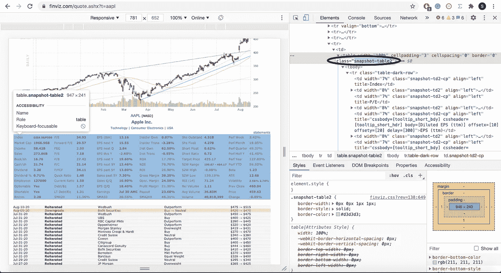

# 用 Python 开发的终极股票筛选工具！

> 原文：<https://medium.datadriveninvestor.com/scraping-live-stock-fundamental-ratios-news-and-more-with-python-a716329e0493?source=collection_archive---------2----------------------->

## 在几秒钟内获得实时基本比率、新闻和内幕交易数据

Photo by [Morning Brew](https://unsplash.com/@morningbrew?utm_source=unsplash&utm_medium=referral&utm_content=creditCopyText) on [Unsplash](https://unsplash.com/?utm_source=unsplash&utm_medium=referral&utm_content=creditCopyText)

## FinViz:终极股票筛选者

获取最新信息对任何投资策略都至关重要，无论是日内交易、波动交易还是简单的长期持有。然而，现在似乎缺乏这方面的资源。大多数 API 提供了一个非常有限的免费版本，支持非常少的请求，类似于财务建模准备

*介绍 fin viz——终极股票筛选者*

[FinViz](https://finviz.com/) 提供交互式图表、基本面比率、顶级分析师推荐、新闻和内幕交易，全部免费！只需点击一个按钮，您就可以获得做出明智的证券买卖决策所需的大部分(如果不是全部)信息。但是，如果您想存储这些数据以便进一步分析或与其他股票进行比较，该怎么办呢？

我们可以简单地使用 Python 来抓取和存储熊猫数据帧中的所有数据。对于本文，我们将重点关注基本比率、新闻和内幕交易部分。

## 使用 Python 抓取 FinViz

Setup

首先，我们必须导入剩余的抓取程序所需的依赖项。熊猫将被用来把网站 HTML 转换成易读的数据框架。NumPy 将用于清理数据帧，bs4/urllib 将允许我们访问网站以检索数据。

 [## 用 Python |数据驱动投资者进行股票价格时间序列预测简介

### 在这个简单的教程中，我们将看看如何将时间序列模型应用于股票价格。更具体地说，一个…

www.datadriveninvestor.com](https://www.datadriveninvestor.com/2020/07/07/introduction-to-time-series-forecasting-of-stock-prices-with-python/) 

FinViz 使得 URL 在代码中实现起来很简单(只需在 http://finviz.com/quote.ashx?t=的[之后添加股票代码)。但是，它们会阻止没有用户代理头的请求(这些请求模拟了一个典型的浏览器)。我们可以将这个头作为参数添加到 urllib 的 Request 方法中。最后，我们可以打开 URL 并将 HTML 存储在一个变量中。](https://finviz.com/quote.ashx?t=aapl)

现在我们可以访问 HTML 代码了，我们可以使用漂亮的 Pandas.read_html()方法快速创建 Pandas 数据帧。

Creating DataFrames from the HTML

我们可以为不同的数据表创建三个独立的函数，因此我们可以根据自己的喜好调用其中的任何一个。为了抑制潜在的错误，我们可以在这三个函数中包含一个 try/except 块。

由于 Pandas.read_html()返回一个数据帧列表，我们可以通过在属性字典中包含表的类名并只调用第一个索引来缩小到我们特别需要的数据帧。你可以打开开发者工具，查看网站源代码，找到 HTML 中标签的类名。你可以在这里阅读更多关于 Chrome 开发工具的信息。

Finding the class name for an HTML tag in Chrome Developer Tools

在这个场景中，我们想要抓取的每个表都包含一个不同的类名，因此我们可以轻松地专门调用它们。特别是对于新闻专栏，我们可以通过找到所有的“a”标记并检索它们的“href”参数值来检索新闻文章的链接。

最后，我们可以清理得到的数据帧，通过切换列、更改列名和设置索引来使它们提供更多信息。

现在，您应该能够打印任何函数，并在几秒钟内检索所需的数据，如下图 GIF 所示！

如果你想要这篇文章的完整代码，你可以访问[GitHub Gist](https://gist.github.com/shashankvemuri/b791e316efa18c8707fb912f69760b09)。我希望这个刮刀将证明对你将来的努力有用。非常感谢您的阅读！

*免责声明:本文材料纯属教育性质，不应作为专业投资建议。自行决定投资。*

如果你喜欢这篇文章，可以看看下面我写的其他一些 Python for Finance 文章！

 [## 使用 Python 在几分钟内解析数千份股票推荐！

### 了解如何在不到 3 分钟的时间内解析顶级分析师的数千条建议！

towardsdatascience.com](https://towardsdatascience.com/parse-thousands-of-stock-recommendations-in-minutes-with-python-6e3e562f156d)  [## 用 Python 制作股票筛选程序！

### 学习如何用 Python 制作一个基于 Mark Minervini 的趋势模板的强大的股票筛选工具。

towardsdatascience.com](https://towardsdatascience.com/making-a-stock-screener-with-python-4f591b198261)  [## 在 3 分钟内创建一个财务 Web 应用程序！

### 了解如何使用 Python 中的 Streamlit 创建技术分析应用程序！

towardsdatascience.com](https://towardsdatascience.com/creating-a-finance-web-app-in-3-minutes-8273d56a39f8) 

**访问专家视图—** [**订阅 DDI 英特尔**](https://datadriveninvestor.com/ddi-intel)