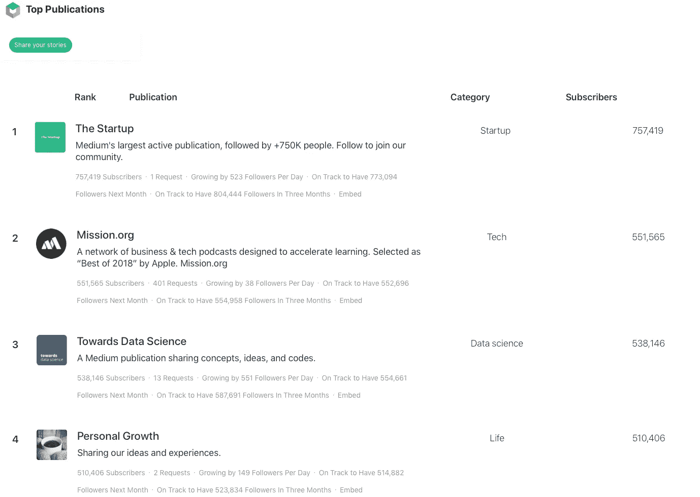
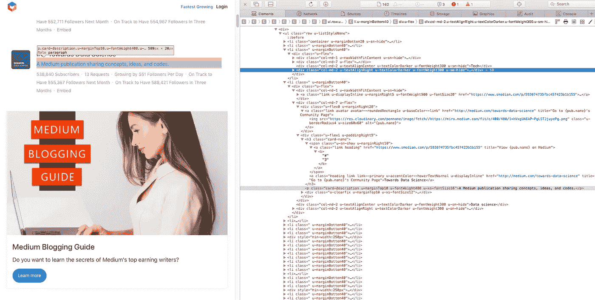
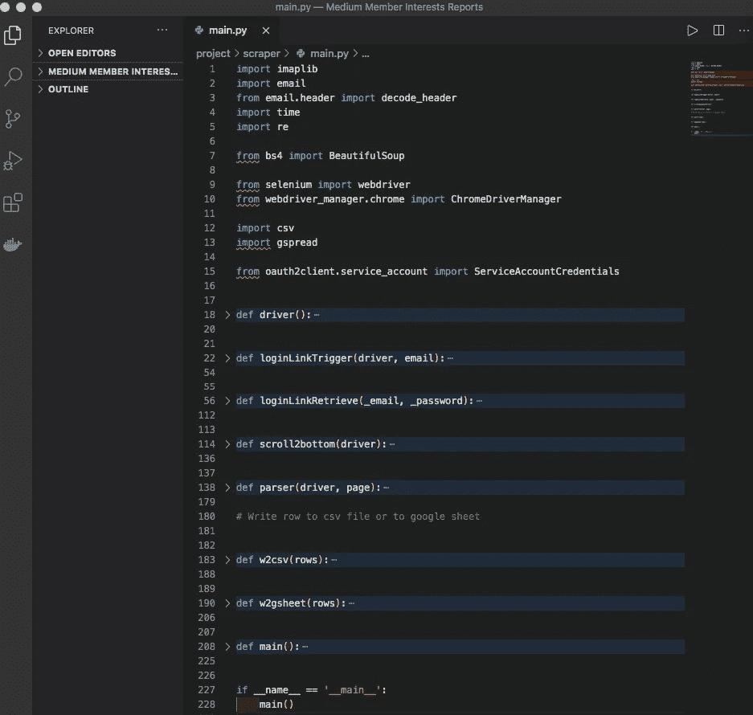

# 使用 Python 抓取顶级出版物的数据(使用 Selenium、Imaplib 和 BeautifulSoup4)

> 原文：<https://medium.datadriveninvestor.com/scraping-top-publications-data-with-python-using-selenium-imaplib-and-beautifulsoup4-18fcf9b95c47?source=collection_archive---------8----------------------->


Photo by [Markus Spiske](https://unsplash.com/@markusspiske?utm_source=medium&utm_medium=referral) on [Unsplash](https://unsplash.com?utm_source=medium&utm_medium=referral)

这是一个系列的第二篇文章，旨在完成拼图游戏，了解谁是 MMedium.com 的用户。获取此类知识的关键原因和附加值在[上一篇文章](https://jkcandick.medium.com/data-science-project-get-rewarded-by-knowing-medium-com-user-pool-modeling-business-problem-part-b93b8088c644)中有详细解释。总之，这些信息可以帮助你在这个平台上获得更多的观点和奖励，就像它对这个平台本身一样。也正如文中所解释的，隐藏在[顶级出版物](https://toppubs.smedian.com/)网站上的一些信息是了解用户构成的关键。

[](https://jkcandick.medium.com/data-science-project-get-rewarded-by-knowing-medium-com-user-pool-modeling-business-problem-part-b93b8088c644) [## 通过了解 Medium.com 用户获得回报——第 1/4 部分抽象商业模式和行动要点

### 一个端到端的数据科学项目，从模拟现实世界的业务问题开始，到…

jkcandick.medium.com](https://jkcandick.medium.com/data-science-project-get-rewarded-by-knowing-medium-com-user-pool-modeling-business-problem-part-b93b8088c644) 

这是我们目标页面的一瞥。举例来说，我敢打赌，没有人会愿意花几十个小时去翻阅页面，记下 12385 份出版物中排名前 1500 位的数据。不用说随时更新信息。这正是在几分钟内收集所有您需要的数据的主要动力。我会告诉你如何做到这一点。



toppubs.smedian.com page

# 预购

我假设您的计算机上已经安装了 Python 3。然后一切都变得容易了。如果您愿意，可以在命令或终端中使用以下代码，在您想要保存工作的目录中创建一个虚拟环境。尽管这一步有助于控制包及其版本，但它是可选的。

```
cd path/to/your/target/directory
python3 -m venv "Give your virtual environment a name"
```

然后应该安装三个核心库， [BeautifulSoup4](https://pypi.org/project/beautifulsoup4/) 、 [Selenium](https://pypi.org/project/selenium/) 和 [Webdriver Manager](https://pypi.org/project/webdriver-manager/) 。等用到位了再介绍。一种(也是我喜欢的)方法是这样的:

```
python3 -m pip install beautifulsoup4
python3 -m pip install selenium
python3 -m pip install webdriver-manager
```

恭喜，你现在可以走了！

# 方法

这种方法可以用一句话来概括:在 Selenium(一个使这项工作变得更容易的包)的帮助下，在特定的 web 页面上复制您需要遵循的过程，以访问您想要的信息。

**第一步:理解与目标页面的基本交互**

我们的首要任务是了解在目标页面上看到我们想要的信息所需的最少步骤，【https://toppubs.smedian.com。我将在下面列出我对这个特定页面的发现。

1.  一个人必须登陆这个页面，点击“登录”开始。不登录，只能看到前 100 个出版物。(需要硒)
2.  登录程序不标准。一种选择是使用你的电子邮件地址登录，然后一封带有登录链接的电子邮件会进入你的邮箱，你可以点击它。(需要硒+ Imaplib)
3.  登录后，您可以向下滚动页面，查看所有出版物，包括出版物排名、关注者数量、关注者增长率、出版物描述等信息。(需要硒+美素)
4.  将您的数据保存到本地的. csv 文件和/或 Google Sheet 中。

**第二步:在 Python 和 Selenium 库的帮助下复制交互。**

> “Selenium 是一个总括项目，它封装了各种工具和库，支持 web 浏览器自动化。Selenium 专门为 W3C WebDriver 规范提供了一个基础设施，这是一个与所有主流 web 浏览器兼容的平台和语言中立的编码接口。— Selenium 主页

Selenium 是我对网络浏览器自动化的选择。可以使用 python 原生包(如“requests”和“httplib ”)创建自定义客户端。

但俗话说，不要再试图创造轮子了！我在下面的步骤中使用了 Selenium 来收集数据。

*   首先，准备并导入库。

```
import imaplibimport emailfrom email.header import decode_headerimport timeimport refrom bs4 import BeautifulSoupfrom selenium import web-driverfrom webdriver_manager.chrome import ChromeDriverManagerimport csv
```

*   使用 Selenium 创建 web 浏览器驱动程序。

```
def driver(): return webdriver.Chrome(ChromeDriverManager().install())
```

*   定义自动触发认证邮件的功能。

```
def loginLinkTrigger(driver, email): # load the Smedian.com pagpe driver.get('https://toppubs.smedian.com') time.sleep(5) # scroll to the bottom before next click driver.execute_script(
      "window.scrollTo(0,document.body.scrollHeight);") # click on login button driver.find_element_by_xpath(
      '//*[@id="__next"]/div[1]/nav/ul/li[2]/button').click() time.sleep(2) # scroll to the bottom before next click driver.execute_script(
      "window.scrollTo(0, document.body.scrollHeight);") # click on "login with email button" driver.find_element_by_xpath(
      '//button[@class="btn btn-success u-sizeFullWidth u-flex u-justifyContentCenter u-alignItemsCenter"]').click() time.sleep(3) # scroll to the bottom before next click driver.execute_script(
      "window.scrollTo(0, document.body.scrollHeight);") # login with email loginEmail = driver.find_element_by_xpath('//input[@type="email"]') loginEmail.clear() loginEmail.send_keys(email) driver.find_element_by_xpath(
      '//button[@class="btn btn-success btn-rounded u-lineHeight30"]').click()
```

值得注意的是，我总是在点击任何链接之前滚动到页面的底部(使用`driver.execute_script(“window.scrollTo(0,document.body.scrollHeight);”)`),然后等待一两秒钟(使用`time.sleep(2)`),以便页面可以完成加载。这里的原则是确保所需元素的可见性和不重叠。您可以根据这一原则调整代码。

*   制作一个功能，将检索您的认证电子邮件，并在后台为您点击登录链接。工作代码片段是专门针对 Gmail 的。

```
def loginLinkRetrieve(_email, _password): # Function to get email content part i.e its body part def get_body(msg): if msg.is_multipart(): return get_body(msg.get_payload(0)) else: return msg.get_payload(None, True) # Function to search for a key value pair def search(key, value, con): result, data = con.search(None, key, '"{}"'.format(value)) return data # Function to get the list of emails under this label def get_emails(result_bytes): msgs = []  # all the email data are pushed inside an array for num in result_bytes[0].split(): typ, data = con.fetch(num, '(RFC822)') msgs.append(data) return msgs # this is done to make SSL connnection with GMAIL con = imaplib.IMAP4_SSL('imap.gmail.com') # logging the user in con.login(_email, _password) # calling function to check for email under this label con.select('Inbox') # fetching emails from aunthenticator@penname.me msgs = get_emails(search('FROM', 'aunthenticator@penname.me', con)) # Find the login link for info in msgs[-1]: if isinstance(info, tuple): msg = email.message_from_string(info[1].decode('utf-8')) dt = decode_header(msg["Date"])[0][0] try: loginLink = re.findall(
                  rb'.*<a class="button js-consumeAuthTokenLink ng-binding" ng-href=.*"(.*)".*', msg.get_payload(decode=True), re.M)[0] except: loginLink = 'Unknown' print('Parse login link failed') print('Time received: ', dt) print('Login link: ', loginLink)
```

认证电子邮件始终来自“aunthenticator@penname.me”。电子邮件数据(从`msg.get_payload(decode=True)`返回)对我来说是多行字节格式，因此在`re.findall()`函数中需要标志`rb`和`re.M`。而且，如果你想了解更多关于 imaplib 库的知识，[官方文档](https://docs.python.org/3/library/imaplib.html)可以是一个很好的参考。

*   现在您应该已经登录，需要向下滚动页面来查看尽可能多的出版物信息。这可以通过下面的函数自动完成。

```
def scroll2bottom(driver): SCROLL_PAUSE_TIME = 6 last_height = driver.execute_script(
         "returndocument.body.scrollHeight") numOfPages = 100 currentPage = 0 while currentPage <= numOfPages: # Scroll down to bottom driver.execute_script(
              "window.scrollTo(0, document.body.scrollHeight);") # Wait to load page time.sleep(SCROLL_PAUSE_TIME) # Calculate new scroll height and compare with last scroll height new_height = driver.execute_script(
               "returndocument.body.scrollHeight") if new_height == last_height: break last_height = new_height currentPage += 1
```

在这个示例代码中，我将页面向下滚动的次数限制为 100，因为在此之后的关注者的数量将少于 1000。但是你可以随时查看更多。再次，给它一秒钟来加载每一页。

*   现在是一个激动人心的时刻，我们都准备好解析数据了。在撰写本文时，出版物的名称、其主页 URL 和排名、描述、类别、订阅者数量、关注者增长率将在找到其元素后从页面中解析出来。右键单击元素，然后您可以选择复制 xpaths 或 css 选择器。如果您已经有了使用 xpath 的经验，建议您自己为这些元素定义它们。代码利用这些选择器来解析下面共享的数据。



```
def parser(driver, page): driver.get(page) scroll2bottom(driver) content = driver.page_source soup = BeautifulSoup(content, features="html.parser") rows = [['publication', 'rank', 'URL', 'description',
      'category', 'subscriber', 'growthRate']] dataBlocks = soup.find_all("li", "u-marginBottom40") for block in dataBlocks: publication = block.find(
            "a", "heading link link--primary u-accentColor--hoverTextNormal u-displayInline").text or "" rank = block.find(
            "a", "link u-displayInline u-marginRight5 u-fontWeight500 u-fontSize20").text or "" URL = block.find(
            "a", "heading link link--primary u-accentColor--hoverTextNormal u-displayInline").get("href") or "" description = block.find(
            "p", "card-description u-marginTop10 u-fontWeight400 u-xs-fontSize16").text or "" category = block.find(
            "div", "col-md-2 u-textAlignCenter u-textColorDarker u-fontWeight300 u-sm-hide").text or "" subscriber = block.find(
            "div", "col-md-2 u-textAlignRight u-textColorDarker u-fontWeight300 u-sm-hide").text or "" for span in block.find_all("span"):

            txt = span.text or "" if "Followers Per Day" in txt: growthRate = txt.replace(' Followers Per Day', '') row = [publication, rank, URL, description, category, subscriber, growthRate] rows.append(row) return rows
```

功能`driver`、`scroll2bottom`在前面章节中定义。每一行都保存为一个列表。

*   将您的数据保存到。csv 文件。这是在本地保存数据的最方便的方法。请修改下面的文件路径。

```
def w2csv(rows): # To csv file. with open('/path/to/data/file.csv', 'w') as f:
         writer = csv.writer(f)
         writer.writerows(rows)
```

也可以将你的数据保存到谷歌表单中。但这需要你创建一个谷歌平台项目服务账户，并安装一些支持的 python 库。完成所有这些后，下面的代码片段将为您提供您自己的 google 电子表格键(您的 google 工作表的标识符)

```
import gspreadfrom oauth2client.service_account import ServiceAccountCredentialsdef w2gsheet(rows):# To google sheetscope = ['https://spreadsheets.google.com/feeds',
         'https://www.googleapis.com/auth/spreadsheets',
         'https://www.googleapis.com/auth/drive']credentials = ServiceAccountCredentials.from_json_keyfile_name(
    '/path/to/service/account.json', scope)gc = gspread.authorize(credentials)gSpreadSheetKey = "xxxxxxxxxxxxxxxxxxxxxxxxxxxxxxxxxxxxx"gSpreadSheet = gc.open_by_key(gSpreadSheetKey)gSpreadSheet.values_update(
    'Sheet1', params={'valueInputOption': 'RAW'}, body={'values': rows})
```

*   最后，我们可以在主函数中构建一个工作流。在此填写您的有效电子邮件和密码。

```
def main(): _email = 'xxxxxxxxxxxxxxxxxxxxx' _pwd = 'xxxxxxxxxxxxxx' _driver = driver() _driver.maximize_window() loginLinkTrigger(_driver, _email) # Waiting time for the eamil to land in mailbox time.sleep(30) loginLink = loginLinkRetrieve(_email, _pwd) rows = parser(_driver, page=loginLink) w2csv(rows) w2gsheet(rows)
```

因此，完整的脚本将利用上述所有功能，如下所示。



在终端中执行脚本后，您将拥有一个. csv 文件和/或一个填充了媒体出版物数据的 google 表单。csv 文件示例在这里。

## **结束注释**

**展开数据。**更进一步，您可以扩展您的脚本来访问每个出版物的主页，并收集其他有趣的信息。

**清理数据**。数据还不完善。例如，每个出版物的类别可能会产生误导。因此，样本出版物的相关类别和主题需要核实和修订。选择正确的代表性样本是一个良好的开端。

**使用数据**。作为这个项目的下一步，我们将评估和利用这个数据集。最后，是时候找出 Medium.com 用户群的构成了。当你写下一个故事，优化标题、描述和标签(后者将在这个项目的最后一个故事中涉及)时，了解用户的兴趣和他们愿意为之付费的内容将会给你带来优势。

[](https://medium.com/datadriveninvestor/an-ultimate-search-engine-optimisation-guide-for-bloggers-with-examples-c46f11ffea39) [## 博客的终极搜索引擎优化指南，附示例

### 优化你的故事和博客，提高知名度。最佳实践的搜索引擎优化解释了一个…

medium.com](https://medium.com/datadriveninvestor/an-ultimate-search-engine-optimisation-guide-for-bloggers-with-examples-c46f11ffea39) 

如果你对我的下一篇关于[的文章感兴趣，从这个数据集中发现的可操作的见解，](https://medium.com/datadriveninvestor/how-to-make-money-on-medium-in-2021-37fbffbd48f1)请随时关注。

[](https://medium.com/datadriveninvestor/how-to-make-money-on-medium-in-2021-37fbffbd48f1) [## 2021 年如何在 Medium 上赚钱？

### 有哪些热门话题？哪些是盈利的？使用最佳实践在媒体上写作、出版和赚钱。

medium.com](https://medium.com/datadriveninvestor/how-to-make-money-on-medium-in-2021-37fbffbd48f1) 

# 作者的其他帖子

[](/empower-automated-stock-trading-with-pattern-recognition-a-recursive-programmatic-approach-5930da422555) [## 通过模式识别实现自动化股票交易——一种递归编程方法

### 股票模式识别的一种高度概括的全局递归程序方法及其实现

medium.datadriveninvestor.com](/empower-automated-stock-trading-with-pattern-recognition-a-recursive-programmatic-approach-5930da422555) [](/how-to-make-money-on-medium-in-2021-37fbffbd48f1) [## 如何在介质上写作赚更多的钱？

### 用数据解释。有哪些热门话题？哪些是盈利的？使用最佳实践在…上写作、出版和赚钱

medium.datadriveninvestor.com](/how-to-make-money-on-medium-in-2021-37fbffbd48f1) [](/an-ultimate-search-engine-optimisation-guide-for-bloggers-with-examples-c46f11ffea39) [## 博客的终极搜索引擎优化指南，附示例

### 优化你的故事和博客，提高知名度。最佳实践的搜索引擎优化解释了一个…

medium.datadriveninvestor.com](/an-ultimate-search-engine-optimisation-guide-for-bloggers-with-examples-c46f11ffea39) [](/data-science-project-get-rewarded-by-knowing-medium-com-user-pool-modeling-business-problem-part-b93b8088c644) [## 抽象的商业模式和行动指向理解 Medium.com 的用户

### 一个端到端的数据科学项目，从模拟现实世界的业务问题开始，到…

medium.datadriveninvestor.com](/data-science-project-get-rewarded-by-knowing-medium-com-user-pool-modeling-business-problem-part-b93b8088c644)