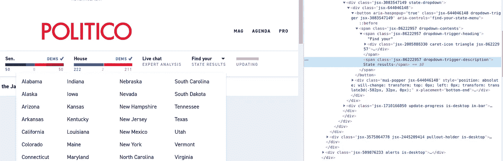
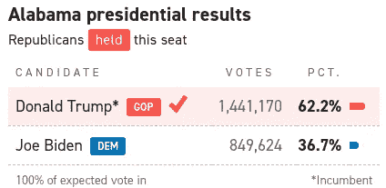
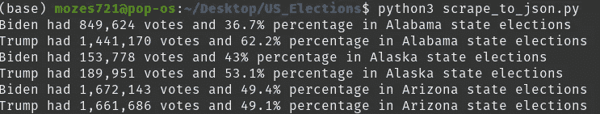
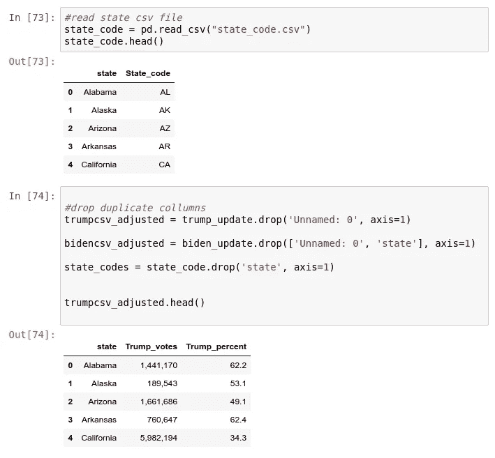
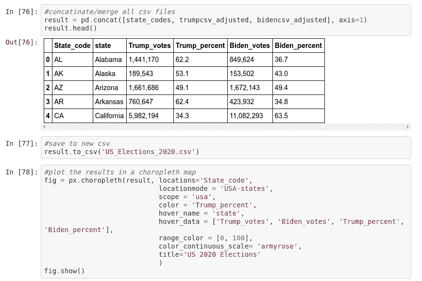
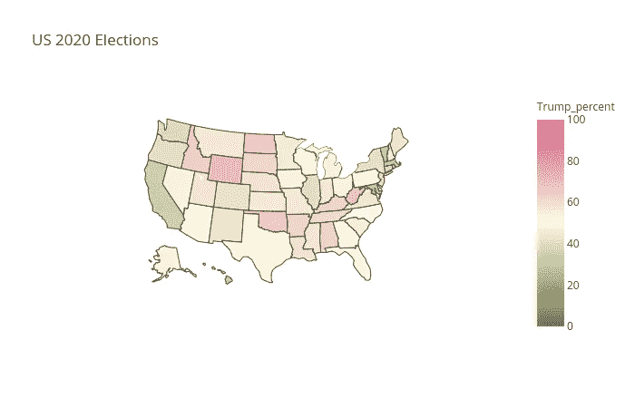

# 抓取美国选举结果，并使用 Jupyter 笔记本和 plotly 进行数据可视化

> 原文：<https://medium.datadriveninvestor.com/scraping-us-election-results-and-using-jupyter-notebook-with-plotly-for-data-visualization-8f3d55dda957?source=collection_archive---------10----------------------->

## 药典


对我来说，写他的项目非常有趣，我希望你们这些读者能从中受益匪浅。

要观看 **YouTube** 视频指南，请按[此处](https://www.youtube.com/watch?v=6z38lvq-3Hc)。

# 网页抓取

Web 抓取使用自动访问和提取网站大量信息的技术，可以节省大量的时间和精力。在这个例子中，我们将刮除[https://www.politico.com/2020-election/results/president/](https://www.politico.com/2020-election/results/president/)

这是一个伟大的练习网页抓取初学者谁正在寻找了解如何网页抓取。

> 我开始使用 **BeautifulSoup** (用于较小的任务和具有静态 HTML 页面的网站)，但很快意识到必须使用 **Selenium** ，因为该网站是 JavaScript 特色网站。

# HTML 知识

你不需要深入的 HTML 知识，也不需要任何网页设计经验。然而，如果你对 HTML 的结构和语法有一些基本的了解，那就简单多了。如果你什么都不懂，我建议你去 w3schools。

[](https://www.w3schools.com/html/) [## HTML 教程

### 组织良好，易于理解的网站建设教程，有很多如何使用 HTML，CSS，JavaScript 的例子…

www.w3schools.com](https://www.w3schools.com/html/) 

# 建立

## 硒

我运行`pip install selenium`为了让 Selenium 工作，它必须访问浏览器驱动程序。默认情况下，它将在 Python 脚本所在的目录中查找。Chrome、Firefox、Edge 和 Safari 驱动程序的链接[可在此处获得](https://pypi.python.org/pypi/selenium)。下面的示例代码使用 Chrome。

我们从导入必要的包开始，将 webdriver 分配到 chromedriver 所在位置的`executable_path`。

与驱动程序得到的网站女巫，我们将从刮在这种情况下，其[www.politico.com](http://www.politico.com(but)

## Jupyter 笔记本

Python 中不包含 Jupyter 笔记本，所以如果您想试用它，您需要安装 Jupyter。

让我们通过安装 IPython 来使我们的新环境起作用:

```
pip install ipython
```

一旦我们有了 Python 包，我们就可以安装 Jupyter Notebook:

```
pip install jupyter
```

然后通过输入`jupyter notebook`命令后；在这种情况下，当前工作目录将是启动目录。

在浏览器中打开 Jupyter Notebook 时，您可能已经注意到仪表板的 URL 类似于`http://localhost:8888/tree`。Localhost 不是一个网站，但它表明内容是从你的本地机器:你自己的电脑上提供的。

我亲自运行了 VSCode IDE Jupyter extention，我发现它方便多了，你可以点击[这里](https://code.visualstudio.com/docs/python/jupyter-support)找到链接。

## 数据绘图

为了展示数据，我们需要标准的数据分析和图表，并转换数据文件格式包。我们将从获取我们将用来从 Pandas，plotly，json，csv 中抓取的网站开始。如果您愿意，您可以使用其他库而不是 plotly。

# 临时设置

然后，我们分配 wait 变量，等待 10 秒钟，让驱动程序加载网站(通过使用显式的 **Wait** 命令，将 **WebDriver** 定向到 **wait** ，直到在继续执行代码之前出现某个条件。)

在 state_btn 变量中，当元素出现在网站上时，我们使用 EC，因为 JS，一些元素需要等待 DOM 渲染。找到所需元素的最佳方式是 XPATH，您可以通过网站中的 inspect 元素获得它。

然后将 click()传递给 state_btn 以打开窗口，等待所有 DOM 元素在网页中呈现。



Selenium 中有多种方法来定位元素，从类名到链接的部分文本。你可以在这里找到更多信息。

## 选举结果

我们首先建立一个空数组，然后在数组中追加所有的状态名。

函数 scrape_results 将传入特定链接的参数。

然后从两行中获取状态结果的表。

为了区分哪一行属于 Trump 或 Biden，我们获取第一行候选人的行名，然后将相应的行分配给 biden_results 函数或 trump_results 函数，并在参数中传递正确的 list_values。



## 获取个人数据

我们继续获取记录的州名，然后创建投票和百分比变量，从列表中获取文本并打印出来进行检查。

创建一个 state_result 字典作为键值对，分配收集的信息并将其添加到相应的结果列表中。

然后，我们对 state_name 和 state_url 使用 zip()函数，并在每次迭代中打开一个新的 webdriver 来获取 state_url 结果。

收集完数据后，使用“w”(write)命令创建一个. json 文件，并将 result_list 字典转储到创建的。json 文件。



The initiated print statement to see if correct results are being gathered


# 绘制结果图表

我们已经走了一半(很难相信吧？)!现在，我们必须像前面提到的那样绘制图表，Jupyter Notebook 在这里是最理想的，因为它能够创建和共享包含实时代码、等式和可视化的文档。


首先，我们导入必要的包来进行数据可视化。

当我们皈依。csv。json 文件，我们必须打开它，并替换新创建的几个条件。csv 文件，以便我们知道它是特朗普的结果还是拜登(的。json 文件只包含值，它不指定候选对象)以及删除'-'和' % '，因为 plotly 无法以这种格式可视化数据。

```
trump_update = ‘’.join(i for i in trump_update).replace(‘votes’, ‘Trump_votes’).replace(‘percent’, ‘Trump_percent’).replace(‘-’, ‘ ‘).replace(‘%’, ‘’)
```

为此，我们使用。join()方法接受 iterable 中的所有项，并以新的格式将它们连接起来。



必须找到/创建 State_code.csv，因为它没有列在抓取的数据中。

删除“未命名:0”列，它是使用 pandas 以及 state_code.csv 中的“state”和 axis-1 自动生成的。

> 注意:一个 DataFrame 对象有两个轴:“轴 0”和“轴1”。“轴 0”表示行，“轴 1”表示列。



我们创建了一个使用 concat()函数的新变量，它在执行可选集合逻辑的同时，完成了沿轴执行连接操作的所有繁重工作。

它们保存在新的。我们使用 choropleth map 来显示结果。设置好所有变量后，我们设置 fig.show()以地图格式显示结果。

更多关于 plotly 检查链接如下。

[](https://plotly.com/python/) [## Plotly Python 图形库

### Plotly 的 Python 图形库制作出交互式的、出版物质量的图形。如何制作线图的示例…

plotly.com](https://plotly.com/python/) 

最终结果将是这样的，当你悬停在每个候选人的数据将会显示。



# 结论

现在你有了它，我们从抓取网页开始，不久后在 Plotly 的 Python 图形库中展示。Plotly 有许多不同的方法来绘制数据，如制作线图、散点图、面积图、条形图、误差线、箱线图、直方图等，当然您可以选择自己的方法。从网上搜集任何其他类型的数据并以你喜欢的方式可视化也是如此。我希望你读得愉快，并能在不久的将来从你自己的项目中得到一些东西。

链接到以下项目:

[](https://github.com/Mozes721/US_Elections) [## mozes 721/美国 _ 选举

### 网络报废获得美国 2020 年选举结果转换成 JSON 文件，然后之后。csv 和结束它关闭图表它…

github.com](https://github.com/Mozes721/US_Elections)