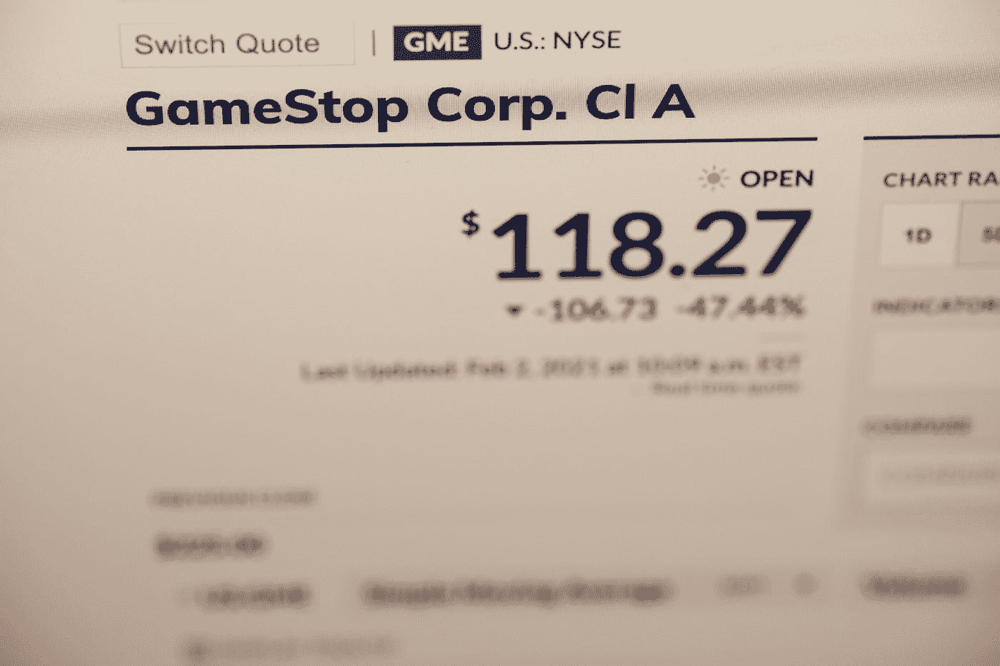
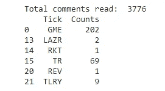
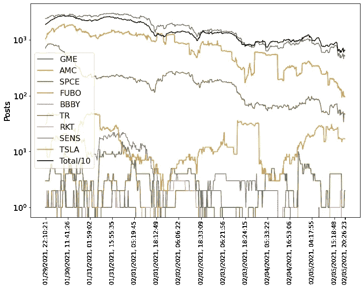

# 刮华尔街赌注股票信号

> 原文：<https://medium.datadriveninvestor.com/scraping-wallstreetbets-for-stocks-signals-414e63ace210?source=collection_archive---------2----------------------->

## 使用 Python 阅读 Reddit 上的评论



Photo by [Tech Daily](https://unsplash.com/@techdailyca?utm_source=medium&utm_medium=referral) on [Unsplash](https://unsplash.com?utm_source=medium&utm_medium=referral)

在 2021 年 1 月的一个短暂时刻，世界停止了对新冠肺炎·疫情的谈论，而[逃到了](https://www.youtube.com/watch?v=5JySeQpymWQ)华尔街、Reddit、小额散户(或不那么小额)投资者和邪恶的对冲基金的疯狂王国。

几年来，一群年轻热情的投资者聚集在一个名为 [r/Wallstreetbets](https://new.reddit.com/r/wallstreetbets/) 的子网站上讨论股票。虽然该论坛稳步发展，拥有几十万会员，但在互联网的广阔空间中，它仍然是一个相当小的角落。但是在 2021 年 1 月底[华尔街赌注](https://en.wikipedia.org/wiki/R/wallstreetbets)飞上了中央舞台。一系列罕见的事件导致一些股票被大肆炒作。华尔街赌注帮谈论的主要股票是 Gamestop ( [GME](https://finance.yahoo.com/quote/gem/) )和 AMC Theaters ( [AMC](https://finance.yahoo.com/quote/amc/) )。由于股票价格上涨，在短短一周内，subreddit 的会员人数从不到 100 万飙升至超过 600 万。互联网和全世界都见证了 GME 股价在两周左右的时间里上涨了 10 倍以上。

每个人都在谈论华尔街赌注，称之为新的“创意晚宴”，而我也想坐在餐桌旁。但是阅读 Reddit 上的所有帖子(我们说的是每天成千上万的帖子)不是一个选择。

但是，如果我们可以写几行代码，让计算机阅读热门帖子，告诉我们酷孩子在谈论什么股票，我为什么要重复所有这些[模因](https://www.investopedia.com/wallstreetbets-slang-and-memes-5111311)和太多的表情符号呢？

## 一句理智的话

对冲基金以及许多其他[的](https://swaggystocks.com/dashboard/wallstreetbets/ticker-sentiment)已经想到利用华尔街赌注和其他社交媒体上的情绪作为投资(或赌博)的指标。我做这个晚间项目的目的只是想看看我是否能做到。把它当成一个编码挑战，别无其他。如果你想投资股票市场，那就在你自学之后再做吧。

## PRAW

为了自动“阅读”Reddit，我们需要一种从代码内部与网站交互的方式。Reddit 提供了一个非常有用的 API，但也有一个陡峭的学习曲线。幸运的是，好人写了一个 Python 包装器，又名[PRAW](https://praw.readthedocs.io/en/latest/):Python Reddit API 包装器，让生活变得非常非常简单。因此，我们需要做的第一件事是使用“pip”安装 PREW 并导入它。

```
!pip install praw
import praw
```

接下来，我们需要设置我们的 Reddit 凭证，并在这个站点上设置一个“应用程序”。这很简单，但是细节可以在 PRAW 的文档中找到。我们需要我们的“应用”(客户端)数据、用户名和密码，对于 user_agent，我只使用了我的用户名。

```
reddit=praw.Reddit(client_id=’id’,
               client_secret=’secret-hash’,
               username=’username’,
               password=’password’,
               user_agent=’username’)
subreddit = reddit.subreddit(‘wallstreetbets’)
```

## 让我们开始吧

现在我们已经设置好了一切，我们可以开始收集我们感兴趣的评论了。我已经根据最“[空头兴趣](https://www.highshortinterest.com/all/)”(和特斯拉)创建了一个 tickers(股票“名称”)列表，所以我可以在评论中寻找它们。主要的想法是统计某种股票在华尔街赌注上被提及的次数，看看人们谈论的股票是否随着时间的推移而演变。主要假设是，在 Reddit 上受欢迎的股票也会引起散户的兴趣，因此股价会上涨。

```
tickerlist=[‘GME’, ‘AMC’, ‘SPCE’, ‘FUBO’, ‘BBBY’, ‘LGND’, ‘FIZZ’, ‘SPWR’, ‘SKT’, ‘GSX’, ‘TR’, ‘GOGO’, ‘AXDX’, ‘BYND’, ‘OTRK’, ‘CLVS’, ‘RKT’, ‘SRG’, ‘IRBT’, ‘PRTS’, ‘PGEN’, ‘TSLA’]
```

我决定浏览 subreddit 中 200 个最热门的帖子，并且只阅读每个主题的第一级评论。我选择不“阅读”所有的评论，因为这将大大增加运行时间，我看不出查看评论的意义，这些评论大多是关闭和表情符号。我们还需要从 PRAW 引进更多的评论。这将有助于我们避免一个非常恼人的错误，这个错误是由这样一个事实引起的:在某一点上，API 将“询问”我们是否想要加载更多的注释，而不仅仅是加载它们。

```
hot = subreddit.hot(limit=200)
sum=[0]*len(tickerlist) # our output array
counttotal=0 # total number of comment read
submissions_counter=0from praw.models import MoreComments
```

在大多数 Reddit 论坛中，很少有“粘性”帖子概述子编辑规则或诸如此类的东西。我们将希望跳过这些，因为它们不会告诉我们任何新的东西(它们可能会存在几个星期，因此不会提供很多信息)，它们只会导致我们的结果出现偏差。我还决定跳过 5 个“最热门”的话题，因为我注意到它们大多是“一个股票秀”，充满了很多我不会从中获得任何有趣的东西的评论，所以我就跳过它们。

所以我们想要做的伪代码看起来像这样:

*   我们现在可以“阅读”评论了。
*   我们将在热点上循环。
*   检查帖子(投稿)是否有粘性？
*   如果它是粘性的，我们跳过了前几(5)个职位。
*   获取提交的评论。
*   如果我们得到了“更多评论”,请直接跳到下一条评论。
*   查看所有的报价器，看看评论中是否提到了某个报价器。

代码是:

```
for submissions in hot:
  if not submissions.stickied:
    submissions_counter+=1
    if submissions_counter>5:
      comments = submissions.comments
      for comment in comments:
        if isinstance(comment, MoreComments):
          continue
        counttotal+=1
        for i, ticker in enumerate(tickerlist):
          if ticker in comment.body:
            sum[i]=sum[i]+1
```

# 结果

通过运行这段代码，我们得到了一个列表，其中“sum”包含了每个 ticker 的被提及次数。

```
import pandas as pd
output=pd.DataFrame(data={‘Tick’: tickerlist, ‘Counts’: sum})
print(‘Total comments read: ‘,counttotal)
print(output[output[‘Counts’]>0])
```



我们可以看到，在 3776 条评论中，有 202 条提到了 GME，而只有 69 条提到了 TR。

接下来，我将脚本插入到一个无限的 *while* 循环中，并让它在后台运行，每 20 分钟左右抓取一次数据。“大炒作”后的周末和接下来一周的结果绘制在下图中:



Number of comments that mention the listed stocks (log scale) as well as the total number of comments the script “read” each instance (scaled by 10)

# 结论

我是否找到了股票表现和华尔街赌注之间的关联？简而言之，答案是否定的。我有认真找吗？答案也是否定的。或许通过进一步收集数据，并对更多股票进行研究，可能会发现一些有趣的东西。但我现在把这个留给对冲基金。我确实喜欢这个快速的数据测绘项目，并且在一天结束的时候，知识的价值和金钱一样多，如果不是更多的话。

你对*华尔街赌注*和 *Gamestop* 有什么看法？你认为社交媒体能成为股市的一个好的(有用的)指示器吗？