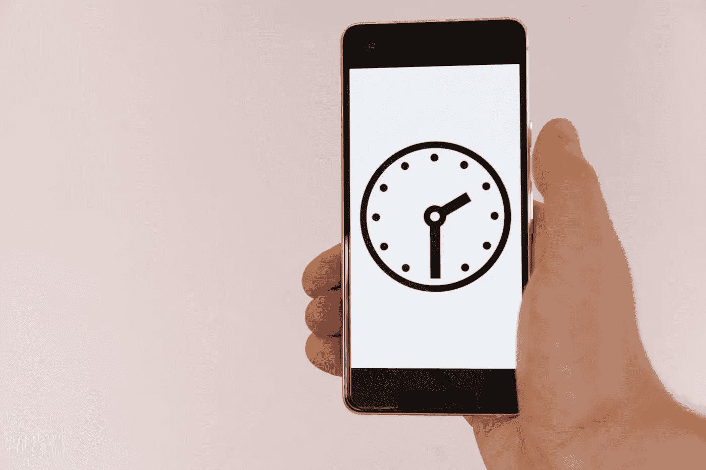

# 屏幕时间——时间窃贼

> 原文：<https://medium.datadriveninvestor.com/screentime-the-thief-of-time-88327b2e84d0?source=collection_archive---------31----------------------->

我的每周屏幕时间报告往往会在我身上引发类似的对税单的反应。

一般情况下，我会绝望地大声说:

**“现在多少钱？?"**

偶尔，我会更深入地研究数据，并检查学习成果。不变的是，我的屏幕时间每周都在增加——这种令人满意的稳定趋势的一个例外是当我在医院呆了一段时间并且失去知觉的时候。

数据也会告诉我时间花在哪里；是在看我的时代 app，像喝奶昔一样吸取知识吗？它是一个冥想应用程序，还是电子邮件，这两者我都可以归因于生产力或改善？

唉，不是。绝大多数人似乎都致力于那些常见的拖延症；Instagram，脸书和推特。无聊、无聊地刷手机，寻找美妙的多巴胺——或者用更通俗的话来说，纯粹的爱管闲事。

现在，如果本周环比增长是一份收入报告，那就太好了。如果这是衡量我的生产力或快乐的标准，我会很高兴。

但事实并非如此，这是对我在无聊的手机刷卡上浪费时间的一个严酷的提醒。

因为时间是一个相对的概念，它回避了“我到底在用我的生命做什么？”

我平均消费 8.3(！！！)每天几个小时盯着我的手机。这相当于一周 60 小时，或者一个月 320 小时。一个月 13 天。

**这是一年 157 天！！！！！！**

即使写下这些数字，我也感到惊讶。当把它们写在纸上时，感觉真实多了。我一年中几乎 35%的时间都在盯着那个该死的屏幕。

套用我的旧教义问答问我的问题——为了什么？

我的意思是，知道我的手机在我的生活中扮演着重要的角色，我感到很欣慰。它让我与电子邮件、朋友和家人以及世界上发生的事情保持联系。

我不相信那些有益的活动可以解释所有的时间，或者真的值得。

你会问，这段时间我还能做些什么？几件事:

**学一门语言**——157 天是学习普通话的充足时间。或者是离开这个领域，为自己创造一个不错的位置——也许有对斯瓦希里语口译的需求？值得一探究竟，或者如果我想谨慎行事，我可以再给西班牙人一次机会。

学会游泳——31 岁的我会像泰坦尼克号场景中的石头一样沉入水中，这是不可原谅的。我记得有一次在斐济划皮划艇——我的朋友弄翻了皮划艇，划走了，我拼命地挥手，表示马上溺水而死。唉，他以为我在欢快地挥手，直到一个过路人听到我声嘶力竭地大喊“去死吧”。再次面对这种情况，我很喜欢这个笑话——157 天的时间足够学会蛙泳和蝶泳。

学习编码— 每当我想创业时，这都是一块绊脚石。一个开发者会对我的建议嗤之以鼻，带着疲惫的表情，要求几千人来交付它。我很想从现在开始绕过那个自鸣得意的饭桶，157 天应该能让我很好地掌握“Java”，不管它是什么。

**做 100 万个仰卧起坐**——我早就想看起来像休·杰克曼的身材替身。我只是什么都没做。宁滨:手机会给我充足的时间做一百万个仰卧起坐——有了它，我的模特生涯可以在相对成熟的年龄开始。“大器晚成”，他们将天。

我拥有第一部智能手机时 18 岁，拥有第一部手机时 13 岁。那个黄金时代我到底是怎么打发时间的？

回想起来，我真的不知道。当我问我母亲或祖母时，他们似乎也不知道——但我猜他们可能是在虚张声势。

前几代人——他们更聪明吗？更有成就感？我不太确定，但感觉他们是一个不错的赌注。

当然，我父母那代人更富有——也许宏观经济环境更有利于财富积累，或者也许他们只是没有整天玩手机。谁知道呢。

写完这篇文章后，我现在要去 Instagram 逛一圈，然后再转发一些 memes。甚至可能会改变我在脸书的个人资料照片。世界是我的，仰卧起坐可以等。