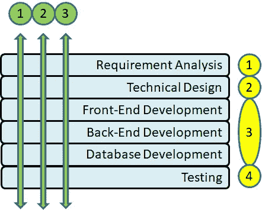
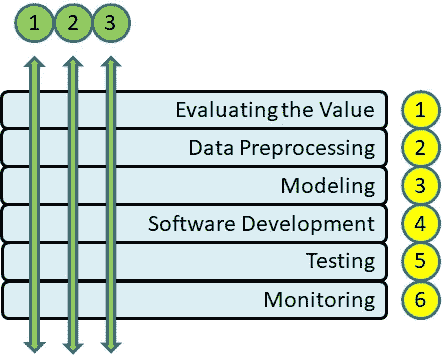
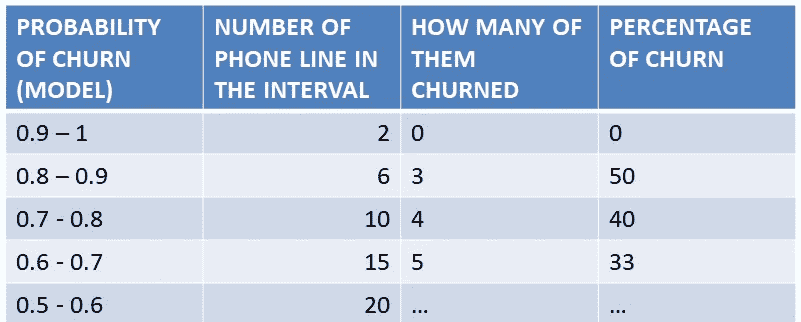
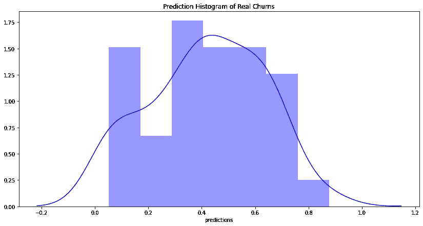

# 数据科学项目中的 Scrum

> 原文：<https://medium.datadriveninvestor.com/scrum-in-data-science-projects-aa355b60d5b6?source=collection_archive---------4----------------------->

Photo by [Kateryna Ozler](https://instagram.com/katyaozler?igshid=7ez9ny9g5aya)

在下面的文章中，您将了解如何为数据科学项目创建产品待办事项。本文从第一个 sprint 开始，通过一个示例案例展示了是否有可能继续切分蛋糕的概念。

# 1.永恒的问题

**关于应用 scrum，软件和数据科学项目有什么区别吗？**

关于这个话题有不同的观点。有些人认为 scrum 不适合数据科学项目。产生这些想法的原因是在迭代中进行和根据切蛋糕的概念创建 pbi 的困难。

我认为这是一个差异，它使得在数据项目中的应用更具挑战性。尽管如此，这仍然是可能的。

**软件和数据科学项目的层次是什么？**

图 1 显示了软件开发周期的主要层次。

Figure-1 Layers of Software Development

倾向于瀑布的团队遵循分析、设计、开发和测试步骤的顺序，并且在没有完成前一个步骤之前不会进一步(遵循黄色圆圈中的数字)。

喜欢 scrum 的团队试图接触任何 sprint 中的所有步骤。(跟随绿色圆圈中的数字)。

图 2 显示了数据科学项目的主要层次。

Figure-2 Layers of Data Science Projects

在这一点上提出了一个著名的问题:

**在数据科学项目中是否也可以像在软件项目中一样遵循绿线？**

是的，但是有点困难和复杂。文章的其余部分将为您提供关于此事的示例和评论。

**什么情况&问题？**

一家电信公司希望降低客户流失率并留住更多客户。

**公司有什么样的数据？**

客户人口统计:客户的基本信息，如出生日期，出生地，姓名，地址，教育状况，工作状况，部门信息等

用法:所有通话，数据和短信使用的日期和时间信息。

账单:为客户准备的所有账单数据

付款:客户帐单付款数据

套餐成员资格:…

包装:…

活动:…

电话线路:线路的基本信息，如号码、线路所有者、套餐、开通日期、关闭日期(如果有)等

客户服务电话:…

位置:客户访问的城市和国家

**冲刺长度和团队规模是多少？**

2 周，5 个人，包括产品负责人

# **2。产品积压项目逐个冲刺**

**冲刺-1**

**PBI-01:** 建立模型版本-0

用户故事:**作为**一名营销经理**，我希望**知道一条电话线的流失概率**，这样**我就可以相应地应用策略。

接受标准:包括电话号码及其流失概率的表格。

解释:这是一个非常非常简单的起始模型，它只使用了两个表客户人口统计和电话线，没有任何数据清理或空处理。作为一个例子，只使用去年的电话线关闭，忽略前几年。在这个阶段，甚至连目标定义都还没有最终确定。

 [## 一瞬间学会数据科学！？数据驱动的投资者

### 在我之前的职业生涯中，我是一名训练有素的古典钢琴家。还记得那些声称你可以…

www.datadriveninvestor.com](https://www.datadriveninvestor.com/2020/07/23/learn-data-science-in-a-flash/) 

任务:

*   将客户人口统计和电话线路表转移到分析环境中。
*   通过合并这两个表来创建一个表。
*   用初始值 0 创建一个新的“目标”列。
*   将封闭电话线的“目标”设置为 1(最简单的目标定义)。
*   使用 lightgbm 或 catboost 建立一个简单的分类器模型，而不需要过多关注调优。
*   获取每条电话线的概率值作为模型结果。

PBI-02: 创建 20 强名单

用户故事:**作为**呼叫中心代理**我希望**有一个前 20 名可能流失客户的列表**，这样**如果他们以任何理由打电话来，我可以更加注意。

接受标准:将包含前 20 名可能流失客户的姓名和电话号码的电子邮件发送给呼叫中心代理。

解释:在这一阶段没有很大的期望，没有预防性的营销行动，没有给客户打电话，这完全是被动的，目的只是让客户意识到最有可能流失的客户。如果不能用程序完成，手工操作也可以。

任务:

*   获取每条电话线的概率值作为模型结果。
*   用数据创建一个 excel 文件
*   将其发送给呼叫中心代理

PBI-03 :目标定义

用户故事:**作为**一名营销经理**我想要**一个特定的客户流失(目标)定义**，以便**我们的模型表现更好，并预测正确的概念。

接受标准:客户流失的定义被所有利益相关者接受。

解释:这是未来最重要的 PBI 之一。例如，他们会排除因死亡而导致的关闭。他们可以应用一些时间限制等。最终，客户流失会有一个明确的定义，公司里的每个人都会知道。

任务:

*   执行数据探索
*   获得必要的洞察力以做出决策
*   开会讨论
*   最终确定客户流失的定义

**作者在 SPRINT-1 结束时的评论**

*   团队有一些有价值的东西要在评估中展示，它会以积极的方式影响动机
*   即使这是一个简单的前 20 名列表，即使使用它不会有任何积极的行动，团队交付了一些东西到产品中
*   利益相关者一定会对如此快速的结果感到满意和有点惊讶
*   有足够的材料进行讨论，并从利益相关者那里获得反馈
*   谁能说这三个 PBI 不能在两周内完成，或者这些结果是无用的？我不这么认为。然后，让我们继续接下来的冲刺。

**冲刺-2**

**PBI-04:** 建立模型版本-1 并更新前 20 名列表

用户故事:**作为**一名营销经理**我想让**知道一条电话线**的流失概率，这样**我就可以相应地应用策略。

接受标准:包括电话号码及其流失概率的表格。

任务:

*   预处理客户人口统计和电话线表(清理、空值处理、异常值处理等)。
*   对这两个表应用特征工程技术。
*   重新训练模型。
*   获取每条电话线的概率值作为模型结果。
*   将新的前 20 名列表发送给代理。

**PBI-05:** EDA(探索性数据分析)第一部分

用户故事:**作为**一名营销经理**，我希望**有 EDA 结果**，这样**我们都可以更多地了解数据并使用它。

验收标准:EDA 完成。

解释:这是一个模糊的 PBI，但它是这个领域的性质。这取决于你的数据科学家和分析师有多优秀。PO 希望看到一些关于数据和流失的有价值的见解。如果有太多的表要处理，那么它可能会分解成 2-3 个 pbi，并被带到下一个 sprints。

任务:

*   将必要的表转移到分析环境中。
*   做 EDA。

**作者在 SPRINT-2 结尾的评论**

*   前 20 名名单成为一个标准名单，并再次发送给代理
*   已经开发了新版本的模型
*   EDA 提供了一些见解，可以与利益相关者进行讨论
*   更多的表已经转移到分析环境中。

**冲刺-3**

**PBI-06:** EDA(探索性数据分析)第 n 部分

解释:不需要多次编写类似的内容，但主要思想是随着每个 sprint，更多的表格被转移到分析环境中，EDA 是通过使用它们来与利益相关者讨论见解而实现的。在接下来的 sprints 中可能会继续这样，直到所有必要的表都完成。

**PBI-07:** 在代理的屏幕上显示客户流失的可能性

用户故事:**作为**一名呼叫中心代理**，我希望**看到客户线路**流失的概率，这样**如果他们以任何理由打电话，我就可以更加注意。

接受标准:客户流失的可能性可以在呼叫中心代理的屏幕上看到。

解释:这是最初的 20 强名单之后的又一步。现在这个列表可以取消了，因为代理将在他们的屏幕上看到每个客户的流失概率。

任务:

*   把流失的概率列表文件放到一个 FTP 文件夹中
*   呼叫中心应用程序从 FTP 文件夹中读取文件
*   呼叫中心应用程序在每个客户的页面上显示概率

**PBI-08:** 监控模型预测

用户故事:**作为**一名营销经理**我希望**看到模型的预测性能**，这样**我们就可以对新系统做出决策。

验收标准:一个小表格和直方图如下所示。

解释:表格显示了模型预测中实际搅动的百分比。直方图显示了模型对真实客户的预测概率。

**作者在 SPRINT-3 结束时的评论**

*   EDA 提供了一些见解，可以与利益相关者进行讨论
*   更多的表已经转移到分析环境中。
*   生产监控开始，有一些结果需要讨论
*   前 20 名名单已被否决，现在有一个真正的集成与呼叫中心应用程序
*   很容易达到的成就，对吗？

**冲刺-*(代表剩余的所有冲刺)**

**PBI-09:** 建立模型版本-n

解释:不需要多次写类似的内容，但主要思想是应该有一些关于每个 sprint 模型的改进。它可以添加来自新表的数据，更多的功能工程，调整，尝试不同的算法和技术，如集成，堆叠等…

**PBI-10:** EDA(探索性数据分析)第 n 部分

说明:如果还有更多表要转移和探索。

**PBI-11:** 设置阈值

用户故事:**作为**一名营销经理**，我希望**更准确地知道哪些电话线路被标记为潜在客户**，这样**我就可以为这些客户花一些钱采取预防措施。

验收标准:标记潜在的流失电话线路，并验证对这些客户进行营销对公司有利。

任务:

*   查找或计算公司流失的成本。
*   了解客户营销策略的成本。
*   找到最佳点阈值营销策略将适用于那些超过它，这将是有利可图的公司。

PBI-12:运用营销策略

**PBI-13:** 监测结果

**PBI-14:** 将模型与移动应用集成

# 3.结论

这篇文章展示了通过应用 scrum 的蛋糕切片技术，在数据项目中进行增量生产部署是可能的。您可以使用模型的早期和不太成熟的版本进行生产，并且您可以更早地获得一些价值。

请注意，这只有在 PO 被完全授权，团队在敏捷和数据领域都有技能和经验的情况下才有可能。如果你不满足这些条件，不要担心，这并不意味着这是最好的方法。总有其他方法可以应用。

如果你有任何进一步的问题，请不要犹豫，写信给:haydarozler@gmail.com

## 访问专家视图— [订阅 DDI 英特尔](https://datadriveninvestor.com/ddi-intel)