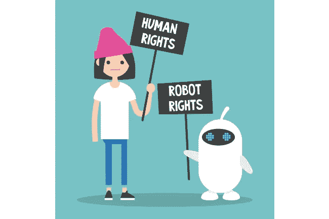

# 审视人类与人工智能的关系

> 原文：<https://medium.datadriveninvestor.com/scrutinizing-human-ai-relationship-39192f2fe157?source=collection_archive---------11----------------------->

> 我们所知道的！
> 
> 人类和人工智能机器将一起工作，这不再是一个书生气十足的理论。他们很可能被认为是“最终游戏”,这意味着他们在预期的未来应该在一起。他们很有可能会完全统治大多数行业和领域，使**人工智能机器在人类
> 
> 环境中的文化和存在正常化。因此，企业有望通过人机合作实现更显著的绩效提升。但我们大多数人可能会质疑我们可能倾向于建立的那种纽带，并在长期内为彼此提供这种纽带。那么，我们为什么要关心他们呢？**
> 
> 没有人实际上是完美的，即使是使用人工智能
> 
> 技术创造的机器。研究表明，当机器人犯错误时，它们更讨人喜欢。尽管他们有从错误中学习和随机应变的能力，我们也一样。尽管我们在外貌、饮食、睡眠和爱情方面存在差异。你绝对可以期待看到一些奇特的东西。它们应该像任何其他机械系统一样启动，但实际上人类对他们的新机器人同事情有独钟。虽然他们经常被描绘成计算器或数据管理者，但这些系统的崛起似乎还有另一面。
> 
> 我们能信任他们吗？
> 
> 如果给你一个与机器共处一室的机会，考虑到人类渴望联系和了解事物，你可能会开始喜欢上它。它可能会像欠人类朋友一样工作，或者可能不仅仅是欠朋友，因为它有能力重视诚实和规定准确性，由于增加了建设性的属性和技术，**人工智能机器将足够像人类，可以与之结合，但也有一些
> 绝对超人的品质，如纠正错误，优先考虑每个人的个人利益，重视他们的观点，将会交换建议，优化他们的工作或研究，最后但并非最不重要的是捕捉彼此对应的记忆(信息数据存储)。**

> 但是，它始于相互信任。毕竟，我们不能有效地与我们不信任的人一起工作或生活，而这些人也不信任我们。AI 也不例外。为什么人与人工智能之间的相互信任很重要的例子广为流传。以半自动车辆为例。由于这些汽车仍在开发中，它们需要一名
> 
> 人类驾驶员做好准备，如果汽车的人工智能
> 
> 无法再安全导航，就收回控制权。但是人工智能怎么能相信这个人已经准备好接手了呢？
> 
> 应该开车的人是警觉的、专注的，并且
> 
> 没有昏昏欲睡或分心？人工智能系统需要
> 
> 能够真正理解我们的情绪和认知状态——在
> 
> 这种情况下，识别某人是否表现出注意力分散的迹象
> 
> 或潜在的危险损伤状态——然后再委托他们。当我们设计这种新的社会契约时，我们需要为人工智能的伦理发展和部署设定标准。这意味着
> 
> 确保人工智能由不同的团队构建，并使用不同的
> 
> 数据，以确保该技术不会复制社会中固有的偏见。这意味着当人们与人工智能交互时，要考虑选择加入和同意的需要，并优先考虑数据隐私。被设计用来与人类互动的人工智能系统将拥有大量的数据，并且将了解很多与它们互动的人。我们也让政府更容易负责任地采用人工智能技术。毫无疑问，人工智能有很大的潜力来改善我们的生活。

> **因此，正如我们需要机器来为我们工作一样，机器也需要人类来关注它们，通过委托它们来监控它们，以便人们能够开始意识到它们可以成为有价值的盟友。**