# 新冠肺炎时代在网上寻找健康信息、产品和希望

> 原文：<https://medium.datadriveninvestor.com/searching-for-health-info-products-and-hope-on-the-internet-in-the-time-of-covid-19-5484f6e21391?source=collection_archive---------16----------------------->

## 一项对消费者在线健康活动的分析揭示了美国人在冠状病毒疫情发作时的大量情绪

Photo by [Mimi Thian](https://unsplash.com/@mimithian?utm_source=medium&utm_medium=referral) on [Unsplash](https://unsplash.com?utm_source=medium&utm_medium=referral)

# 介绍

我们在网上搜索了哪些关于健康信息、药物、治疗方案以及产品的信息，这些信息可能(T0)或可能(T1)在[新冠肺炎/冠状病毒疫情](https://www.who.int/emergencies/diseases/novel-coronavirus-2019/events-as-they-happen)期间真正帮助我们？简而言之，美国人——害怕、被隔离，并且有大量的空闲时间——大量使用互联网*(这是这位专家能找到的最好的学术术语),同时他们开始面对这一流行病学[黑天鹅事件](https://www.investopedia.com/terms/b/blackswan.asp)而面临[与世隔绝和封闭的生活](https://www.nytimes.com/2020/03/27/world/coronavirus-lockdown-relationships.html)！*

*在之前的一篇文章(“[疫情期间我们在网上想要什么，以及这对我们的影响](https://vocal.media/journal/what-we-want-online-during-the-pandemic-and-what-that-says-about-us)”)中，这位分析师研究了 2020 年 3 月期间的*总体*网络趋势——在这个月，冠状病毒不幸成为我们大多数人生活中的故事*和整个国家的巨大挑战*。在这篇文章中，我们将特别关注这个动荡时期我们网络生活的健康方面。是的，当我们的国家和我们自己与一个多世纪以来最糟糕的疫情进行斗争时，这一分析将揭示出你、我和我们的邻居所担心、思考和寻找的许多东西。*

*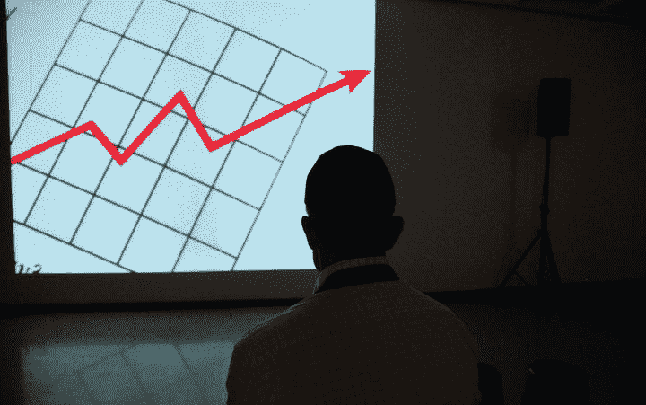*

*By [Frank Busch](https://unsplash.com/@frankbusch) on [Unsplash](https://unsplash.com)*

# *窥见大众*

*最近，我开始熟悉总部设在纽约的“一瞥”(glance)网站的工作，该网站试图从我们所有的在线活动中收集信息，以发现产品、公司和行业的潜在趋势。Glimpse 的关键指标是他们所谓的*消费者兴趣水平*，这是基于该公司对“来自网络的数亿消费者行为信号”的专有分析*

* [## 冠状病毒；惊慌失措；字里行间的 z |数据驱动的投资者

### 围绕冠状病毒的话题；更准确地说，新冠肺炎几乎占据了整个新闻预报的头条…

www.datadriveninvestor.com](https://www.datadriveninvestor.com/2020/03/23/coronavirus-a-to-panic-z-between-the-lines/) 

因此，看看 Glimpse 对上个月(2020 年 3 月)消费者对各种产品兴趣水平的统计分析，这个月,[新冠肺炎/疫情冠状病毒](https://www.cdc.gov/coronavirus/2019-ncov/index.html)在美国爆发，并带来了自我和[州强制的居家命令](https://www.nytimes.com/interactive/2020/us/coronavirus-stay-at-home-order.html)和隔离，所有这些都揭示了一些非常有趣的关于美国人思想和情绪的见解，因为我们共同面临恐惧、不确定性和经济混乱，这些都是由于这种致命疾病的大范围爆发以及我们努力孤立自己以“[平](https://www.livescience.com/coronavirus-flatten-the-curve.html)

在这项研究中，我们特别关注了 2020 年 3 月 Glimpse 关于消费者对各种健康话题的兴趣水平的数据。提醒一下，随着 3 月中旬美国许多地区的疾病爆发恶化，大多数州在 3 月 20 日至 4 月 1 日期间的某个时候实施了居家隔离令。因此，下面的每个图表代表了 2020 年 3 月整月消费者对特定健康主题的兴趣水平数据。当你观察这些趋势时，一定要记住，随着疫情时间的推移，下半月的趋势反映了美国人对这些产品/服务的消费兴趣水平的真实变化，因为疫情导致人们就地避难。

以下是《一瞥》杂志发现的一些更有趣的健康趋势——至少从消费者的角度来看——在这个最不稳定的时代。我们将我们的分析分为两个部分，考察 2020 年 3 月美国消费者表现出的兴趣水平，首先是肯定有助于对抗疾病的东西，然后是主要是“疫情时尚物品”的东西——传言(或更糟)有助于预防甚至治愈冠状病毒！这包括从洗衣用品到家用医疗设备的各种物品，然后是一系列补充剂和药物(主要用于标签外用途，作为潜在的新冠肺炎预防/治疗)，这些物品在 2020 年 3 月疫情的早期阶段引起了非常恐慌的美国公众的兴趣。

# 绝对有帮助的事物趋势…

## ***远程医疗***

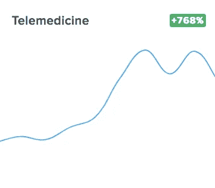

**Source:** Glimpse Consumer Interest Level Data on COVID-19, March 2020 *(*[https://meetglimpse.com/covid19/](https://meetglimpse.com/covid19/)*)*

***为什么会有这种趋势？***2020 年 3 月前远程医疗一直呈上升趋势。然而，由于患者害怕暴露于冠状病毒，医生/诊所希望防止他们的患者和工作人员受到感染，疫情[似乎对所有形式的远程医疗和远程保健产生了浓厚的兴趣](https://khn.org/news/telemedicine-surges-fueled-by-coronavirus-fears-and-shift-in-payment-rules/)。

根据医疗保险[中心&医疗补助服务(CMS)](https://www.cms.gov/) 的规定，这些术语以及医疗计划、医院等可能采用的变体。，[指](https://www.cms.gov/newsroom/fact-sheets/medicare-telemedicine-health-care-provider-fact-sheet)任何导致“通过电子通信将医疗信息从一个地点交换到另一个地点以改善患者健康状况”的实践此外，许多医院和诊所一直在指导那些可能认为自己患有轻度甚至中度新冠肺炎系统的患者使用他们的远程医疗选项，而不是试图访问他们的设施。各州和健康保险计划[改变了关于患者远程医疗和医生/医疗机构报销规定的规则和条例](https://qz.com/1821549/telemedicine-faces-unprecedented-demand-in-the-wake-of-coronavirus/)，以鼓励更多地使用在线互动，这促进了这一点。很可能，这些变化将[极大地促进](https://www.forbes.com/sites/bijankhosravi/2020/03/29/post-coronavirus-how-telemedicine-could-upend-the-healthcare-system/#230f24d5d03f)患者、提供商和支付者对远程医疗的日益接受，从而在冠状病毒爆发后很长一段时间内减少实际的患者护理。

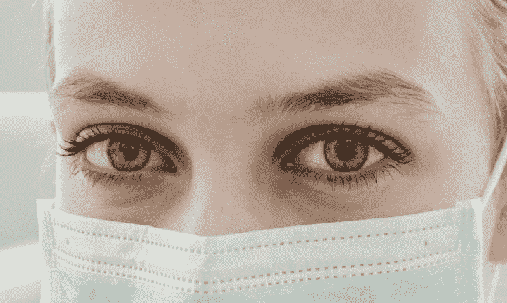

By [Ani Kolleshi](https://unsplash.com/@anikolleshi) on [Unsplash](https://unsplash.com)

## ***个人防护装备***

在检查 Glimpse 2020 年 3 月的消费者兴趣水平数据时，一个非常不可能的趋势变得显而易见，那就是，毫无疑问，许多许多个人、医院、诊所、政府和公司都在网上寻找 PPE(个人防护设备),这种设备很快在该国许多地区出现短缺，危及医疗保健和医务工作者。

随着新冠肺炎疫情的恶化，个人防护设备的缺乏成为[媒体密集报道和政治辩论的主要话题](https://www.usatoday.com/story/news/politics/2020/03/22/coronavirus-fuels-thirst-answers-and-effort-spin-blame/2893949001/)，而对于那些在医院工作的人和第一反应者来说，个人防护设备成为[那些在卫生保健部门工作的人生死攸关的问题](https://www.nytimes.com/2020/03/19/health/coronavirus-masks-shortage.html)。因此，当他们的雇主和机构不能提供他们需要的物品时，许多医生、护士和其他医务工作者转向互联网获取信息，并通过许多点对点和慈善网络获得他们自己的 PPE。此外，一些美国人[购买个人使用的个人防护设备](https://www.npr.org/2020/04/02/825200206/doctors-say-hospitals-are-stopping-them-from-wearing-masks)，试图保护自己免受冠状病毒的感染——可能超出了他们在卫生保健环境之外的任何*家庭、工作和/或社会用途中能够拥有和应该拥有的防护设备——无论情况如何。*

“一瞥”数据明确显示了 2020 年 3 月消费者对个人防护设备的强烈兴趣，包括隔离服(*增长 1154%* )和特卫强套装(*增长 400%* )。

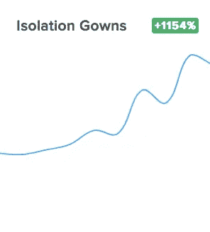

**Source:** Glimpse Consumer Interest Level Data on COVID-19, March 2020 *(*[https://meetglimpse.com/covid19/](https://meetglimpse.com/covid19/)*)*

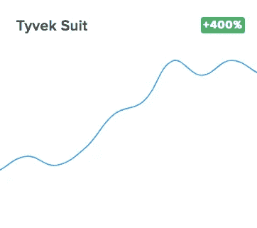

**Source:** Glimpse Consumer Interest Level Data on COVID-19, March 2020 *(*[https://meetglimpse.com/covid19/](https://meetglimpse.com/covid19/)*)*

是的，在即将到来的 4 月份，消费者对各种类型和防护水平的口罩的兴趣水平应该是——嗯，*难以置信*——考虑到不同等级的防护口罩/护盾严重短缺，以及[最近呼吁美国人开始在公共场所戴口罩](https://www.usnews.com/news/national-news/articles/2020-04-03/cdc-advises-all-americans-to-wear-cloth-masks-in-public)！

Photo by [Kelly Sikkema](https://unsplash.com/@kellysikkema?utm_source=medium&utm_medium=referral) on [Unsplash](https://unsplash.com?utm_source=medium&utm_medium=referral)

## ***房子周围的物品***

Glimpse 在 2020 年 3 月对消费者兴趣水平的调查显示，在疫情的早期阶段，美国人对采取措施帮助保护自己和家人免受冠状病毒感染有着浓厚的兴趣——从他们的在线活动中可以看出这一点。我们都知道[全国各地围绕洗手液的疯狂](https://www.cnbc.com/2020/03/27/coronavirus-the-history-of-hand-sanitizer-and-why-its-important.html)——这是《一瞥》在新冠肺炎的评论中没有包括的一个话题，这位研究人员希望在他们下一次发布的 2020 年 4 月消费者兴趣水平月度数据中包括这个话题，因为这应该是*字面上的*超出图表！因此，我们美国人对可能有助于抗击疾病传播和他们感染病毒的可能性的事物表现出强烈的网上*和网下*兴趣。

让我们先来看看[酒精准备垫](https://amzn.to/3dXsGoI)—*实际上帮助防止病毒传播的东西*。因为 [60%的酒精溶液可以杀死冠状病毒](https://www.nbcnews.com/better/lifestyle/many-common-household-cleaning-products-can-kill-coronavirus-if-you-ncna1160271)，[酒精准备垫](https://amzn.to/2wdLdvL)——医护人员在给你打针或抽血之前用来清洁你手臂的那种抹布，因为准备垫上有 70%的酒精溶液，所以[开始流行囤积](https://www.businessinsider.com/coronavirus-checklist-what-to-keep-in-your-purse-or-backpack-2020-3)以帮助防止病毒传播。正如[对](https://www.consumeraffairs.com/news/foot-traffic-at-big-retailers-falls-after-mad-rush-for-coronavirus-related-essentials-040120.html)[洗手液](https://amzn.to/2x2fXAm)的疯狂抢购一样，这里的消费者兴趣在于那些实际上*证明*有助于防止冠状病毒传播的产品。因此，是的，在 2020 年 4 月，无论是当时还是现在，这种令人昏昏欲睡的产品类别突然成为许多美国人的必需品。

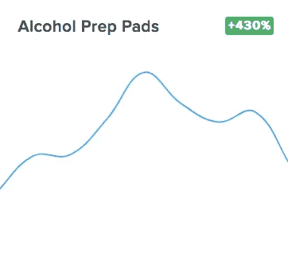

**Source:** Glimpse Consumer Interest Level Data on COVID-19, March 2020 *(*[https://meetglimpse.com/covid19/](https://meetglimpse.com/covid19/)*)*

当然，还有各种各样的其他家用物品可以用来对抗疾病的传播。这导致了从肥皂到各种消毒清洁剂以及 T2 洗手液的抢购。Glimpse 数据中回顾的一个领域是洗衣消毒，特别是如何在洗涤过程中杀死病毒。如下图所示，2020 年 3 月，消费者对[洗衣液](https://amzn.to/3dXwMgt)的兴趣水平上升了 1153%。

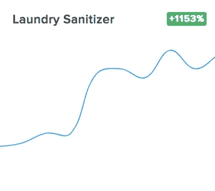

**Source:** Glimpse Consumer Interest Level Data on COVID-19, March 2020 *(*[https://meetglimpse.com/covid19/](https://meetglimpse.com/covid19/)*)*

现在，冠状病毒可以在各种织物上存在多长时间，以及如何最好地实际“洗涤”以最有效地“杀死”病毒的科学是非常复杂的(参见一篇关于该主题的优秀文章，获得关于该问题的具体指导:“[冠状病毒在衣服上存在多长时间，以及如何洗涤它们](https://www.huffpost.com/entry/how-long-coronavirus-live-clothing-washing_l_5e724927c5b6eab779409e74)”)。因此，是的，美国人对在线学习洗衣消毒剂以及如何使用它们— *希望是正确地使用它们—*—以对抗病毒传播的兴趣显著增加——超过 10 倍！

Photo by [Matt Artz](https://unsplash.com/@mattartz?utm_source=medium&utm_medium=referral) on [Unsplash](https://unsplash.com?utm_source=medium&utm_medium=referral)

# …以及对实际没有帮助(甚至可能有害)的事物的趋势！)

关于互联网，我们知道的一件事是，尽管它作为信息来源具有价值，但反驳的观点是，网络不仅充满了虚假信息，而且显然充满了危险的信息！在这种情况下，情况确实如此，不仅是美国人，全球各地的人都在网上寻找答案，以应对新冠肺炎疫情的危险。

想要在互联网上展示关于冠状病毒的错误信息吗？让我们先来看一下 [*c* 胶体银](https://amzn.to/2UFB4l1)——一种悬浮有银小颗粒的水溶液——长期以来一直被用作仅局部使用的灭菌剂。在冠状病毒在美国爆发的早期，[的电视福音传道者吉姆·巴克](https://www.cbsnews.com/news/jim-bakker-coronavirus-covid-19-fake-cure-televangelist-sued-by-missouri-symptoms-selling-treatment/)和其他人[鼓吹口服胶体银溶液](https://www.politifact.com/factchecks/2020/mar/17/sherill-sellman/no-silver-solution-wont-cure-coronavirus/)作为预防新冠肺炎的一种方法，结果却被美国食品和药物管理局[美国食品药品监督管理局](https://www.fda.gov/home)取缔。然而，如图所示，这一行动并没有完全阻止人们对摄入胶体银作为预防冠状病毒的一种手段的兴趣(事实上，它上升了近 200%！)，尽管 NIH ( [美国国家卫生研究院](https://www.nih.gov/) ) [发布警告](https://www.nccih.nih.gov/health/colloidal-silver)称:

*   胶体银会引起严重的副作用。最常见的是银白色，一种蓝灰色的皮肤变色，通常是永久性的。
*   胶体银还会导致某些药物的吸收不良，如某些抗生素和甲状腺素(用于治疗甲状腺缺乏症)。
*   FDA 也在 1999 年警告说，胶体银对于治疗任何疾病都是不安全或无效的。

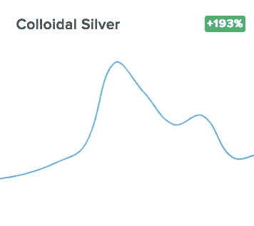

**Source:** Glimpse Consumer Interest Level Data on COVID-19, March 2020 *(*[https://meetglimpse.com/covid19/](https://meetglimpse.com/covid19/)*)*

另一方面，美国人也搜索了各种可能对他们没有伤害，但也可能没有真正证明对预防或对抗冠状病毒有好处的物品。目前对 2020 年 3 月的 Glimpse 数据的分析揭示了两个这样的趋势。首先，消费者对[血氧计](https://amzn.to/39Mq21J)、[一种常见的便携式家用医疗诊断设备](https://www.lung.org/lung-health-diseases/lung-procedures-and-tests/pulse-oximetry)的兴趣水平，在新冠肺炎疫情的早期阶段上升了 200%以上。

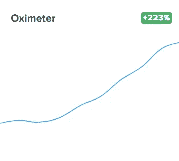

消费者对这些设备越来越感兴趣，这些设备主要由患有慢性呼吸疾病的个人用来监测他们的氧水平是否低于正常水平，[归功于媒体报道](https://qz.com/1832464/pulse-oximeters-for-coronavirus-unnecessary-but-selling-strong/)，包括电视主持人[安迪·科恩](https://twitter.com/Andy)，他说他在与自己的新冠肺炎感染作斗争时自己也使用了脉搏血氧计。

然而，[医学专家在媒体上警告说，对大多数人来说，这些机器虽然不会造成伤害，但在检测可能的新冠肺炎感染方面是无效的。](https://abcnews.go.com/Health/pulse-oximeters-home-track-coronavirus-symptoms/story?id=69939772)

 [## 资源在美国不断增长的疫情中枯竭

### 联邦储备的救生呼吸机几乎耗尽，医院不堪重负，更多的…

www.goodmorningamerica.com](https://www.goodmorningamerica.com/news/video/resources-depleted-amid-americas-growing-pandemic-69955024) 

同样，在 2020 年 3 月，消费者对臭氧发生器的兴趣水平跃升了 224%！再一次，急于找到关于

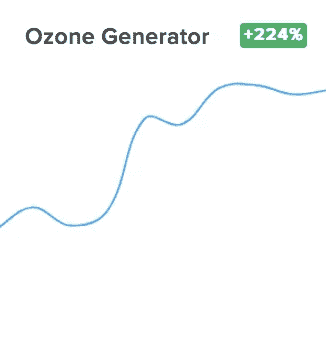

**Source:** Glimpse Consumer Interest Level Data on COVID-19, March 2020 *(*[https://meetglimpse.com/covid19/](https://meetglimpse.com/covid19/)*)*

美国冠状病毒早期的臭氧发生器是由关于这些机器如何被用来对抗——甚至可能杀死——病毒的报道和谣言驱动的。虽然[臭氧消毒](https://www.aeroqual.com/does-ozone-kill-coronavirus-covid-19)是医院用来消毒设备的一种行之有效的方法，并且在过去对某些类型的冠状病毒有效，包括在 2003 年流行期间导致 [SARS](https://www.cdc.gov/sars/index.html) 的病毒，但是如果使用不当，[这些设备](https://www.oransi.com/page/ozone-air-purifier)也会“造成广泛的健康问题，特别是肺部。它们会导致呼吸道发炎和损伤，使肺部更容易受到感染。”关于臭氧发生器的互联网“口碑”变得如此糟糕，以至于 EPA ( [环境保护局](https://www.epa.gov/))最近不得不出来公开建议美国人[不要使用臭氧发生器](https://www.epa.gov/coronavirus/will-ozone-generator-protect-me-and-my-family-covid-19)作为应对冠状病毒的预防性设备，因为风险远远超过任何可能的回报！

## ***补充剂和药物***

在美国新冠肺炎疫情的早期，人们对可能有助于预防和/或治疗冠状病毒的现有补充剂甚至处方药产生了浓厚的兴趣。就连美国总统也加入了这一行动，帮助提高了消费者对羟氯喹的兴趣，羟氯喹是一种历史悠久的抗疟药，颇具争议的是可能在治疗新冠肺炎感染方面有所用途。

尽管政治、医学和科学争论围绕羟氯喹在治疗冠状病毒中的潜在用途展开，但媒体的关注只是增加了美国人对这种药物的好奇心。羟氯喹的在线活动在 2020 年 3 月跃升了 7000%以上，这一事实证明了这一点！

而消费者对普通补充剂的兴趣也在增加，如:

*   **维生素 C**

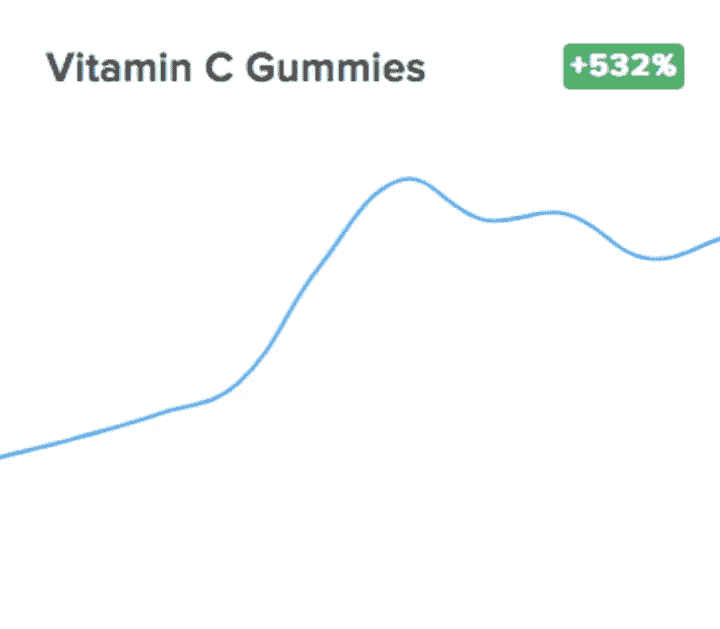

**Source:** Glimpse Consumer Interest Level Data on COVID-19, March 2020 *(*[https://meetglimpse.com/covid19/](https://meetglimpse.com/covid19/)*)*

**资料来源:*一瞥新冠肺炎消费者兴趣水平数据，2020 年 3 月***

*   **锌含片**

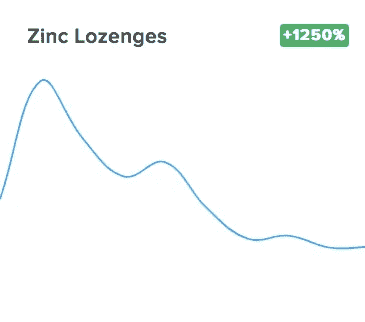

**Source:** Glimpse Consumer Interest Level Data on COVID-19, March 2020 *(*[https://meetglimpse.com/covid19/](https://meetglimpse.com/covid19/)*)*

*   **牛至油**

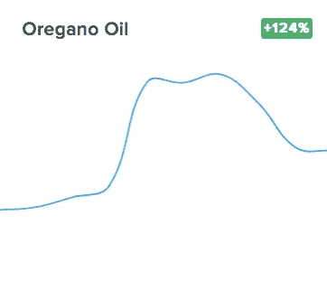

**Source:** Glimpse Consumer Interest Level Data on COVID-19, March 2020 *(*[https://meetglimpse.com/covid19/](https://meetglimpse.com/covid19/)*)*

…公众对大量处方药的兴趣也在增加，这些处方药像羟氯喹一样，被一些知名的*和*媒体，尤其是网上的一些不太知名的消息来源吹捧为可能“治愈”冠状病毒的药物。这些药物主要用于所谓的“标签外用途”(即[表示](https://www.fda.gov/patients/learn-about-expanded-access-and-other-treatment-options/understanding-unapproved-use-approved-drugs-label)将 FDA 批准的药物用于未经批准的用途)，以及可能尚未获准在美国使用的药物，包括以下药物:

*   **阿比朵尔(*涨幅超过 13000%！* )**

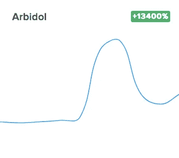

**Source:** Glimpse Consumer Interest Level Data on COVID-19, March 2020 *(*[https://meetglimpse.com/covid19/](https://meetglimpse.com/covid19/)*)*

*   **矢车菊素**

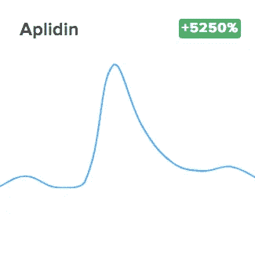

**Source:** Glimpse Consumer Interest Level Data on COVID-19, March 2020 *(*[https://meetglimpse.com/covid19/](https://meetglimpse.com/covid19/)*)*

*   **妥珠单抗**

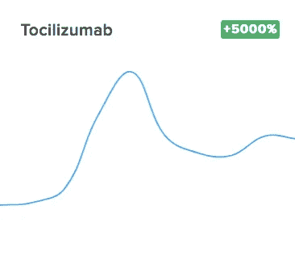

**Source:** Glimpse Consumer Interest Level Data on COVID-19, March 2020 *(*[https://meetglimpse.com/covid19/](https://meetglimpse.com/covid19/)*)*

*   乌米非诺韦

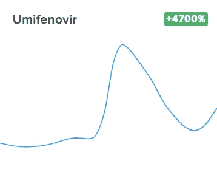

**Source:** Glimpse Consumer Interest Level Data on COVID-19, March 2020 *(*[https://meetglimpse.com/covid19/](https://meetglimpse.com/covid19/)*)*

*   普拉奎尼

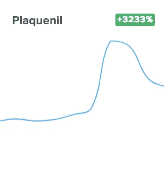

**Source:** Glimpse Consumer Interest Level Data on COVID-19, March 2020 *(*[https://meetglimpse.com/covid19/](https://meetglimpse.com/covid19/)*)*

*   **卡雷特拉**

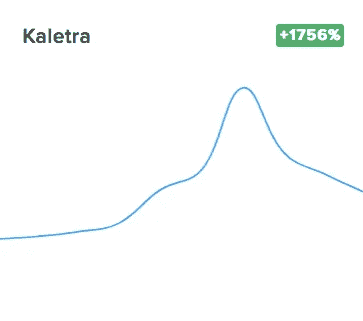

**Source:** Glimpse Consumer Interest Level Data on COVID-19, March 2020 *(*[https://meetglimpse.com/covid19/](https://meetglimpse.com/covid19/)*)*

*   **洛匹那韦**

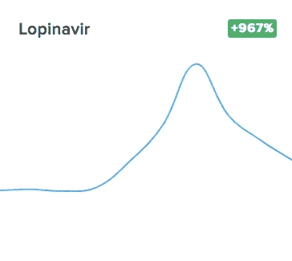

**Source:** Glimpse Consumer Interest Level Data on COVID-19, March 2020 *(*[https://meetglimpse.com/covid19/](https://meetglimpse.com/covid19/)*)*

## 消费者对药品兴趣水平的探讨

涉及使用无标签处方药甚至未获得 FDA 批准的抗冠状病毒药物的问题是一个复杂的问题，这是一个值得关注的问题，远远超出了作者能够提供的范围。正如[美国医学协会](https://www.ama-assn.org/)、[Patrice Harris](https://twitter.com/PatriceHarrisMD)、[博士最近警告](https://www.huffpost.com/entry/ama-president-trump-hydroxychloroquine_n_5e8a9914c5b6e7d76c663197) : *“这是一种新病毒，所以我们不应该推广任何未经 FDA 证明和批准的治疗任何疾病的药物或药品。”*

然而，有一点是肯定的:消费者对任何可能有助于预防冠状病毒感染或对新冠肺炎患者有效的东西的兴趣水平，是媒体、政府官员，是的，制药公司应该持续监控的，并随着在线活动趋势的发展，能够做出“快速反应”。在社交媒体上看到的、在现实生活中听到的以及在网络和/或传统媒体上看到的“事情”可以迅速形成一个恶性循环，甚至是危险的循环，并将生命置于危险之中。因此，这是一个需要密切和持续监控的网络活动领域。虽然回顾过去，从宏观层面观察美国消费者兴趣水平的变化来看，本文研究的月度数据很有意思，但对这种趋势的实时分析对于公司和政府来说尤为重要，以保护公众健康免受疫情期间药物治疗选择和可用性的错误信息的影响。

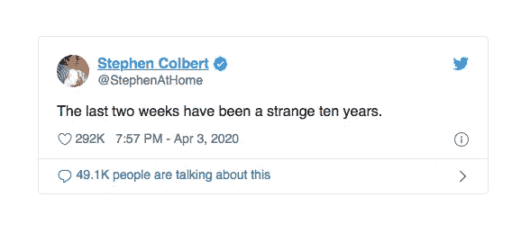

**Source:** [https://twitter.com/StephenAtHome](https://twitter.com/StephenAtHome)

# 结论

在这个充满不确定性的时代，从几乎每个角度来看——健康、经济、社会、家庭等等。—我们知道，我们所有人都可能比以往任何时候都更频繁地使用互联网。我们将在网上——大部分时间在家里——工作、观看、交流，是的，在网上搜索医疗信息，并回答我们在这个动荡时期遇到的问题。

因此，虽然这篇文章是对一个月的数据进行的单一分析，详细说明了美国消费者在这一非常独特和前所未有的历史时期的兴趣水平，但这只是一个非常有趣的研究流的开始，该研究流将研究我们如何——无论是集体还是个人——在一个深刻的危机时代进行在线互动。作为一名管理学教授和这类营销和战略问题的“专家”，我相信，我们将从分析 2020 年疫情冠状病毒期间，不仅仅是美国人，而是世界各地的个人如何利用“让世界触手可及”的奢侈中学到很多。也许，仅仅是也许，我们可以从企业、政府和个人/家庭在集体危机时的反应中学习如何做得更好。就我个人而言，我相信从所有这些事情中可以获得很多真知灼见，我个人也期待更多关于我们如何“预测不可预测的事情”并在下一次做得更好的工作，或者更好的是，帮助防止下一次发生！

_________________________________

大卫·c·怀尔德*([dwyld@selu.edu](http://dwyld@selu.edu))是新奥尔良外东南路易斯安那大学[的管理学教授。他是一位著名的商业顾问和当代管理问题的演讲者/作家。](https://www.southeastern.edu/)*

*最初发布于*[*https://vocal . media/journal/searching-for-health-info-products-and-hope-on-the-time-of-the-internet-of-the-新冠肺炎*](https://vocal.media/journal/searching-for-health-info-products-and-hope-on-the-internet-in-the-time-of-covid-19)*