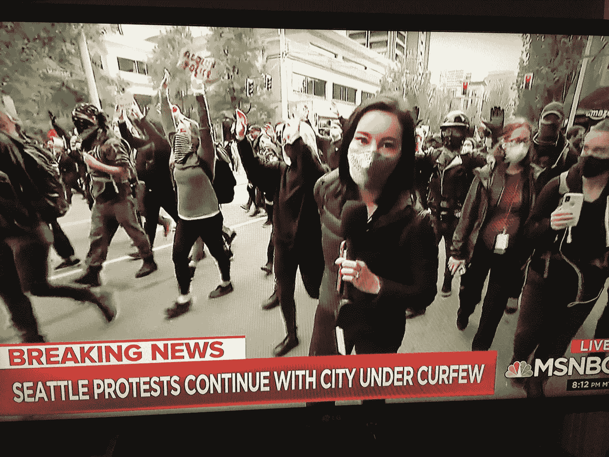

# 西雅图法官裁决媒体败诉

> 原文：<https://medium.datadriveninvestor.com/seattle-judge-rules-against-the-press-2f7fd66674f2?source=collection_archive---------13----------------------->

## 《西雅图时报》和电视台必须将录像交给警方

Screenshot of MSNBC news coverage of the Seattle demonstrations that occurred Memorial Day Weekend. Courtesy: Jennifer Karchmer, taken May 31, 2020.

2020 年 7 月 31 日更新:媒体将对尼尔森·李法官强制执行传票的决定提出上诉。

*《西雅图时报》执行主编米歇尔·马塔萨·弗洛里斯表示，该报“将提起上诉”。她在 7 月 31 日的一封电子邮件中说，“我们坚信，这一决定对媒体的独立性和摄影记者的安全构成了风险。”。*

尽管华盛顿州的《T4 记者保护法》保护记者在大多数情况下不必放弃笔记、文件或消息来源，但 7 月 23 日，当西雅图法官命令《西雅图时报》和四家西雅图电视台向警方提供视频和照片以帮助刑事调查时，新闻自由受到了令人不安的打击。

7 月 23 日上午 9:07，我通过电话会议参加了由金县高等法院法官尼尔森·李主持的公开听证会。该案件使西雅图警察局和西雅图市与西雅图时报、KIRO、KING-5、KOMO 和 KCPQ 福克斯新闻频道展开了对抗。

一个月前，西雅图警察局命令新闻媒体向他们提供在阵亡将士纪念日周末示威和抗议期间拍摄的数码照片和视频，这些示威和抗议是因乔治·弗洛伊德被杀而爆发的。警方正在调查汽车火灾以及从警车上被盗的枪支，并寻求媒体的帮助，因此在 6 月 18 日，他们发出了[传票](https://www.documentcloud.org/documents/6979683-Subpoena-Duces-Tecum-Seattle-Times-Company-Et-Al.html)——一种迫使媒体提供文件的合法方式。

作为回应，新闻媒体在西雅图 Davis Wright Tremaine 的媒体律师的帮助下，试图“撤销”或废除传票，他们自己用一份法律文件进行反击:“新闻媒体反对并要求撤销所谓的受保护新闻采集材料的传票”《西雅图时报》助理总编丹尼·加沃斯基在一份公开声明中为媒体提供了进一步的支持。

在两个小时的听证会结束时，李法官站在了西雅图警方一边，命令新闻媒体放弃视频和图像，以协助调查。西雅图警方试图获取 5 月 30 日周六下午 3:30 至 5:00 之间拍摄的所有原始视频片段和静态照片，拍摄地点包括奥利夫街至派克街，以及西雅图第六大道至第四大道。在此期间，嫌疑人放火焚烧警车。另外，一名或多名嫌疑人从警车上偷了枪支。

> “媒体的存在很大程度上是为了让政府，包括执法机构，对公众负责。”米歇尔·马塔萨·弗洛雷斯，《西雅图时报》执行主编

在 7 月 23 日的听证会之前，7 月 2 日举行了一次听证会，没有为法官做出决定提供足够的信息。由于新冠肺炎的原因，听证会是通过电话进行的，与会者打电话进入会议线路。诉讼程序对公众开放，在庭审结束时，李法官说大约有 12 名来电者出席(不清楚这个数字是包括法官和诉讼律师，还是只包括公众出席者)。

出席并发言的有:

*   尼尔森·李法官，金县高等法院法官。
*   新闻自由记者委员会的代表马德琳·莫拉提交了一份名为“法庭之友简报”的声明。
*   Eric Stahl，Davis Wright Tremaine 的律师，代表 T2、西雅图时报和西雅图电视台。
*   布莱恩·埃斯勒是代表西雅图警察局的米勒·纳什·格雷厄姆·邓恩律师事务所的律师。
*   加里·恩斯多夫，国王郡检察官办公室的高级副检察官。
*   西雅图警探迈克尔·马根。

斯塔尔要求法官驳回传票，主要理由是媒体不为执法部门工作，不应被迫提供视频片段或照片等材料。在听证会的两天前，我和*《西雅图时报》*的执行主编米歇尔·马塔萨·弗洛里斯就这个话题进行了一次电子邮件交流。

 [## 关于华为|数据驱动投资者的一个误区

### 《华尔街日报》在最近的一篇文章中详细描述了华为是如何被北京的数十亿美元推动的。在网络版中,《华尔街日报》…

www.datadriveninvestor.com](https://www.datadriveninvestor.com/2020/01/14/a-wrong-way-about-huawei/) 

“媒体的存在很大程度上是为了让政府，包括执法机构，对公众负责，”她在 7 月 21 日写道。“对于我们的可信度和有效性来说，保持独立于我们所报道的对象是非常重要的。由于我们国家普遍的分裂，我们现在比以往任何时候都不能被公众视为执法部门的一员。”

在听证会上，代表西雅图警方的艾斯勒有责任说服法官，传票是可以执行的，在这种情况下，新闻媒体不属于华盛顿州盾牌法的范围，即所谓的 [RCW 5.68.010](https://apps.leg.wa.gov/RCW/default.aspx?cite=5.68.010) 。埃斯勒需要证明:

*   有合理的理由相信犯罪已经发生，
*   被请求的材料(视频和照片)“是高度重要和相关的”
*   被请求的材料是“关键的或必要的”
*   “这一披露有令人信服的公众利益”
*   “寻求此类新闻或信息的一方已用尽所有合理和可用的手段从替代来源获得该信息。”

在证词中，Magan 侦探列出了他和他的警察团队在调查中采取的步骤，包括敲开市中心商店的门，要求提供监控视频，与该地区的大型百货商店交谈，包括 Nordstrom、Gap 和 Old Navy。在一个案例中，他能够从市中心的星巴克获得镜头，然而，黑白视频的质量“很糟糕”，Magan 说，认为这些剪辑在明确识别嫌疑人方面是不可用的。

Magan 解释说，一名业余摄像师提供了一些有用的镜头，但那只是一个人。显然，西雅图警方有一个[证据门户](https://seattlepd.evidence.com/axon/citizen/public/demonstrations)，公众可以匿名发布视频。根据 Magan 的说法，在超过 27000 次上传中，只有大约 200 个剪辑甚至是最低限度的使用——其中大部分是色情的。根据侦探的说法，警方能够从盗窃和纵火中找到两个嫌疑人，并根据其他图像部分确定了其他人，但处于停滞状态。“我烧了鞋革，又折了回来，”马江作证说。“我不知道该往什么方向走。我坐在泥地里转着我的轮子。”

根据 Magan 的说法，西雅图警察局没有举行新闻发布会，张贴印刷或数字海报，登录犯罪提示网站 Crimestoppers，或以其他方式向公众广播请求。为了表明警方没有用尽所有途径，Stahl 进一步询问 Magan，为什么他的团队没有直接向公众呼吁，要求在媒体之前提供视频。

Magan 表示，助理警察局长指示他不要向公众寻求帮助，因为调查涉及枪支，并被视为“公共安全问题”。在听证会期间，我在谷歌上搜索了一下，发现了一篇关于 Seattle.gov 的[帖子](https://spdblotter.seattle.gov/2020/06/01/police-seek-videos-and-photos-as-they-investigate-destruction-violence-in-downtown-core/)，标题是“警察在调查市中心核心区的破坏和暴力时寻求视频和照片”，发表于 2020 年 6 月 1 日。不清楚这个链接是否已经向公众播出或在社交媒体上推广。

“我相信我已经用尽了所有的线索，没有别的地方可去，”马江在他的证词中继续说。“我当警察已经快 34 年了。我从未见过如此重大的案件。我从未见过警车被烧毁，也没见过从车辆上偷走枪支。”

斯塔尔为媒体辩护，继续他的论点，称强迫媒体交出镜头以协助警方调查可能会被公众视为协助执法，并反过来激起公众对记者的更多不信任——这一职业已经遭受了公众的激烈争论和身体攻击，来自示威游行的公众甚至警察。

斯塔尔说:“我们认为，保持媒体的独立性符合公众的切身利益。”。

李法官并不接受这种说法，他说，不信任和攻击虽然具有破坏性和警示性，但不是由警方引起的，与传票无关。

需要明确的是，媒体需要制作的镜头来自每个电视台的“高质量”摄像机，而不是来自个别记者的个人手机。

根据[7 月 23 日*西雅图时报*的报道](https://www.seattletimes.com/seattle-news/judge-rules-seattle-media-companies-must-hand-over-protest-images-to-police/)，媒体正在决定是否对法官的判决提出上诉。另一次电话听证会定于 7 月 30 日上午 9 点举行

Jennifer Karchmer 是一名独立记者，报道新闻自由、第一修正案和记者安全。更多在此:[www.jenniferkarchmer.com](http://www.jenniferkarchmer/)*并在推特上*[@记者 _jk](https://twitter.com/journalist_jk?lang=en)

## 本报告和进一步阅读参考资料来源

*   [传票](https://www.documentcloud.org/documents/6979683-Subpoena-Duces-Tecum-Seattle-Times-Company-Et-Al.html)西雅图时报等
*   西雅图时报[反对传唤](http://www.jenniferkarchmer.com/uploads/9/9/9/1/9991267/2020-06-29_objections_to_subpoena_for_protected_newsgathering_material.pdf)
*   《西雅图时报》助理总编丹尼·高沃斯基[声明](http://www.jenniferkarchmer.com/uploads/9/9/9/1/9991267/2020-06-29_declaration_of_danny_gawlowski_in_support_of_objections_to_subpoena_for_protected_newsgathering_material.pdf):
*   新闻自由记者委员会，[法庭之友简报](https://www.rcfp.org/wp-content/uploads/2020/06/Amicus-Brief-of-Reporters-Committee-for-Freedom-of-the-Press.pdf)。
*   "[西雅图法官考虑警方传唤记者视频](https://www.courthousenews.com/seattle-judge-mulls-over-police-subpoena-for-journalists-videos/)，" 2020 年 7 月 16 日，法院新闻服务。
*   [《西雅图时报》等媒体对抗西雅图警察局传票索取原始镜头、照片的抗议](https://www.seattletimes.com/seattle-news/seattle-times-other-media-fight-seattle-police-department-subpoena-for-raw-footage-photos-of-protest/)《西雅图时报》2020 年 7 月 3 日。
*   2020 年 6 月 1 日，Seattle.gov。
*   Seattle.gov 西雅图警察局。
*   “华盛顿州的新保护法”，2007 年 5 月 4 日，《哥伦比亚新闻评论》。
*   华盛顿州屏蔽法， [RCW 5.68.010](https://app.leg.wa.gov/RCW/default.aspx?cite=5.68.010) 。
*   [数字媒体法项目](http://www.dmlp.org/legal-guide/washington/washington-protections-sources-and-source-material)，华盛顿对来源和来源材料的保护。

*更正:这篇报道于 2020 年 7 月 26 日周日下午 12:07 更新，以更正新闻自由记者委员会的玛德琳·莫拉在听证会期间对法庭之友摘要的简要概述。她没有像以前报告的那样逐字宣读法庭之友的摘要。*

**进入专家视角—** [**订阅 DDI 英特尔**](https://datadriveninvestor.com/ddi-intel)