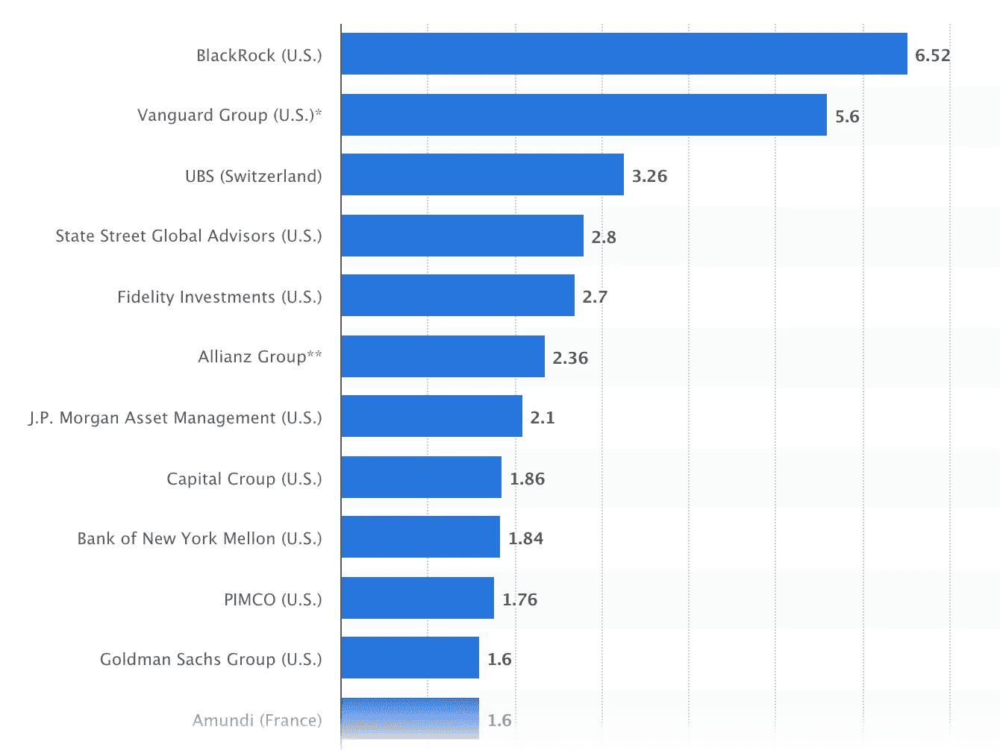

# 世界第二大资产管理公司拥抱区块链技术

> 原文：<https://medium.datadriveninvestor.com/second-biggest-asset-manager-in-the-world-embraces-blockchain-technology-9b8cd83037f4?source=collection_archive---------12----------------------->

2 分钟视频，解释 Vanguard 如何使用区块链和数字资产

在富达资产管理公司进行的一项调查中发现，五分之四的机构投资者认为数字资产具有“T2”的吸引力。在富达调查的公司中，27%的美国公司和 45%的欧洲公司目前投资于数字资产。

全球最大的资产管理公司

来源:Staista.com

泰坦先锋是全球第二大资产管理公司，管理着 5.6 万亿美元的资产。它以其一系列指数跟踪基金而闻名，几年来一直致力于许多项目，以调查使用区块链技术的真正好处。自 [2017 年以来，](https://www.coindesk.com/mutual-fund-giant-vanguard-wraps-phase-1-of-digital-asset-backed-securities-pilot) Vanguard 还一直在与一家总部位于美国的企业 symbion 合作，该企业拥有一个基于区块链的平台(显然给纳斯达克风险投资[2019 年 1 月向 symbion 投资 2000 万美元](https://www.forbes.com/sites/michaeldelcastillo/2019/01/23/exclusive-nasdaq-leads-20-million-investment-in-enterprise-blockchain-startup-symbiont/#20a0eefe46d1))留下了深刻印象。

2019 年秋天，Symbiont 和 Vanguard 宣布，他们正在考虑使用区块链平台来提高日均 6 万亿美元外汇(FX)市场的效率。自 2019 年 8 月以来，Vanguard 一直在测试 Symbiont 的区块链平台，进行外汇交易，并对结果印象深刻，决定上市。最初，先锋的意图是帮助自己的资产管理公司。随着时间的推移，这将包括其他经理人，从而通过点对点交易(而不是通过银行)降低外汇交易的成本，从而降低与第三方交易的成本和需求。一个额外的驱动因素也是为了降低合规风险，这似乎是更多机构参与区块链技术的常见原因。来自 [Vanguard 的 Carolyn Wegemann 说](https://www.financemagnates.com/institutional-forex/technology/vanguard-partners-with-symbiont-to-bring-blockchain-to-fx-market/)“*Vanguard 目前正在试点一个项目，重点是提高外汇对冲的效率和降低风险*

 [## 数字货币、区块链和货币的未来|数据驱动的投资者

### “区块链”、“加密货币”、“令牌化”，以及现在的“央行数字货币”已经成为…

www.datadriveninvestor.com](https://www.datadriveninvestor.com/2020/02/18/digital-currencies-blockchain-and-the-future-of-money/) 

Vanguard 使用区块链的最新尝试是评估一种完全数字化的资产支持证券(ABS)的生命周期。先锋集团与纽约银行、梅隆银行、T2 银行、花旗银行和 T4 道富全球顾问公司已经完成了发行资产支持型证券的第一次试验。引用 Vanguard 金融科技战略集团的 Warren Pennington 的话说“*通过数字化和简化 ABS 发行流程，我们将能够提高交易的速度和透明度，同时降低成本并最大限度地减少风险，最终实现更高效的商业模式* …”

Vanguard 正在使用来自 1.3 万亿美元指数基金的数据，使其基金能够通过一个分散的数据库几乎即时地跟踪相关指数。通过使用“智能合约”，即在约定事件发生时自动执行，人们相信这将改善信息流、价格发现、二级市场的流动性以及关键企业行动的自动化。因此，减少了任何基准跟踪误差，并节省了客户的资金(这对于合规人员和董事会成员来说是天籁之音)。人们认为，使用区块链技术可以大幅降低成本，提高透明度，并改善金融机构内部的风险控制。

以上文章是用数字字节带给你的。如果你想每周收到数字字节，请发电子邮件给 Jonny.Fry@Teamblockchain.net。

**访问专家视图—** [**订阅 DDI 英特尔**](https://datadriveninvestor.com/ddi-intel)