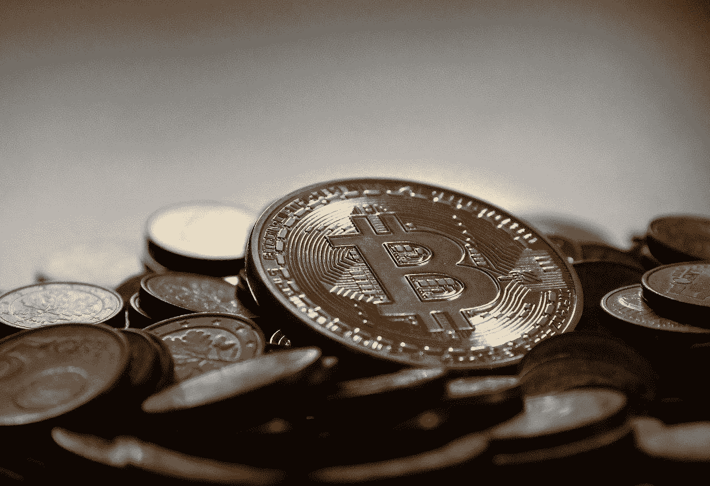
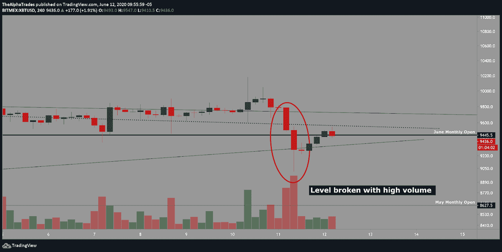

# 比特币抛售第二波？股票市场将如何支配 BTC

> 原文：<https://medium.datadriveninvestor.com/second-wave-of-bitcoin-selling-how-the-stock-market-will-dictate-btc-875c0828165b?source=collection_archive---------13----------------------->

## COVID 案例增加，股票打破趋势，BTC 卖家保持强劲。

Bitcoin crypto, Image by Michael Wuensch from Pixabay

今天，我们将着眼于广泛的市场，以更好地理解昨天比特币和股票的大抛售。

我已经讨论了几个星期的 9445 的重要性。自从 6 月份开始以来，比特币已经多次冲击该水平，直到昨天该水平被突破。如果你已经[看过我们的视频](https://youtu.be/qb69rOzbmSo)或者[看过我们的文章](https://medium.com/datadriveninvestor/bearish-volume-divergence-in-bitcoin-have-altcoins-topped-25625512113b)，你就会知道我认为这种突破是必然会发生的。

前几天，无论是黄金还是白银、石油、股票、大宗商品，甚至是货币，整个市场都遭到抛售。这足以推动比特币以令人信服的高成交量通过 6 月月度开盘。通常，当资产接近高交易量的特定水平时，一旦到达下一个关键水平，它有更大的机会向相反方向回撤，但当价格突破高交易量的水平时，回撤足以恢复先前趋势的机会就不太可能了。后者是我们现在在比特币中看到的，所以我认为 6 月的月开被打破了。

 [## 加密货币行业是死是活？数据驱动的投资者

### 九月初，我们在 X-Order 内部就代币市场的未来进行了一场辩论。有趣的是，我们的观点是…

www.datadriveninvestor.com](https://www.datadriveninvestor.com/2019/12/12/will-the-cryptocurrency-industry-be-dead-or-alive/) 

我预计 6 月份的月度开盘将成为一个关键的阻力位，在撰写本文时，价格正在挑战这一预测。

BTC level is broken on high volume; Source: Alpha Trades

# 如果你是艾略特波浪交易者，你可以查看我前几天的图表或者今天的视频([时间戳 2:15](https://youtu.be/weW8bEQZPYk?t=135) )，嵌入在这篇文章的底部(TradingView 读者必须通过我们的签名行导航到视频)。

只要不采取措施阻止股票继续下跌，我们目前就有抛售比特币的完美风暴。昨天上午在市场开盘时，我警告我们的优势会员，抛售正在开始，大约在那个时候，有报道称，美国和国外的第二波冠状病毒病例正在市场上制造恐慌。盘前交易也给出了预警信号。不管是什么原因造成的，作为一个技术交易者，我已经做好了自我定位，并提醒社区，强烈的抛售越来越有可能发生。

根据你正在查看的交易所，比特币正在打印不同的支点，但根据 BitFinex，**四小时支点正好在 9762 点左右。**

# 比特币继续被转移到交易所

比特币另一个值得关注的指标是流入和流出交易所的。通常，当比特币流入交易所时，所有者的目标是出售。我们[已经详细地](https://medium.com/datadriveninvestor/3-reasons-why-bitcoin-hasnt-bottomed-daily-review-c59f49b68a31?source=your_stories_page---------------------------)讨论了过去几周内[未知矿池](https://news.bitcoin.com/bitcoin-miners-selling-faster-than-they-generate/)的重大抛售。昨天，在 BTC 下跌之前，我们可以看到 BTC 的上涨是如何被载入交易所的。即使散户交易者继续抬高价格，大卖家仍继续主导市场(好吧，或许零售叙事最终会改变，我们将拭目以待)。

自今年年初以来，BTC 只花了大约八天时间超过 10，000 点，如果只计算实际收盘在该关口上方的天数。很明显，这是一个强大的心理水平，大卖家一直在散户的推动下分配价格，这样他们就可以在理想的水平退出他们的头寸。

# 随着 COVID 第二波恐惧的增长，股票抛售

标准普尔 500 电子迷你期货(ES1！)打破了自 2020 年 3 月崩盘见底以来保持不变的上升趋势。市场可能反映了交易员试图提前计入第二波停摆的经济影响。与病毒相关的市场混乱可能会持续几周，尽管这并不一定意味着市场会像 3 月份那样极度下跌。我预计，只要美联储不试图通过印更多的钞票来堵住船上的漏洞，人民币就会缓慢下行。这当然增加了比特币遵循同样轨迹的可能性。

Equities break the uptrend; Source: Alpha Trades

# 知道何时弃牌— BYND 选项更新

我们的团队已经开始减少我们对市场的长期敞口。前几天，我提醒我们的会员，Beyond Meat (BYND)正在崩溃，不幸的是，我不得不茫然退出。

作为交易者，你必须尽最大努力确保利润。永远不要让赚钱的交易变成赔钱的交易。这是你在市场上交易或投资的最糟糕的方式。最好的情况是，我弄清楚我是否能建立一个盈亏平衡止损点，以确保我能以一定的利润退出反转头寸。我们不能告诉你买或卖，但我们可以告诉你我们在市场上到底在做什么。我们不提供财务建议，但我们提供诚信。正如今天的视频所示，当**我平仓 BYND，总体亏损 19%时，我每一步都提醒了社区。**

BYND breaks down; Source: Alpha Trades

# 优势会员获得更多

[订阅 Discord 服务器](https://bit.ly/2KJ1oor)学习技术分析以及如何投资获利。要求第一个月的高级会员享受 50%的折扣！(优惠将于 6 月 15 日结束)查看以下视频了解更多信息。

Second Wave of Bitcoin Selling? How the Stock Market Will Dictate BTC

不要错过，因为我们**在我们通常免费提供的内容中占主导地位**关注更高质量的数据、新闻和对我们优势群体的分析。

# 放弃

Alpha Trades，LLC 提供的信息不用于制定任何财务决策，也不是购买、持有和/或销售特定产品、数字资产或 ICO 的请求或建议。

访问我们的完整服务条款:[https://bit.ly/3faVeeV](https://bit.ly/3faVeeV)