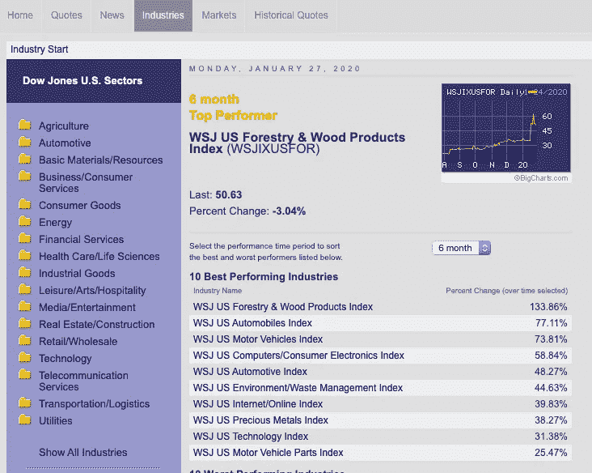
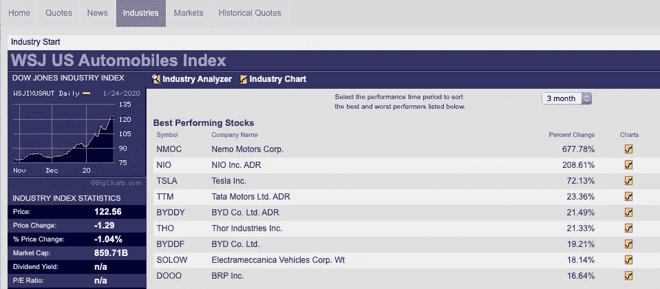

# 独自交易没有你想象的那么难

> 原文：<https://medium.datadriveninvestor.com/sector-rotation-swing-trading-strategy-c59c8c548272?source=collection_archive---------2----------------------->

你有没有参加过免费的股票交易讲座，但最终注册了他们的付费项目？课程结束后，你会感到兴奋和激动，很快你的交易账户就有了资金。接下来会发生什么？你可能不知道交易什么，但是猜猜看？组织课程的学院还提供股票推荐服务！

Photo by [Nik Shuliahin](https://unsplash.com/@tjump?utm_source=medium&utm_medium=referral) on [Unsplash](https://unsplash.com?utm_source=medium&utm_medium=referral)

现在，在投资了数千美元的课程和该学院提供的服务后，你意识到你已经开始依赖他们的服务。这时，你就希望那只股票能让你的交易账户翻倍或三倍，这样你就能最终收回迄今为止所有的投资成本。

 [## 想知道领导是谁？请他决定。数据驱动的投资者

### 一个有效的领导者能为组织提供的最有价值的东西之一是决策能力…

www.datadriveninvestor.com](https://www.datadriveninvestor.com/2019/01/25/want-to-know-who-the-leader-is-ask-him-to-decide/) 

然后突然，你想到…如果这种股票存在，或者如果它很简单，为什么这门课程的创始人要教呢？他们本可以把他们所有的钱和厨房水槽都投入到那只股票中，而不是花费所有的时间和精力来“分享”他们的知识和策略，对吗？

不知不觉中，你结束了继续投资更多的钱在学院，而不是做实际的股票交易，这是一个典型的股票交易课程。它给你鱼，而不是教你钓鱼。

我希望这篇文章能给你一些关于如何形成自己的策略和计划的提示和建议。通过练习和一些个人调整，你一定能自己钓鱼。

> 给一个人一条鱼，你可以喂他一天。教一个人钓鱼，你可以喂他一辈子

Photo by [stephen momot](https://unsplash.com/@ah360?utm_source=medium&utm_medium=referral) on [Unsplash](https://unsplash.com?utm_source=medium&utm_medium=referral)

今天分享一下我个人的 4 步策略(板块轮动摆动交易策略)。它是使用一些方法和在线免费工具构建的。您可以单独使用它，甚至可以将它与您已经学会的其他技术或方法结合使用。下面是免费的工具或网站，可以帮助你一路走来。

1.  [www.finviz.com](http://www.finviz.com)
2.  www.etfdb.com
3.  【www.bigcharts.com 
4.  [www.marketwatch.com](http://www.marketwatch.com)

**第一步:了解市场部门或行业**

宏观经济消息很重要，但如果你不知道自己在寻找什么，它也会影响你的决定。首先，你可能会盯着 www.marketwatch.com 看几个星期，甚至不知道如何反应。股票市场由代表农业、航空等关键经济领域的行业组成。

交易所交易基金( **ETF** )是一种在证券交易所交易的投资基金，很像股票。它持有股票、商品或债券等资产。我们正在寻找的是基于行业部门的 ETF，以衡量行业的趋势。

以下是一些受欢迎的标准普尔 500 交易所交易基金，你可以监测:

XLE—SPDR 能源精选基金

XLB—SPDR 基金材料精选部门

XLI-SPDR 工业精选基金

XAR-SPDR 工业精选基金

XHB — SPDR S&P 房屋建筑基金

XLP —消费必需品精选行业 SPDR 基金

XLV —医疗保健精选行业 SPDR 基金

XLF—SPDR 医疗保健精选基金

XLK —技术精选行业 SPDR 基金

XLC —通信服务精选行业 SPDR 基金

XLU —公用事业精选行业 SPDR 基金

你可以通过查看 www.etfdb.com 的[找到更多的 ETF。请避免低交易量 ETF、高杠杆 ETF 或反向 ETF，因为这可能会给人一种行业实力的错觉。](http://www.etfdb.com)

**第二步:评估行业实力(上升趋势)**

为了衡量行业实力，你可以使用上升趋势的概念。如果你没有读图的知识，你可以简单地利用[www.finviz.com](http://www.finviz.com)提供的工具。它自动绘制支撑线、阻力线、趋势线、潜在突破形态和移动平均线。

有很多方法可以在图表中识别上升趋势。您可以使用以下一种或几种的组合。你的最小时间框架应该总是以天为单位。

1.  3 条移动平均线(MA) —如果价格堆叠在 MA 20 之上，MA 20 堆叠在 MA50 之上，MA50 堆叠在 MA200 之上，这是一个上升趋势。
2.  更高的高，更高的低-价格继续创造更高的高和更高的低。

下面是一个上升趋势开始的例子，它符合上面的两个条件。

一旦你在 ETF 的任何图表中发现了上升趋势，你可以继续第 3 步。如果可能的话，总是留意趋势的变化。这意味着上升趋势正在形成，这样你就可以一直驾驭这个趋势。

或者，你也可以看看[www.bigcharts.com](http://www.bigcharts.com)的十大表现最佳的行业。请注意，[大图表](http://www.bigcharts.com)中使用的行业指数是不可交易的。对这 10 大新条目的持续监控会给你一个新趋势的潜在开端。

**第三步:寻找购买机会**

一旦你在图表中确认了上升趋势，注意在支撑线或均线的低点买入。

除了购买 ETF，你还可以通过比较 ETF 中的股票来建立自己的股票投资组合。例如，如果你想购买 XHB (Homebuilder ETF)，你还可以比较 LEN，DHI，HD，PHM 等公司的市盈率和其他基本面分析。你可以用[www.finniz.com](http://www.finniz.com)帮你。

如果你使用的是[www.bigcharts.com](http://www.bigcharts.com)，该行业指数是不可交易的，所以你需要投资该指数跟踪的个股。

**第四步:监控市场新闻**

首先，这不是价值投资。你不会购买并持有 ETF 或股票多年。你可以继续逢低买入并持有，直到图表告诉你趋势结束。

你不是通过监测市场新闻来挑选股票，而是通过监测市场新闻来发现你所投资行业的任何异常情况。比如你已经投资了 XHB(住宅建筑商 ETF)，而美联储刚刚加息，请尽快从投资中抽身。

**总结**

板块轮动交易策略简单而有力。这篇文章是根据我个人的理解写的，我希望它能给你一个不同的炒股视角。

祝你学习愉快，并祝你在交易旅途中一切顺利。

你现在知道怎么钓鱼了吗？请在评论中分享。

Photo by [Robson Hatsukami Morgan](https://unsplash.com/@robsonhmorgan?utm_source=medium&utm_medium=referral) on [Unsplash](https://unsplash.com?utm_source=medium&utm_medium=referral)