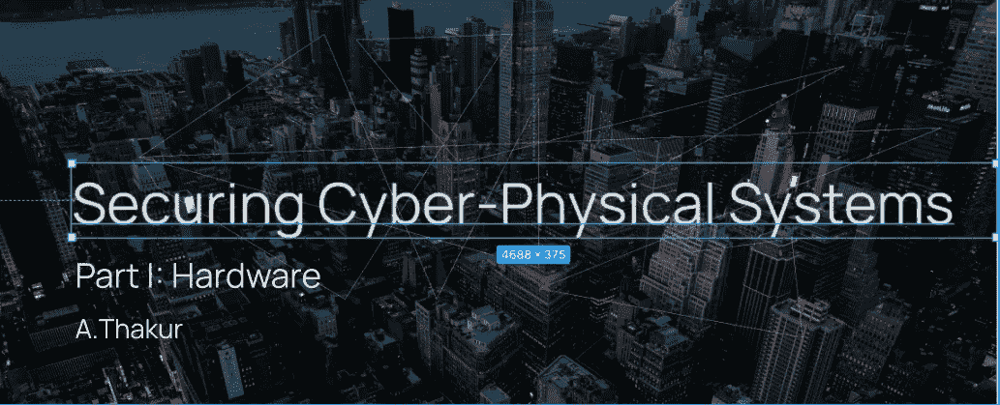
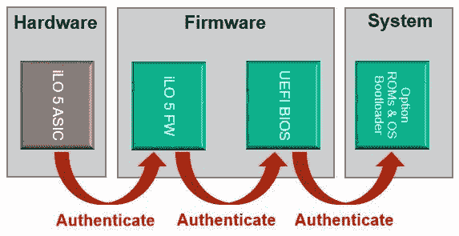
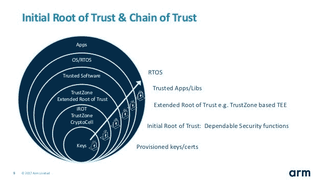
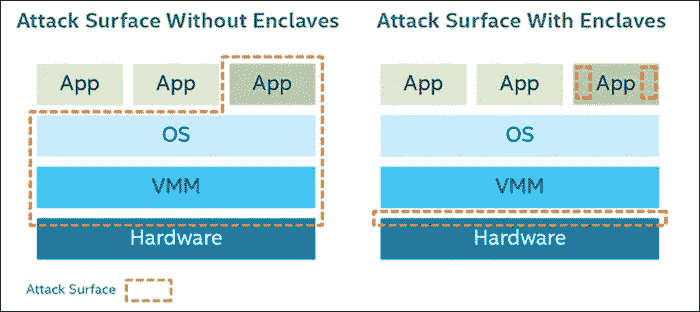

# 确保网络物理系统的安全

> 原文：<https://medium.datadriveninvestor.com/securing-cyber-physical-systems-i-d508543a5187?source=collection_archive---------36----------------------->

# 系列介绍

将网络物理系统和物联网设备融入我们今天的生活已经变得非常重要。如今，物联网设备几乎在所有经济领域都有部署和使用案例，已经很好地融入了我们的日常生活。

对于物联网的敏感用例，如工业控制系统中的恒温器和制造工厂中的预防性传感和监控，安全漏洞和系统故障可能会产生极端影响，导致生命损失。

物联网设备经过优化，效率更高。考虑到它们的小尺寸和有限的处理能力，这些设备包含薄弱的认证和风险缓解机制，允许攻击者将这些设备作为他们的攻击点。

> 微软发布的白皮书揭示了其对 21 世纪 20 年代初 25%的网络攻击将集中在物联网设备上的预测。

在这一系列文章中，我将把物联网系统分解成独立的组件，并将每个组件分解成最基本的部分。我将尝试解释和介绍当前的安全实践和业界领袖，如微软、Wisekey 等所采用的措施。这些文章中讨论的方法都足够宽泛，可以有自己的系列，所以我将保持解释的简洁和信息的丰富，以使我们的生活更加轻松:)。

如今，物联网产品正被各行各业采用，其速度之快令开发人员难以跟上发展步伐。**这就像在 100 公里/小时的区域里以 200 公里/小时的速度行驶**。

> 加拿大政府发布的最新网络报告认为，物联网设备利用是当今网络安全的主要风险之一。

个人和行业正在将物联网设备整合到他们的网络中，而没有考虑所带来的网络风险。目前定义的标准不足以对抗另一次 [Mirai 未来组合攻击](https://www.csoonline.com/article/3258748/the-mirai-botnet-explained-how-teen-scammers-and-cctv-cameras-almost-brought-down-the-internet.html)的风险，并且包括诸如“使用强密码”、“不要分享你的密码”、“关闭你不需要的端口”等提示这些都不足以保障物联网设备。

# 分解它

在我们深入研究技术内容之前，先简单回顾一下物联网连接系统的工作原理:

任何物联网通信都涉及三件事:

*   物理设备
*   网关
*   云

在这篇文章中，我不会解释所有这三个问题，但会深入讨论其中一个。如果你想了解更多关于物联网的基本机制(建议)，你可以参考我之前写的一篇文章[这里](https://theiotmagazine.com/introduction-to-iot-structure-security-the-achilles-heel-f2f8f1d06228)。

今天文章的重点是解决通信系统中物理设备组件的三个主要方面之一，**硬件**。

> Pssssttt…我写了一篇关于固件开发的文章(我如何对智能相机的二进制文件进行逆向工程以获取其密码)[这里](https://medium.com/datadriveninvestor/iot-security-firmware-exploitation-8160028d8a2d)，查看一下；).

# **硬件**

随着每年推出的设备数量越来越多，对安全性缺乏关注会使数百万 MCU(微控制器)暴露在互联网上，使一些企业每年损失高达 40 万美元！这些设备现在容易受到过多的攻击，也可以被用来形成僵尸网络。

不相信我？看一看 shodan，让我知道我是否改变了你的想法。

利用故障和暴露的物联网设备可能会产生各种影响，从基本的灯泡黑客攻击到以灾难性的方式摧毁炼油厂。在这一部分，我将讨论各种安全措施，这些措施有助于保护这些设备并为其增加一层安全保护。这些措施包括:

*   实现信任根(RoT)
*   划分
*   用于密钥管理的可信平台模块
*   纵深防御

# 实现信任根(RoT)

信任或 RoT 的根源仅仅是硬件验证的引导过程**的实现，该引导过程**确保要执行的第一个操作码是从不可变的源执行的，并且引导的每个阶段验证下一个阶段。

把这个想象成一个链条…因为它就是。

由于引导过程的每个阶段都会验证下一个阶段，因此会形成一个信任链。这种信任链在 ROT 实现的安全性的建立中起着基础作用。如果在某个阶段/由某个阶段检测到篡改，则引导过程无效，因此引导没有成功完成。这可以防止任何恶意代码从一个阶段传播到另一个阶段，并有助于防止类似[固件闪烁之类的事情。](http://tech-faq.com/flashing-firmware.html#:~:text=Some%20firmware%20are%20non-rewriteable,%E2%80%9D%20or%20simply%20%E2%80%9Cflashing%E2%80%9D.)

由于硬件的两个特性，硬件是实现 RoT 过程的完美候选。第一，一次性使用的硬件不会被攻击者重新用于非预期的操作。其次，硬件可以通过引入脉冲测试 reset 引脚等技术来防止/检查[毛刺攻击，从而帮助减轻对设备的物理攻击。](https://www.darkreading.com/edge/theedge/glitching-the-hardware-attack-that-can-disrupt-secure-software-/b/d-id/1336119#:~:text=Glitching%20attacks%20are%20defined%20as,environmental%20variables%20in%20a%20system.&text=Glitching%20generally%20requires%20intimate%20knowledge,physical%20access%20to%20that%20system.)

Basic Depiction Of The Process In Larger Systems

> 在第二次世界大战中，英国海军成功回收了一批德国 Engima 机器(字面上只有 2 台)，并成功破解了德国 Engima 代码。如果德国人在他们的 Engima 设备中实现了 RoT，那就不会发生了😂

RoT 可以通过几种不同的方式实现，包括从 rom 或不可写存储器引导以存储映像和[根密钥](https://www.pcmag.com/encyclopedia/term/root-key)，以及使用一次性可写存储器和[熔丝位](https://www.allaboutcircuits.com/projects/atmega328p-fuse-bits-and-an-external-crystal-oscillator/)来存储根密钥。

最近，采用了一种有趣的方法来合并 RoT:通过子系统的开发和部署。微软最近开发了一个新的 RoT 实现子系统，名为 [Pluton](https://www.microsoft.com/security/blog/2020/11/17/meet-the-microsoft-pluton-processor-the-security-chip-designed-for-the-future-of-windows-pcs/) 。这主要是为 CPU 开发的，以防止总线传输攻击，尚未在物联网设备中实现。

Pluton for IoT 承诺实施 AES 密钥解密和加密引擎、用于验证代码和检查证书的 SHA 哈希算法、用于加速 RSA 和 ECC 操作的公钥引擎，以及改变固件启动时间以防止计时攻击的随机数生成器。WiseKey 在其新的微控制器 [VaultIC](https://www.wisekey.com/products-services/secure-semiconductors/secure-elements/) 中引入了类似的概念。

Process Of ARM Root and Trust Chain For Boot Process

其他一些支持 RoT 的处理器有 [ARM TrustZone](https://developer.arm.com/ip-products/security-ip/trustzone) 和[英特尔引导保护](https://edk2-docs.gitbook.io/understanding-the-uefi-secure-boot-chain/secure_boot_chain_in_uefi/intel_boot_guard)。

# 划分

划分是使用硬件强制边界来保护不同软件区间的思想，以防止恶意代码或二进制代码从一个被破坏的区间传播到另一个区间。

想象一下，你和十个不同的室友住在同一个房子里，但是你们没有一个人走出房间。如果你们中的一个人生病了，疾病传播到其他九个人的可能性要小得多，因为墙壁和物理屏障(硬件强制边界)有助于防止传染。

划分被认为是数据安全和隐私中最有效的安全措施之一。一种常见的划分技术是使用操作系统进程或独立的虚拟机作为划分。这允许代码和其他进程在它们自己的环境中执行，这意味着即使设备的固件为攻击者所拥有，包含您的“秘密”或私人数据的另一个隔间也可能不是。这大大减少了攻击面。

Compartmentalization Visualized

安全警卫飞地或 SGX 可以被认为是一种划分形式。sgx 与软件证明(在执行代码之前验证代码的不变性)一起工作更好。

# 可信平台模块(TPM)

暂停。下一节将讨论公钥和私钥以及保护它们的方法。如果你认为自己在知识上有差距，并且不精通这些领域，那么我建议在进入下一部分之前暂停一下，查阅一下这些资源:

*   [https://brilliant.org/wiki/rsa-encryption/](https://brilliant.org/wiki/rsa-encryption/)
*   【https://www.youtube.com/watch?v=GSIDS_lvRv4 号
*   [https://www . geeks forgeeks . org/difference-between-private-key-and-public-key/](https://www.geeksforgeeks.org/difference-between-private-key-and-public-key/)

## 向前，我的种马🏇🏽…

TPM 是专用的加密处理器，是密钥存储的行业标准。公钥和私钥对于确保部署的系统确实安全至关重要，但是密钥本身也必须有可靠的管理和安全方法。这就是 TPM 发挥作用的地方。

这就像保护设备安全的钥匙，你明白吗？

TPM 是一个分立的硬件组件，设备制造商将 RSA 密钥刻录在其中。TPM 在现代计算机中用于保存、保护和管理其他服务的密钥，包括磁盘加密、RoT 引导、硬件真实性验证等。TPM 还使用哈希为软件和代码创建“已知良好”的配置文件。该文件可用作引导时检查篡改和恶意代码插入的参考，有助于保护和管理加密密钥，这些密钥是设备的基础，对设备的安全高效运行至关重要。

# **纵深防御**

深度防御或 DID 只是一种分层的安全机制。这种机制针对每种特定威胁整合了多种应对措施，因此，在一种机制失效的情况下，另一种机制会立即采取措施，试图阻止攻击成功或进一步发展。

这种技术被许多设备制造商采用，如 Broadcom、Nation semiconductor、德州仪器和微软。

# 最后

上述大多数实践在现代计算世界中是常见的和标准化的，但在物联网等信息物理系统中很少发现。

在数据敏感区域大量部署物联网设备需要更好的安全措施，这是底线。 ***为了获得物联网功能的全部好处，我们必须首先播种和浇灌安全的种子..***

# 为什么？

在研究物联网安全等新的小众主题时，寻找有价值且不重复的研究论文往往会成为一项繁琐的任务。由于这个领域相对较新，而且有一些问题需要解决，所以很难区分有价值的和没那么有价值的。在这一系列文章中，我将尝试为您带来物联网安全领域最新的、得到有效支持的研究和开发成果。

***您的物联网安全一站式商店；)***