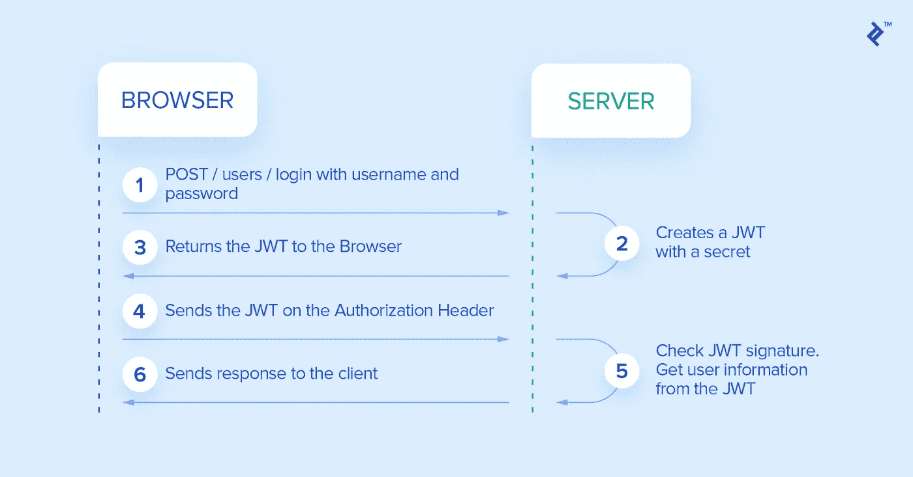

# 用 JWT 保护 Web-REST-API

> 原文：<https://medium.datadriveninvestor.com/securing-web-rest-apis-with-jwt-787c75229cee?source=collection_archive---------2----------------------->

平衡网络安全性和便利性的正确方法

source: the Independent: the US to call for a worldwide tightening of airport security measures over fears of ‘new generation’ of Syrian terror attacks

J**SON Web Token(JWT)**是一个开放标准，它定义了一种紧凑的自包含方式，以 JSON 对象的形式在各方之间安全地传输信息。
这个信息可以被验证和信任，因为它是数字签名的。
jwt 可以使用秘密(使用 **HMAC** 算法)或使用 **RSA** 或 **ECDSA** 的公钥/私钥对进行签名。

 [## 数据科学和软件工程哪个更有前途？数据驱动的投资者

### 大约一个月前，当我坐在咖啡馆里为一个客户开发网站时，我发现了这个女人…

www.datadriveninvestor.com](https://www.datadriveninvestor.com/2019/01/23/which-is-more-promising-data-science-or-software-engineering/) 

JWT 是强大的，可以携带大量的信息，但它仍然很容易使用，即使它的大小相对较小。
链接任何其他令牌，JWT 可用于在身份提供者和服务提供者
(不一定是同一个系统)之间传递认证用户的身份。它还可以携带用户的所有声明，如授权数据，因此服务提供商不需要进入数据库或外部系统来验证用户对每个请求的角色和权限；~该数据是从令牌中提取的。

# **JWT 认证流程**

source: toptal blog: Spring Security

*   客户端通过将其凭据发送给身份提供者来登录。
*   身份提供者验证凭证；如果一切正常，它将检索用户数据，生成一个包含用户详细信息和权限的 JWT，用于访问服务，它还设置 JWT 的到期时间(可能是无限的)。
*   客户端存储 JWT 的时间有限或无限，具体取决于身份提供者设置的到期时间。
*   客户端将每个请求的授权头中存储的 JWT 发送给服务提供者。
*   对于每个请求，服务提供者从授权头中取出 JWT，并解密它，如果需要，验证签名，如果一切正常，提取用户数据和权限。仅基于该数据，并且同样不需要在数据库中查找进一步的细节或联系身份提供者，它可以接受或拒绝客户端请求。唯一的要求是身份和服务提供者有一个关于加密的协议，以便服务可以验证签名或者甚至解密哪个身份被加密。

JWT 和其他任意令牌的主要区别在于令牌内容的标准化。
另一个推荐的方法是使用承载方案在授权报头中发送 JWT 令牌。
标题的内容应该是这样的；

> :授权:无记名

# 什么时候应该使用 JSON Web 令牌？

**授权**:

这是使用 JWT 最常见的情况。用户登录后，每个后续请求都将包含 JWT，允许用户访问该令牌允许的路由、服务和资源。单点登录是目前广泛使用 JWT 的一个特性，因为它的开销很小，并且能够很容易地跨不同的域使用。

**信息交换:**

JSON Web 令牌是在各方之间安全传输信息的好方法。因为 jwt 可以是签名的——例如，使用公钥/私钥对——所以您可以确保发送者就是他们所说的那个人。此外，由于签名是使用头部和有效载荷计算的，因此您还可以验证内容没有被篡改。

## JSON Web Token 结构是什么？

在其压缩形式中，JSON Web 令牌由三部分组成。)
其中有:

> 1.割台
> 2。有效载荷
> 3。签名

因此，jwt 如下所示:

***xxxx . yyyyyy . zzzzz***

让我们来分解不同的部分。

**a .表头**

报头通常由两部分组成:令牌的类型(JWT)和使用的签名算法(如 HMAC SHA256 或 RSA)。

例如:

## {
"alg": "HS256 "，
"typ": "JWT"
}

然后这个 JSON 被 Base64Url 编码形成第一个 JWT。

**b .有效载荷**

令牌的第二部分是有效负载，它包含声明。声明是关于实体(通常是用户)和附加数据的声明。这三种债权，即公共债权、注册债权和私人债权。

**丙.签名**

要创建签名部分，您必须获取编码的报头、编码的有效载荷、秘密、报头中指定的算法并签名。

结果是三个由点分隔的 BASE64-URL 字符串可以在 HTML 和 HTTP 环境中轻松传递，同时与基于 XML 的标准如 SAML 相比更加紧凑。

## **JSON Web 令牌是如何工作的？—客户端**

[https://www.toptal.com/java/rest-security-with-jwt-spring-security-and-java](https://www.toptal.com/java/rest-security-with-jwt-spring-security-and-java)

在身份验证中，当用户使用他们的凭证成功登录时，将返回一个 JSON Web 令牌。因为令牌是凭证，所以必须非常小心以防止安全问题。一般来说，令牌的保留时间不应超过需要的时间。

每当用户想要访问受保护的路由或资源时，用户代理应该发送 JWT，通常是在使用承载模式的授权报头中。标题的内容应该如下所示:

授权:持有人

服务器的受保护路由将检查授权头中的有效 JWT，如果存在，将允许用户访问受保护的资源。

如果令牌是在授权头中发送的，跨源资源共享(CORS)将不会是一个问题，因为它不使用 cookies。

## **为什么要使用 JSON Web 令牌？**

JWT 比基于 XML 的 SAML(安全标记语言令牌)更紧凑。
SWT(简单 Web 令牌)只能使用 HMAC 算法通过共享秘密进行对称签名。JWT 和 SAML 可以使用公钥/私钥
对。

JWT 的主要优势是以无状态的方式处理用户认证，因此是可扩展的方式，同时通过最新的**加密标准**保持一切安全。

支持我，看看我的小应用:[人生规划师](https://thelifeplanner.co)

干杯！