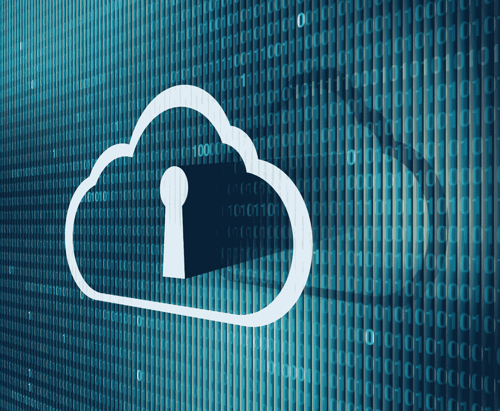

# 金融公司迁移到云的安全性考虑

> 原文：<https://medium.datadriveninvestor.com/security-considerations-for-financial-firms-moving-to-the-cloud-527b44ba7bb6?source=collection_archive---------23----------------------->

## 管理云基础架构类似于管理自有和运营的基础架构

*注:本文原载于 2020 年 1 月 27 日* [*Apteo 网站*](https://www.apteo.co/post/security-considerations-for-financial-firms-moving-to-the-cloud)

*—*

# 介绍

你听过*“云只是别人的电脑”*这句话吗？

虽然这可能曾经是整个故事的全部，但现代云技术已经成为一个复杂的硬件和软件资源系统，不仅提供了一个运行应用程序的地方，还提供了各种各样的物理和虚拟硬件和软件服务，所有这些 IT 专业人员都可以通过 API 和简单的用户界面轻松管理。

今天，世界领先的云提供商亚马逊网络服务公司拥有 150 多种不同的服务，允许开发者在几分钟内建立复杂的基础设施和应用程序。其中许多，包括硬件配置、负载平衡和防火墙配置，过去需要数周时间、数万美元和训练有素的员工来部署和维护。

但是时间和成本的节省并不是使用云带来的唯一好处。AWS、Google Cloud Platform 和 Microsoft Azure 等云提供商提供按需可扩展性、将硬件管理外包给世界级专业人员的能力、高度可用的应用程序级服务、超级计算机的访问以及精通 devops 和基础架构的大型支持团队。

 [## 更好的预算，打造更大的|数据驱动型投资者

### 即使是专家也承认它们并不完美。从 1 到 10 的范围内，安东尼·科普曼和德尔…

www.datadriveninvestor.com](https://www.datadriveninvestor.com/2018/11/08/budget-better-to-build-bigger/) 

虽然云为许多组织带来了好处，但并不是每个公司都迅速将其集成到运营中。安全、监管和保密问题经常导致金融领域的组织对在其业务的任何关键领域利用云服务特别警惕。

# 将云用于金融服务的挑战

尽管使用云带来了诸多好处，但许多金融行业的 IT 高管担心在他们不拥有和运营的硬件上存储数据和运行核心工作流。金融公司受到严格监管，在考虑可能影响数据机密性、失控和数据访问的技术时，需要缓慢而谨慎地进行。这些高管担心，失去对核心基础架构的直接控制可能会增加发生安全事故的可能性。

对他们来说幸运的是，无论他们是在云上还是在自己的硬件上运行核心应用程序，他们仍然能够控制 IT 中很大一部分最常见的漏洞。一般来说，对物理基础设施的攻击是最不可能导致数据泄露的原因。人为错误通常表现为来自网络钓鱼企图或社交工程的脆弱和被盗凭据，这通常是更有可能导致事故的原因。除了人为错误之外，应用程序或基础架构的错误配置，如开放端口、后门或不必要的权限提升，是下一个最有可能引发安全违规的因素。

通过使用云，IT 管理人员可以专注于实施和加强他们将用于内部应用程序和配置的相同控制，同时将复杂的物理硬件管理留给世界上最大和最好的数据中心组织。

# 管理应用程序，不考虑底层基础架构

通过适当的方法，IT 主管可以像对待本地应用程序的安全性一样对待基于云的安全性。事实上，最大的云提供商已经创建了高度安全的 API 来以编程方式管理基础设施，有时甚至更容易实现最佳实践。

无论 IT 专业人员使用云还是自己的硬件，以下控制措施只是他们保护运营的众多方法中的一部分:

*   **培训和人员:**如上所述，很大一部分安全漏洞是由人为错误造成的，因此 IT 专业人员应继续对员工进行安全重要性教育，包括使用多因素身份认证、对可能属于网络钓鱼活动的电子邮件保持警惕，以及密码管理。
*   **应用程序安全性:** IT 主管必须继续加强应用程序级别的安全性，并确保他们的开发人员了解最常见的漏洞。他们应该坚持让开发人员使用众所周知的开源安全库，而不是创建他们自己的脚本，对定制开发的应用程序实施严格的密码要求，并确保新应用程序能够在其界面中最需要的地方正确地应用权限。应用程序应该从内存系统中提取环境变量，而不是硬编码或通过不太安全的方法传输它们。
*   **标准系统和访问控制:**已经维护了强大系统和访问控制的组织可以继续使用云上的应用程序。那些将开发应用程序的员工与部署应用程序的员工分开的组织可以在使用云时继续保持这种分离。组织应对所有员工强制实施最少访问策略，以便在发生违规时最大限度地降低影响，或者最大限度地降低来自内部不良行为者的威胁。需要访问硬件的员工应该使用强公钥/私钥。
*   **强大的基础设施配置:**组织应该使用最少访问策略来配置其网络。应该只打开必要的端口。后端服务应该放在只对上游或下游服务可用的私有子网中，而不是接受来自所有 IP 地址的连接。应该尽可能使用 SSL 和 TLS。

通过应用这些以及类似的标准控制，IT 管理人员能够在云操作的基础架构上维护与自有和运营的硬件相似的安全配置文件。此外，管理人员实际上可以通过利用云公司已经提供的复杂服务来简化他们的许多安全相关流程，这些服务包括以下许多领域:

*   **加密:**只需轻轻一点，云提供商就能让 IT 专业人员对静态或传输中的数据进行加密。
*   **托管服务的自动或可选更新:**同样，IT 专业人员可以使用非常简单的界面来配置服务，如数据库或实例主机，以便按需或自动应用安全补丁和升级。
*   **日志记录和监控:**云提供商可以轻松地将整个组织的日志路由到一个位置，并使这些日志的搜索和分析变得极其容易。同样，云提供商在其提供的每一级基础设施中都内置了各种各样的监控选项，减轻了公司管理员实施第三方解决方案的负担。
*   **防御 DDoS 和类似攻击:**云提供商现在拥有内置服务来保护您的基础设施免受 DDoS 攻击，这使得您的组织更容易从有针对性的攻击中恢复。
*   **轻松配置新机器:**云提供商可以轻松配置安全组、防火墙和其他项目，即使旧机器离线并创建新机器，也不考虑其 IP。通过使用命名组和预先配置的设置，可以在几分钟内将新机器添加到标准安全配置文件中。

# 结论

正如我们今天所知，云已经存在了十多年。当今最先进的技术组织现在正在管理跨洲、高度冗余的设施，这使得交付和部署技术变得非常容易。虽然人们对使用新技术有一些合理的担忧，但其中许多担忧已经得到缓解。通过实施标准的安全实践，金融机构可以继续保持强大的安全配置，并且在与新供应商合作时，这些机构应该寻找保持类似安全标准的提供商，就像我们在 [Apteo](http://www.apteo.co/) 所做的那样。