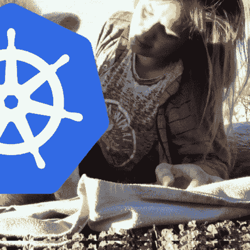
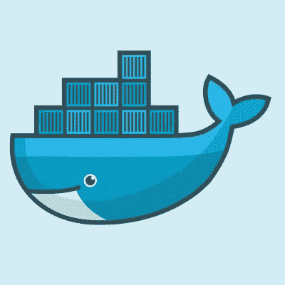
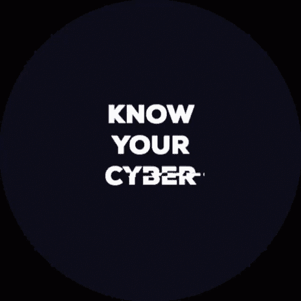

# 集装箱技术的安全性

> 原文：<https://medium.datadriveninvestor.com/security-of-container-technologies-ff52a7ff362b?source=collection_archive---------8----------------------->

## Kubernetes、Dockers 和 DevOps 方法的日益流行都促成了它的流行。考虑到这一新的快速发展的技术，问题仍然存在:如何最好地确保其使用和安全？

更糟糕的是，新工具和技术，如 Dockers 和 Kubernetes，正在受到攻击，并作为有价值的资产进入公司。这些新环境对于确保我们拥有这些环境的安全关键组件至关重要。

认真对待容器部署的组织不可避免地会遇到管理流程的两个关键基础设施:容器注册和协调容器部署的管理堆栈。从安全的角度来看，帮助协调容器的管理栈经常被忽视。集装箱登记和 Kubernetes 相结合，使得在将集装箱重新放置到环境中时，可以自动执行一些质量和安全标准。

恶意的容器映像可以使用受损的基础系统，该系统被配置为执行从简单的加密货币挖掘到试图横向移动的各种操作。通过利用自动化的力量，容器编排平台可以充当恶意行为的倍增器，使容器危害更广泛和更快。

尽管容器是交付应用程序最流行和最有效的方法之一，但许多公司似乎仍然不愿意为它们采用安全策略。最近发生了许多与大公司有关的集装箱安全漏洞事件。

鉴于已经在容器环境中发现了主要的漏洞，有理由认为一些最流行的容器技术并不完全是“最安全的”。

 [## 《星际迷航发现》中的 3 项真正可怕的技术|数据驱动投资者

### 2017 年，随着《星际迷航:发现》的上映，星际迷航积极重返银幕。这个节目…

www.datadriveninvestor.com](https://www.datadriveninvestor.com/2020/05/16/3-real-scary-technologies-in-star-trek-discovery/) 

2015 年，发现了一些关键和显著的漏洞，导致安全和开发人员重新思考他们的规划和部署架构。

今年 2 月，影响 Docker、Kubernetes 甚至 Apache Mesos 的 runC 漏洞表明，将访问权限限制在 Docker 容器上的单个用户，仍然不足以阻止攻击者获得主机服务器的 root 访问权限。安全研究人员发现，在蜜罐服务器上运行的预配置 Kubernetes 部署最初受到恶意 Docker 容器的毒害，并被配置为破解加密货币 Monero。以自动化容器部署、更新监控和其他容器平台(如 Docker Swarm)的监控为例。

Kubernetes 针对特斯拉的最新漏洞只是许多容器技术之一——基于我们将在未来几个月和几年看到的漏洞。随着包括大型云公司在内的许多组织采用它作为编排和扩展基于容器的工作负载的标准方法，它的受欢迎程度出现了爆炸式增长。

更严重的错误是允许每个节点在 Kubernetes 集群上运行，从而允许黑客注入恶意代码，使整个集群环境崩溃，并窃取敏感数据。

虽然 NeuVector 的 container firewall 等商业工具提供了多向量保护和可见性，但正在发展附加安全功能的开源项目是一个近年来发展了新功能和改进的开源项目。NeuVector 解决方案能够在其中部署和更新容器，而无需使用任何编排系统，如 Docker、SUSE Linux 企业版、Docker Swarm 或 Docker Hub。

然而，为了确保容器符合开发安全基线，您将需要一个自动化的扫描器以及一个容器注册器和一个管理栈。

在大范围的 Kubernetic 环境中，手动评估安全事件和违反规则的情况非常耗时。为了执行安全策略，使安全检查不会与管弦乐队冲突，请使用内置的国内控制——只要有可能，在 Kubernetes 中。除了使用第三方代理或垫片来强制网络分段，您还可以使用 Kubernetes 网络策略来确保安全的网络通信。

任何漏洞值为 7 或更高的部署都应移动到包含特权容器的部署，即使该部署位于开放的 Internet 上，或者能够支持非关键应用程序(如 web 应用程序)。

一言以蔽之，Kubernetes、Dockers 和 DevOps 方法的日益流行都是其受欢迎的原因。考虑到这一新的快速发展的技术，问题仍然存在:如何最好地确保其使用和安全？随着对其使用兴趣的增加，我们看到对其安全性和潜在危险的担忧也越来越多。

**引用来源**

*   [https://www . trend micro . com/en _ us/what-is/container-security . html](https://www.trendmicro.com/en_us/what-is/container-security.html)
*   [https://www . secureworks . com/blog/cloud-container-security-best-practices](https://www.secureworks.com/blog/cloud-container-security-best-practices)
*   [https://www . stack rox . com/post/2020/05/kubernetes-security-101/](https://www.stackrox.com/post/2020/05/kubernetes-security-101/)
*   [https://tech beacon . com/enterprise-it/hackers-guide-kubernetes-security](https://techbeacon.com/enterprise-it/hackers-guide-kubernetes-security)
*   [https://www . CIO . com/article/3411994/kubernetes-security-best-practices-for-enterprise-deployment . html](https://www.cio.com/article/3411994/kubernetes-security-best-practices-for-enterprise-deployment.html)
*   [https://www . wwt . com/article/common-container-security-threats](https://www.wwt.com/article/common-container-security-threats)
*   [http://techgenix.com/container-security/](http://techgenix.com/container-security/)
*   [https://neu vector . com/container-security/kubernetes-security-guide/](https://neuvector.com/container-security/kubernetes-security-guide/)

**访问专家视图—** [**订阅 DDI 英特尔**](https://datadriveninvestor.com/ddi-intel)