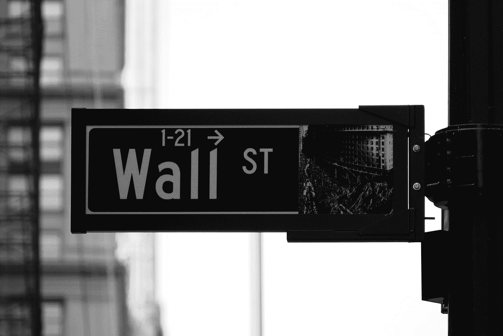

# 我认为新冠肺炎对我的财务有好处

> 原文：<https://medium.datadriveninvestor.com/seeing-covid-19-as-a-positive-for-my-finances-eb7bdd691b06?source=collection_archive---------20----------------------->

Photo by [Campaign Creators](https://unsplash.com/@campaign_creators?utm_source=medium&utm_medium=referral) on [Unsplash](https://unsplash.com?utm_source=medium&utm_medium=referral)

对于许多人来说，COVID 在财务方面一直存在很大的不确定性，然而，尽管这可能是真的，但对于我的财务独立之旅来说，这是塞翁失马，焉知非福。正如许多人一样，在被禁闭的空闲时间里，他们把注意力放在新的项目上，我自己则专注于我的财务独立目标。

由 COVID 引起的经济和股票市场的动荡时期提供了机会，特别是在股票市场和我的储蓄中，因为个人股息股票的价格因关于病毒的负面消息而下跌，随后因正面消息而上涨。虽然我同意这样选择市场时机是一个危险的举动，但定期将少量资金投入股票和基金，主要是在一些股票下跌时，意味着建立我的投资组合使我能够在追求财务独立的过程中走在前面

在过去的几个月里，由于目前的情况，我的生活费用很少，COVID 带来的变化让我节省并投资了大约 2，500 英镑(这在我的财务独立数字中只占很小的一部分，但仍是一种进步)。

除了利率目前处于创纪录的低点，我自己也一直在存钱，并向我的财务目标靠近。不管 COVID 引起的不确定性带来的额外波动，合理的做法是审查和重新审视您的投资组合，并根据您自己的财务目标重新平衡，同时考虑 COVID。虽然这是建议大多数投资者每年至少一次的事情，但 COVID 提供了一个提醒和调整以适应当前金融环境的机会。

Photo by [Chris Liverani](https://unsplash.com/@chrisliverani?utm_source=medium&utm_medium=referral) on [Unsplash](https://unsplash.com?utm_source=medium&utm_medium=referral)

然而，疫情的金融影响也有不利的一面，出于对其他人的同情，其中许多人已经失业，我处于一个非常幸运的境地。尽管如此，我们仍可以从疫情对金融的影响中吸取教训。

首先，记住消极的情况可以带来积极的机会。由于这些限制，封锁限制了消费的诱惑，并提供了更多的时间来关注财务目标。支出的减少有助于提高你的储蓄率和投资股市的能力，把我剩余的预算放在一边，以实现财务目标。

在大企业面临不确定性的时候，这可能是投资的最佳时机。虽然这可能需要一定程度的投机，即所选股票被低估，并将随着时间的推移而恢复，但这是一个值得冒的风险，尤其是如果你像我一样，正在进行长期投资。

作为一名股息收入投资者，随着一家又一家公司削减或暂停派息，这是一个坏消息。然而，对我的投资进行定期审查可以优化我的投资组合，以建立可持续的被动收入，目前可以进行再投资。所谓的分红贵族或分红王，多年来一直分红的公司，一直是一颗定心丸，也是一件幸事。

Photo by [Lukas Blazek](https://unsplash.com/@goumbik?utm_source=medium&utm_medium=referral) on [Unsplash](https://unsplash.com?utm_source=medium&utm_medium=referral)

第二，虽然减少了每周的花费，通常是在上下班的路上，但能够减少这意味着朝着财务目标的快速前进，增加了每周对储蓄罐的贡献。从封锁开始，我的应急基金增加了 1274%，这是一个惊人的成就，如果情况不同，这将是相当难以实现的。

即使利率降至不到 1%的极低水平，这也不应该阻止我或你继续储蓄。所有这些加起来，你就会看到进步。如果我的存款能在五个月内增加 1274%,用正确的工具和时间，这对任何人来说都是可能的。

虽然从某种意义上看，它似乎从 COVID 和我投资组合中的个股的不幸中获利，但它肯定没有造成任何直接伤害。从一个不同的角度来看，在通常情况下，什么是坏消息，这使得基于简单财务原则的个人财务目标取得了重大进展。

自 3 月以来，尽管疫情的财务影响，削弱了许多人的主要财务目标，COVID 在财务方面一直存在巨大的不确定性，然而，尽管这可能是真的，但对我的财务独立之旅来说，这是塞翁失马，焉知非福。正如许多人一样，在被禁闭的空闲时间里，他们把注意力放在新的项目上，我自己则专注于我的财务独立目标。

Photo by [Patrick Weissenberger](https://unsplash.com/@ricktap?utm_source=medium&utm_medium=referral) on [Unsplash](https://unsplash.com?utm_source=medium&utm_medium=referral)

由 COVID 引起的经济和股票市场的动荡时期提供了机会，特别是在股票市场和我自己的储蓄中，因为个人股息股票的价格因关于病毒的负面消息而下跌，随后因正面消息而上涨。虽然我同意这样选择市场时机是一个危险的举动，但定期将少量资金投入股票和基金，主要是在一些股票下跌时，意味着建立我的投资组合使我能够在追求财务独立的过程中取得成功。

在过去的几个月里，由于目前的情况，我的生活费用很少，COVID 带来的变化让我节省并投资了大约 2，500 英镑(这在我的财务独立数字中只占很小的一部分，但仍是一种进步)。

除了利率目前处于创纪录的低点，我自己也一直在存钱，并向我的财务目标靠近。不管 COVID 引起的不确定性带来的额外波动，合理的做法是审查和重新审视您的投资组合，并根据您自己的财务目标重新平衡，同时考虑 COVID。虽然这是建议大多数投资者每年至少一次的事情，但 COVID 提供了一个提醒和调整以适应当前金融环境的机会。

然而，疫情的金融影响也有不利的一面，出于对其他人的同情，其中许多人已经失业，我处于一个非常幸运的境地。尽管如此，我们仍可以从疫情对金融的影响中吸取教训。

Photo by [Elena Mozhvilo](https://unsplash.com/@miracleday?utm_source=medium&utm_medium=referral) on [Unsplash](https://unsplash.com?utm_source=medium&utm_medium=referral)

首先，记住消极的情况可以带来积极的机会。由于这些限制，封锁限制了消费的诱惑，并提供了更多的时间来关注财务目标。支出的减少有助于提高你的储蓄率和投资股市的能力，把我剩余的预算放在一边，以实现财务目标。

在大企业面临不确定性的时候，这可能是投资的最佳时机。虽然这可能需要一定程度的投机，即所选股票被低估，并将随着时间的推移而恢复，但这是一个值得冒的风险，尤其是如果你像我一样，正在进行长期投资。

作为一名股息收入投资者，随着一家又一家公司削减或暂停派息，这是一个坏消息。然而，对我的投资进行定期审查可以优化我的投资组合，以建立可持续的被动收入，目前可以进行再投资。所谓的分红贵族或分红王，多年来一直分红的公司，一直是一颗定心丸，也是一件幸事。

第二，虽然减少了每周的花费，通常是在上下班的路上，但能够减少这意味着朝着财务目标的快速前进，增加了每周对储蓄罐的贡献。从封锁开始，我的应急基金增加了 1274%，这是一个惊人的成就，如果情况不同，这将是相当难以实现的。

Photo by [Scott Graham](https://unsplash.com/@sctgrhm?utm_source=medium&utm_medium=referral) on [Unsplash](https://unsplash.com?utm_source=medium&utm_medium=referral)

即使利率降至不到 1%的极低水平，这也不应该阻止我或你继续储蓄。所有这些加起来，你就会看到进步。如果我自己的储蓄能在五个月内增加 1274%,用正确的工具和时间，这对任何人来说都是可能的。我要达到我整体财务独立数字的百分之一。这可能看起来很荒谬和微不足道，然而，它感觉像一个相当大的成就。

财务目标看似不可能，但当你能从不同的角度看待负面影响时，你会意识到它实际上是可以实现的。