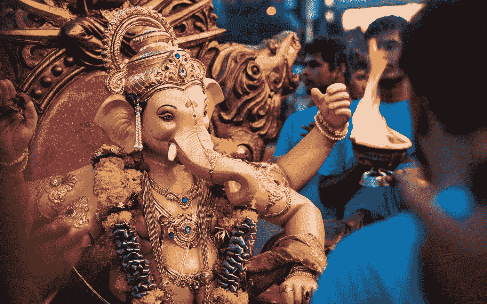

# 寻找上帝

> 原文：<https://medium.datadriveninvestor.com/seeking-god-d593cd0906a9?source=collection_archive---------10----------------------->

2020 对我们并不友好。

分心的事情会少得多。现在很难证明这两天的宿醉是合理的，因为这里没有舞池，也没有深夜烤肉串。无论从哪方面来看，假日都不在考虑范围之内。一日游？仍在继续，但建议内部法律顾问在无数的规章制度中导航。

没有分心，我不再有任何借口。我决定试一试，把人生的真题弄个水落石出；

***“我们到底在这个星球上做什么？”***

这是我们很多人都忽略的大问题。我们选择忽略它，因为这很难回答。一个真正的难题。

对形容词“忙”的赞美是如此之多，以至于它已经成为“你好吗？”。这是公认的战术。

我从来没有说过，“其实一点也不忙。老实说，需要时间来消化生活，因为这将确保进入精神病院。不过，禁闭给了我这个机会。所以我抓住了机会。

世界上有三类人:

1.  **神的信徒**
2.  **无神论者**
3.  **不可知论者**

我喜欢不可知论者这个词。它让我听起来既聪明又神秘，我想说它概括了一层层外表下的大多数人。

*而且不知道也没关系。*

不过，我决定试着找出答案。我阅读了大量支持进化论和大爆炸理论的文献；达尔文、道金斯等人。很好的读物，非常可信。

不过，我就是不喜欢《生活大爆炸》。也许我不够聪明，但我就是不相信。对我来说似乎有点牵强。诚然，与诺亚和他的方舟不相上下。

在听取了原告的陈述后，我决定听取被告的陈述。

我表妹和她丈夫都是虔诚的基督徒。他们邀请我上“阿尔法”课程，这基本上是基督教的入门课程。当然是在变焦镜头上，考虑到时间因素，但那是相当有效的。Alpha 有点像公路法规，或者是你在驾驶汽车前的理论测试。

太棒了。人们很可爱；谦逊、关心他人、知识渊博。没有说教。领导者就像精神上的夏尔巴人一样，在旅途中指导我们这些新手。不是火与硫磺。

文献和视频内容丰富，见解深刻。显而易见，领导人的信念是坚定的。我想他们和我们一样也有怀疑的时候，但他们确实有一种明显的、令人向往的内心平静。

我非常想找到信仰。我进行了公平的听证，但我不能完全做到这一点，原因有二:

世界上有很多宗教。世界上有超过 1000 种注册宗教。“四大”由基督教、伊斯兰教、印度教和佛教组成。尽管基督教是宗教中的老虎伍兹，占世界人口的 31%，但仔细观察，基督教有各种教派——天主教、新教和马丁·路德旗下的其他较小教派。

根据定义，基督教的信徒认为所有其他宗教都是错误的。或者也许“不正确的”是一种更好的说法，但它们肯定是相互排斥的。很难理解。对于每一个将告诉我耶稣基督存在的文字证据的历史学者，我会找到另一个指向先知穆罕默德的善意。我发现，在我看来，相信一个单一的上帝要容易得多——这是所有信仰共有的。

**预先决定。**这个我纠结过。基督教信仰的一个中心信条是，上帝已经为他的子民绘制了一条生活的道路；一个被称为预先决定的原则神学家争论它是否仅仅是上帝绘制的粗略的笔画，或者它是我们日常生活的细节。我只是不能接受上帝故意为非洲最贫穷地区的一些孩子安排饥饿、疾病和死亡的生活。像大屠杀或 911 这样的暴行也很难让人接受。

虽然《十诫》感觉像是一本很好的生活手册，但我就是不明白如何预先决定和选择一种宗教。也许信仰不是被寻求或培养的，也许它要么被拥有，要么不被拥有——而我不拥有它。或者也许信仰是通过斗争获得的，接受人类的智慧不能控制所有不可估量的事物，也许信仰是一种永恒的奋斗状态。

目前，我仍然是不可知论者——在地球上漫游，想知道这一切的意义何在。

我非常想找到基督教信仰。天堂的承诺比在地下慢慢腐烂更有吸引力。与失去的爱人重聚是一个令人欣慰的想法，让我们居住的世界变得有意义。

毕竟，无神论有什么好处呢？

我想试试其他宗教，但这在文化上不可行。摩门教徒享受的一夫多妻制有其吸引力，佛教徒寻求的内心平静也是如此。我出生在西方基督教文化中，因此我的宗教信仰是预先确定的。

这就是宗教的问题所在，它们天生就是分裂的。

发展对上帝的信仰，远离有组织的宗教，绝对也是我所渴望的——但是现在，我仍然保留着不可知论。