# 使用 Google Sheets 和 Google Data Studio 细分 Shopify 客户群

> 原文：<https://medium.datadriveninvestor.com/segment-shopify-customer-base-using-google-sheets-e-google-data-studio-8683c0b795b9?source=collection_archive---------9----------------------->


Photo by [Franki Chamaki](https://unsplash.com/@franki?utm_source=ghost&utm_medium=referral&utm_campaign=api-credit) / [Unsplash](https://unsplash.com/?utm_source=ghost&utm_medium=referral&utm_campaign=api-credit)

# 在定义了 RFM 分析的含义，以及如何将其应用于您的客户群之后，我想向您展示如何将其应用于 Shopify 订单数据。

一个简短的介绍能预料到一些疑点，如:

*   我们为什么要使用 RFM 分析？
*   利用它可以获得什么样的信息？
*   我如何使用客户细分和 RFM 分析来提高转换率或 AOV(平均订单价值)？

我在一篇文章中回答了其他一些问题，你可以点击这个链接找到答案。

# 让我们从 Shopify 导出订单

Shopify 收集的数据是一个很好的起点，但它们需要一点标准化，以便在 excel 上进行近期、频率和货币分析。

为了提取所有订单，我们需要进入后端，**点击侧菜单**中的“订单”选项卡，并遵循一些步骤，如下所述。

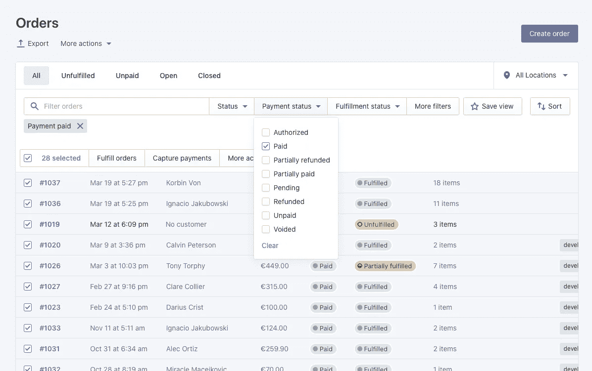

一个模态窗口将会打开，显示一些选项。

1.  选择**所有订单**的选项。
2.  在“导出为”部分，保留默认选择。

现在您可以点击**导出订单**按钮，导出我们刚刚过滤的订单。

## 边注

出口越大，需要的时间就越多。例如，少于 100，000 个项目的出口可以在不到一个小时内完成，而 400，000 个项目的出口可能需要大约 4 个小时。在如此长时间的导出结束时，Shopify 会通过电子邮件通知我们，给我们发送一个下载文件的链接。

现在我们已经有了我们的文件，让我们把它导入到我们的 Google Drive 帐户，它会自动把它变成一个工作表文件。

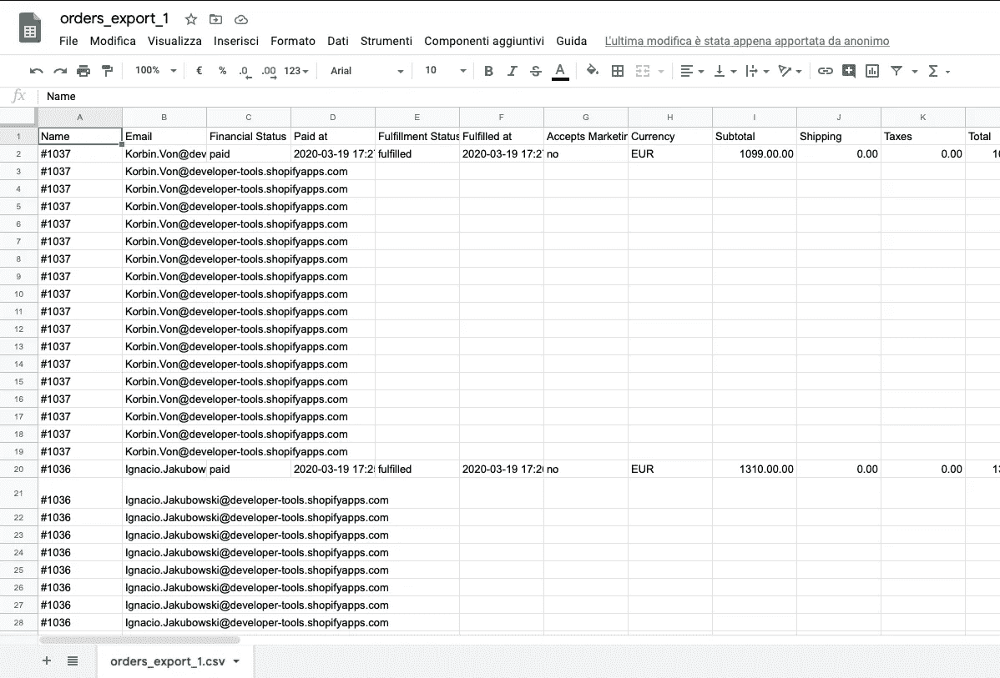

Exported excel file of Shopify orders

该文件包含 Shopify 为我们商店保存的信息；许多数据对于我们的计算来说是多余的，我们将在下一步中继续清理它们。

导出的数据已经按照**财务状态、已支付和履行状态、已履行**进行了过滤，我们需要删除多余的列。

首先，我们检查**所有行是否正确填写了“已付”和“已履行”**，否则我们可能会得到**不准确的结果**。

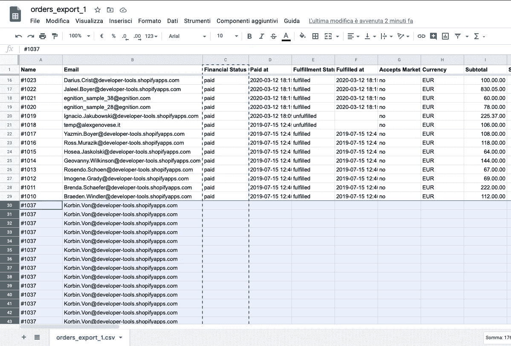

Delete the unfilled values

在“履行状态”列上从 A → Z 进行排序，并删除值不是“已履行”的行。

我们删除所有列，只保留下表中显示的字段，确保货币字段具有正确的货币格式。

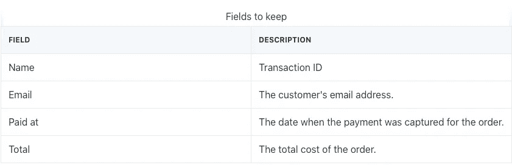

**电子邮件字段将是我们的客户 ID** ，允许我们在 Google Data Studio 中显示相关的电子邮件，以便我们筛选特定的客户细分。

> ***提示*** *—导出的选定细分市场可用于主动营销活动，通过电子邮件营销自动化创建有针对性的宣传。*

# 标准化值

此时，我们需要规范化“Paid at”列中的所有值，因为 Shopify 导出的格式也处理时区。为了这个例子的目的，也可以允许一天的变化，但是如果我们想要应用正确的转换，我们应该在 Google Sheets 脚本模块中应用一个自定义函数，以便正确地转换日期。

# Google 电子表格中的时区转换

```
/**
 * Converts a datetime string to a datetime string in a targe timezone.
 *
 *@param {"October 29, 2016 1:00 PM CDT"} datetimeString Date, time and timezone.
 *@param {"GMT"} timeZone Target timezone
 *@param {"YYYY-MM-dd hh:mm a z"} Datetime format
 *@customfunction
 */
function myFunction(datetimeString,timeZone,format) {
  var moment = new Date(datetimeString);
  return Utilities.formatDate(moment, timeZone, format)
}
```

*--只有当你对数据格式很有把握时才使用*

继续下一步，我们可以应用=SPLIT 函数，如下所示:

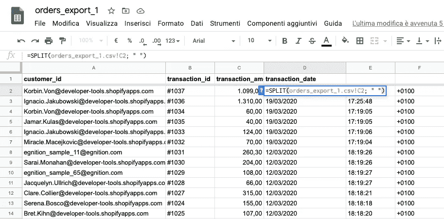

[应用 RFM 矩阵计算，如本文](https://alexgenovese.it/customer-journey-segmentation-using-google-analytics-and-gsheets/)所示，在这里你可以回顾所有的单身步骤，或者如果你喜欢，下载现成的谷歌工作表文件。

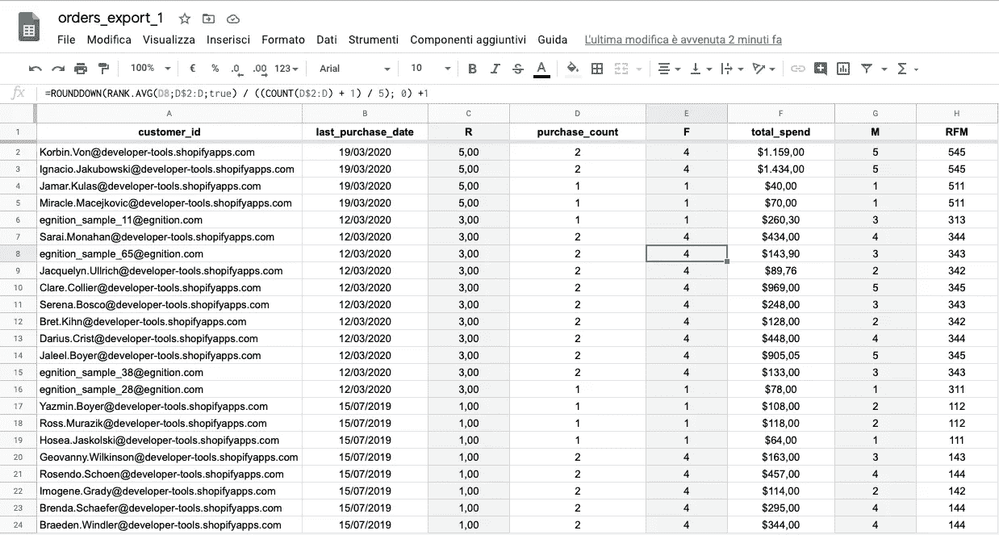

RFM analysis applied

# 在 Google Data Studio 中显示数据

打开 Google Data Studio，新建一个报表，如下图所示:

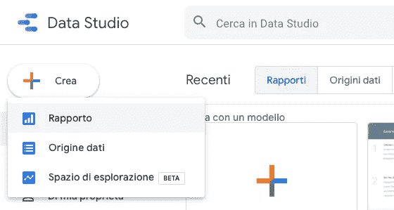

创建新报表时，会要求您关联一个数据源；选择到目前为止我们已经处理过的工作表。创建新报表时，会显示一些不同的数据源集成；选择到目前为止我们已经处理过的工作表。

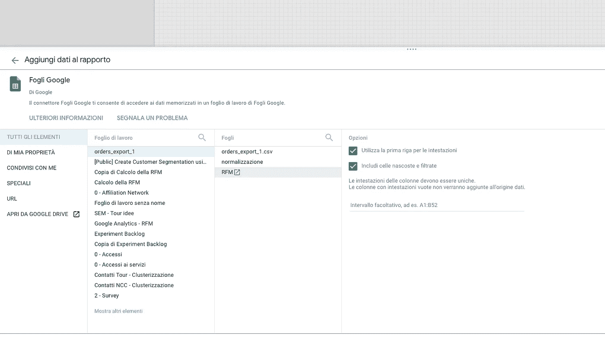

它将创建一个简单的表，我们将按如下方式更新它:

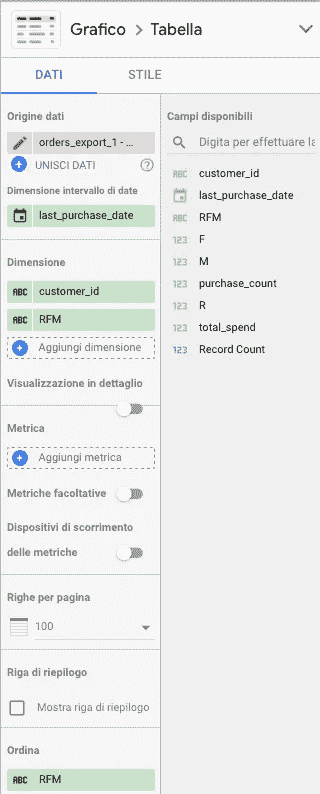

这些设置将允许我们查看每个客户的所有电子邮件和 RFM 价值。现在，**添加一个树形图，它可以帮助我们正确地显示如何以及有多少个集群组成了我们的客户数据库。**

添加“树形图”并按如下方式设置其配置。

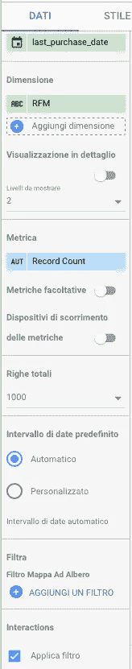

在这一点上，将显示几个矩形，代表我们的客户群集群和排序的大小:颜色变得更暗的电子邮件的总和。

343，344，545 个值代表了我们客户的非常具体的信息，您可以从关联表[中读取，我在本文的最后一节](https://alexgenovese.it/applying-rfm-customer-segmentation-to-your-business-right-now/)中描述了该表。

这些图表是我们数据的基本表示，如下图所示。现在，我们可以过滤这些图表上的点击，从而实时更新右侧表格中属于被点击细分市场的客户的相关电子邮件。

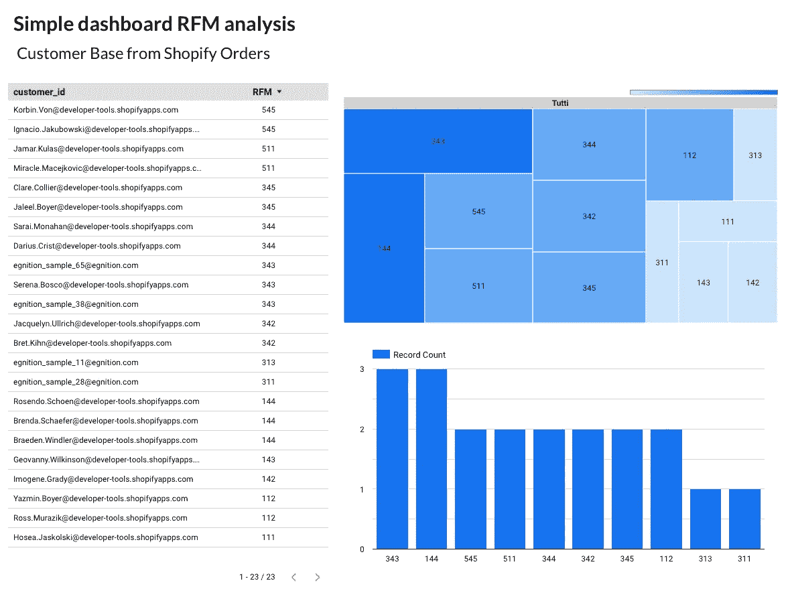

RFM analysis on Google Data Studio

> ***PRO TIP****—当我们规范化订单时，我们还清理了其他数据(例如，每个订单的产品编号、每个产品的成本和许多其他数据)。在过滤集群时，保留这些列并显示在 Google Data Studio 中可能会很有趣。*

在 Google Data Studio 中，您可以创建更适合您特定需求的自定义仪表板。

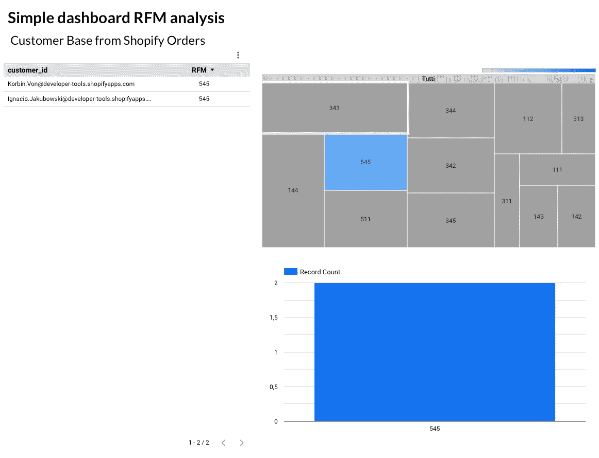

Data Filtering

## 在这里你可以找到 Data Studio 仪表盘，这是构建一个更实用的仪表盘的良好起点。

# 文章系列

我发表了一系列基于 RFM 矩阵的文章来解释不同的可行策略来发展你的业务。

如果您错过了什么，该系列包括以下文章:

*   [立即将 RFM 客户细分应用到您的业务中](https://alexgenovese.it/how-to-apply-rfm-customer-segments-your-business/)
*   [【逐步指南】使用 Google Analytics 和 Google Sheets 绘制客户细分图](https://alexgenovese.it/customer-journey-segmentation-using-google-analytics-and-gsheets/)
*   [**使用 Google Sheets e Google Data Studio**](https://alexgenovese.it/segment-shopify-customer-base-using-google-sheets-e-google-data-studio/)细分 Shopify 客户群