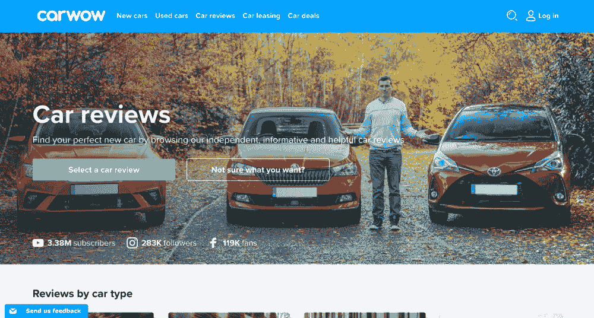

# 自开发软件:博主有什么要给你看的？

> 原文：<https://medium.datadriveninvestor.com/self-development-software-what-do-bloggers-have-to-show-you-5f85c429df4?source=collection_archive---------14----------------------->

## 9 位博客作者、9 个成功案例和 9 个软件解决方案

2000 年的全球社会和 2020 年的全球社会有什么区别？

我们认为，最大的区别在于人们自我教育、获取新闻和拓宽视野的方式。二十年前，人们读书、看电视、听广播。今天，人们通过互联网满足他们的信息需求。人们不再相信电视主持人或作家了。相反，他们会听取博主、博客作者和社交媒体影响者的意见。

 [## 摔倒不是失败。数据驱动的投资者

### 你只有在放弃的时候才会失败。每个英雄都会倒下，我们活着就是为了失败者出现的时刻；上升到…

www.datadriveninvestor.com](https://www.datadriveninvestor.com/2019/01/17/falling-isnt-failing/) 

在大多数情况下，这些人通过 Instagram、YouTube、Telegram 或 Twitter 与公众沟通。然而，对于他们中的一些人来说，这些平台还不够，所以他们开发自己的网站和移动应用程序。在本文中，我们将浏览最受欢迎的世界博主为我们提供的最有趣、最鼓舞人心的教练应用程序和自我发展网站。下面是最鼓舞人心的社交媒体人名单，他们是 KeenEthics 团队崇拜的人，以及他们的自我开发应用程序或网站。

# 维姆·霍夫

冰人维姆·霍夫是一名极限运动员，也是一名来自荷兰的生活方式教练。霍夫以其抵御严寒的能力而闻名，他创造了无数项在冰下游泳、躺在冰上或赤脚在冰上慢跑的吉尼斯纪录。他相信人类精神和身体的全能，并挑战他的追随者离开他们舒适的角落。因此，他发展了自己的身体硬化法，叫做维姆·霍夫法(WHM)。

推特:[冰人 _ 霍夫](https://twitter.com/Iceman_Hof?ref_src=twsrc%5Egoogle%7Ctwcamp%5Eserp%7Ctwgr%5Eauthor)

Instagram: [冰人 _ 霍夫](https://www.instagram.com/iceman_hof/)

YouTube: [维姆·霍夫](https://www.youtube.com/channel/UCxHTM1FYxeC4F7xDsBVltGg)

# 维姆·霍夫方法应用程序

为了向公众传播他的方法，维姆·霍夫开发了自己的网站。在这里，你可以报名参加一个研讨会，参加一个视频课程，甚至可以预约与这位杰出人士的会面。它也有提供信息的作用。它讲述了维姆·霍夫方法的三个支柱:冷疗、呼吸和承诺。维姆·霍夫承诺的是增加能量和意志力，改善睡眠和表现，提高注意力和创造力，减少压力，增强免疫系统。为了帮助人们实现他的方法，他推出了一款手机应用，安卓和 iOS 都可以使用。在这里，人们可以和他们的移动教练一起锻炼。

基本上，移动应用程序是维姆·霍夫如何将他的才华和职业货币化，并将其带给整个世界。

网址:[wimhofmethod.com](https://www.wimhofmethod.com/)

# 凯拉·伊辛斯

凯拉·伊辛斯是一名澳大利亚健身教练、企业家和作家。[根据时间](https://time.com/4258291/30-most-influential-people-on-the-internet-2016/)统计，她是 2016 年互联网上最具影响力的 30 人之一。凯拉发明了一种独特的饮食和训练方法，她称之为比基尼身体指南(BBG)。多亏了它，来自世界各地的成千上万的妇女已经改变了她们的身体，重塑了她们的生活。

推特:[凯拉 _ 伊辛斯](https://twitter.com/kayla_itsines?lang=en)

Instagram: [凯拉 _ 伊辛斯](https://www.instagram.com/kayla_itsines/?igshid=rk18n53578u6)

YouTube: [kaylaitsines](https://www.youtube.com/user/kaylaitsines)

# 汗水 App

为了指导来自世界各地的人，Kayla 开发了一个网站和 Android 和 iOS 的移动应用程序。这样，每个人都可以在健身房和家里通过智能手机或笔记本电脑与凯拉和其他知名健身教练一起训练。有不同的训练常规，包括力量和高强度训练、阻力训练、有氧运动和瑜伽。有数百种健康食谱和 300 多页关于健身、营养和健康的教育内容。该应用程序的独特之处在于，它为女性提供了一个怀孕后恢复体力和健康的程序。

SWEAT app 成为 2016 年最受欢迎、最赚钱的 app。

网址:[sweat.com](https://join.sweat.com/en/signup/new?utm_source=KAYLA_IGProfileLink&utm_medium=Q3_challenge&shortlink=igKIq3&pid=Social&c=Q3_Challenge_IGProfileLink&af_adset=Kayla&is_retargeting=true&af_click_lookback=28d)

# 克里斯·赫里亚

克里斯·赫里亚(Chris Heria)是健康与健身社交媒体的影响者，他推广健美操。年仅 28 岁的克里斯·赫里亚是 THENX.com、WEIGHTVEST、克里斯·赫里亚商店和赫里亚专业应用程序的创始人兼首席执行官。他鼓励人们开始健康饮食，开始训练，参加健美操，并对自己的生活保持乐观。赫里亚受到全世界所有性别和年龄的人的崇拜和追随。然而，他也有不少仇人，部分是因为他不愿意公开自己的种族，部分是因为他的犯罪记录。

推特:[基督教](https://twitter.com/christianheria)

Instagram: [chrisheria](https://www.instagram.com/chrisheria/?hl=en)

YouTube: [克里斯·赫里亚](https://www.youtube.com/channel/UCaBqRxHEMomgFU-AkSfodCw)

# HERIA PRO 应用程序

克里斯·赫里亚开发了几个网站来推销自己和他的商品。然而，他的关键软件解决方案是适用于 iOS 和 Android 的 Heria Pro 应用程序。该应用程序具有一个庞大的独立锻炼和多日计划库、一个个人锻炼日历和一个锻炼生成器。这个应用程序与 Kayla Itsines 的 SWEAT 非常相似，但它的教育性更低，更实用，专注于锻炼——脂肪燃烧、力量训练和 tabata。

通过明智的网络推广策略，Heria 成功地将自己的角色转变为一个全球健身品牌。

网址:[heriapro.com](https://heriapro.com/)，[chrisheria.com](https://chrisheria.com/?gclid=EAIaIQobChMIkrjim_yt5wIVRuR3Ch2yOAc9EAAYASAAEgJIGvD_BwE)

# 卡莉·克劳斯

卡莉·克劳斯是美国模特，前维多利亚的秘密天使，根据 Vogue Paris 的统计，她是 2000 年前 30 名模特之一。然而，她的模特成就并不是我们把她列在这里的原因。

卡莉·克劳斯是一名企业家，也是“Kode With Klossy”项目的创始人，该项目旨在增强妇女学习编程的能力。21 岁的时候，她开始自己学习编码，几年后，她决定和其他女孩分享自己的知识。

推特: [karliekloss](https://twitter.com/karliekloss?ref_src=twsrc%5Egoogle%7Ctwcamp%5Eserp%7Ctwgr%5Eauthor)

Instagram: [KarlieKloss](https://www.instagram.com/KarlieKloss/)

YouTube: [Klossy](https://www.youtube.com/channel/UCH5Qu8Sd-m-7Zk4xc_J5VzA/videos)

# 克洛斯·柯德

Kode With Klossy 是一个女性赋能项目，它打破了 STEM 中对女性的刻板印象，教会她们去违背行业规则。这个平台的目标是让年轻女性更加自信，激励她们追求自己的激情，并让她们成为科技领域的领导者。Kode With Klossy 在美国各地建立了多个营地，并为具有不同编程知识水平的女性提供为期两周的免费夏季奖学金。

卡莉·克劳斯做了如此重要的工作——她改变了现代 STEM 教育的面貌，如果没有她的网站，她不可能做到这一点。

网址:[kodewithklossy.com](https://www.kodewithklossy.com/)

# 蒂姆·费里斯

Tim Ferriss 是一位美国企业家、著名播客以及个人发展和商业领域的书籍作者。他涵盖的主题各不相同，但大多数都致力于如何让自己或你的企业表现得更好:如何改善早晨的例行公事，如何减肥或锻炼肌肉，如何创建可持续的内容，如何自动化和授权。此外，费里斯还采访了一些来自商界和流行文化界的有趣人物，如爱德华·诺顿或亚当·萨瓦奇。蒂姆·费里斯最出名的是他的每周工作 4 小时的概念

推特: [tferriss](https://twitter.com/tferriss?ref_src=twsrc%5Egoogle%7Ctwcamp%5Eserp%7Ctwgr%5Eauthor)

Instagram: [timferriss](https://www.instagram.com/timferriss/?hl=en)

YouTube: [蒂姆·费里斯](https://www.youtube.com/channel/UCznv7Vf9nBdJYvBagFdAHWw)

# 蒂姆·费里斯秀

Tim Ferriss 通过 YouTube 成功地推广了他自己、他的书和视频，然而，在 2007 年的某个时候，他认为这个平台还不够。他为自己的个人博客开发了一个网站“建立一个社区，向聪明的读者学习”。在这里，他存储了他所有的视频、播客和书籍(或者购买它们的网站)。这个博客有它的读者。对一些人来说，这个网站只会给人一堆不那么有趣的商业和自我发展的想法。但是对一些人来说，蒂姆·费里斯的博客改变了他们的想法。

不管人们会对这个博客说些什么，Tim Ferriss 实现了他的目标——建立一个社区。

网址: [tim.blog](https://tim.blog/)

# 尼尔·帕特尔

Neil Patel 是一个让全世界大多数市场营销、商业分析、商业开发和内容管理专家都感到兴奋的名字。他是《纽约时报》畅销书作家，30 岁以下 100 强企业家，福布斯 10 大营销人员。此外，他还是 Neil Patel Digital 的联合创始人和代言人，Neil Patel Digital 是一家数字营销机构，专注于 SEO、内容管理和 SMM。尼尔以他用简单易懂的方式解释复杂事物的能力而闻名。他的视频和书籍是每个初级营销专家的入门包。

推特:[尼尔帕特尔](https://twitter.com/neilpatel?ref_src=twsrc%5Egoogle%7Ctwcamp%5Eserp%7Ctwgr%5Eauthor)

Instagram: [尼尔帕特尔](https://www.instagram.com/neilpatel/?hl=en)

YouTube: [尼尔·帕特尔](https://www.youtube.com/channel/UCl-Zrl0QhF66lu1aGXaTbfw)

# 尼尔·帕特尔数码公司

Npdigital.com 是尼尔·帕特尔数字公司的企业网站，尼尔·帕特尔和迈克·卡莫创办了一家数字营销机构。这个网站的主要目的是推广公司的服务，但对大多数读者来说，它不仅仅是这样。互联网用户将 npdigital.com 视为尼尔·帕特尔的博客，在那里他们可以找到有用的提示和技巧，例如，如何在社交媒体上对付仇恨者，如何了解网站排名，或者如何创建内容计划。

该网站已经成为尼尔·帕特尔拓展其目标读者群的一种方式，并瞄准那些喜欢在互联网上寻找所有答案的人。

网址:[npdigital.com](https://npdigital.com/)

# 巴勃罗·斯坦利

Pablo Stanley 是 InVision 的首席设计师、插画师、音乐家、[播客](http://sketchtogether.io/)和漫画作家。这种多面的个性在 UI/UX 社区中因其简单幽默的漫画和杰出的艺术插图而闻名。他涉及的主题是设计师的日常生活和每个人都可能涉及到的。Pablo 是一家创新的电子医院 [Carbon Health](https://carbonhealth.com/) 的联合创始人。此外，他还领导着一个拉美裔设计师社区——设计的拉美裔人。

推特:[帕布罗斯坦利](https://twitter.com/pablostanley?ref_src=twsrc%5Egoogle%7Ctwcamp%5Eserp%7Ctwgr%5Eauthor)

Instagram: [帕布罗斯坦利](https://www.instagram.com/pablostanley/?hl=en)

YouTube: [帕布罗斯坦利](https://www.youtube.com/user/pablostanley)

# 巴勃罗·斯坦利网站

巴勃罗·史丹利经营的每个项目，无论是[碳健康](https://carbonhealth.com/)还是[速写](http://sketchtogether.io/)，都有自己的网站。Pablo 自己有两个网站——一个是他的作品集，另一个是他的漫画和插图。两者在风格上看起来非常相似，而且都非常迷人。如果你开始滚动 stanleycolors.com，你可能整个晚上都会被困在那里。

巴勃罗·斯坦利和他的多个项目的成功故事证明，每一个初创企业都需要一个网站才能成功。

网址:[pablostanley.com](https://www.pablostanley.com/)，[stanleycolors.com](http://www.stanleycolors.com/)

# 科里·马斯卡拉

科里·马斯卡拉是积极心理学教练、著名作家、播客和社交媒体影响者。他是长岛正念中心的创始人，在那里他帮助人们使用正念、积极心理学和综合健康教练的工具和策略朝着他们的幸福愿景前进。作为一名前僧侣，他称自己为当下和幸福的老师。

推特:[corymascara](https://twitter.com/corymuscara?lang=en)

insta gram:[corymoscara](https://www.instagram.com/corymuscara/?hl=en)

YouTube: [科里·穆斯卡拉](https://www.youtube.com/channel/UCUPP3b6x2a1FcUMTrsdAR2g)

网址:[www.corymuscara.com](https://www.corymuscara.com/)

# 简单习惯 App

简单习惯是由科里·马斯卡拉创立的一个心智成熟项目。它既是一个网站，也是一个用于冥想的 iOS/Android 移动应用程序。有些冥想是为了更好的工作效率、更健康的睡眠、更幸福的家庭关系、更好的自控力、更集中的注意力，甚至是早上更愉快的一杯咖啡。这些冥想由不同的人讲述，以适合任何用户的喜好。正如 Cory 的 Instagram 所示，大人和小孩都很喜欢这个冥想平台。

网络和移动解决方案帮助科里接触和帮助那些他不能亲自交谈的人。简单的习惯是他与世界分享智慧的方式。

网址:[simplehabit.com](https://www.simplehabit.com/cory-muscara)

# 马特·沃森

每个石油大亨都应该知道马特·沃森——汽车评论的家伙。他的生活就是汽车和旅行，他很乐意与公众分享。他的 Youtube 频道是世界上最受汽车爱好者欢迎的 YouTube 频道之一。你可能会问我们，“汽车评论网站与自我发展有什么关系？”。汽车热情是一种亚文化，一个有其规则、价值观和领导者的社区。对这些人来说，个人发展就是了解汽车的一切，驾驶一辆超快的汽车。

很多人在考虑买哪辆车时，都会去找马特·沃森，帮助他们做出艰难的选择。其他人访问他的页面，以获得激励，更加努力地工作，买得起一辆火箭般快的汽车。一些人跟随他去了解更多关于 6 万英镑的道奇 Charger 或 1.8 万英镑的斯柯达 Kamiq 引擎盖下的东西。

推特:[马特 _ 沃森](https://twitter.com/mat_watson?ref_src=twsrc%5Egoogle%7Ctwcamp%5Eserp%7Ctwgr%5Eauthor)

Instagram: [matwatsoncars](https://www.instagram.com/matwatsoncars/)

YouTube: [MatWatsonCars](https://www.youtube.com/user/MatWatsonCars)

# 卡哇伊

马特·沃森是一个受欢迎的汽车评论网站 Carwow 的代言人。在这里，人们可以阅读几乎任何汽车的专家评论，比较任何两辆汽车的技术特征或价格，并最终找到他们完美的汽车交易。这个网络平台证明了汽车行业可以是聪明和诚实的，它可以有一张人性化的脸。

Carwow 网站将汽车行业变成了石油文化。

网址:[carwow.co.uk](https://www.carwow.co.uk/car-reviews)

# 总结

维姆·霍夫、Kayla Itsines、Chris Heria、卡莉·克劳斯、Tim Ferriss、Neil Patel、Pablo Stanley、Cory Muscara 和 Mat Watson 的成功故事证明，软件解决方案可能是这一成功的重要组成部分。

这些博客并不是唯一决定投资软件开发并从中受益的博客。这样的成功故事还有很多，但这些都是 KeenEthics 团队喜欢的。

博主们证明，商业数字化不再是一个选项。相反，它变成了一个希望繁荣的企业的绝对必需品。

# 您需要帮助实现业务数字化吗？

[让我们的团队帮助您](https://keenethics.com/contacts)为您的商业理念设计和开发一个网络或移动解决方案。

这篇文章最初出现在 [KeenEthics 博客](https://keenethics.com/blog)上。

 [## 网络和移动开发博客- KeenEthics

### 阅读来自 KeenEthics 博客的关于软件开发的最新新闻和观点——所有文章都基于我们的…

keenethics.com](https://keenethics.com/blog#subscribe)