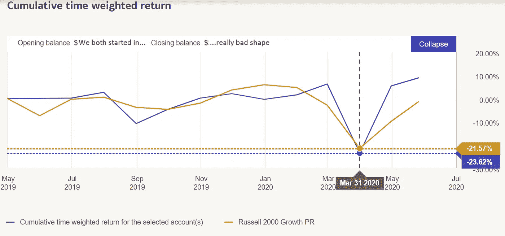
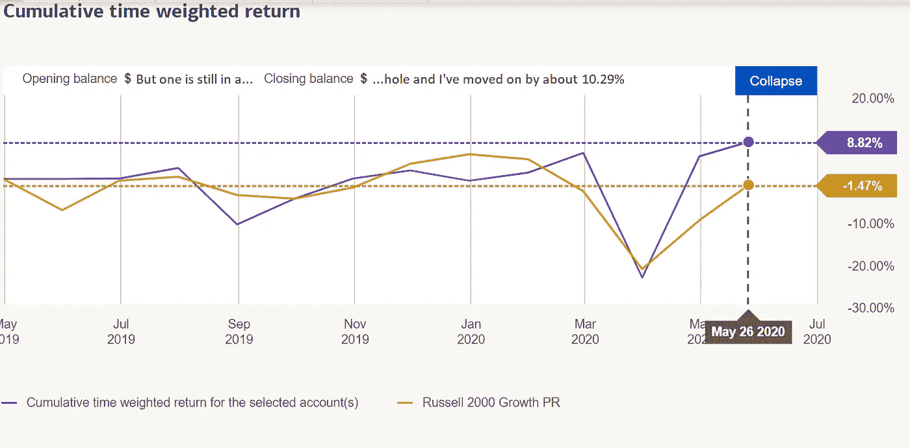

# 自我怀疑，承认&在失败中赢得 30%的胜利

> 原文：<https://medium.datadriveninvestor.com/self-doubt-conceding-earning-30-victory-in-defeat-970633e61b1a?source=collection_archive---------19----------------------->

## 站在混乱中寻找安慰不仅揭示了前景，而且在深不可测的市场情景中形成了超越市场回报的洞察力。

Source: Self Created Image with Canva

你的投资组合表现如何？你做了什么来保护自己？有办法在波动中找到确定性吗？人们喜欢谈论理论。每个人都有一些抽象的做事方式。除了他们的行为，每个人都是其他事情的老师。你老师的个人作品集做得怎么样？

> 后视镜里一切都很清楚。真正的挑战是做出预测，并对其准确性下注。

有人真的能摆脱近 30%的亏损吗？

我有。你有吗？

基准是很好的指标。基准显示了你相对于整体市场的表现。根据市场来衡量你的投资组合的问题是，没有人真的像基准那样多元化。

当集会来临时，每个人总是错过它。

具有讽刺意味的是，大多数基准测试都不可能真实反映。不管可能性如何，让我们少谈理论，多谈事实。

**市场下跌时我在哪里**

少谈个别高收益交易吧。突破是伟大的。在高端，他们每笔交易可以获得 2-5%的收益。*大多数人不做或不懂模式交易*。所以让我们跳过今天文章的整个主题。先说说我们大多数人在哪里。

大多数投资组合很可能是传统的设置。我们大多数人都有股票、交易所交易基金(ETF)、债券和传统证券。我也有传统的投资组合。我不全是另类结构。

让我们回顾一下我的传统投资组合在新冠肺炎市场震荡前后的位置。

很可怕吧？如你所见，我和其他人一样洗了个澡。我认识的大多数人还是全军覆没。这又回到了我写的评论，人们没有反映市场。唯一真实反映市场的产品是指数年金。这些产品是保险公司的义务，迫使他们像支付指数一样支付给你。该指数并不强制你的帐户。

直截了当地说，“**指数年金并不投资于指数，它们反映了指数。指数年金使保险公司有义务根据指数向你付款。**”

*保险公司基本上是根据指数做什么来欠你的*。**不要以为自己在一个索引里**。

*虚假参与假设*是大多数人对保险产品跟踪指数的常见误解。

**我是如何通过获得贬值的头寸而攀升的**

看下面的图表。这就是当你在混乱中找到平静，看到别人走过的路时发生的事情。

如你所见，我从负 23.62%的收益下降到正 8.82%的收益。截至今天，年初至今已超过 10.82%。

我个人的传统投资组合比市场基准高出 10.27%。

我重新配置了我的个人投资组合，我的传统投资组合在 45 天内升值了 32.44%。10 个人中有 9 个人不是这样。仅仅因为市场上涨并不意味着每个人的投资组合都是其中的一部分。**这是另一个错误的假设**。 ***在一次市场调整中，大多数人都被淘汰出局*** 。大多数人重新配置资产，以保护不跟踪市场收益的资产的未来损失。大多数人没有抓住收益，因为不可能预测何时上涨。结果，大多数人错过了你在新闻上看到的所有收获。

我是怎么做到的？我选赢家了吗？我选了假失败者吗？也许我只是在扔垃圾的混乱中捡了人们认为是黄铜的金块。

**在熊市中寻求升值而非收益**

试图预测哪家公司会在一个所有人都在亏损的市场中获利是愚蠢的追求。**玩赔率**。投资者出于冲动而非事实过度抛售某些东西。

重估策略是我最擅长的领域。就个人而言，升值是弥补巨大损失的必要手段。

就我个人而言，我选择的基本策略基于 1)经济因素，2)利率，3)低估资产的重新估值，4)从不使用杠杆或保证金& 5)在股票运动中即使价格大幅下跌也保持冷静。

前三(3)可以教。贪婪和急躁是吸引人们进入第四项的性格缺陷。最后一项(第 5 项)是大多数人感到恐慌的地方。

我还使用技术指标，如 RSI、MACD、成交量振荡指标、布林线、贝塔系数、阿尔法系数和突破模式来帮助我做决定。这些是我与基本面相结合的高级交易指标，如:市值、已发行和已发行股票、杠杆率和某些比率。

很多人喜欢使用市盈率和速动比率。我可能会看他们，但我不会把太多的注意力放在他们身上。我会查看每股收益(EPS)，看看能否进行股息对冲，但仅此而已。健康的收益也告诉我一家公司是否真的盈利。商业目标是赚钱而不是赔钱。

**核心信息**

选择账面价值稳定的股票。账面价值需要关注有形资产。如果公司的房地产在房地产市场上价值 100，000 美元，而由于某种原因，一家公司的股票在股票市场上只值 80，000 美元，那就买下来。

> 重估策略允许你利用“重估”和“利润”。

从众心理推动了疯狂的股票波动。*羊群输光所有的钱后疯狂奔跑*一致 ***资金趋势正常化*** 价格。一只股票总会值它所有的资产。你只需要 ***等待它的价格将*** 正常化为它的资产价值。机构、对冲基金、经验丰富的投资者和交易者的活动将使市场正常化。在正常化的时刻*，造成剧烈波动的人出局，如果你还在 ***看着价格飙升*** 。*

> *重估是你如何在 30 天内赚取一定的 30%的升值，而不是投机性的 30%的游戏，炫耀 99 个输家对 1 个赢家。*

*记住保证金交易会让你被淘汰。在动荡的熊市中，我不进行保证金交易。事实上，我一点也不喜欢保证金。很容易在转身前被踢出局，错过机会。耐心是关键，即使头脑发热也要保持冷静。就像有人向你开枪一样。你必须保持冷静，瞄准目标。在火拼中死去的人是开枪射击并且被激怒的人。*

*不要被情绪激动的市场击中。*

******

*关于 Christopher:Christopher Knight Lopez 是一名职业骗子，在他的职业生涯中，他与职业企业家进行了广泛的合作。在他 14 年的职业生涯中，Christopher 已经开了超过 7 家公司。克里斯托弗的目的是利用各种市场驱动的机会。Christopher 是注册项目经理(MPM)和认证财务分析师(AFA)。Christopher 之前通过了 65 系列证券执照考试。克里斯托弗也有他的总路线——人寿、意外、健康和健康维护组织。Christopher 已经管理了总计 2 . 86 亿美元的报告管理资产和建议资产。Christopher 在 29 个国家有工作经验，为各种业务筹集了超过 5000 万美元，在他的个人职业生涯中总收入超过 1300 万美元。Christopher 曾在高科技行业工作:生物技术、金融、证券、制造、房地产和住房抵押贷款。克里斯托弗是一名美国空军老兵。克里斯托弗热爱家庭、竞技体育、钓鱼、武术，并倡导企业家精神。克里斯托弗为崭露头角的企业家提供自助课程。克里斯托弗对导师的热情来自于企业家和骗子需要指导的信念。这个世界充满了关于企业家身份的相互矛盾的信息。在[www.christopherklopez.com 看更多。](http://www.christopherklopez.com.)*

*免责声明:这些信息并不意味着是一种投资建议或财务建议。不要把这种情况应用到你自己的个人环境中。各种风险包括:商业风险、投资风险、政治风险和其他风险。此信息仅用于信息和教育目的。请不要向作者寻求任何投资策略或哲学。针对自己的情况，请咨询自己的理财顾问或法律顾问。不是任何形式的推荐或认可。*