# 自驱动数据库:阿里巴巴数据库的智能参数调整

> 原文：<https://medium.datadriveninvestor.com/self-driven-databases-intelligent-parameter-tuning-for-alibaba-databases-explained-e11cf8dc4b1c?source=collection_archive---------16----------------------->

*本文撰稿人包括:陈杰(在阿里巴巴昵称为“爱傲”)、张平()、乔宏林(、)、齐星、张()。*

VLDB 2019 会议(第 45 届超大规模数据库国际会议)于 2019 年 8 月 26 日至 30 日在加利福尼亚州洛杉矶举行。本次大会上，阿里云数据库产品团队的多篇论文入选研究赛道和产业赛道。

本文详细介绍了“iBTune:针对大规模云数据库的个性化缓冲区调优”，这是一篇入围论文。

# 背景

大约五六年前，阿里巴巴数据库团队尝试将数据库管理员的经验应用到产品中，为业务发展提供更高效、更智能的数据库服务。云数据库管理员自 2014 年以来一直提供自助智能诊断和调优服务，经过四年的不断研究，于 2018 年发展成为下一代自动驾驶数据库平台(SDDP)。

SDDP 是一个智能数据库平台，它为平台上运行的数据库提供自驱动能力，使这些数据库能够独立感知、决策、恢复和优化，以实现持续和不可感知的服务供应。除了自动诊断、恢复和优化的核心功能，SDDP 还提供了一系列其他功能，如物理资源管理、实例生命周期管理、安全性和自动扩展。

2017 年底，SDDP 实现了所有数据库实例的全自动端到端优化，涵盖大型数据库的自动化慢速 SQL 查询、空间和参数优化。本文描述了大型数据库的自动参数调优。

近年来，智能数据库调优技术主要是通过使用数据驱动和机器学习算法来调优数据库参数。然而，这给开发者带来了重大的技术挑战。要解决的问题是如何在满足服务水平协议(SLA)要求的同时，以最优的性价比和最低的资源成本，自动配置大型数据库中运行不同服务的数百万个数据库实例。这种智能数据库调优技术对于云服务提供商来说具有巨大的价值。

学术界在过去的一两年里研究了智能数据库调优。比如卡耐基梅隆大学开发了 [OtterTune](https://db.cs.cmu.edu/projects/ottertune/) ，这是一个自动调优工具，它依赖于以前手动调优的经验，无法针对大型数据库进行缩放。Azure SQL 数据库和 AWS 也投资了智能数据库调优，但没有发表任何论文或产品。

阿里巴巴从 2018 年开始探索智能数据库参数调优。多个团队合作取得技术突破，并最终实现了广泛的调优，从问题定义和核心算法设计、评估和改进到端到端的自动化调优。

论文“iBTune:大规模云数据库的个性化缓冲调优”入选 VLDB 2019 大会的研究轨道，这标志着阿里巴巴数据库智能业务的一个重要里程碑。该论文由覃健、铁英、飞刀、艾敖、齐星、池源、洪林、时越、宋明和张睿共同撰写。

本文提出了智能数据库参数调整的创新想法，这些想法已在阿里巴巴集团的约 10，000 个实例上广泛实施，并帮助减少了约 12%的内存资源使用。这使得阿里巴巴成为业内唯一一家广泛实施数据库参数调优的公司。

# 问题定义

参数调优是数据库调优的重要手段，随着数据库参数数量的增加，它变得越来越复杂。比如最新版本的 MySQL 提供了 500 多个参数，甚至 PostgreSQL 也提供了 290 个左右的参数。数据库调优侧重于影响性能的参数。在这些参数中，缓冲池设置的影响最大。

目前，阿里巴巴采用的部署是多个数据库实例共享同一个主机。这导致了服务器资源的浪费，因为尽管有冗余的 CPU 和存储资源，主机内存仍然经常不足。因此，内存资源短缺是阻碍数据库实例部署密度提高的瓶颈。

因此，我们将重点放在缓冲池的智能参数调优上，因为它使用了最多的内存资源。我们需要优化缓冲池配置，因为它是降低整体服务器成本和提高数据库实例性能的关键因素。

对于大型数据库，挑战在于如何将每个数据库实例的缓冲池大小设置为适当的值，以便在不影响实例性能的情况下最小化实际的缓冲池大小。静态配置模板通常用于设置数据库实例参数，从而实现对传统大型数据库的统一管理和控制。

阿里巴巴提供了 10 种缓冲池规格的数据库实例供业务伙伴选择。在应用实例时，开发人员通常使用默认或高级规范，而不定义服务所需的缓冲池大小。这导致了严重的资源浪费。

服务的多样性和不断变化使得 DBA 无法手动调优大型数据库的参数。这促使我们研究使用数据驱动和机器学习算法，根据数据库负载和性能的变化动态调整数据库缓冲池。

# 问题分析

缓冲池大小和命中率是直接相关的。如果我们可以找到一个公式，如*缓冲池大小=函数(命中率)*，并确定业务合作伙伴或数据库管理员可以接受的命中率，我们可以在不影响服务的情况下减少缓冲池的大小。

在操作系统的缓存研究领域，我们发现了大量关于缓冲池大小和命中率之间关系的研究。一些研究表明，这种关系在长尾部分遵循幂律分布，即:

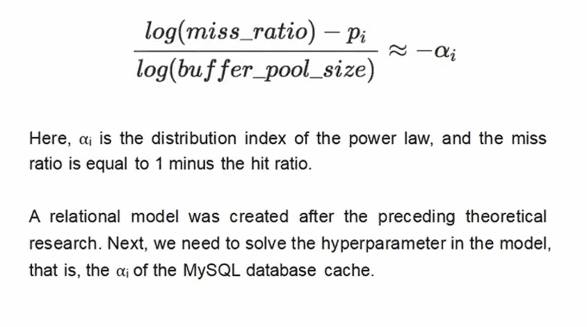

我们使用阿里巴巴数据库管理员开发的工具 Frodo，在阿里巴巴的主要在线交易处理(OLTP)场景中对不同的缓冲池配置进行了压力测试，例如添加到购物车和交易支付。测试结果证明 MySQL 的缓冲池在长尾部分符合幂律分布的假设。

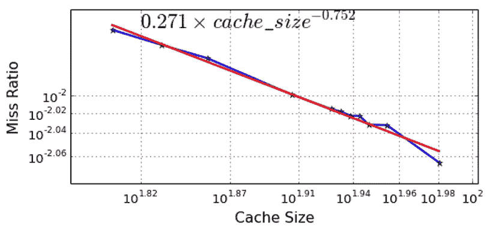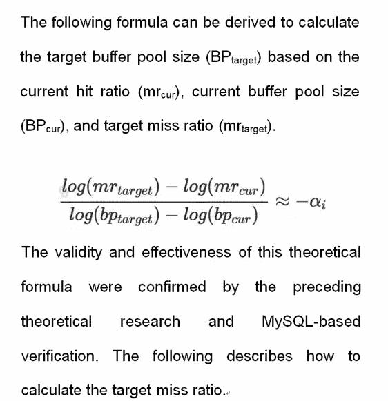

# 确定适当的失误率

阿里巴巴拥有超过 30，000 个数据库实例的主节点。我们考虑在这些数据库实例中找到与目标实例相似的实例的方法，以基于相似实例的缺失率来确定目标实例的缺失率。

我们选择了 CPU 使用率、逻辑读取、I/O 读取、未命中率和响应时间等特性作为描述服务工作负载的性能指标。我们还选择了统计项目，如平均值、中间值、第 70 百分位和第 90 百分位来测量这些特征的值。

为了减少工作日和周末性能差异的影响，我们选择了跨越四周的性能数据进行相似性计算。下图显示了两对相似实例的示例。

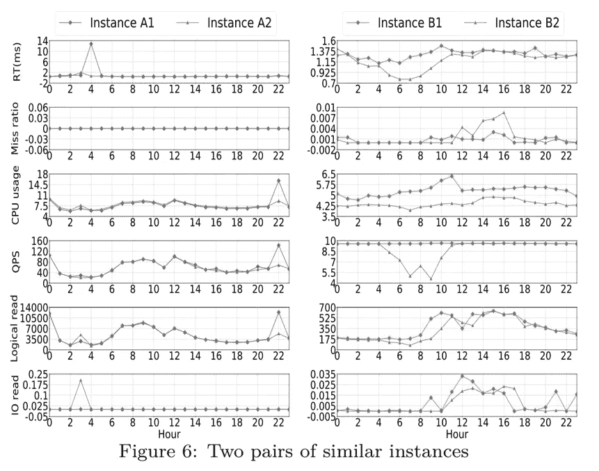

# 算法挑战

现在，我们可以使用基于定义的参数和目标未命中率的公式来计算缓冲池大小。下一个挑战在于将这种算法应用到工程过程中。

从业务伙伴和数据库管理员的角度来看，命中率并不能直接反映数据库的服务影响，也不能用来衡量数据库服务的稳定性。由于稳定性要求，我们无法在服务级别应用该算法，因为我们无法量化服务影响。

在与数据库管理员和业务合作伙伴反复讨论后，我们发现数据库响应时间对数据库管理员和业务合作伙伴非常重要，尤其是数据库实例在与应用程序交互时的最大响应时间。

如果我们可以预测数据库实例响应时间的最大值(上限),那么我们就可以量化缓冲池调优后的服务影响。这消除了缓冲池调优中的一个困难，并使得在生产环境中应用该算法成为可能。因此，我们使用该算法来预测数据库实例的响应时间上限。

# RT 预测模型

我们提出了用于 RT 预测的成对深度神经网络(DNN)模型，如下图所示。

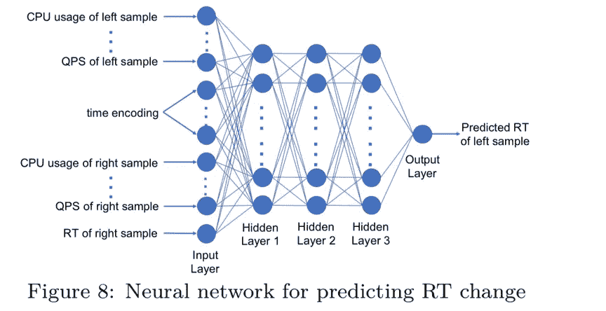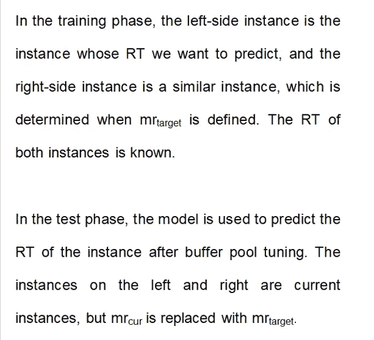

DNN 是一个完全连接的网络，ReLU 作为激活功能。隐藏层 1、隐藏层 2 和隐藏层 3 分别有 100、50 和 50 个节点。

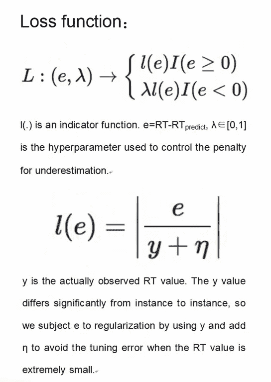

# 实验

在 RT 预测实验中，我们比较了回归算法，如线性回归(LR)、XGBoost、随机样本一致性(RANSAC)、决策树(DTree)、ENet、自适应增强(AdaBoost)、梯度增强决策树(GBDT)、K 近邻回归(KNR)、Bagging 回归器(BR)、极端随机化树回归器(ETR)、随机森林(RF)和稀疏子空间聚类(SSC)。我们添加了深度学习算法，包括嵌入层的实例到向量(I2V)-DNN 模型和成对 DNN 模型。

下图显示了 I2V-DNN 模型的结构。

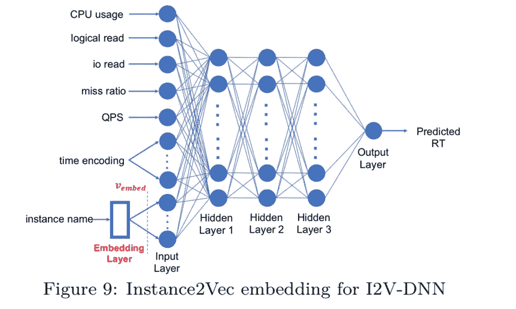

为了证明算法的通用性，我们从阿里巴巴内部的几个主要数据库业务场景中选取了 1000 个实例，包括只读实例、只写实例、读写平衡实例等不同读写比的实例。

我们通过使用以下三个指标来评估算法性能:

AMRAE 测量响应时间预测结果中的错误百分比，MAE 测量响应时间预测中的平均错误，而 UMAE 测量响应时间预测的低估。

下图比较了基于实验数据的响应时间预测结果。

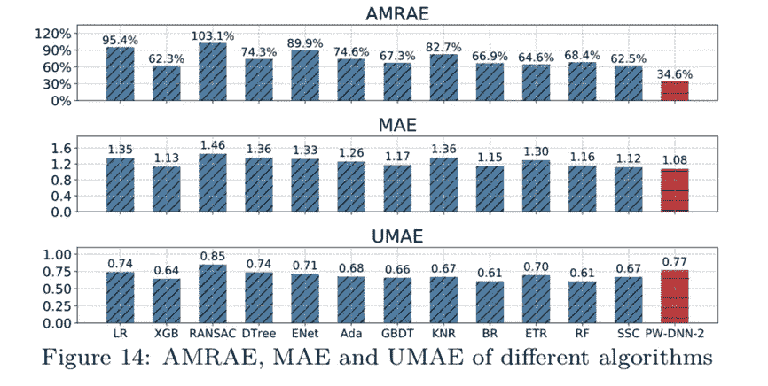

如上图所示，成对 DNN 算法在 AMRAE 性能上超过了其他算法，并在其他指标上表现出最佳性能。因此，我们选择了成对 DNN 算法进行响应时间预测。

# 结果呢

为了直观地显示缓冲池调优前后的变化，我们选择了 10 个实例，并测量了它们在调优前后的数据库指标，如下图所示。

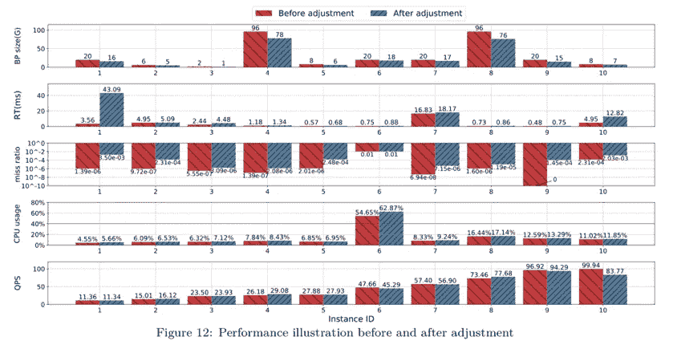

如上图所示，不同实例类型(除了实例 1)的响应时间在缓冲池调优前后没有太大差别。每秒查询数和 CPU 使用率指标显示，每秒查询数在缓冲池调优前后没有太大差异，实例消耗的资源量几乎相同。但是，这些实例显示了不同程度的内存使用减少。

优化后，实例 1 的响应时间大幅增加。这种情况下，每秒的查询数通常非常低，单个查询占用了大部分处理时间。优化后为此查询返回的值不同于优化前的值。优化显著增加了逻辑读取和物理读取的数量，并进一步增加了平均响应时间。但是，优化后响应时间的绝对值并不大，也不会出现缓慢的 SQL 查询。对于服务来说，这种情况是可以接受的。因此，不会触发回滚。

# 履行

我们实现了一个端到端的算法应用过程，从数据收集到执行缓冲池调优命令。该系统有四个模块:指标收集、数据处理、决策制定和执行。下图显示了模块设计。

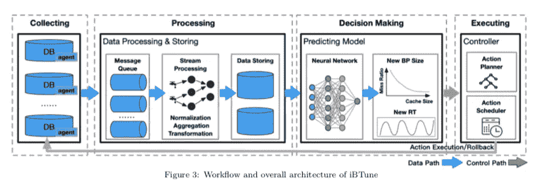

*   指标收集:数据库控制平台收集阿里巴巴内部所有数据库实例的指标，包括算法使用的所有指标。
*   数据处理:在流操作后，对收集到的不同窗口维度的度量进行统计，统计结果存储在 MaxCompute 中，供算法使用。
*   决策制定:该模块从 MaxCompute 读取度量统计信息，并通过使用算法来计算它们，以确定目标缓冲池大小。
*   执行:数据控制平台运行调优命令并调度相关的时间窗口，以按照发布约束高效地执行调优。

# 稳定性挑战

降级缓冲池配置会影响稳定性。操作不当可能会增加数据库管理员的工作量，甚至导致服务失败。缓冲池调优项目给数据库管理员和相关业务部门中负责服务稳定性的其他同事带来了巨大的挑战和负担。

我们采取了一系列措施来确保服务的稳定性，包括:

1.  算法模型:调整缓冲池大小与命中率映射关系的敏感系数αα，使调优结果更加保守。
2.  在线调优:只调优支持在线调优的实例的参数，以避免 MySQL 内核导致的 MySQL 崩溃。
3.  分阶段调优策略:在广泛的网络范围参数调优期间，实施严格的分阶段调优策略。首先，服务 DBA 根据算法确定的缓冲池大小调优少量实例，以确保服务的稳定性。然后，服务 DBA 将大量实例添加到白名单中，允许自动调整缓冲池大小。最后，服务 DBA 对已确认的非核心实例执行广泛的自动化调优，每次调优操作中限制实例的数量。
4.  闭环过程:整个调优过程是一个闭环，从数据收集、关于缓冲池大小的决策、自动缓冲池调优到调优后的量化和回滚。每天都会发布调优后的统计分析报告。

# 结果

经过算法探索和端到端自动化缓冲池调优，2019 财年阿里巴巴内部约有 10，000 个实例被调优，整体内存使用量从 217 TB 降至 190 TB，节省了 12.44% (27 TB)的内存资源。

# 未来计划

*   在业务方面，2020 财年，我们将对更多实例实施缓冲池调优，以节省更多内存资源，并通过混合云数据库管理(HDM)在公共云上优化和应用算法模型，为云用户提供选择数据库实例类型的建议。
*   在技术方面，除了缓冲池之外，我们还将调整与数据库性能相关的其他参数，探索多个性能相关参数的关系和影响，并根据数据库负载和性能影响之间的关系创建一个模型，以在数据库实例级别调整数据库参数。

# 原始来源:

 [## 自驱动数据库:阿里巴巴数据库的智能参数调整

### ApsaraDB 2020 年 3 月 3 日 324 本文撰稿人包括:陈杰(在阿里巴巴昵称为艾傲)、张平…

www.alibabacloud.com](https://www.alibabacloud.com/blog/self-driven-databases-intelligent-parameter-tuning-for-alibaba-databases-explained_595932)