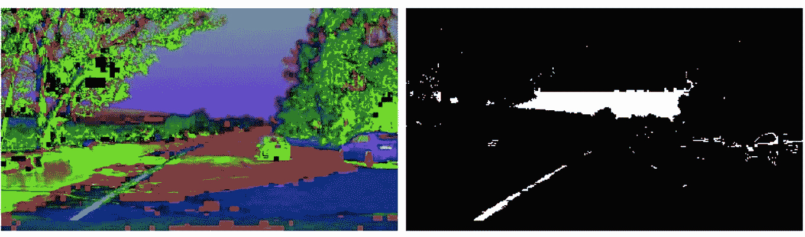
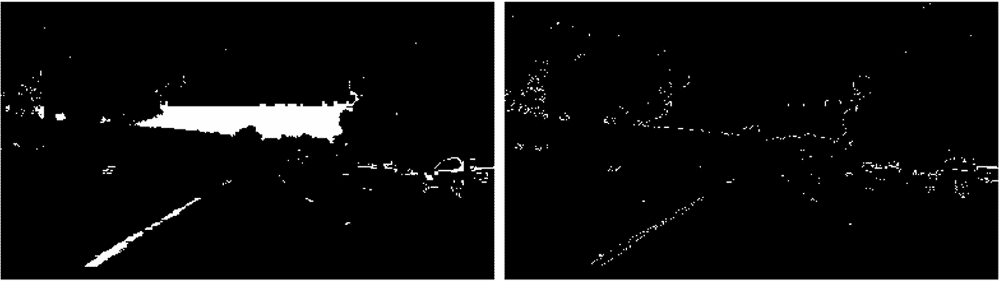
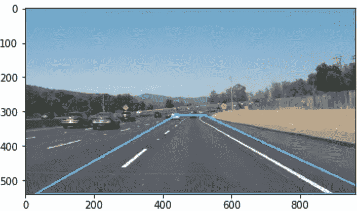
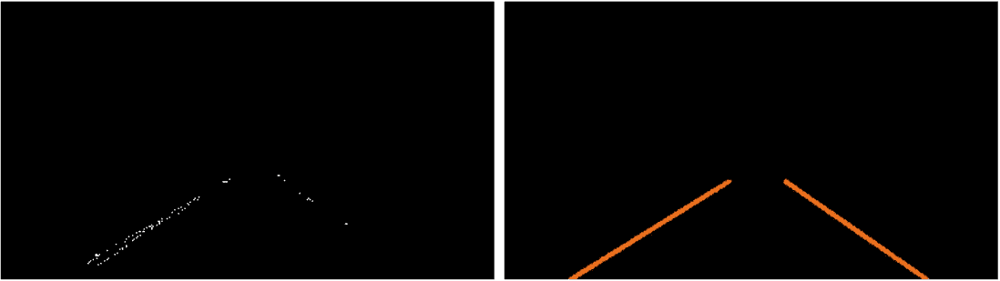
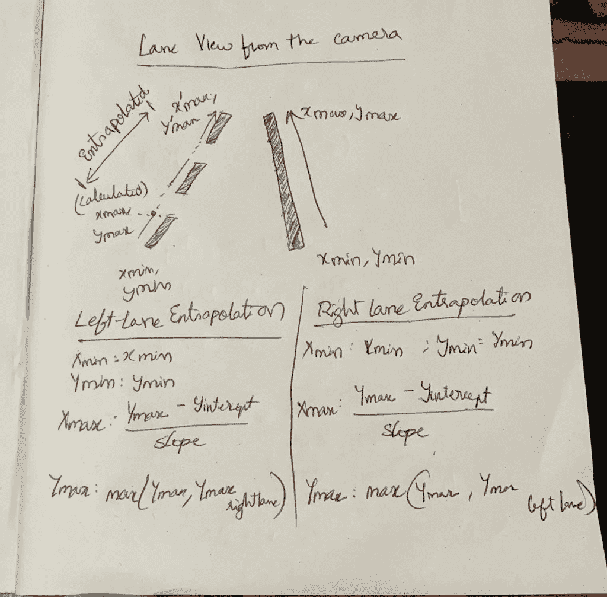
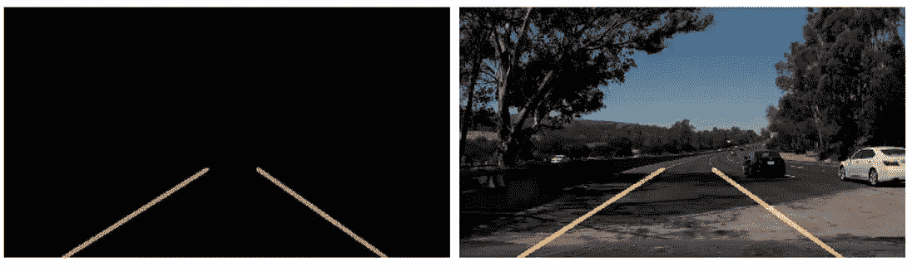
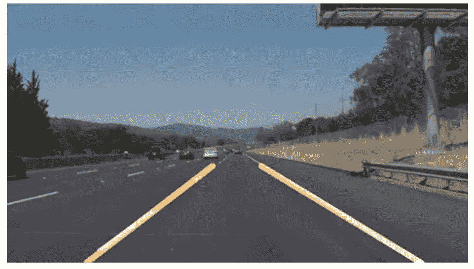

# 自动驾驶汽车:寻找道路车道是第一步

> 原文：<https://medium.datadriveninvestor.com/self-driving-cars-finding-road-lanes-is-the-first-step-bd049914bdb9?source=collection_archive---------7----------------------->

Photo by [Bram Van Oost](https://unsplash.com/@ort?utm_source=medium&utm_medium=referral) on [Unsplash](https://unsplash.com?utm_source=medium&utm_medium=referral)

识别道路的车道是人类驾驶员执行的非常常见的任务。这对于保持车辆在车道的限制内是很重要的。这也是自动驾驶汽车执行的一项非常关键的任务。车道检测是自主导航的一个重要方面。这是使车辆能够可视化并理解其环境的第一步。

这个项目的目标是创建一个在道路上寻找车道线的管道。

# 1.我的方法

1.  将原始图像转换到 HSV 色彩空间。是的，HSV！不是灰度。

## 选择 HSV 而不是灰度的原因:

在灰度中，我们会丢失很多信息，尤其是当光线条件改变和颜色改变时。我们通常有白色车道和黄色车道，以及不同的光线条件，如阴影、强光或弱光等。

此外，我们通常在 RGB 色彩空间中表示大多数图像，以描述颜色并以数字方式保存它们。但是当光线条件改变时，这不是一个好的选择。

因此，我们必须选择一个对变化的光照条件更鲁棒的色彩空间。所以我选择了 HSV 色彩空间，因为色彩信息是在单通道 h 中编码的。这样，该通道中的信息不会随着照明条件的变化而变化。

 [## 在自动驾驶汽车发生事故的情况下，谁应该承担法律责任？数据驱动的投资者

### 我仍然认为自动驾驶汽车是一种奢侈品，而不是必需品…

www.datadriveninvestor.com](https://www.datadriveninvestor.com/2018/11/02/who-is-legally-accountable-in-the-case-of-an-autonomous-vehicle-accident/) 

补充一点来支持我为什么选择 HSV 而不是灰度。请参考“色彩空间对跟踪鲁棒性的影响”一文，该文提出“……与灰度和 RGB 图像相比，YCbCr 和 HSV 的色彩空间给出了更准确、更鲁棒的跟踪结果……”链接:[https://ieeexplore.ieee.org/document/4582971](https://ieeexplore.ieee.org/document/4582971)

示例图像显示了阴影图像，左侧为黄色通道，右侧为 HSV 转换图像。

2.然后，我们获取上一步的输出，即转换到 HSV 色彩空间的原始图像，并应用 GuassianBlur 函数。

这有助于去除图像中的任何噪声。这是 canny 边缘检测的重要预处理步骤。

3.黄色和白色的遮罩被应用到 HSV 图像以从图像中提取车道线。

# 原因何在？

即使在转换到 HSV 颜色空间并应用高斯模糊后，图像中仍可能存在干扰车道线识别的噪声。解决这个问题的有效方法是在图像中寻找特定的颜色，过滤掉图像中的噪声。在我们的例子中，我们知道车道线主要是黄色和白色，我们可以利用这一信息在 HSV 图像上应用黄色和白色遮罩，并尝试删除除车道线以外的所有内容。

4.然后通过将平滑后的灰度图像传递到 OpenCV 的 canny 函数中来检测图像中的边缘。

5.在检测到边缘之后，只有图像中具有道路车道线的那部分需要被考虑用于进一步处理。所以我们做了一个 4 边的多边形，它覆盖了我们感兴趣的区域。该区域在下图中高亮显示。接下来，我只关注我们在步骤 4 中得到的图像输出中的那个区域。结果显示在右边。

6.现在，图像只有车道线部分的 canny 边缘，其余部分被涂黑，我们可以在这些检测到的边缘上绘制 hough 线。这是车道的高亮部分。

从检测到的边缘画线是这个项目最重要的方面之一。对于要在边缘上绘制的两条单线，车道的每条线一条(左和右)，draw_line()函数以下列方式修改:

# 画线算法

我做了一个外推算法，考虑到左车道和右车道，在图像上绘制外推线。以下是实现这一目标的步骤:

a.为了外推从霍夫线返回的线并创建两条单线，两个端点(x_min，y_min，x_max。y_max)为双车道线及其对应的

需要斜率值(正斜率、负斜率)和截距(正截距、负截距)。这形成了算法的问题陈述。

b.对从 hough_lines()函数返回的线的数组进行迭代，对于每条线，计算斜率并存储在正负斜率的单独数组中。

c.从斜率是正还是负可以推断出该线属于车道的左线还是右线。

d.为了移除不属于任何车道但仍在车道区域内的边缘上的噪声线，为算法可接受的斜率值定义阈值。

e.对于每条线，截距也被计算和存储。

f.两条车道线的 y_max 是图像底部的点，也是这些线的起点。

g.两条线的斜率值可以通过取相应的正斜率值和负斜率值的平均值来计算。这也有助于消除斜率值上的一些噪声。

h.类似地，两条车道线的截距可以通过取存储截距的平均值来计算。

一、y_min 可以通过比较所有行中的所有 y 值，取最小值求出。

j.现在，x_min 和 x_max 可以通过将所有之前找到的参数拟合到该直线的一个方程中来找到。

k.现在可以在车道线上画线。

7.该图像现在与原始图像相结合，并且返回的图像将是原始图像，算法生成的车道线绘制在其上。

8.最终结果如下所示:

# 2.反光

转换到 HSV 色彩空间使管道对变化的光照条件具有鲁棒性，但线条仍然有点抖动。可以对 draw_line 算法进行改进，以便在处理时更好地利用来自视频的先前帧的信息。

# 3.结论:

给定的任务已经完成，项目符合给定的标准。您也可以在我的 GitHub repo 上找到该项目:

[https://github . com/harivamsi 9/Finding-Lane-Lines-using-OpenCV-for-Driving-Cars](https://github.com/harivamsi9/Finding-Lane-Lines-using-OpenCV-for-Self-Driving-Cars)

## 关于作者:

**哈里·瓦姆西·雅达瓦利**，韦洛尔 VIT 大学的计算机科学预科生，是自动驾驶汽车、人工通用智能、数据科学、深度学习、机器人过程自动化、机器人、量子计算和量子物理领域的未来研究人员。

对创业、创业、黑客马拉松、金融、区块链、家庭自动化和股票市场感兴趣。

## **访问专家视图—** [**订阅 DDI 英特尔**](https://datadriveninvestor.com/ddi-intel)