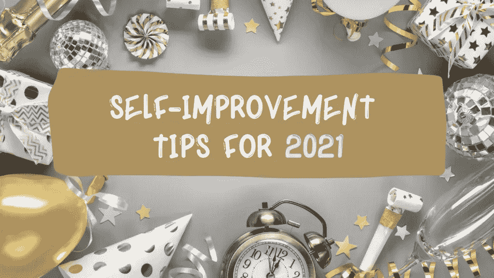
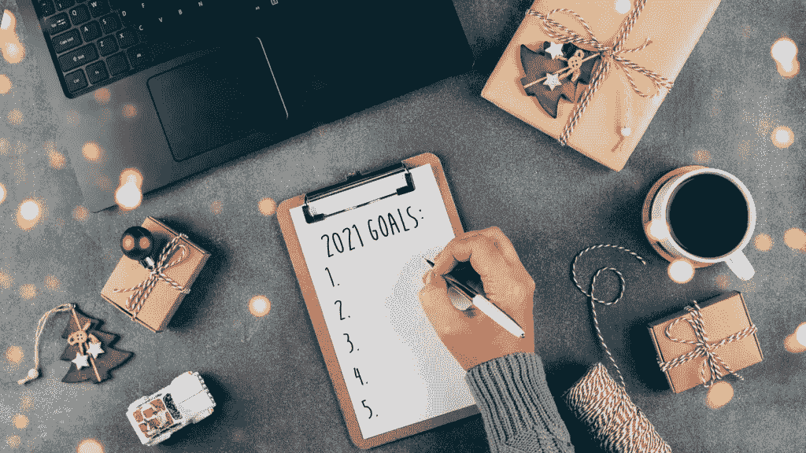

# 2021 年自我提升小贴士

> 原文：<https://medium.datadriveninvestor.com/self-improvement-tips-for-2021-a26f3f14abec?source=collection_archive---------0----------------------->

canva.com user-edited photo

你必须问自己，每天你能做些什么来提高自己？做一个比昨天更好的人？

好吧，既然我们现在是在 2021 年，2020 年已经过去了，我们现在应该开始准备我们今年的目标，以改善和成为更好的自己。

自我提升对我们的未来是必要的，因为它允许个人成长，可以帮助我们发展技能和纪律，使我们所有的梦想成为可能，当我们接近年底时，我们应该始终保持正确的习惯，这将有助于我们变得更好。

话虽如此，我们应该准备好改变自己，以便能够在我们的目标方面做出成功的改变，从而可能实现这些目标，因为如果不改变，我们就不允许自己改进和体验我们尚未体验的新事物。

> 我们应该最终走出舒适区，因为当我们开始面对新的挑战并学会如何克服它们时，成长就开始了。

不要害怕改变，因为害怕只会让你无法过上最好的生活。

> 摆脱困顿感的唯一解决办法是每天寻找提升自己的方法，如果你愿意向更好的*生活迈出一步。*

## **也就是说，下面是 7 个自我提升的建议，可以帮助任何人在 2021 年成为最好的自己**

canva.com user-free photo

回顾过去一年你做了什么——回顾过去一年你做了什么，想想你做得不成功的地方，这样你就可以想办法在 2021 年做得更好，实现它们。为了知道你需要提高什么，你必须知道你的起点。花一点时间反思过去的一年，评估你目前在生活中的位置。你必须知道你已经做了什么，你还想达到什么，因此，你会找到新的方法来改善它。

设定明确的界限——自我提升的下一个建议是设定明确的界限，因为如果你不为自己或周围的人设定明确的界限，一切都将难以实现。如果你觉得和别人在一起太多，你不能永远专注于自己，你需要对他们说不。让你的朋友或家人知道你的时间表，以便知道你什么时候方便，什么时候不方便。对自己和对目标的热情做出承诺，并允许自己采取行动去实现目标，但首先，你可能需要投入一些时间和精力，所以设定明确的界限肯定会对你有所帮助。

你不需要和你的朋友、家人或同事一起做他们做的事情。你是你自己，你最了解你自己。所以，做你热爱的事情，不要去取悦别人。知道你的极限，做你觉得对的事情

设定远大目标— 设定你想在 2021 年实现的远大目标很重要，因为当你有了一个明确的全年目标时，你就设定了一个期限，允许你尽一切努力实现这些目标。因此，在设定这些里程碑时，要志存高远，因为这有助于你变得更有动力去实现它们，并能够成功实现你设定的目标。

拥有年度成就也能激励你在接下来的一年左右继续做下去。

**4)知道自己的弱点——**你必须知道你缺少什么，你的弱点是什么，因为一旦你确定了你的弱点和你缺少的东西，你就会努力将它们转化为你的优势。例如，如果你在某个领域缺乏知识，为了更进一步实现你的梦想，你需要进一步发展，那么不要犹豫。我们每天都在学习，接受我们在某个领域所知不多的事实会让我们开始获取更多的知识，从而让自己进步。

**试着保持高效**——不要游手好闲，开始为你的目标行动起来。不要拖延任务，而是马上完成。如果你总是拖延，很可能你会拖延一整年，所以不要养成习惯

关注自我成长——关注你自己和你想要创造的未来，别无其他。这应该是你的首要任务。切断那些拖你后腿、让你感觉不那么关注自己的关系。

对 2021 年有一个愿景——为你明年想要做的事情创建一个愿景板，因为它们对实现你生活中想要的事情有很大的帮助。但是请记住，没有采取行动的勇气，光有愿景什么都不是。

~~~~~~~~~~~~~~~~~~~~~~~~~~~~~~~~~~~~~~~

**如果你错过了我们之前的文章，可以点击下面这些链接阅读；**

 [## 更好的你的 10 个个人发展目标(自我提升)

### 设定目标会给你一种生活的目标感，让你把时间和精力集中在真正重要的事情上

medium.com](https://medium.com/datadriveninvestor/10-personal-development-goals-for-a-better-version-of-you-self-improvement-2b87194a3ac9)  [## 新年新的你，2021 年能改善你生活的 7 个习惯

### 让你的 2021 年轰轰烈烈地开始吧，通过去除某些不会带来任何改变的习惯来改变你的生活方式…

medium.com](https://medium.com/datadriveninvestor/new-year-new-you-7-habits-that-could-improve-your-life-in-2021-e006fccebdb8)  [## 健康生活的最佳新年决心

### 对我们许多人来说，新的一年意味着新的开始，这就是为什么每当一年即将结束时，人们都会开始…

stephup.medium.com](https://stephup.medium.com/the-best-new-years-resolution-for-a-healthy-living-565cc74c371d) 

**进入专家视角—** [**订阅 DDI 英特尔**](https://datadriveninvestor.com/ddi-intel)