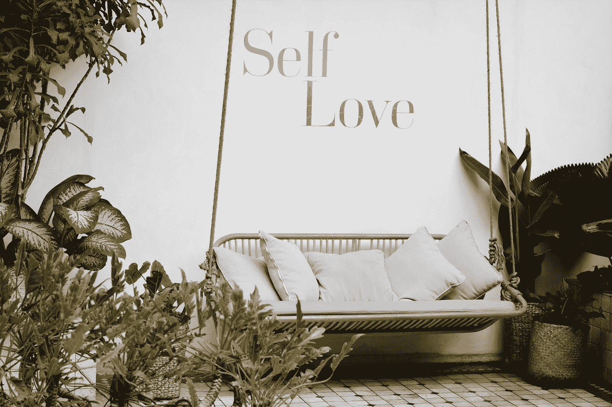
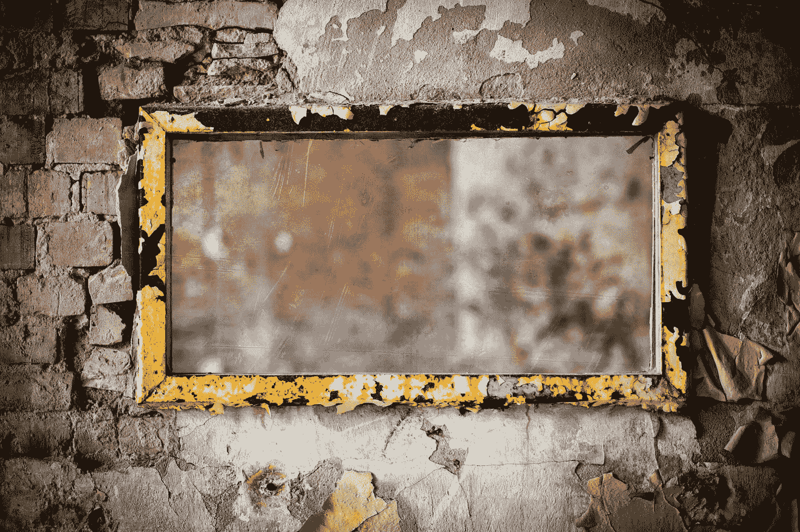

# 自爱还是自毁？

> 原文：<https://medium.datadriveninvestor.com/self-love-or-self-destructive-89e697c1a53?source=collection_archive---------4----------------------->

Photo by [Content Pixie](https://unsplash.com/@contentpixie?utm_source=medium&utm_medium=referral) on [Unsplash](https://unsplash.com?utm_source=medium&utm_medium=referral)

自爱这个词是一个相对较新的词，在 20 世纪 80 年代被我们的词汇所采用。在过去的几年里，自爱这个词似乎作为一个公认的真理出现在日常对话中。

> “你要更爱自己。”
> 
> “你为什么不爱自己呢？”
> 
> “只有先爱自己，才能爱另一个人。”

考虑到上述老生常谈，以下是一些自爱的咒语，暗示着更充实的生活。但是，自爱的自我观是否有助于你我过上更幸福、更健康的生活呢？我不相信。

当然，我理解同情自己和花时间的必要性，但作为一个忠告，我不认为自爱会给我们留下多少对他人友善或同情的空间。

事实上，我们需要彼此来展现最好的，有时是最坏的，来接受我们所有人的正常。

# 十亿美元的产业

自爱的基本原则最早是在 20 世纪 50 年代和 60 年代提出的。然而，直到 20 世纪 80 年代，自爱这个词才被我们的词汇所接受，并且作为一个行业，它已经发展成为自助领域中价值数十亿美元的业务。

> *2016 年，美国自助产业价值约 99 亿美元。市场研究人员预测，到 2022 年，该行业的价值将达到 130 亿美元。*

以下是我对自爱做法的想法，我认为我们应该在日常生活中体现这些做法之前努力反思。或者更糟的是，把它作为我们自己都不了解的未经请求的表面建议分发给别人。

Photo by [Denny Müller](https://unsplash.com/@redaquamedia?utm_source=medium&utm_medium=referral) on [Unsplash](https://unsplash.com?utm_source=medium&utm_medium=referral)

# 1)魔镜，墙上的魔镜谁是世界上最美丽的人？

> 不够漂亮。不够聪明。不够有成就。不够喜欢。

在一个不断用针对我们最原始的自我的营销材料轰炸你的世界里，接受你自己是人类力量的壮举。毕竟广告是告诉你你需要什么。

我为那些在广告中宣传真实男女的广告商鼓掌。这一法案使人们对社会有一个更平衡的看法，并阻止人们追求某种自我形象，一种不可实现的幻想。但是，自爱告诉我们，真正的自信和我们对世界的价值来自我们自己。那么，为什么我们需要改变广告呢？自爱似乎仍然微妙地主张赢家和输家。

我们都是人，应该得到同情和爱。一个不对，一个不差；然而，这种自爱的内在自我优先化会使对他人的概括和否定成为正当的行为。

# 2)爱自己就好

自爱意味着你必须先爱自己，然后才能爱别人——这是一种内在的自我优先化。但是，思考你的积极品质而不检查缺点，实际上，没有给他人或个人成长留下空间。

这种对自己的冥想让我们的内心没有同情他人的空间，因为我们只努力看到积极的一面，摒弃消极的一面，这样就没有谦卑的空间了。

优先考虑自爱意味着我们错过了成长，因为我们告诉自己我们已经完整了。这不也叫自恋吗？(如果我一意孤行，我们将不再使用自恋等最新的客观化词汇——但那是另一天的想法。)

> *《回声爱上了自己的倒影》*
> 
> *~奥维德的《变形记》，一部神话和传奇故事集，许多取材于希腊。*

为了成长和改变自己，我们必须审视自己的缺陷，这些缺陷有时可以通过我们与世界上其他人的互动反映出来。在我们的世界发生巨大变化和紧张的时候，我们需要共同成长，而不是自我优先。

Photo by [Larisa Birta](https://unsplash.com/@larisabirta?utm_source=medium&utm_medium=referral) on [Unsplash](https://unsplash.com?utm_source=medium&utm_medium=referral)

# 3)高处不胜寒

我是对的。你错了。克服它。如果自爱认为所有的积极品质都是可以接受的，没有缺点，我们如何在伙伴关系或社区中和谐地生活在一起？

个人主义在我们的社会中经常受到赞扬，但我们需要学会合作来解决当今现实世界的问题。

努力自爱似乎是摆脱我们所有人都感到的内疚或不足的唯一可能的方式，这反过来会导致我们远离我们所爱的人和朋友。

自爱运动的危险在于，它可能会导致我们仅仅接受过去的自己，粉碎任何成长或改变的愿望。

 [## 规划和建立您的房地产业务|数据驱动的投资者

### 房地产行业是有史以来最受欢迎的五大职业之一。原因很简单。它确实…

www.datadriveninvestor.com](https://www.datadriveninvestor.com/2020/12/14/plan-and-build-your-real-estate-business/) 

# 我用自己的方式做了这件事

有人告诉我，我的价值来自内心。我做到了。我的自我喜欢这样。但是，我不相信我的伟大来自内心，来自我积极的自爱品质。

我见过人们为了自我荣耀而努力为好项目做技术的负面效应。我一直受到商界女性和科技大使的负面评价。

> 如果我们自大到取消自己负面品质的资格，那么我们就没有谦虚到能够看到别人。

当爱我们自己成为我们的第一目标时，我们对你为我们自己签署的价值观的同情能力被淡化了，只被用来为你自己和你自己的利益服务。

# 5)满分 10 分

由于我们从未见过的技术进步，我们生活的时代令人着迷。但这些进步导致了一些基于对未知的恐惧而建立在保护主义和排外主义基础上的行为。

清空一个人的头脑，向内看，像自爱所指引的那样，如何帮助我们的世界变得更好——它不能。这不可避免地使情况变得更糟，因为我们无法看到或与他人分享，因为我们太担心他们窃取我们的想法和创新。

# 结束语

一定要照顾好自己，设定界限，考虑自己的需求，表达出来，善良并富有同情心。但是想想自爱的原则和实践在这个过程中是如何影响你周围的人的。

> 我们把自己比作不存在的理想人物。因此，当我们感到不安全并向内看时，我们找谁呢？或许那个批评的声音在告诉我们，我们不配。

如果我们停下来，从自爱中向外看，我们可以看到一个完整的世界，那里有人因为我们是谁而关心和爱我们。

> 我们是“可怕而奇妙的”
> 
> ~诗篇 139

做人类是困难的，我们给自己各种各样的分心来麻木痛苦。但是我们需要首先审视自己——好的和坏的——然后我们才有希望在我们今天生活的这个迷人而又可怕的时代拥有我们所需要的同情心或善良。

> "拥抱你的平凡，这样你才能拥抱别人的平凡."

艾米莉是火星金星生活方式，关系和商业教练。我的使命是支持我的[客户](https://www.marsvenuscoachemily.com/about)实现他们的最高理念，点燃他们的激情，激励他们实现自己的目标和梦想。

如果你为你的成功之路做好了准备，请联系我，拨打免费的[教练电话](https://www.marsvenuscoachemily.com/about)，看看和教练一起工作是否适合你。

**访问专家视图—** [**订阅 DDI 英特尔**](https://datadriveninvestor.com/ddi-intel)