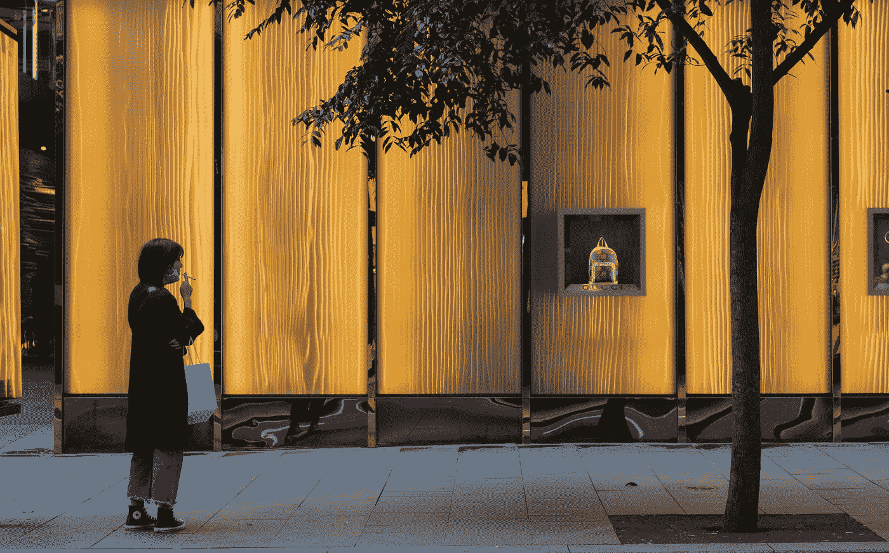

# Covid19 期间的自我更新

> 原文：<https://medium.datadriveninvestor.com/self-renewal-during-covid19-c67bd2db7886?source=collection_archive---------30----------------------->

Photo by [Kate Trifo](https://unsplash.com/@katetrifo?utm_source=medium&utm_medium=referral) on [Unsplash](https://unsplash.com?utm_source=medium&utm_medium=referral)

在这个封锁期，最初的新鲜感，即有额外的时间和家人在一起，有时间阅读那本书，有时间改造家居，有时间学习，已经消失了；研究表明，许多人沉溺其中，让时间溜走！在许多国家，这是春天，按照惯例，这是冬季过后的更新和恢复时期。

> ***“有欢乐的地方就有创造。没有快乐就没有创造:了解快乐的本质。”*(Taittiriya 奥义书)**

重要的是要提醒我们自己，传统的生活模式将呈现出新的现实！在这里，我分享如何提高对健康生活的时间价值的正念！

1.  *重视并保留无组织的时间！*无组织的时间是一笔有价值的财富，可以让你去思考和思考。远离技术和人类互动的噪音；这是一个调谐到内在噪音的机会，并允许它以涂鸦或图片的形式出现，或记录或观察一个人的思想。这可以是每日例行公事，也可以是每周例行公事。
2.  *迎接意外之喜！*偶遇为生活和项目提供刺激和机会。有许多网上和放大的机会，可以创造意外收获和思想的交汇，可以增强追求一个感兴趣的领域的动力。开放可以打开新的大门。
3.  *意识到能量水平！总会有额外的电子邮件需要回复，总会有更多的朋友需要添加到脸书，总会有更多的推文或电话！区分优先顺序会有帮助！回应必须是一种需要，而不是一种需要。*

> 告诉我你关注什么我就知道你是谁！何塞·奥尔特加·加塞特

4.*日常冥想练习！*电影制作人大卫·林奇建议，生产力问题可以通过提倡冥想来解决:

> “如果一家公司为企业中的每个人提供一种方式，让他们能够潜心钻研，开始拓展精力和智力，而不是灌输恐惧，人们就会免费加班。他们会更有创造力。公司就会向前飞跃。事情本可以如此。事情不是这样的，但事情很容易就变成那样了！

5.*承认成就！*记录进步是一个重要的激励因素！在做的过程中，成就可能看不见！一个日常习惯点击续费按钮，流量继续！

> 你通过对你是谁和你选择成为什么样的人负责来提升你的生活。韦恩·代尔

 [## 冠状病毒；惊慌失措；字里行间的 z |数据驱动的投资者

### 围绕冠状病毒的话题；更准确地说，新冠肺炎几乎占据了整个新闻预报的头条…

www.datadriveninvestor.com](https://www.datadriveninvestor.com/2020/03/23/coronavirus-a-to-panic-z-between-the-lines/)