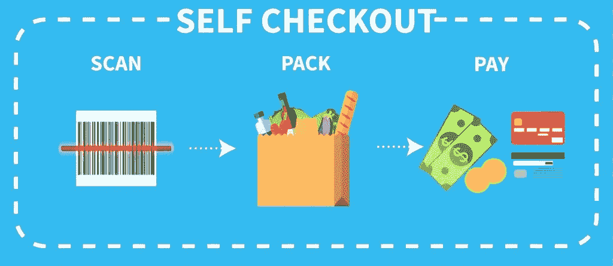
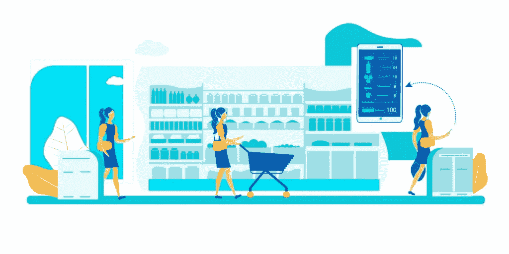
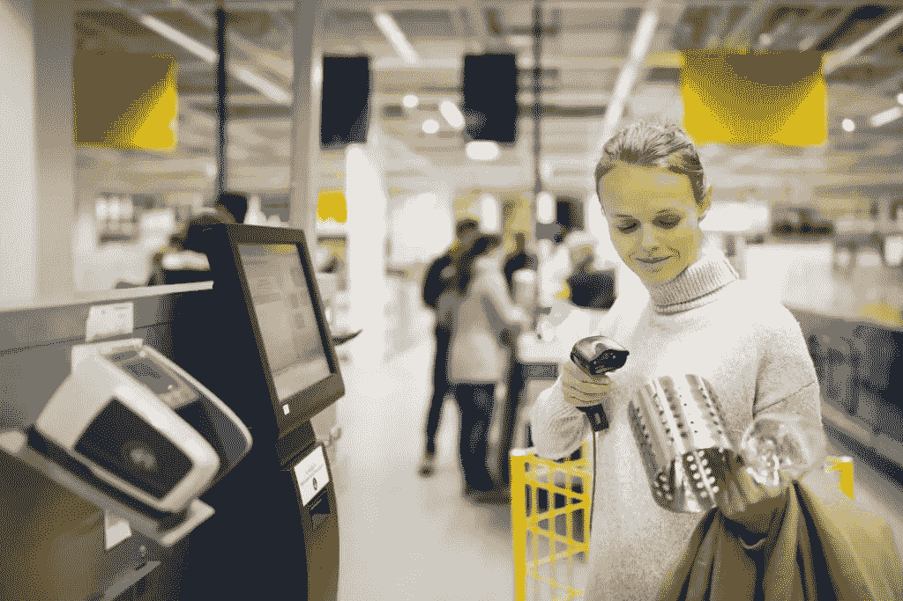

# 自助结账——优点、缺点，以及如何在您的商场实施自助结账机

> 原文：<https://medium.datadriveninvestor.com/self-serve-checkouts-pros-cons-and-how-to-implement-self-checkout-machines-in-your-store-df88dba1cd07?source=collection_archive---------12----------------------->

不管你是在杂货店、零售连锁店还是其他地方购物，在收银台排队都是一种可怕的经历。为了向客户提供更友好的消费体验，企业实施了自助结账，以加快结账过程并降低成本。事实上，根据最近一份调查美国 2，000 名购物者的报告，81%的人说快速结账会让店内购物体验更好，76%的人说自助结账也是如此。

既然如此多的人喜欢使用自助结账，你也需要开始在你的店内实施，以吸引和留住新顾客，同时在竞争中保持领先。让我们仔细看看为什么自助结账是好的。

# 自助结账是一个双赢的局面

自助结账变得如此流行的原因是它们对顾客和商店都有好处。购物者可以加快最不愉快的购物过程，因为他们不必排队等待他们的商品，因此对重复前往特定商店有更少的保留。对于企业来说，自助结账机提供了节约成本的机会。专家表示，零售业所有工作的 50%-80%可能会实现自动化，自助结账技术可能会有助于降低成本。

 [## 软件开发过程:如何选择正确的过程？数据驱动的投资者

### 软件是任何企业组织成功的生命线。没有软件的帮助，一个…

www.datadriveninvestor.com](https://www.datadriveninvestor.com/2020/01/16/software-development-process-how-to-pick-the-right-process/) 

# 自助结账机的优点和缺点

虽然我们提到了自助结账机的一些**优势**，但还有更多，例如:

*   减少店内员工的维护工作
*   更大的存储容量
*   你总是有足够的收银员
*   提高员工生产力

自助结账的**缺点**包括:

*   盗窃增加
*   设备故障
*   店内员工的不满
*   去人性化你的商店

既然我们知道了自助结账的所有优点和缺点，让我们来看看这项技术的未来。

# 自助结账的前景如何？

尽管自助结账还有很多问题需要解决，但所有的数据和顾客趋势都表明这是实体店的发展方向。我们看到像 Amazon Go 这样的商店，他们利用零售技术发展来消除结账过程。这项技术跟踪每一件从货架上拿下来又放回去的商品。当一个人完成购物后，他们可以离开商店，他们将通过电子邮件收到账单。

一些商店已经实施了 [RFID 技术](https://en.wikipedia.org/wiki/Radio-frequency_identification)，以进一步加快自助结账流程。当顾客走近自助结账终端时，他们所要做的就是把篮子放在柜台上，机器就会把里面所有的东西都记录下来。你不再需要一件一件地把所有东西拿出来扫描。

我们还必须记住，实体店正面临着来自在线平台的日益激烈的竞争，这些平台为购物者提供了足不出户就能购物的便利。因此，实体店也需要能够提供高水平的满意度，以吸引顾客。

# 自助结账适合你吗？

每当你考虑是否实施自助结账时，你都需要考虑你卖的是什么。如果你有容易处理的物品，而且方便顾客打包，那么自助结账就很适合你。此外，考虑你的客户。他们是在寻找方便快捷的东西吗？如果是这样，你必须向他们提供他们想要的东西。

你可以考虑的另一件事是让这种快速结账成为你的标志。即使很多商店已经以某种形式实现了自助结账，你也可以超越它，让它更快更方便。这并不意味着你必须像 Amazon Go 一样全力以赴，但你可以为你的商店带来优势的任何事情都值得做。

# 今天就开始实施自助结账

对于许多购物者来说，定期排队结账是一件麻烦事。这得到了最近一份[报告](https://www.emarketer.com/content/for-many-consumers-the-in-store-shopping-experience-still-has-flaws)的支持，该报告发现 60%的美国成年人觉得定期结账令人恼火。因此，如果你不使用自助服务终端，你就会拒绝很多潜在客户。

由于自助结账是未来的趋势，你需要为世界各地商店开始实施的最新趋势做好准备。虽然这种技术需要在时间和金钱方面进行大量投资，但从长远来看，它们肯定会带来更高的客户忠诚度和更多的收入。

*最初发布于*[*https://sky well . software*](https://skywell.software/blog/self-serve-checkouts-pros-cons-how-to-implement-in-your-store/)*。*