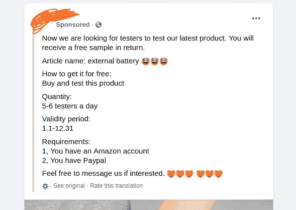
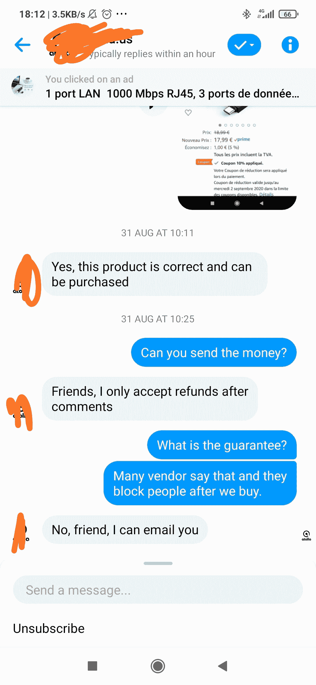

# 亚马逊上的卖家承诺在交换五星评论时提供免费测试产品

> 原文：<https://medium.datadriveninvestor.com/sellers-on-amazon-promises-a-free-testing-product-in-the-exchange-of-five-star-review-96848509b867?source=collection_archive---------5----------------------->

## 这不是一场营销，而是一场骗局

Photo by [Morning Brew](https://unsplash.com/@morningbrew?utm_source=unsplash&utm_medium=referral&utm_content=creditCopyText) on [Unsplash](https://unsplash.com/s/photos/paid-review?utm_source=unsplash&utm_medium=referral&utm_content=creditCopyText)

“我们正在寻找一个具有亚马逊档案的测试人员。消息如果感兴趣，“脸书的一个广告引起了我的注意。我最近遇到过很多，我知道会发生什么。尽管如此，我还是点击了上面的信息图标。

Screenshot:- a type of sponsored post on Facebook

“你好，你对我们的产品感兴趣吗？”一个机器人给我发了信息。“你需要有一个亚马逊个人资料和一个贝宝账户。买了用七天。去掉一个五星评级和一个优秀评论，我们用贝宝费用退还总金额。”

他们没有说，“如果你降低五星评级……”但他们说，“降低五星评级。”这个条件意味着没有复习的自由。我需要像他们说的那样审查它以获得退款。看似免费，其实并不像说的那么简单。

谁不爱免费产品？我的两个朋友也在其中。

## 芝加哥的朋友 A

几个月前，我在芝加哥的朋友收到了一个类似的信息，来自一个做脸书推广的页面。页面主人答应给他全额退款。他花 20 美元订购了一个多端口 USB，没有它他也能生活。他提交了订单详情，在满足所有条件后给了五星评级，并要求退款。他们告诉他，他将在 15 天的处理时间内获得退款。

他等了七天才办理退款。当他打开一个消息框查看状态时，他什么也没发现，只看到一个被删除的页面。该产品在亚马逊上获得了 20 个五星评级。最有可能的是，所有这些都是骗局的一部分。

## 巴黎的朋友 B

当 b 看到 Instagram 上的一个促销活动“亚马逊测试员招聘”时，她需要一个研磨机来进行家庭活动。她从亚马逊卖家那里订购了一台 50 欧元的研磨机，正如他们所说的那样。产品不像预期的那样，当然也不值 50 欧元。在她的详细评论中，她写下了利弊，并给了它四星评级。这位脸书竞选者拒绝给她退款。

美国和欧洲亚马逊商店的新卖家使用社交媒体促销策略。不管在哪个洲，他们的策略都是购买评论。我们永远不知道每天有多少买家落入这样的陷阱。

# 卖家想要的只是一个五星评价，仅此而已。

我问了几个活动家，他们是否会提前付钱给我，这样我就可以购买他们的产品。他们一直拒绝我的提议。不一定所有的竞选者都是骗子，但问题是五星评论。无论我买什么产品，不管它们的质量和价值如何，我都需要给它们一个五星级的评价，并配上优美的解说，这样才能把钱拿回来。

Screenshot by author

我觉得同意他们的条款和条件有两个主要问题。

1.  每一个购买他们产品的测试人员都必须放弃一个优秀的评论来获得退款。所以，如果我写了一篇诚实的评论，我就拿不到报酬。我得写一篇付费评论。
2.  如果我写了一篇付费评论，我可能会拿回我的退款，如果竞选者不是一个骗子，不像我的朋友遇到的那样。如果有人在阅读了我的(付费)评论后购买了该产品，可能会让买家失望。作为一个有立场的人，这将是我的巨大损失。

如果这些过程是一种真正的测试方法，测试和(诚实地)审查一个产品就不是问题了。但这里的情况并非如此。所以，我决定不买(测试)任何这样的产品。

评级良好的亚马逊产品在亚马逊搜索指数中攀升，但这一过程对于新卖家来说并不那么简单。因此，我们可以看到新的卖家通过脸书广告寻找付费评论者。

亚马逊在用户开始评论(评级或/和评论)之前保持了最低的购买金额阈值，以防止新用户的评级和评论。但是，这并不能阻止付费评论的流通。

这是一个骗局。小心点，亚马逊。小心点，亚马逊的顾客们。