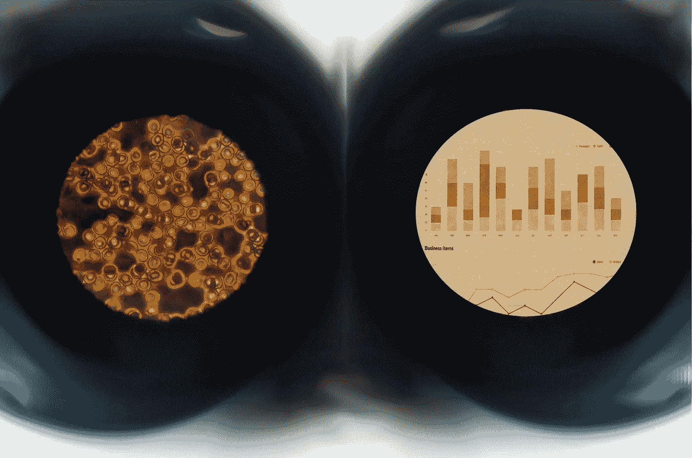
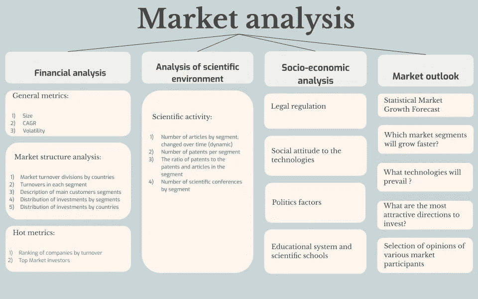
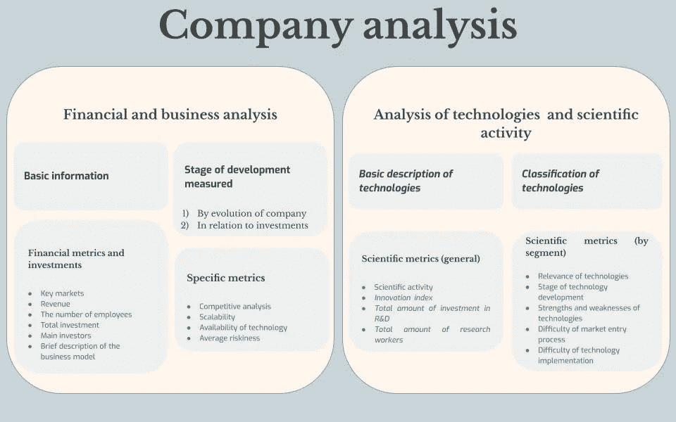

# 销售生物技术

> 原文：<https://medium.datadriveninvestor.com/selling-biotech-20cd6a9b024b?source=collection_archive---------4----------------------->

生命科学营销咨询的独特之处

生物技术市场的复杂性使其充满挑战。

事实上，我们所指的生物技术是各种不同行业的大杂烩，这些行业通常是松散耦合的，在市场和技术上都有显著的不同。这使得生物技术营销咨询变得重要起来。

许多传统的营销方法在生命科学行业不起作用，还有一些方法出乎意料。

在这篇文章中，我将试着总结一下 [Bionity](https://bionity.xyz/) 在生物技术咨询过程中积累的经验。

# 鱼龙混杂的市场

生命科学产业中的利基、市场、技术、工艺流程、生产链和网络的数量是巨大的。与传统市场不同，这里很可能是一家或几家公司占据了整个细分市场。此外，有相当数量的潜在部门根本不存在公司。这些细分市场中的每一个都需要非常具体的技能，而通才往往无法提供特定公司所需的咨询服务。

所有这些都迫使咨询公司面对以下事实:

1.不存在这样的单一市场。

2.每个行业都应该发展自己的评估商业前景的方法。

3.营销业务评估与科学评估密不可分，科学评估总是高度专业化的。

在这种情况下，咨询公司成为分析师和企业之间的一种中介。

尽管不可能开发出一种单一的方法，但我们可以区分出一些适用于评估任何生物技术初创公司的指标。当然，每个指标的相对重要性会因所讨论的特定行业而异。

我们过去常常应用这些通用方法的度量标准:

*   发展阶段
*   竞争指数
*   可量测性
*   技术可及性
*   科学活动
*   创新指数
*   技术优势
*   统计风险
*   技术实现的复杂性
*   市场相关性

但是细分市场本身应该进行分类和比较。为此实施了以下[方法](https://bionity.xyz/analytics.html):

在细分市场中，可以比较特定的公司:

这样一个框架虽然简单，却让我们能够非常成功地识别行业领导者、有潜力的初创企业、比较不同细分市场的前景，并找到可能在不久的将来腾飞的技术。

框架的简单性使我们能够避免“维数灾难”,并相对容易地获取所需数据，尽管为了理解各种特定的细分市场，可能需要更多的数据类别。

然而，一切仍不那么乐观。

 [## R&D 的支出如何影响生物技术公司的增长？数据驱动的投资者

### 与收入数字相比，生物技术公司是最大的研发支出者。截至 2019 年…

www.datadriveninvestor.com](https://www.datadriveninvestor.com/2020/05/11/how-is-rd-spending-affecting-biotech-company-growth/) 

# 营销咨询路上的障碍

尽管生物技术领域差别很大，但它们是相关的:一个行业的产品是另一个行业的资源；一个行业的研究往往会导致另一个行业的进步。有些行业，如长寿，需要生物技术几乎所有分支的复杂互动:生物信息学、干细胞研究、组学、生物工程、结构和系统生物学、生物医学。

因此，出现了一种矛盾的情况:在生物技术咨询方面几乎没有竞争，但同时却很难进入市场。

单个公司实际上无法获得足够的能力在整个市场上运作。

换句话说，我们面临着规模的问题:在非常小众的领域找到几家需要咨询或分析服务的初创公司或投资基金是相当容易的。超越这些利基市场，将获得的能力用于其他行业要困难得多。基本上没有其他办法，因为每个特定利基市场的客户群非常有限。

这就导致了这样一个事实，即生物技术创业公司常常发现，不通过中介机构，直接雇佣专门研究他们感兴趣的问题的独立分析师更有利可图。当然，这种解决方案有交易成本，当这些成本太高时，生物技术咨询服务就变得有意义了。

此外，问题出现在启动战略层面。关键是，正如许多生物技术问题需要多种解决方案一样，许多生物技术解决方案适用于多种问题。通常，一家初创公司开发特定产品是为了满足特定需求，完全没有意识到它可以应用于其他领域。当在市场和技术分析过程中发现这样的机会时，创业公司通常不愿意实施它。

以下问题也仍然相关。由于研发特点通常是保密的，所以存在限制。
2。缺乏基础科学方面的专业知识。
3。产品开发周期非常长，可能长达数十年，这通常不允许对业务前景进行充分评估。

它让我们认识到技术在生物技术中的作用。

# 技术几乎就是一切

在生物技术领域，技术比技术本身更多。

许多传统的营销问题和方面，如人体工程学、用户友好性、质量、效率、盈利能力，都依赖于研发。生物技术咨询几乎完全由 R&D 分析组成。由于大多数初创公司仅处于产品开发阶段，这种情况更加严重。

与此同时，技术和方法的多样性使得采用密集研发比粗放研发更为合理。我这么说的意思是，开发一种全新的方法或者从外部引进一种方法通常比完善一种旧方法更有效率。这通常是生物技术咨询的结果。

对技术的关注也意味着生物技术产品的推广几乎完全变成了与科学家和工程师的交流，而生物技术咨询的任务之一就是成为这种推广的平台，明智地选择由公司科学家指导的标准。

与此同时，我们必须明白，生物技术的许多部门都非常年轻，甚至还处于起步阶段。他们刚刚走出学术环境。因此，他们的初创公司更像是实验室，而不是商业项目。他们需要帮助重新聚焦于商业。

当然，生物技术将永远是知识密集型的。但随着创意和产品从学术界向商业领域的转移，初创企业发展中非科学方面的作用将会增加。生物技术不仅仅是技术。

这就是现在的情况。但是我们对未来有什么期待呢？

# 趋势

我们在行业中看到的趋势激发了对生物技术咨询发展的谨慎乐观。让我们列出其中最重要的。请注意，我关注的是那些首先与咨询发展相关的趋势。

*生物技术走向 B2C*

传统上，生物技术一直是 B2B 行业。然而，这种情况将会改变。

越来越多的生物技术产业瞄准了最终用户。这可能包括遗传和表观遗传测序、神经技术的各个领域、生物医学设备，当然还有制药。面向零售客户的 DIY 实验室和项目的整个生物技术产品领域正在兴起。

这意味着:生物技术必须变得对用户友好。促销和广告的作用将会增加。

*数字化*

随着生物技术产品正在成为信息技术产品，为后者开发的整套工具将为前者服务。生物技术公司和软件公司之间的界限越来越模糊。

随着数字化而来的还有指数化。这意味着那些设法与 It 相结合的细分市场的爆炸式增长。自然，这将为生物技术咨询创造广阔的新天地。

【艾】艾

一旦生物技术被数字化，数据科学和人工智能的方法就可以应用于它们。这已经在药物开发、生物标记识别、神经技术和长寿方面广泛发生。这些初创公司将寻找新的方法来将人工智能集成到他们的产品开发过程中。协助这些尝试的中介将会出现。

*民主化*

生物技术在小企业一级变得可行。从事生物技术研发不再需要吸引数百万美元的投资，建立一个基因工程实验室的费用已经不超过 5000 美元。

这将意味着一种动态的车库 IT 项目文化将来到生物技术领域，小型学生团体将能够实现他们自己的商业想法。一群小型生物技术创业公司正等着我们。

*新片段的出现*

这一点都不新鲜:生物技术的新领域不断涌现。但是这种情况发生的速度正在加快。

在不久的将来，我们将会看到诸如娱乐用神经技术、预防性长寿、表观遗传测序、消费有机体开发等行业的出现。

*医药创业发展*

制药公司 R&D 效率的下降迫使他们将 R&D 外包给创业公司。这创造了一个非常特殊的商业模式，基于与大公司的合作协议和合资企业。

*供应链多样化*

随着技术的进步，供应链正变得越来越复杂。初创公司在生物技术产品的庞大网络中找到自己的位置将越来越困难，也越来越重要。

*地域多元化*

整个地区都与市场相连。由于有利的法律环境，发展中国家正获得相对于传统生物技术中心的竞争优势。我们正在等待基因工程或干细胞医学的区域中心的出现，这将创造他们自己对分析服务的需求。

# 分析和咨询应该跟上

随着生命科学行业的变化，生物技术咨询也将转型。

关于这将如何发生，许多方向已经被确定。

1.  生物技术向 B2C 的转变使市场变得民主，分析公司的新数据来源出现。处理这些数据的方法早已为其他领域所熟悉，比如社交媒体、移动应用、零售营销。赢家将是那些能够率先发现使用这些方法的公司。它尤其意味着将人工智能应用于生物技术营销和技术数据的处理。
2.  生物技术的多学科趋势要求分析公司应用其他领域的方法和手段，尤其是信息技术日益增长的作用不容忽视。一旦生物技术和信息技术融合，我们将需要更多的生命科学信息技术咨询。
3.  生物技术市场的民主化将导致在线生物技术平台的创建，初创企业将在这些平台上争夺投资者、潜在合作伙伴等的注意力。分析公司应该利用这样的平台。
4.  生物技术咨询和分析公司将在网络和平台上联合起来，以满足生物技术中科学上复杂的产品开发过程和供应链的分析需求。

顺应生物技术市场趋势的咨询机构很可能会成功。

另一方面，分析公司本身能够影响生物技术创业公司的特征。例如，机器学习技术的发展，许多科学数据库的开放，以及关于临床试验的信息，为建立成熟的推荐系统创造了先决条件，无论是在科学研究层面还是在商业层面。大数据的使用正在创造越来越大的竞争优势。分析公司可能会成为新兴生物技术创业公司这种推荐系统的强大提供商。它可以从本质上提高 R&D 过程的速度和效率。

# 继续前进

实践表明，发展生物技术咨询的最佳方式是从团队具有竞争优势和重要知识的几个特定种子开始，然后逐渐将他们的服务扩展到整个市场。完全覆盖整个生物技术行业仍然是不可能的，外包将始终发挥重要作用。无论如何，生物技术咨询市场仍然是一片蓝海。也许是太空虚太深沉了。实际上没有竞争——但这更多的是负面影响，而不是正面影响，因为专注于其他领域和技术的公司的存在只会发挥积极作用:只有相对高度专业化的公司网络才能覆盖整个市场，但为此，它们必须集成到一个共同的基础设施中，以鼓励数据、发现和实践的交流。

我们需要更多的生物技术咨询！

**进入专家视图—** [**订阅 DDI 英特尔**](https://datadriveninvestor.com/ddi-intel)