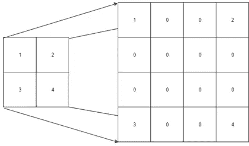
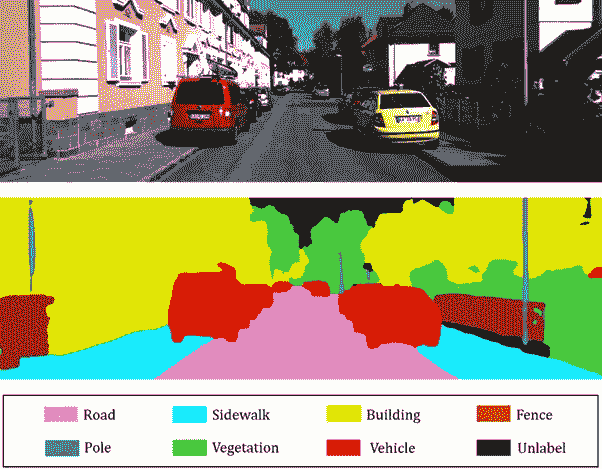
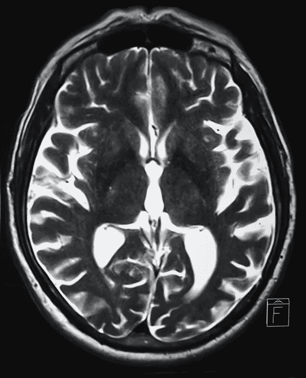
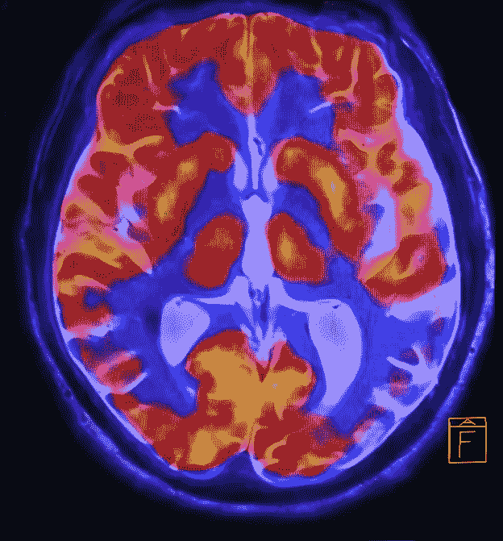
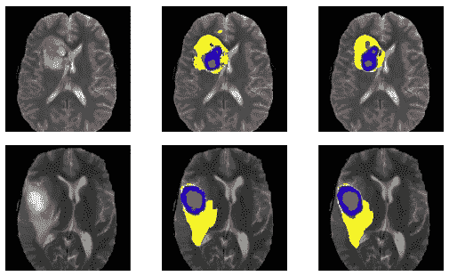

# 语义分割:最强大的计算机视觉任务

> 原文：<https://medium.datadriveninvestor.com/semantic-segmentation-the-most-powerful-computer-vision-task-270da844befd?source=collection_archive---------5----------------------->

分割对于图像分析任务是必不可少的。语义分割描述了将图像的每个像素与类别标签相关联的过程。这是为全面理解场景铺平道路的高级任务之一。

**语义分割的应用包括:**

> 自动驾驶
> 
> 虚拟现实
> 
> 工业检查
> 
> 卫星图像中可见地形的分类
> 
> 医学影像分析

随着近年来深度学习的流行，许多语义分割问题正在使用深度架构来解决，最常见的是 CNN，它在准确性和效率方面远远超过了其他方法。

语义分割是像素级从粗到细推理过程中的自然步骤:

> 起源可以在分类时定位，分类包括对整个输入进行预测。
> 
> 下一步是定位/检测，它不仅提供类别，还提供关于这些类别的空间位置的附加信息。
> 
> 最后，语义分割通过对每个像素进行密集预测推断标签来实现细粒度的推断，使得每个像素都用其包围对象或区域的类别来标记。

语义分割模型的架构由编码器和解码器组成:

编码器通常是预训练的分类网络，例如 VGG/雷斯网，后面是解码器网络。

解码器的任务是将编码器学习的区别特征(较低分辨率)在语义上投影到像素空间(较高分辨率)上，以获得密集分类。

 [## 修复摄影|数据驱动的投资者

### 汤姆·津伯洛夫在转向摄影之前曾在南加州大学学习音乐。作为一个…

www.datadriveninvestor.com](https://www.datadriveninvestor.com/2019/03/22/fixing-photography/) 

根据输出尺寸简单地拉伸图像中的像素可能会产生不合适的图像，有一些技术可用于放大图像。让我们看看，如果我们想使用 2*2 的输入创建一个 4*4 的图像，它会是什么样子。

图 1.2

将图像的大小调整到其原始像素也称为上采样，上采样有多种技术，如下所示，最近的邻居:这种方法不是执行复杂的数学运算，而是从最近的像素获取像素值并调整图像的大小。

双线性插值:在这种方法中，我们使用线性插值计算每个最近像素之间的加权距离，并计算新像素。

双三次插值:在这种方法中，我们也选择最近的像素，但不是像上面一样用线性插值来计算新的像素值，我们必须选择三阶多项式插值，这比其他两种方法需要更多的时间，但会得到更好更平滑的结果。

语义分割需要在像素上进行区分，并将在编码器的不同阶段学习到的区分特征投射到像素空间上。

Semantic Segmentation Output: Identification and masking each identified object

没有语义分割，自动驾驶汽车就无法制造。机器必须了解是否有汽车，左侧或右侧，道路的哪一侧，只有这样智能汽车(自动驾驶汽车)才能决定向左或向右转向，减速或加速。

即使是医学影像 AI，没有语义分割也无法进行。

语义分割可以识别重要的组成部分并屏蔽它们，用于分析特定异常的大小和存在，这是神经外科医生(专门研究神经系统疾病)、肿瘤学家(专门研究癌症)、放射肿瘤学家(通过开放射治疗处方来治疗和管理癌症)、神经学家治疗神经系统疾病、物理医学和康复专家(恢复身体残疾者的功能和生活质量)的主要任务

输出如下所示

Output of Semantic Segmentation

脑瘤识别可以类似地进行

希望你已经学会了语义分割的重要性

以上文章摘自本书: [**甘用工业用例**](https://www.amazon.in/Generative-Adversarial-Networks-Industrial-Cases/dp/9389423856/ref=sr_1_2?keywords=navin+manaswi&qid=1583916025&sr=8-2)

[**GAN 用工业用例(美国市场)**](https://www.amazon.com/Generative-Adversarial-Networks-Industrial-Cases/dp/9389423856/ref=sr_1_2?keywords=navin+manaswi&qid=1583916025&sr=8-2)

请随时分享您的反馈

—纳文·马纳维

人工智能书籍的作者和人工智能传播者