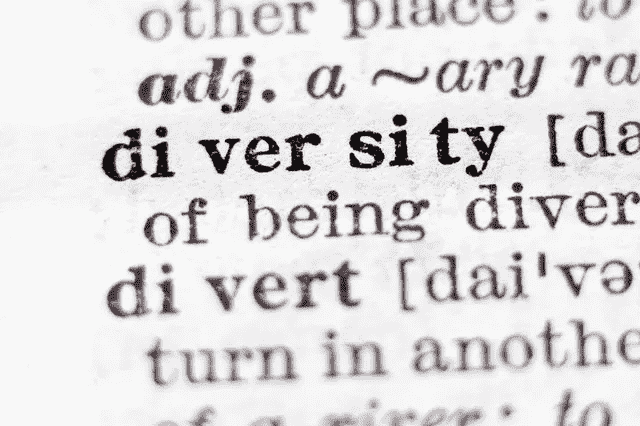
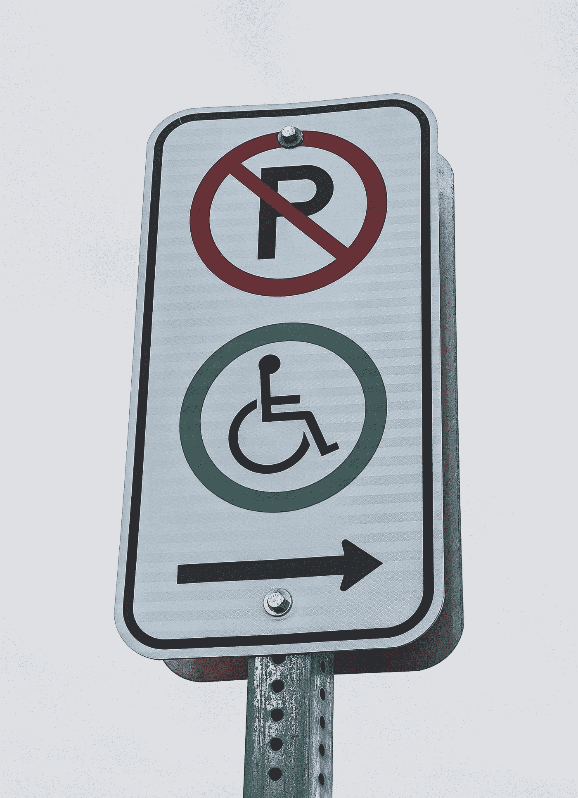

# 语义转移:社会工程的工具

> 原文：<https://medium.datadriveninvestor.com/semantic-shift-societal-engineering-and-the-centuries-old-neglected-modern-autocracy-fafd92b17624?source=collection_archive---------19----------------------->

## 被忽视了几个世纪的现代专制制度

Photo by [Vitezslav Vylicil](https://www.pexels.com/@vitezslav-vylicil-3618407?utm_content=attributionCopyText&utm_medium=referral&utm_source=pexels) from [Pexels](https://www.pexels.com/photo/text-5431221/?utm_content=attributionCopyText&utm_medium=referral&utm_source=pexels)

我们看到的、做的或感觉到的每一件事都有意义。从语言学上来说，我们需要特定的信息或信念，以便在与他人的每次交流中贯彻。我们试图与他人交流，并了解他们的立场意味着什么，以平衡主观感知和客观传达的备忘录。它仅仅是一个词使用各种短语的和谐状态；尽管如此，目前的语言学描述术语因类型而异。所有这些都指向不同的动机和重点。

# 语言变异的概念

在实际意义中，短语、动作和现象的语言变化经常被有意操纵。词和短语也演变为连续的年代改革的主题，这种改革是由特定社会在不同时代和地点的动态变化引起的。

它容易受到无限因素的影响，包括文化、民族、种族、价值观和教育。就像一些可变性一样，对第三方旁观者来说，定义并意味着一个需要特别审查和定期回访以避免误用的空间；同时，保持社会所有者成员之间的同步。因此必须避免宣传和阴谋的危害。

换句话说，定义是对术语、短语或符号背后含义的[确认](https://www.datadriveninvestor.com/glossary/confirmation/)。它们分为两部分:意向，它试图给一个给定的词赋予意义；和外延定义，旨在列出时间描述的对象。然而，一种重要的意义类型是明示变体，它通过举例来传达短语的本质。任何给定的术语都可能拥有几个不同的概念和许多意义，因此有多种定义。

传统上，定义的谬误和规则受到了关注，因此它们也必须阐明作为定义主题的事物的独特的基本属性。

定义应该避免循环。它必须避免使用被解释为推断原始术语的先验知识的一段意思的短语。定义也不能太宽或太窄。解释不能晦涩难懂，或者描述在有利的地方不能是不利的。

然而，任何定义的局限性在于，在任何给定的时间，诸如英语的自然语言包含任何综合描述的有限数量的词，这些词必须要么是循环的，要么依赖于原始的概念。因此，不同的学者选择留下一些术语未定义。

根据经院哲学家的说法——最高的属(也称为十大元帅)是不可定义的，因为不能指定一个更高的家族来归属于哪个家族。

有些人反对这样一种观点，即一个术语的每一种含义解释都必须阐明其本身。“如果没有另一个解释的支持，一个解释就会悬而未决”，声称对一个词的解释只是为了避免误解。

意义的模糊性指的是对交流内容的混淆，因为接受的语境可能导致对本质的不同解释。许多词汇中的许多短语有许多定义。

歧义是属于性格规律的突发事件的结果，即上下文定义了信息交换。如果发送者不在现场，语境明显不同，就像接受者是读者，而发送者是作者。

# 什么是意义？

值得注意的一点是“语义”短语与其所指对象之间的关系有以下几个层次。

# 语义的转变

语义学是对内涵如何通过符号和语言表达的考察。

理解面部表情、肢体语言和语气如何影响意思，以及单词、短语、句子和标点符号如何与目的相关，都是例子。

在语言学、逻辑学和计算机领域中，人们研究了各种各样的语义学分组。例如，语言语义学是一部关于单词以前是如何被使用的历史；逻辑语义学包括人们在可能的追求和信念方面如何暗示和关联。

在单词、短语或符号的定义、意义和理解之间的巨大差异中；然而，我们可以反复担保现有定义的定期变更。

重新定义是对事物的意义进行修改的过程。它主要影响人们以独特的方式思考问题。例如，社交网络重新定义了朋友的含义，或者重新定义了人们注意精神疾病的方式。

意义、定义和重新定义，无论是有意的还是无意的，都在不断地搅动和偏离，因为它们不仅是人类客观创造的主体，而且必须遵循每个人在任何给定的时间、地点和情况下的感知。他们炮制了[语义变化](https://en.wikipedia.org/wiki/Semantic_change)或漂移背后的根本因素，这是一个进化和传播感官刺激的完美环境。

每个词都包含意义和内涵的波动。随着时间的推移，它们可以被添加、删除或改变，经常到跨空间和时间的同源词具有非常不同的含义的程度。普遍的观点是，各种各样的力量触发语义修改。这些因素包括语言、心理、社会文化、文化影响和政治因素。

# 定义的时间变化

定义随时间的变化是真实而持续的。政治记者玛莎·吉尔曾是一名游说记者，一名经济学家，曾是一名政治家。她曾经说过“字面上”这个词是最被误用的语言，已经改变了意思。

> 以及“以字面的方式或意义”的意思；没错:当被要求径直穿过交通圈时，司机照字面意思理解了。

许多字典增加了后一个词的其他更近的用法。

正如谷歌所说:

> 术语[字面上的](https://www.theguardian.com/commentisfree/2013/aug/13/literally-broken-english-language-definition)可以用来“承认；不准确的东西。

如果我们停留足够长的时间，我们会发现[词汇会发生变化](https://www.thoughtco.com/how-the-meanings-of-words-change-1692666)，不管我们的意图是什么。语义转移的过程有多种原因和方式。四个主要的流行类别是“**加宽**、**变窄**、**改善**、**变窄**。"

**拓宽**，也实现为概括或延伸。它代表一个词的内涵比早期含义变得更全面的过程。例如，在古英语中,“狗”一词最初只与一个独特的品种有关。尽管如此；当然，在当代英语中，dog 也可以指许多不同的品种，而 something 可以指任何事物。

**变窄**与变宽相反。它指的是语义变化的类型，其中一个词的意义变得不那么广泛。例如，在古英语中，鹿可以指任何动物，女孩可以指任何性别的年轻人。

> 今天，确切的词有了更具体的含义。

**改善**与词义地位的提升或上升有关。例如，一丝不苟曾经意味着“害怕或胆怯”，而敏感仅仅意味着“能够运用自己的感官”。

贬损是一个词的意思的降级或贬低。

例如，形容词 silly 曾经表示“幸运的”或“无辜的”，opotous 表示“努力工作”，而 aggressive 表示“增加某物的重量”。

每一位编辑都必须研究语言，以决定哪些词应收入词典，并确定它们的含义。他们必须仔细监控人们最常使用的词汇以及他们是如何使用的。这包括公司对公共媒体活动的赞助。

该材料是关于社会工程技术借用策略，最有效地补充贵族纠正文明。在文章中，作者将社会工程学定义为:“对人类社会的创造和影响的研究。这是一个社会科学领域，研究那些在足够大的规模上影响整个人口的社会动态。”

在文章中，Jesse 指出了认识到任何意义与问题答案不同的倾向的重要性。后者包括诸如——“自由”这个词对你来说意味着什么？“基督徒”这个词呢？“保守派”、“犹太人”、“穆斯林”、“尼日利亚人”、“美国人”怎么样？

提交人进一步指出，答案会因回答特定问题的人而有很大不同。后者可能会为同一个人加班。

这篇文章讲述了为什么单词的定义会根据它们周围的信念属性而改变。社会工程界利用这一现象来解释、分析甚至有助于改变一个词的联想；从今以后，通过这样做，你可以仅仅改变一个人对措辞问题的看法。"如果使用得当，它会像魔法一样发挥作用。"-他描述了。

Photo by [Sigmund](https://unsplash.com/@sigmund?utm_source=medium&utm_medium=referral) on [Unsplash](https://unsplash.com?utm_source=medium&utm_medium=referral)

# 社会工程的角色

今天，社会工程包括与传达的信息相关的术语，并慢慢努力重塑它们的关联。从而使他们的定义更好地符合观众应该假设的内容。

社会工程的基本方面是关于:当一个特定的短语坚定地归因于一个独特的概念，即意图已经嵌入了这个词的定义中。

比如说——“公共”这个词；一度用来形容每个人都拥有的东西。今天，我们都知道不是每个人都拥有每一个公园、道路或桥梁。

不管我们称之为营销、宣传还是文字游戏，最终，社会工程精确而方便地有益于特定的目的。这在今天通过语义转变很容易实现。

随着信息技术、社交媒体和部分受控数据的出现，这种努力对于帮助引导公众兴趣实现其抱负的实体来说是一件方便的事情。

Braj Bihari kach ru(1932 年 5 月 15 日—2016 年 7 月 29 日)是一位印度语言学家。他曾经假设意识形态和权力是两个同类但又至关重要的问题，涉及每一部主要的词典。

一个词典编纂者和一个善于观察的使用者必须在任何激烈的词典编纂行业中奋斗。然而，直到 1995 年，批判性词典学才受到足够的重视。

那是当[kach ru Lann Hornscheidt；](https://en.wikipedia.org/wiki/Lann_Hornscheidt)(1965 年生于西德维尔伯特)，活跃于性别研究和语言学领域的德国学者；阿内塔·卡哈恩(1954 年出生于东柏林)是一名德国记者、作家和反犹太主义、种族主义和右翼极端主义的活动家，她第一次揭示了批判性词典学。

# 有意义的词典编纂

迄今为止，人们很难找到一个有组织的有意义词典学的理论图景。在全球语境中，批评词典学的广度和功能仅仅是比较性的。这是因为它没有考虑到不同学科的理论和方法灵感。这包括“批判性话语和后殖民研究”，这可能会使定义更具说服力和分析性。由于这种认识上的分歧，作为对这一呼吁的回应，出现了各种各样关于批评词典学研究方法的建议性话语，称为[【批评词典学话语研究(CLDS)】。对词典编纂者来说' '](https://academic.oup.com/ijl/article-abstract/32/3/362/5306896?redirectedFrom=fulltext)[社会责任](https://medium.com/societalengineering/societal-engineering-technique-3-redefinition-of-words-23059346d48d)。意义、定义和意图的差异导致阴谋、宣传和控制，这并不是一个隐藏的事实。

[尼尔·波兹曼(Neil Postman，1931 年 3 月 8 日—2003 年 10 月 5 日)](https://en.wikipedia.org/wiki/Neil_Postman)美国著名作家，著有二十本书，教育家、媒体理论家、文化评论家。他的最新材料包括:《娱乐至死》、《良心反对》、《技术垄断:文化向技术的投降》、《童年的消失》、《教育的终结:重新定义学校的价值》。"

尼尔曾经说过-

> *“当人们被琐事分散了注意力，当文化生活被重新定义为一轮无休止的娱乐，当严肃的公共谈话变成了一种闲聊，简而言之，当一个民族变成了观众，他们的公共事业变成了杂耍表演，那么一个国家就会发现自己处于危险之中；一种文化——死亡是一种确定的可能性。”*

今天，大多数政治和行政领域的特征不仅仅是功能失调的政治。相反，它呼吸着在娱乐的眼镜后面无情制造的控制。社会风景充斥着分散注意力和虚伪的政治大幕，对流行短语进行重新定义。

这证明了民主假说的杠杆作用，即世界各地的专制当局赋予支持合法镇压的政府形式以民主的面纱。

# 民主的语义转变

“人民民主”主要指二战后苏联红军推行共产主义的东欧卫星地区。鉴于他们对这些国家的政治禁令中明确的极权主义，这个词成了耻辱的主题。存在各种形式的民主，都有不同的含义，如主权民主和自由民主。

不管是有意的，巧合的，还是社会工程的产物，定义之间的不同步，意味着公众对任何短语的感知，是真实的。在特定的时间和地点，这是一个敏感的话题。因为这将是一个充满机会真空的理想环境，有利于对手。

应用于市场，当需求大于供给时，商品生产工程成为商业交易的一个广泛的重要贡献者。但是，一旦大规模生产变得有竞争力，有效的沟通和定义成为市场领域的一个大玩家；这本身就补充了大量的可比种群。

随着时间的推移，随着许多小巷和明确定义的客户接触点，指定身份和强大的独创性，inked 增加了企业的最大价值。

# 医疗保健和批判词典学

记住关于语义漂移和社会工程学的影响以及批判性词典学的讨论。然而，它适用于我们日常生活中的一切。

毫不奇怪，定义的不恰当和断章取义的意图也没有放过医疗保健系统。例如，像这样的短语；当前医疗保健领域中的个性化医疗、优质护理、基于价值的报销、健康和医疗保健代表了充斥行业头条的许多“流行语”中的几个。他们的定义是在少数利益相关者和玩家的话语背景下。

# 医疗保健的价值

今天，医疗保健的价值仅仅是基于偏袒的衡量标准。如今，政治言论支持医疗服务的当前价值，认为它是毫无根据的第三方算法的产物。他们的声音仅仅是一个吸引人们兴趣的时髦词，并没有提供任何实质性的价值。

> 医疗质量不是一个数学公式！

我们无法通过命令、政策，甚至新的商业模式来执行真正高质量的医疗服务。将基于价值的标准分配给基于人群的医学是不合适的，也是基于不充分定义的失败。

# 什么是医疗保险？

同样，医疗保险被视为另一项人权。美国打算实施一项福利计划。将后者与社会项目区分开来的那种项目只能使其与国家宪法的兼容性合法化。初级保健医学是另一个有不同解释的术语。

# 定义的明智策略是什么？

对于每个时代、社会和场景，建立对意义的准确理解的更新和精确的定义是值得注意的。它必须努力促进平等机会，以明确理解短语的内涵和解释。

尽管如此，执行最新的基本政策符合企业和行政部门的利益，因为这种便利是通过语义修改来紧扣公众思维和获取公共财富。

*原载于 2020 年 2 月 14 日 https://www.datadriveninvestor.com***。**

* [## 国家医疗保健争议:篱笆另一边的草更绿吗？

### 谈到医疗保健，每个国家都面临独特的挑战。关于这个问题的争论主要集中在三个方面…

medium.com](https://medium.com/@Adamtabriz/national-healthcare-controversies-is-the-grass-greener-on-the-other-side-of-the-fence-ffbab7b76e59)*