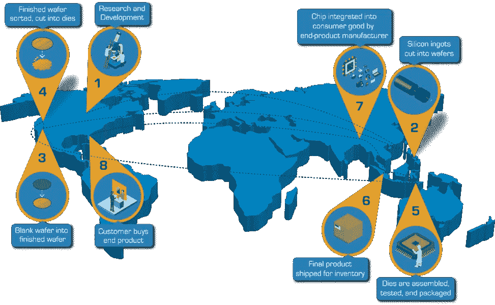

# 半导体行业供应链价值流分析

> 原文：<https://medium.datadriveninvestor.com/semiconductor-industry-supply-chain-value-stream-analysis-739f93546507?source=collection_archive---------4----------------------->

## 地球上最丰富的材料是如何通过工业供应链获得附加值，最终进入我们周围的一切？

Photo by [Laura Ockel](https://unsplash.com/@viazavier?utm_source=medium&utm_medium=referral) on [Unsplash](https://unsplash.com?utm_source=medium&utm_medium=referral)

半导体材料无处不在——在我们的口袋里，在我们穿的衣服里，在我们周围的一切事物中被广泛使用，以产生、处理和消费比历史上任何时候都多的大量数据流。

这些不断传输数据流的电子设备的基本原材料之一是由纯硅制成的芯片(有意掺杂了一些杂质)。这里有一个[事实](https://www.britannica.com/science/silica):地壳的质量 59%是**二氧化硅，又名硅**和**氧**，二氧化硅，这是 95%以上已知岩石的主要成分。

芯片制造是一个高度先进、复杂的过程，需要像 TSMC 和全球晶圆代工厂这样的专业代工公司几个月的时间才能完成。与此同时，他们正在投入研发资金，将技术节点制造成越来越小的几何形状(纳米级晶体管),以增加产能来满足贪得无厌的需求，而不必建造新的晶圆厂(这是一项非常昂贵的努力)。同样的 12 英寸直径晶片面积，由于更小的几何尺寸，晶体管密度[更高](https://en.wikipedia.org/wiki/Moore%27s_law)可生产更多器件，并更好地利用晶圆厂现有的昂贵设备。

让我们看看从晶圆厂到半导体设计公司到领先的消费设备公司再到电子零售商的整个供应链中的毛利率(GM ),看看价值是在哪里创造的，并作为价值流分析加以增加。我将首先说这是一个简化的观点，以了解半导体行业供应链和价值积累。

Semiconductor supply-chain value stream

请注意，我已经列出了一个典型的毛利润作为一般说明，这些是受不同公司的变化。根据这些假设，如果原材料二氧化硅的投入成本为 15 美元，而制造一片功能性半导体器件的直接成本为 15 美元，那么如上所示，它最终会在价值链中积累价值，并最终以芯片形式获得价值 100 美元的电子器件内容，这些芯片可以按照用例中涉及的软件组件的要求，存储和处理从输入到输出的数据。

 [## 现在的疫情刺激工业 4.0 吗？数据驱动的投资者

### 当前的全球疫情对人类的各个领域造成了严重的破坏，同时也给了……

www.datadriveninvestor.com](https://www.datadriveninvestor.com/2020/07/29/does-the-present-pandemic-stimulate-industry-4-0/) 

从另一个角度来看，在世界上销售的每 100 美元的零售半导体(电子设备芯片)内容，大约 30 美元作为收入流向半导体工厂，25 美元作为毛利流向芯片设计公司，25 美元作为毛利流向消费设备设计/制造商/经销商公司，其余 20 美元作为毛利流向设备零售商。

现在，上面第三步中的消费设备公司可以进一步分解为其自身的价值流，包括 ECM(电子合同制造商)、设计运营和分销商合作伙伴的供应链，以了解其收入如何在其自身的供应链价值创造中分配。例如，苹果是一家消费设备公司，在内部设计产品，为其大部分销售进行营销和零售，并利用富士康作为他们的 ECM。

对于大多数在开发新设计以满足复杂客户需求方面有很大 R&D 的半导体设计公司来说，使用专门的高科技晶圆厂公司进行合同制造通常是有意义的，以便:

1.  避免半导体制造中的高资本结构
2.  避免与快速缩减流程节点相关的 R&D 成本
3.  避免因生产线上的新设计、未准备好生产或零星需求周期而导致的任何闲置生产能力。

对于晶圆厂来说，在这个供应链中保持准时交货(OTDs)与过度库存天数的期望是一个非常小心的平衡。在假日季节主要消费电子设备发布前的几个月，需求会大幅增加。因此，适当且快速地提升而不造成昂贵的延迟变得非常重要；延迟也可能导致未来订单因错过交货日期而取消。

总之，这种[价值链](https://en.wikipedia.org/wiki/Value_chain)分析可以在任何行业进行，并可能有助于回答这样的问题，如处于价值链中间的公司进行垂直整合是否有益于更好的商业模式。这种分析应考虑其盈利能力的提高是否会证明吸收更多价值链所需的投资回报是合理的。我希望这有助于投资者确定投资分析的增值方面。

[https://www.semiconductors.org/wp-content/uploads/2018/05/Semiconductor-Value-Chain-Map.png](https://www.semiconductors.org/wp-content/uploads/2018/05/Semiconductor-Value-Chain-Map.png)

*最初发表于*[T5【https://hardiksp.substack.com】](https://hardiksp.substack.com/p/semiconductor-industry-supply-chain)*。*

## 访问专家视图— [订阅 DDI 英特尔](https://datadriveninvestor.com/ddi-intel)