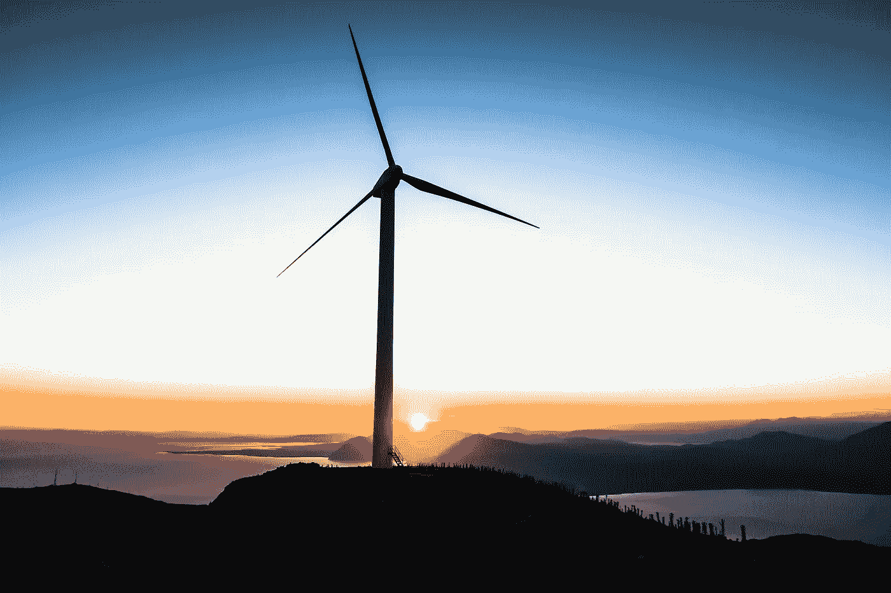

# 未来能源的明智策略

> 原文：<https://medium.datadriveninvestor.com/sensible-strategies-for-the-future-of-energy-b15339c79a2e?source=collection_archive---------21----------------------->

## 选择最佳方案构建更好的网格

Photo by [Jason Blackeye](https://unsplash.com/@jeisblack?utm_source=unsplash&utm_medium=referral&utm_content=creditCopyText)

随着气候变化的现实[迫在眉睫](https://climate.nasa.gov/faq/16/is-it-too-late-to-prevent-climate-change/)，企业、政府和个人都有责任为子孙后代找到更好的能源解决方案。

在选择能源时，有一些主要问题需要考虑，最明显的是:可耗竭性、排放和安全性。每种能源都有其独特的优点和缺点，在开发能源系统时都应该考虑到这些优点和缺点。

仅有一种能源是不够的；一个真正可持续的系统将在一个选项失败时提供替代方案，并且理想地包括各种资源，这些资源一起工作以获得最大效率。最好的策略是综合利用不同的资源，并把它们放在最有效的地方。

## 太阳的

太阳能是未来最灵活可靠的能源选择之一。太阳能电池板几乎可以放在任何地方，比如屋顶上或高速公路旁。此外，我们可以永远依靠太阳继续发光——至少在接下来的几千年里。

太阳能的主要优势是取之不尽，用之不竭，这就是为什么它是许多国家首选的清洁能源。像 T4、德国、西班牙和日本这样的国家率先将太阳能纳入他们未来的能源计划。在许多地方，生产太阳能电池板的成本正在迅速下降。

太阳能的主要缺点是产生的能量受到天气条件的限制。这个问题可以通过储存晴天产生的能量以备后用，或者将其输送到需要的地方来解决，但这些解决方案都有自己的挑战。

## 风

风力涡轮机有许多与太阳能相同的优点和缺点。一个独特的缺点是，有些人觉得涡轮机没有吸引力，不希望它们影响他们居住附近的风景。

这个问题的一个可能的解决方案是将风力涡轮机放置在海上。海上涡轮机建造成本更高，但也更有效率地产生能量。风力发电是清洁高效的，但它并不总是有风，就像它并不总是阳光明媚，它通常在风多的地区工作得更好。

风力发电可能会产生美国所需电力的 20%,但其他能源将需要占其余的 80%。就像太阳能一样，风能也面临储存和运输的问题。

## 氢

许多储存和运输的问题都可以用氢技术来解决。通过使用氢作为其他不同来源的[储存和传输](https://www.sciencedirect.com/science/article/abs/pii/S0360319918309108)媒介，我们可以提高电网的整体效率。

太阳能和风能等清洁能源产生的能量可以转化为氢作为能量载体。以氢的形式，能量可以作为燃料电池储存和运输，或者用来驱动热机和内燃机。将氢与风能、太阳能、地热和水电等清洁可再生能源结合使用是未来的理想策略。

## 其他人

氢气也可以用来提高系统的效率，包括不太清洁的能源解决方案，如[生物质](https://digital-films-com.proxy.lib.pdx.edu/p_ViewVideo.aspx?xtid=56357)。

生物质不是一个理想的解决方案，因为它会产生排放，但它比石油或煤炭更可再生，比核能更安全，而且便宜，易于在发展中国家或新兴经济体生产。

许多能源在整体可持续性方面都有这种环境权衡。例如，水力发电产生的温室气体排放量较低，但可能会破坏河流和溪流的生态系统。

核能的排放量也很低，但是会产生放射性废物，对环境造成危害，而且众所周知，这是导致死亡、受伤和环境破坏的灾难的原因。

核能还会引起政治争议，因为用于核能的技术也可以用来制造核武器，一些人认为应该限制获取这种技术。

## 位置，位置，位置

地理在决定什么是可行的方面也起着很大的作用。例如，潮汐能的生产受到地理位置的限制——你需要潮汐。地热能既高效又低排放，但它只能在地质条件适宜的地方产生。

例如，日本拥有丰富的地热资源，有 100 多座活火山。日本正在努力增加地热、太阳能和其他可再生能源的生产，以便在福岛核事故后摆脱对核能的依赖，但仍然在很大程度上依赖煤炭和化石燃料，就像美国和中国一样。

## 真正重要的是

考虑到所有这些不同的因素，最突出的总是清洁、可再生和安全。理想情况下，我们应该以用最少的资源生产能源为目标，同时产生最少的排放，降低对公共健康和环境的风险。

在制定能源战略时，成本和政治等因素应该放在次要位置。虽然成本可能是发展中经济体考虑的一个合理因素，但在第一世界，我们真的没有逻辑借口不优先考虑降低排放等事情。

**没有什么经济要务比失去一个宜居星球的严重性更重要，而这个宜居星球本来就是发展经济的地方。**

其他公共和环境安全风险也应认真考虑，不要让金钱或政治搅浑水。气候变化是一个*人类*的问题，超越了国籍、财富和政治派别。如果我们能把这些琐碎的问题放在一边，就能更清楚地思考我们的能源战略。

## 分解它

为了使这些选择更容易，我们可以把我们潜在的能源分成三类:理想的、不理想的和过时的。

煤炭和化石燃料正在进入过时类别，因为它们具有最大的缺点:高排放、公共健康风险、其他负面环境影响以及明显的可耗竭性。

生物量、生物燃料和核能属于“不理想”类别。这些资源比煤或天然气更不易耗尽，但仍有明显的缺点，如生物质和生物燃料的排放或核电带来的公共健康风险。这些缺点客观上比风力涡轮机不美观的缺点，或者太阳能电池板在阴天效率不高的缺点更大。

在从“过时”能源过渡的同时，我们也应该明智地利用“不理想”的能源，因为我们处理气候变化和资源枯竭问题的时间无疑是有限的，而且其中一些系统已经构建在我们的基础设施中。

然而，我们也不应该忽视“不理想”能源的明显缺点，并尽可能减少这些缺点的负面潜力。

在理想的类别中，我们有多种可能性:太阳能、风能、水电、地热、潮汐和氢。虽然这些都是最好的选择，但是没有一种能源可以单独解决我们的能源问题。

为了拥有高效的能源系统，既能满足我们的能源需求，又能检查所有其他重要项目；可再生，低排放，安全，我们需要使用这些资源的组合，战略性地放置和整合。结合安全、清洁和可再生能源的力量，我们可以为未来创造一个实用的能源战略。