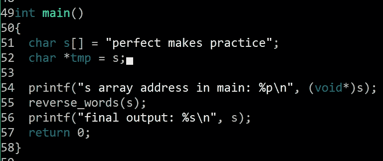
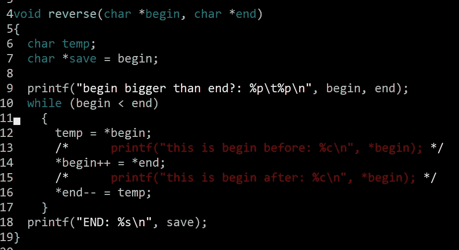

# 句子逆序算法

> 原文：<https://medium.datadriveninvestor.com/sentence-reverse-algorithm-9371fbe0948d?source=collection_archive---------5----------------------->

“At what point do your dreams for yourself become ‘unreasonable’?”

这周我在 Pramp 上做了一个模拟面试。事情进行得不是很顺利——这很令人沮丧，因为回想起来，这并不是一个很难的问题。让我们跳进来。

 [## 算法诱人的商业逻辑|数据驱动的投资者

### 某些机器行为总是让我感到惊讶。我对他们从自己的成就中学习的能力感到惊讶…

www.datadriveninvestor.com](https://www.datadriveninvestor.com/2019/03/22/the-seductive-business-logic-of-algorithms/) 

有人问我一个问题，叫做“句子颠倒”。您会得到一个字符“s”数组，它“由空格字符分隔的字符序列组成”。每个空格分隔的字符序列定义一个单词。所以，你会得到这样的东西:

s[] = "熟能生巧"

要求您“实现一个‘reverse _ words’函数，以最有效的方式反转数组中单词的顺序。”因此，如果给定上面的输入，期望的输出将是:

s[] =“熟能生巧”

关于边缘情况，可能存在空数组、仅包含空格的数组、一个单词的数组、单词之间的多个空格等。

解决这个问题的最好方法是首先反转数组中的每个单词:

s[] = "ecitcarp sekam tcefrep "

然后颠倒每个单词:

s[] =“熟能生巧”

让我们开始编码。

首先，让我们考虑一下我们的主要功能。我们需要初始化将要反转的字符串。然后，我们希望将字符串的地址传递给一个函数，该函数将反转字符串中的每个单词。我们的主要功能可能是这样的:

I include the print statements I used to debug for reference

当我们调用 reverse_words(s)时，我们实际上是将字符串中第一个字符的内存地址传递给函数。这很方便，因为这样一来，我们的助手函数就不必向 main()返回任何东西，因为 main()有一个对助手函数所操作的数据的引用。

接下来我们来写 reverse_words()。由于我们需要完成的第一件事是反转字符串中的每个单词，reverse_words()将负责为它遇到的每个单词获取一个指向单词开头和结尾的指针。一旦设置了这些指针，我们就可以对每个单词调用 reverse()，这实际上将反转字符串中的每个字符:

注意 reverse_words()如何遍历字符串 s:

1.  首先，我们将 while 循环设置为运行，直到 temp 指向的地址值为 NULL。

2.其次，我们递增 temp 指向的地址，然后检查我们现在是否指向一个空字节。请注意，在这种情况下，while 循环似乎比 for 循环更合适，因为我们希望在循环体中遇到逻辑之前增加 temp，而不是在 for 或 do-while 循环中通常会发生的情况之后。

*   如果我们指向一个空字节，那么我们已经到达了字符数组的末尾。我们现在要做的就是反转数组中的最后一个字，等待 while 循环终止，然后调用 reverse(第 45 行)并反转整个字符串。

3.接下来，我们检查 temp 是否指向一个空格字符。

*   如果我们指向一个空格字符，那么我们在字符串中找到了另一个单词的结尾。我们需要使用指向字符串开头的指针(word_begin)和表示字符串最后一个字符的 temp-1 来调用 reverse。
*   在我们颠倒这个单词之后，我们需要把我们的新单词 begin 设置为 temp+1，它代表我们的字符串中下一个单词的第一个字符，然后继续循环。

4.如果 temp 没有指向空字节或空格字符，我们在每次循环迭代中所做的就是通过单词中的字母递增 temp 指针。

现在让我们看看 reverse()实际上是如何颠倒我们传递给它的单词中的字符的:

因此，当 begin 的地址小于 end 的地址时，我们将运行 while 循环:

//让我们想象我们正在反转字符串“perfect”

1.  将“p”的值复制到一个名为 temp 的 char 变量中。
2.  将 begin 指向的地址值(以前是“p”)更改为 end 指向的地址值(以前是“t”)。我们可以通过使用指向字符串开头的字符指针 save 打印字符串来测试这一点。该字符串现在应该显示为“terfect”：

然后应用后置递增运算符。现在，begin 指向字符串中的第二个字符，即“e”:

3.保存在 temp 中的字符被分配给保存在指针末端的地址。该词现在应读作“terfecp”:

然后应用后缀减量运算符，end 现在指向单词“c”中的倒数第二个字符:

这个循环将继续下去，直到 begin 指向的地址大于 end 指向的地址:

就时间和空间复杂度而言，该算法对于两者都是 O(n ),其中 n 表示字符串中的字符数。

这就是你如何在 c 语言这样的低级语言中反转一个句子。