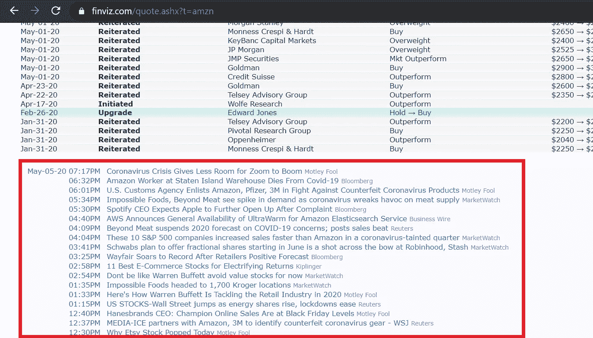
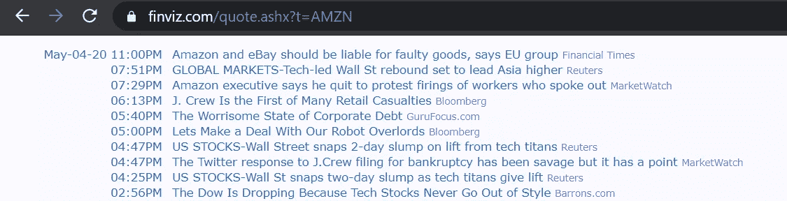
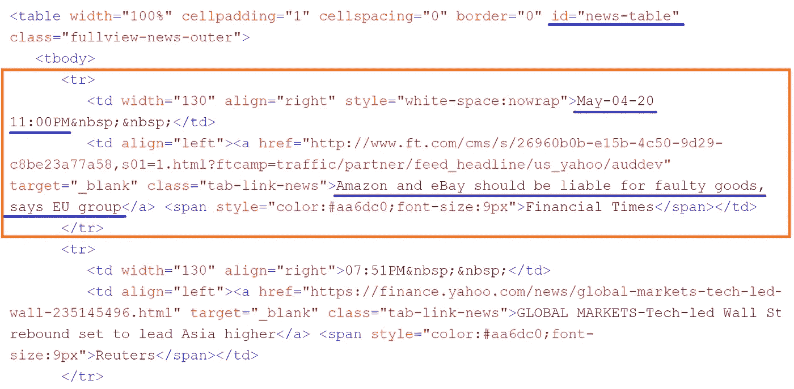
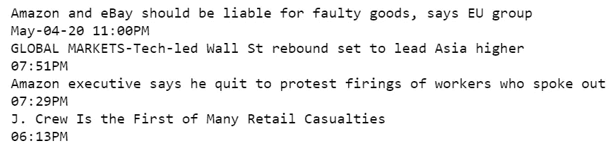
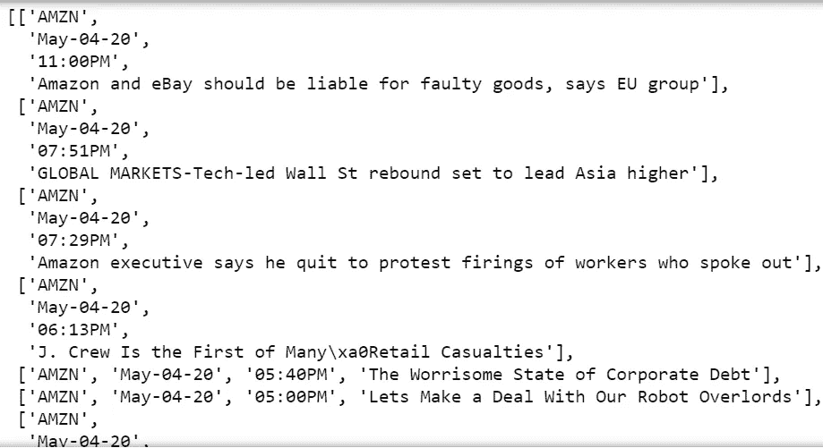
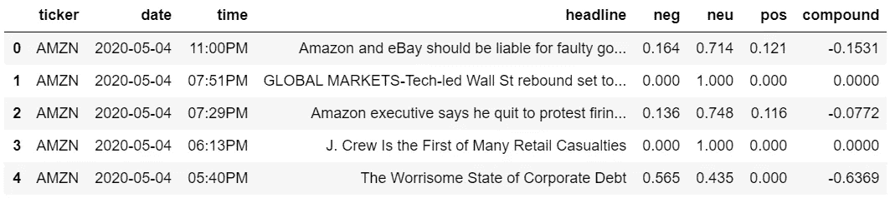
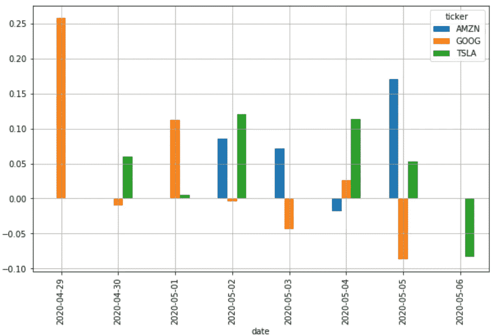
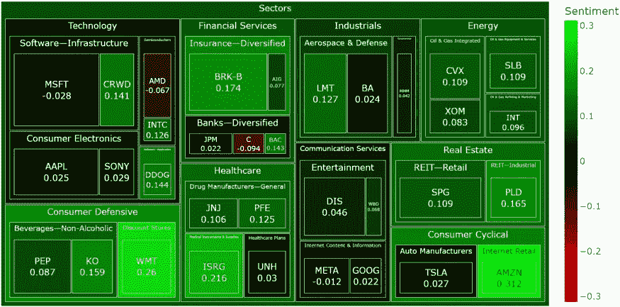
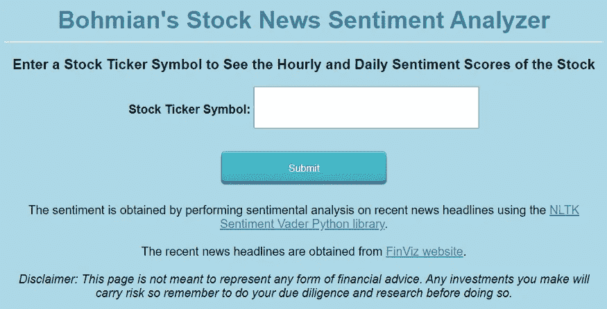

# 基于 Python 的金融新闻股票情感分析

> 原文：<https://medium.datadriveninvestor.com/sentiment-analysis-of-stocks-from-financial-news-using-python-82ebdcefb638?source=collection_archive---------0----------------------->

## 使用 Python 从 FinViz 网站的财经新闻标题中提取股票情绪


Photo by [Markus Spiske](https://unsplash.com/@markusspiske?utm_source=medium&utm_medium=referral) on [Unsplash](https://unsplash.com?utm_source=medium&utm_medium=referral)

FinViz 绝对是我最喜欢的获取股市信息的网站之一。从基本比率、技术指标到**新闻标题**和内部培训数据，它是一个完美的股票筛选工具。此外，它还更新了每个部门、行业和任何主要股票指数的表现信息。

[](https://finviz.com/) [## FINVIZ.com 股票筛选员

### 股票行情自动收录器最后变化量信号股票行情自动收录器最后变化量信号日期时间发布对实际预期先前…

finviz.com](https://finviz.com/) 

下面给出了来自 [FinViz 网站](https://finviz.com/quote.ashx?t=amzn)的亚马逊(股票代码为‘AMZN’)新闻标题部分的一个例子。请随意访问它，并向下滚动到这一部分来亲自查看它！这一部分是实时更新的，针对每一只股票。



News Section in FinViz page for ‘AMZN’ stock ticker

> 我们可以使用 Python 解析该网站数据，并在一段时间内对每个标题进行平均之前，对每个标题进行情绪分析(即分配一个情绪得分)，而不必遍历您感兴趣的每只股票的每个标题。

这个想法是，平均值可能会为某一天(或者一周，如果你决定对一周的新闻进行平均)股票的总体情绪提供有价值的信息。让解析网站变得更容易的是，你只需在这个 url 的末尾添加股票代码'[*【https://finviz.com/quote.ashx?t=*](https://finviz.com/quote.ashx?t=)'来解析它(见上图中的 url)。让我们开始吧！

*更新:*作为更新，我已经写了[另一篇文章](/build-a-stock-sentiment-web-app-with-flask-and-deploy-it-online-3930e58a236c)，介绍如何应用本文中的所有内容在 Flask 上构建一个[股票情绪仪表板 Web 应用程序，并将其部署到网上。读完这篇文章后，你可以随意查看。](/build-a-stock-sentiment-web-app-with-flask-and-deploy-it-online-3930e58a236c)

# 1.导入库

首先，我们导入存储数据所需的库。 [BeautifulSoup](https://www.crummy.com/software/BeautifulSoup/bs4/doc/) 需要**解析来自** [**FinViz**](https://finviz.com/) 的数据，而’[requests](https://pypi.org/project/requests/)需要获取数据。 [Pandas](https://pandas.pydata.org/) 用于**存储数据帧**中的数据，而 [Matplotlib](https://matplotlib.org/) 用于**在图表**上绘制情感。最后，使用' [nltk .情操. vader](https://www.nltk.org/_modules/nltk/sentiment/vader.html) '库**对新闻标题进行情感分析**！

```
# Import libraries
from urllib.request import urlopen, Request
from bs4 import BeautifulSoup
import os
import pandas as pd
import matplotlib.pyplot as plt
%matplotlib inline
# NLTK VADER for sentiment analysis
import nltk
nltk.downloader.download('vader_lexicon')
from nltk.sentiment.vader import SentimentIntensityAnalyzer
```

# 2.存储日期、时间和新闻标题数据

让我们仔细看看亚马逊(Amazon)的新闻标题及其相应的 html 代码。你也可以访问 FinViz 页面并在浏览器中查看 html 代码。



News headlines for Amazon in FinViz (corresponding html code is below)



Html code for the news section for Amazon in FinViz

从上面的代码中可以注意到，所有的新闻都存储在一个带有***id = " news-table "***的表中。我包含了表中的两行数据，以*<tr></tr>*标记为界。其中一行的代码被装箱。注意框中第一个*<TD></TD>*标签之间的**日期和时间数据**，以及*<a></a>*标签中的**新闻标题文字**。我们将提取每一行的日期、时间和新闻标题，并对新闻标题进行情感分析。

下面的代码显示,**将 FinViz 网站上的整个“*新闻表*”**存储到一个 Python 字典 *news_tables* 中，这些股票是亚马逊(Amazon)、特斯拉(Tesla)、谷歌(Google)(或者更确切地说是 Alphabet，谷歌的母公司)。您可以在*ticker*列表中包含任意数量的 ticker。

```
finwiz_url = '[https://finviz.com/quote.ashx?t='](https://finviz.com/quote.ashx?t=')news_tables = {}
tickers = ['AMZN', 'TSLA', 'GOOG']for ticker in tickers:
    url = finwiz_url + ticker
    req = Request(url=url,headers={'User-Agent': 'Mozilla/5.0 (Windows NT 6.1; WOW64; rv:20.0) Gecko/20100101 Firefox/20.0'}) 
    response = urlopen(req)    
    # Read the contents of the file into 'html'
    html = BeautifulSoup(response)
    # Find 'news-table' in the Soup and load it into 'news_table'
    news_table = html.find(id='news-table')
    # Add the table to our dictionary
    news_tables[ticker] = news_table
```

# 3.打印存储在 news_tables 中的数据(可选)

大致了解一下“AMZN”在 *news_tables* 字典中存储了什么。随意运行下面的代码，它遍历每个*<></tr>*标签(针对前 4 行)以获取*<></a>*标签之间的标题以及*<【TD></TD>*标签之间的日期和时间，然后打印出来。这一步是可选的，是为了自己学习。

```
# Read one single day of headlines for ‘AMZN’ 
amzn = news_tables[‘AMZN’]
# Get all the table rows tagged in HTML with <tr> into ‘amzn_tr’
amzn_tr = amzn.findAll(‘tr’)for i, table_row in enumerate(amzn_tr):
 # Read the text of the element ‘a’ into ‘link_text’
 a_text = table_row.a.text
 # Read the text of the element ‘td’ into ‘data_text’
 td_text = table_row.td.text
 # Print the contents of ‘link_text’ and ‘data_text’ 
 print(a_text)
 print(td_text)
 # Exit after printing 4 rows of data
 if i == 3:
 break
```

您应该会看到下面这样的内容(当然还有更多更新的标题)。



# 4.将日期、时间和新闻标题解析成一个 Python 列表

下面的代码与上面的类似，但是这次它**将日期、时间和标题解析到一个名为 *parsed_news* 的 Python 列表**中，而不是打印出来。if，else 循环是必要的，因为如果你看上面的新闻标题，只有每天的第一条新闻有“日期”标签，其余的新闻只有“时间”标签，所以我们必须考虑这一点。

```
parsed_news = []# Iterate through the news
for file_name, news_table in news_tables.items():
    # Iterate through all tr tags in 'news_table'
    for x in news_table.findAll('tr'):
        # read the text from each tr tag into text
        # get text from a only
        text = x.a.get_text() 
        # splite text in the td tag into a list 
        date_scrape = x.td.text.split()
        # if the length of 'date_scrape' is 1, load 'time' as the only elementif len(date_scrape) == 1:
            time = date_scrape[0]

        # else load 'date' as the 1st element and 'time' as the second    
        else:
            date = date_scrape[0]
            time = date_scrape[1]
        # Extract the ticker from the file name, get the string up to the 1st '_'  
        ticker = file_name.split('_')[0]

        # Append ticker, date, time and headline as a list to the 'parsed_news' list
        parsed_news.append([ticker, date, time, text])

parsed_news[:5] # print first 5 rows of news
```

上面代码中的一部分如下所示。请注意，它实际上是一个列表的列表，每个列表包含股票代码、日期、时间和相应的新闻标题。



# 5.用维达进行情绪分析！

现在是时候用 *nltk .情操.维德*进行情感分析了，终于！我们将股票、日期、时间、标题存储在熊猫数据帧中，**对标题进行情感分析**，然后在数据帧中添加一个额外的列来存储每个标题的情感得分。

```
# Instantiate the sentiment intensity analyzer
vader = SentimentIntensityAnalyzer()# Set column names
columns = ['ticker', 'date', 'time', 'headline']# Convert the parsed_news list into a DataFrame called 'parsed_and_scored_news'
parsed_and_scored_news = pd.DataFrame(parsed_news, columns=columns)# Iterate through the headlines and get the polarity scores using vader
scores = parsed_and_scored_news['headline'].apply(vader.polarity_scores).tolist()# Convert the 'scores' list of dicts into a DataFrame
scores_df = pd.DataFrame(scores)# Join the DataFrames of the news and the list of dicts
parsed_and_scored_news = parsed_and_scored_news.join(scores_df, rsuffix='_right')# Convert the date column from string to datetime
parsed_and_scored_news['date'] = pd.to_datetime(parsed_and_scored_news.date).dt.dateparsed_and_scored_news.head()
```

上面代码中数据帧的前 5 行应该是这样的。“*复合*”列给出了情感得分。对于**正**分数，**的**值越高，情绪越**正**。同样地，对于负分数来说，**越负**的值，情绪就越负**的值。分数范围从-1 到 1。**



DataFrame of the above code

请随意参考这篇文章，以获得更多关于 nltk .情操. vader 库的信息和更多关于情感分析的信息。

[](https://programminghistorian.org/en/lessons/sentiment-analysis) [## 探索性数据分析的情感分析

### 本课使用情感分析作为大型文本语料库的探索性数据分析的基础。这是…

programminghistorian.org](https://programminghistorian.org/en/lessons/sentiment-analysis) 

# 6.绘制每天情绪得分的条形图

下面的代码取每个日期的**期间收集的所有新闻标题的情感得分**的**平均值，并**将其绘制在条形图**上。你也可以平均每一周的分数，以获得一周的整体情绪。**

```
plt.rcParams['figure.figsize'] = [10, 6]# Group by date and ticker columns from scored_news and calculate the mean
mean_scores = parsed_and_scored_news.groupby(['ticker','date']).mean()# Unstack the column ticker
mean_scores = mean_scores.unstack()# Get the cross-section of compound in the 'columns' axis
mean_scores = mean_scores.xs('compound', axis="columns").transpose()# Plot a bar chart with pandas
mean_scores.plot(kind = 'bar')
plt.grid()
```

上面的代码产生了下面的图表。请注意，在没有任何特定股票新闻标题的日子里，不会有情绪得分。



Bar chart showing sentiments for AMZN, GOOG, and TSLA for each date

我希望你觉得这是有用的。所有代码都可以在我的 GitHub 库的这个 Python 笔记本中找到。当然，现在由您来决定如何处理获得的情感分数！你愿意的话可以试试用它做机器学习！

# 更新:后续项目！

如果你喜欢这篇文章，你可能也希望阅读我的其他文章对我的后续股票情绪项目。

首先，我为本文中的[股票投资组合构建了一个股票情绪热图仪表板。](/build-an-interactive-stock-sentiment-heatmap-for-your-portfolio-a467c45e37a2)

[](/build-an-interactive-stock-sentiment-heatmap-for-your-portfolio-a467c45e37a2) [## 为你的投资组合建立一个互动的股票情绪热图

### 它还显示了你的投资组合配置的部门和行业一目了然

medium.datadriveninvestor.com](/build-an-interactive-stock-sentiment-heatmap-for-your-portfolio-a467c45e37a2) 

我还应用这里的一切在 Flask 上构建了一个[股票情绪仪表板 Web 应用程序，并将其部署到网上。](/build-a-stock-sentiment-web-app-with-flask-and-deploy-it-online-3930e58a236c)

[](/build-a-stock-sentiment-web-app-with-flask-and-deploy-it-online-3930e58a236c) [## 用 Flask 构建一个股票情绪 Web 应用程序，并在线部署

### 提取金融新闻标题上的股票情绪，在 Flask web 应用程序中绘制每小时/每天的情绪，并部署它…

medium.datadriveninvestor.com](/build-a-stock-sentiment-web-app-with-flask-and-deploy-it-online-3930e58a236c) 

你也可以看看我的其他文章！

[](/easily-optimize-a-stock-portfolio-using-pyportfolioopt-in-python-80492b83912a) [## 使用 Python 中的 PyPortfolioOpt 轻松优化股票投资组合

### 如何获取股票数据，分析数据并使用 PyPortfolioOpt 优化投资组合以获得最大夏普比率

medium.datadriveninvestor.com](/easily-optimize-a-stock-portfolio-using-pyportfolioopt-in-python-80492b83912a) [](https://medium.com/@bohmian/get-up-to-date-financial-ratios-p-e-p-b-and-more-of-stocks-using-python-4b53dd82908f) [## 使用 Python 获得股票的最新财务比率(市盈率、市净率等)

### 大多数 API 给出过时的年度/季度财务比率。下面是一个从 FinViz 获取实时数据的指南。

medium.com](https://medium.com/@bohmian/get-up-to-date-financial-ratios-p-e-p-b-and-more-of-stocks-using-python-4b53dd82908f) [](/use-python-to-value-a-stock-automatically-3b520422ab6) [## 使用 Python 对股票进行自动估值

### 苹果股票是否被高估？只需输入 Ticker，让 Python 自动决定！

medium.datadriveninvestor.com](/use-python-to-value-a-stock-automatically-3b520422ab6) 

欢迎加入 Medium 成为会员，阅读更多来自任何作家的类似故事！

[](https://medium.com/@bohmian/membership) [## 通过我的推荐链接加入 Medium-Bohmian

### 作为一个媒体会员，你的会员费的一部分会给你阅读的作家，你可以完全接触到每一个故事…

medium.com](https://medium.com/@bohmian/membership) 

在 [**数据科学/ AI / ML / DL**](https://app.ddichat.com/category/data-science-ai-ml-dl) **:** 中安排 DDIChat 会话

[](https://app.ddichat.com/category/data-science-ai-ml-dl) [## 专家-数据科学/ AI / ML / DL - DDIChat

### DDIChat 允许个人和企业直接与主题专家交流。它使咨询变得快速…

app.ddichat.com](https://app.ddichat.com/category/data-science-ai-ml-dl) 

在此申请成为 DDIChat 专家[。
与 DDI 合作:](https://app.ddichat.com/expertsignup)[https://datadriveninvestor.com/collaborate](https://datadriveninvestor.com/collaborate)在此订阅 DDIntel [。](https://ddintel.datadriveninvestor.com/)