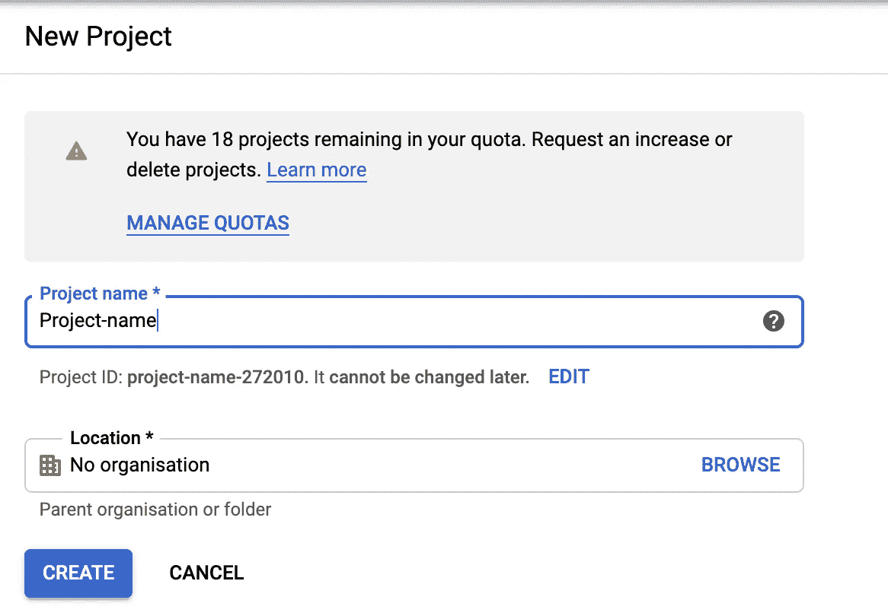

# 使用谷歌云自然语言 API 的情感分析

> 原文：<https://medium.datadriveninvestor.com/sentiment-analysis-using-google-cloud-natural-language-api-aedec981d1ea?source=collection_archive---------7----------------------->

*数据丰富但真正的价值在* ***分析*** *。*

在本教程中，我们将学习如何使用谷歌云自然语言 API 分析情感。这里，基于[官方文件](https://cloud.google.com/natural-language/docs/quickstart-client-libraries)讨论了情感分析应遵循的基本程序。

# **建立谷歌云平台控制台项目**

通过您的 Google 帐户登录到您的 Google 云平台控制台，并创建一个新项目。

创建项目后，转到“APIs &服务”选项，在仪表板上单击“启用 API 和服务”

启用云自然语言应用编程接口，然后你就可以进行计费了。

# 创建凭据

要创建 API 密钥，我们必须在 APIs & Services 中选择凭证选项。在创建凭据选项中，单击 API 密钥。将生成 API 密钥。下载 JSON 格式的凭证并保存在您的工作目录中。

# 设置环境变量

环境变量用于验证调用 API 的人的身份。这里我们使用 GOOGLE_APPLICATION_CREDENTIALS 作为环境变量，它被设置为包含凭证的 JSON 文件的路径。

对于 node.js 项目，执行以下步骤

创建一个. env 文件，并将您的凭证文件路径设置为 GOOGLE_APPLICATION_CREDENTIALS

要求 dotenv 模块进入项目

const dotenv = require('dotenv ')。config()；

检查您是否使用直接配置 dotenv

控制台. log(process . env . Google _ APPLICATION _ CREDENTIALS)；

# 调用自然语言 API 来执行情感分析

现在你可以通过 npm 安装@google-cloud/language library，通过导入上面的库来做情感分析。

如果你不想使用. env 文件，我在这里写了另一个方法来执行这个任务。

这里我们避免创造。环境文件。当创建客户机时，我们给出一个 object 参数，它包括作为键的 projectID 和 keyFilename。我们应该分别给出 projectID 值和凭证文件的路径。

这是一个关于如何使用谷歌云自然语言 API 进行情感分析的简要说明。在我以后的教程中，将讨论其他基于 NLP 的内容。