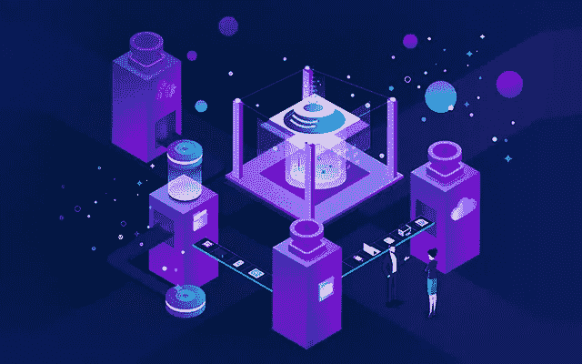
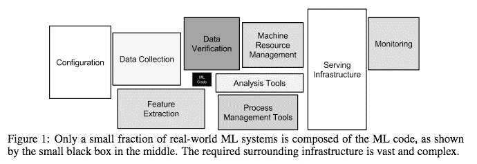
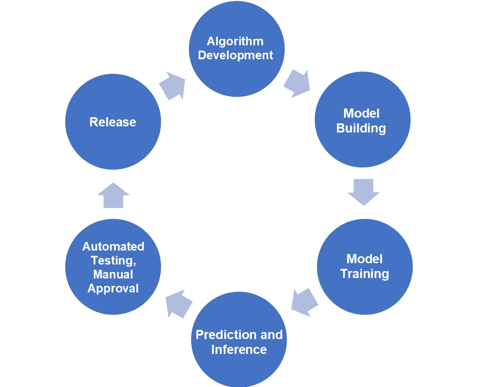
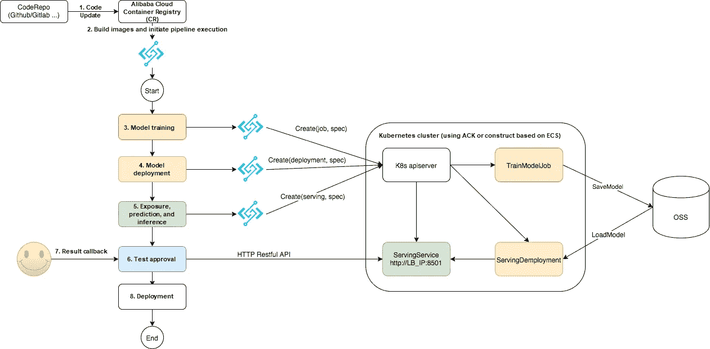
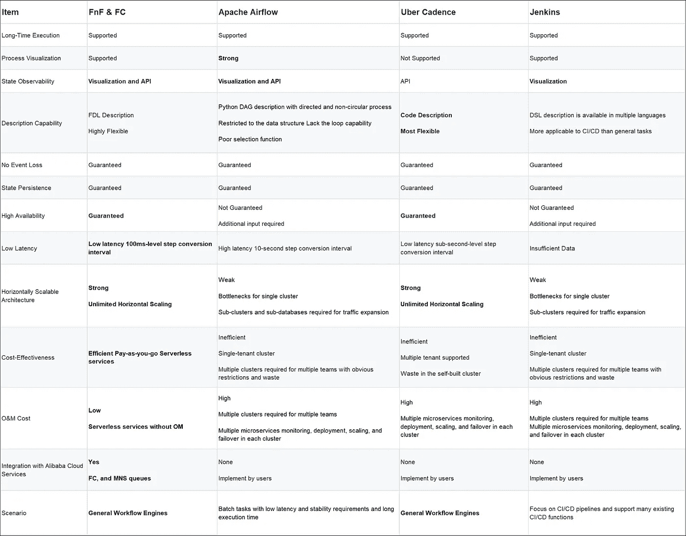
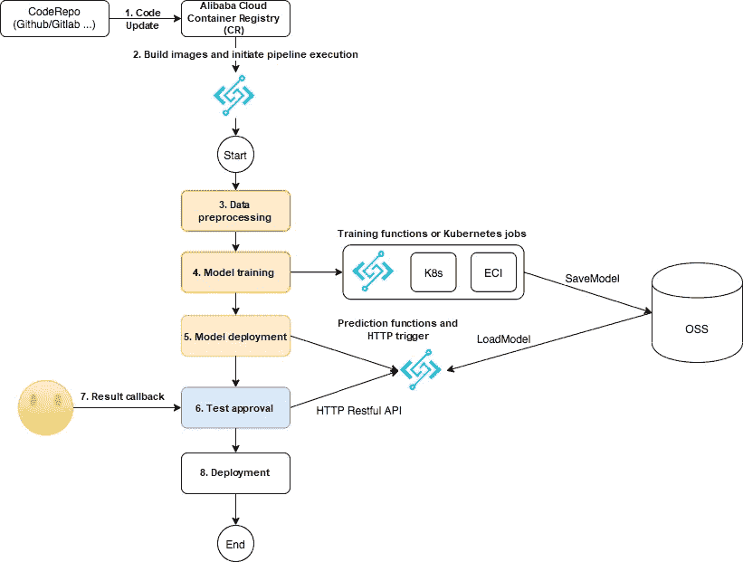

# 生产中的无服务器机器学习管道

> 原文：<https://medium.datadriveninvestor.com/serverless-machine-learning-pipeline-in-production-d3cebf893811?source=collection_archive---------18----------------------->

本文将介绍以下内容和技术要点:

1.  生产环境中 ML 管道要求的定义
2.  基于阿里云的[无服务器 ML 管道解决方案 GitHub](https://github.com/awesome-fnf/machine-learning-pipeline)[无服务器工作流(FnF)](https://www.alibabacloud.com/product/serverless-workflow) 和[函数计算(FC)](https://www.alibabacloud.com/product/function-compute)
3.  GitHub 为 Kubernetes (ACK) 提供的 FC 与[阿里云容器服务的组合指导。还介绍了任务触发、预测和推理服务部署以及公开服务。](https://www.alibabacloud.com/product/kubernetes)
4.  本解决方案与类似解决方案的分析和比较。无服务器 ML 管道可以提高 R&D 效率，降低 O&M 成本，帮助 ML 更快地产生价值。
5.  浅谈物流基础设施的选择。FC 可以补充 Kubernetes 集群。

# 前言

随着机器/深度学习的商业价值上升，ML 的软件技术也在每天发生变化。训练、模型、算法、预测、推理等概念以及 Spark MLlib 和 Tensorflow 等软件框架经常被引用。Jupyter 笔记本可以在本地机器上调用 Tensorflow 来训练数万张图像。经过连续的参数调整，输出的模型推断/预测结果是准确的。在 NIPS 上发表的论文中有一个图，题为， [*机器学习系统中隐藏的技术债务*](https://papers.nips.cc/paper/5656-hidden-technical-debt-in-machine-learning-systems.pdf) ，非常准确地说明了一件事。在产生商业价值的过程中，**对于机器学习的外围设置的开发，MLOps 的工作量远大于机器学习的核心开发。**生产环境中的 MLOps 因业务场景而异。此外，它涉及许多模块，无法在一篇文章中解释。本文将关注其中一个模块，**机器学习管道**。本文将介绍如何使用阿里云无服务器服务来提高 R & D 和 O & M 的效率，并自动将算法转换为训练好的模型。这样做，在生产环境中通过预测/推断，经过测试和批准后，有望最终产生商业价值。

**注:**这一数字来自[机器学习系统中隐藏的技术债务](https://papers.nips.cc/paper/5656-hidden-technical-debt-in-machine-learning-systems.pdf)

# 场景抽象和问题定义

如下图所示，将复杂的 MLOps 抽象简化为一个封闭的反馈回路，包括算法开发、模型构建、培训、服务、测试和审批、发布。

虽然逻辑清晰简单，但在生产环境中使用之前，管道系统必须满足以下要求:

*   **支持长时间执行:**模型训练时间根据数据量和算法执行时间从几分钟到几小时(有时更长)不等。
*   **流程可视化**:ML/data scientist 的工程师使用的技术栈与 DevOps 的工程师使用的不同。逻辑描述需要通过可视化从实现细节中分离出来。
*   **状态可观察性:**ML/数据科学家和 DevOps 工程师需要在流水线的不同步骤进行沟通、协调、合作，观察流程的进展。
*   **丰富的描述能力:**与 CI/CD 管道相比，ML 管道具有更加灵活和复杂的业务逻辑。例如，需要结果来确定是进入下一步还是返回到上一步。
*   **无事件丢失:**在各种机器崩溃或流程异常的情况下，可以再次接收和处理管道事件，如代码推送、构建、启动和部署结束时间。
*   **步骤重测:**流水线的所有任务都可能遇到随机故障。对步骤进行重新测试可以提高整个过程的成功率。
*   **状态持久化:**在机器崩溃或进程异常的情况下，流水线重执行可以从最近一次成功的步骤继续执行，无需重启。
*   **高可用性、低延迟、可扩展性:**不再赘述
*   **成本效益:**与计算资源相比，流水线编排在总成本中所占比例较低。
*   **M 成本低:**与计算资源相比，流水线编排在总成本中所占的比例很低。

*   技能堆栈要求根据不同的团队而有所不同。注:这是来自[机器学习模型部署:策略到实现](https://www.slideshare.net/Hadoop_Summit/machine-learning-model-deployment-strategy-to-implementation)的图。*

管道的概念和上面的要求并不新颖。一些开源解决方案也得到广泛应用，如 CI/CD 系统常用的 Jenkins、workflow engine Airflow、优步 Cadence 等。然而，阿里云平台上并没有流行的 ML 管道解决方案。本文介绍了一种将阿里云无服务器云服务与 ACK 相结合的解决方案。

# 解决办法

本文假设 [ACK 集群](https://www.alibabacloud.com/product/kubernetes)或基于[弹性计算服务](https://www.alibabacloud.com/product/ecs) (ECS)自建的 Kubernetes 集群用于训练和预测/推理。[时尚 MNIST 数据集](https://github.com/zalandoresearch/fashion-mnist)用于训练。预测服务接受图像并产生相应的预测结果，如衣服、帽子和鞋子。训练和服务有不同的码头工人形象。 [FnF](https://www.alibabacloud.com/product/serverless-workflow) 和 [FC](https://www.alibabacloud.com/products/function-compute) 用于流水线编排。FC 和 FnF 都是无服务器云服务。它们是完全托管的，无需维护，并根据使用情况收费。它们也可以无限扩展。管道逻辑图如下:

1.  [阿里云容器注册中心(ACR)](https://www.alibabacloud.com/help/doc-detail/60997.htm) 的镜像构建由算法、参数调整或其他代码修改触发。
2.  [FC HTTP 触发器](https://www.alibabacloud.com/help/doc-detail/71229.htm)由镜像成功构建后配置的 webhook 触发，函数实现函数工作流流程的执行。
3.  FnF 调用 FC 函数向用户 VPC 的 Kubernetes apiserver 发送一个创建作业的请求。apiserver 配置是通过 ACR 的 DescribeClusterUserKubeconfig 接口获得的。模型训练完成后，模型文件上传至 OSS。
4.  FnF 调用 FC 函数向 Kubernetes apiserver 发送创建部署的请求。Kubernetes 使容器能够从 OSS 下载模型，并监视本地端口 8501 以接收预测和推理请求。不能从外部访问服务。
5.  FnF 调用 FC 函数向 Kubernetes apiserver 发送请求，以创建服务并指定服务规范类型 LoadBalancer。Kubernetes 根据规范创建一个可以从公共网络访问的 SLB，然后生成一个 Internet IP 来接受 HTTP 请求。
6.  FnF 调用 FC 向提供服务的服务发送 HTTP Restful API 调用，以确定模型的预测精度。测试完成后，将启动手动批准。
7.  如果通过了手动批准，解决方案将继续在生产环境中部署模型，如步骤 3、4 和 5 所示。

# 解决方案部署

1.  根据[GitHub awesome-fnf/machine-learning-pipeline](https://github.com/awesome-fnf/machine-learning-pipeline)项目的自述说明完成部署。
2.  从[功能工作流程控制台](https://fnf.console.aliyun.com/fnf/cn-hangzhou/flows/item/fnfDemoMLPipelineFlow)执行流程。请参阅 Github README.md 中的“输入”点击下面关于管道效应的讲解视频:【https://yunqivedio.alicdn.com/od/ahh8E1578982933372.mp4

# 溶液分析

如前所述，FC 和 FnF 用于协调 ML 管道。FC 和 FnF 与现有开源工作流引擎相比有什么优势？答案在于 ML 管道所需的能力。下表是对“问题定义”部分中列出的功能的比较分析:

与开源工作流/管道解决方案相比，FnF 和 FC 解决方案满足了上述生产环境中 ML 管道的更多要求。它还具有以下突出特点:

*   高可用性、低延迟和无限制的水平可扩展性
*   **与阿里云服务的原生集成:** FnF 是第一款专注于工作流的阿里云产品。它通过与服务(如 FC 和 MNS)的原生集成，涵盖了几乎所有阿里云产品的编排服务。凭借其灵活的 FDL 描述，它满足各种简单和复杂的工作流场景。
*   **成本效益:**没有未使用的管道服务集群，这意味着最高的资源利用率。
*   成本低:全托管，无成本，研发和交付效率最高。机器学习模型训练和其他计算资源相对更多，比如 Kubernetes 集群和 GPU 实例。&米阿的压力比较大。ML 流水线系统通过无服务器服务与主要计算资源分离。这不仅简化了 Kubernetes 集群的部署，还为管道系统节省了 O & M。因此，可以将更多的时间用于模型训练和算法优化。
*   **灵活描述和过程可视化的结合:**上面描述的 ML 流水线是以一种过于简化的方式实现的。真实场景中的流程逻辑更加复杂。例如，如果某个步骤失败，系统需要自动回滚到前一个步骤。与 DAG 相比，FnF FDL 描述更加灵活，可以适应更复杂的流水线场景。内置的可视化功能降低了流程开发的难度，增强了操作过程中的可观察性。

# 场景扩展

在本文提到的解决方案中，训练和预测阶段是通过 Kubernetes 上的作业和部署实现的。Kubernetes 集群包含的资源相对较多，但普遍存在利用率低的问题。FnF 和 FC 解决方案的优势之一是其极高的灵活性，如下节所示:

*   **FC 预测服务:**对于成本控制和资源利用率要求高的用户，可以使用 [FC HTTP 触发器](https://www.alibabacloud.com/help/doc-detail/71229.htm)来暴露预测服务。因此，可以减少 Kubernetes 集群节点的数量，并且可以提供无服务器预测服务。
*   **FC 模型训练:**如果模型训练速度快，不需要 GPU 资源，训练任务也可以由 FC 完成。这样就真正实现了无服务器 ML。
*   **FC 数据刷新和 ETL 预处理:**在大规模或 map-reduce 操作中需要刷新数据的场景下，FnF 和 FC 解决方案可以高效可靠地用于数据刷新和 ETL 预处理。
*   **异构计算资源:**对于 FnF 的训练步骤，[弹性容器实例(ECI)](https://www.alibabacloud.com/product/elastic-container-instance) 任务也可以由 FC 发起。训练步骤也可以提交到[阿里云机器学习平台进行 PAI](https://www.alibabacloud.com/product/machine-learning) 。

更多的功能预计将由开发人员开发。

# 参考

*   [机器学习系统中隐藏的技术债务](https://papers.nips.cc/paper/5656-hidden-technical-debt-in-machine-learning-systems.pdf)
*   [为什么不是气流？](https://medium.com/the-prefect-blog/why-not-airflow-4cfa423299c4)
*   [用 TensorFlow 服务训练和服务 TensorFlow 模型](https://www.tensorflow.org/tfx/tutorials/serving/rest_simple)
*   [机器学习模型部署:策略到实现](https://www.slideshare.net/Hadoop_Summit/machine-learning-model-deployment-strategy-to-implementation)
*   [无服务器工作流程介绍](https://www.alibabacloud.com/help/doc-detail/114020.htm)
*   [函数计算简介](https://www.alibabacloud.com/help/doc-detail/52895.htm)

# 原始来源:

 [## 生产中的无服务器机器学习管道

### 阿里云无服务器 2020 年 12 月 17 日 652 本次将介绍以下内容和技术要点…

www.alibabacloud.com](https://www.alibabacloud.com/blog/serverless-machine-learning-pipeline-in-production_597025)