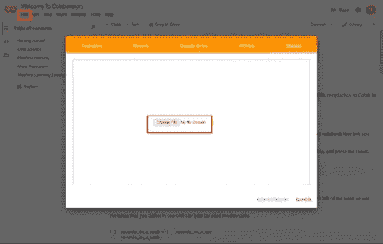
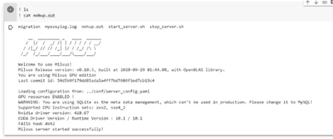

# 在 Google 联合实验室中设置 Milvus，以便轻松构建 ML 应用程序

> 原文：<https://medium.datadriveninvestor.com/set-up-milvus-in-google-colaboratory-for-easy-ml-application-building-536dc9b75301?source=collection_archive---------18----------------------->

## Google Colab 让开发和测试机器学习应用变得轻而易举。了解如何在 Colab 中设置 Milvus 以更好地管理大规模矢量数据


Photo by [Markus Spiske](https://unsplash.com/@markusspiske?utm_source=medium&utm_medium=referral) on [Unsplash](https://unsplash.com/?utm_source=medium&utm_medium=referral) | Google Colab logo

# 在 Google 联合实验室中设置 Milvus，以便轻松构建 ML 应用程序

技术进步不断让人工智能(AI)和机器规模的分析变得更容易获得和更容易使用。开源软件、公共数据集和其他免费工具的激增是推动这一趋势的主要力量。通过配对两个免费资源， [Milvus](https://milvus.io/) 和[谷歌合作实验室](https://colab.research.google.com/notebooks/intro.ipynb#scrollTo=5fCEDCU_qrC0)(简称“Colab”)，任何人都可以创建强大、灵活的人工智能和数据分析解决方案。本文提供了在 Colab 中设置 Milvus 的说明，以及使用 Python 软件开发工具包(SDK)执行基本操作的说明。

**跳转到:**

[在 Google Colaboratory 中设置 Milvus 以方便 ML 应用构建](#6a27)
[Milvus 是什么？](#8d4c)
[什么是 Google 协同实验室？](#63cf)
[在谷歌实验室中开始使用 Milvus](#929b)
[用 Python 在谷歌实验室中运行基本的 Milvus 操作](#11dc)
[Milvus 和谷歌实验室完美地结合在一起](#33f4)

# 什么是 Milvus？

[Milvus](https://milvus.io/) 是一个开源的向量相似性搜索引擎，可以与广泛采用的索引库集成，包括 Faiss、NMSLIB 和 airy。该平台还包括一套全面的直观 API。通过将 Milvus 与人工智能(AI)模型配对，可以构建各种各样的应用程序，包括:

*   图像、视频、音频和语义文本搜索引擎。
*   推荐系统和聊天机器人。
*   新药开发、基因筛选和其他生物医学应用。

# 什么是谷歌联合实验室？

[谷歌合作实验室](https://colab.research.google.com/notebooks/intro.ipynb#recent=true)是谷歌研究团队的产品，它允许任何人通过网络浏览器编写和运行 python 代码。Colab 的建立考虑到了机器学习和数据分析应用，提供了免费的 Jupyter 笔记本环境，与 Google Drive 同步，并允许用户访问强大的云计算资源(包括 GPU)。该平台支持许多流行的机器学习库，可以与 PyTorch、TensorFlow、Keras 和 OpenCV 集成。

# 在 Google 联合实验室中开始使用 Milvus

虽然 Milvus 推荐[使用 Docker](https://milvus.io/docs/v0.10.4/milvus_docker-cpu.md) 安装并启动服务，但是目前的 Google Colab 云环境并不支持 Docker 安装。此外，本教程的目标是尽可能地容易理解——并不是每个人都使用 Docker。通过[编译 Milvus 的源代码](https://github.com/milvus-io/milvus/blob/0.10.4/INSTALL.md)来安装启动系统，避免使用 Docker。

## 下载 Milvus 的源代码并在 Colab 中创建新的笔记本

Google Colab 预装了 Milvus 的所有支持软件，包括所需的编译工具 GCC、CMake 和 Git 以及驱动程序 CUDA 和 NVIDIA，简化了 Milvus 的安装和设置过程。首先，下载 Milvus 的源代码，并在 Google Colab 中创建一个新的笔记本:

1.  下载 Milvus 的源代码:Milvus_tutorial.ipynb。

```
Wget [https://raw.githubusercontent.com/milvus-io/bootcamp/0.10.0/getting_started/basics/milvus_tutorial/Milvus_tutorial.ipynb](https://raw.githubusercontent.com/milvus-io/bootcamp/0.10.0/getting_started/basics/milvus_tutorial/Milvus_tutorial.ipynb)
```

2.将 Milvus 的源代码上传到 [Google Colab](https://colab.research.google.com/notebooks/intro.ipynb#recent=true) 并创建一个新笔记本。



## 从源代码编译 Milvus

**下载 Milvus 源代码**

```
git clone -b 0.10.3 https://github.com/milvus-io/milvus.git
```

**安装依赖关系**

```
% cd /content/milvus/core ./ubuntu_build_deps.sh
./ubuntu_build_deps.sh
```

**构建 Milvus 源代码**

```
% cd /content/milvus/core
!ls
!./build.sh -t Release
# To build GPU version, add -g option, and switch the notebook settings with GPU
#((Edit -> Notebook settings -> select GPU))
# !./build.sh -t Release -g
```

> 注意:如果 GPU 版本编译正确，一个“GPU 资源启用！”出现通知。

## 启动 Milvus 服务器

**将库/目录添加到 LD_LIBRARY_PATH:**

```
% cd /content/milvus/core/milvus
! echo $LD_LIBRARY_PATH
import os
os.environ['LD_LIBRARY_PATH'] +=":/content/milvus/core/milvus/lib"
! echo $LD_LIBRARY_PATH
```

**在后台启动并运行 Milvus 服务器:**

```
% cd scripts
! ls
! nohup ./start_server.sh &
```

**显示 Milvus 服务器状态:**

```
! ls
! cat nohup.out
```

> 注意:如果 Milvus 服务器成功启动，将出现以下提示:



Milvus server started successfully!

# 使用 Python 在 Google Colab 中运行基本的 Milvus 操作

在 Google Colab 中成功上线后，Milvus 可以为 Python、Java、Go、Restful、C++提供多种 API 接口。下面是使用 Python 接口在 Colab 中执行基本 Milvus 操作的说明。

[](https://www.datadriveninvestor.com/2020/08/11/being-good-at-google-is-a-skill/) [## 擅长谷歌是一种技能|数据驱动的投资者

### 擅长‘谷歌’是一种技能。是的，你听到了。知道什么和如何谷歌或搜索的东西是一个…

www.datadriveninvestor.com](https://www.datadriveninvestor.com/2020/08/11/being-good-at-google-is-a-skill/) 

**安装 pymilvus:**

```
! pip install pymilvus==0.2.14
```

**连接服务器**:

```
# Connect to Milvus Server
milvus = Milvus(_HOST, _PORT)# Return the status of the Milvus server.
server_status = milvus.server_status(timeout=10)
```

**创建集合/分区/索引:**

```
# Information needed to create a collection
param={'collection_name':collection_name, 'dimension': _DIM, 'index_file_size': _INDEX_FILE_SIZE, 'metric_type': MetricType.L2}# Create a collection.
milvus.create_collection(param, timeout=10)# Create a partition for a collection.
milvus.create_partition(collection_name=collection_name, partition_tag=partition_tag, timeout=10)    
ivf_param = {'nlist': 16384}# Create index for a collection.
milvus.create_index(collection_name=collection_name, index_type=IndexType.IVF_FLAT, params=ivf_param)
```

**插入并冲洗:**

```
# Insert vectors to a collection.
milvus.insert(collection_name=collection_name, records=vectors, ids=ids)# Flush vector data in one collection or multiple collections to disk.
milvus.flush(collection_name_array=[collection_name], timeout=None)
```

**加载和搜索:**

```
# Load a collection for caching.
milvus.load_collection(collection_name=collection_name, timeout=None)# Search vectors in a collection.
search_param = { "nprobe": 16 }
milvus.search(collection_name=collection_name,query_records=[vectors[0]],partition_tags=None,top_k=10,params=search_param)
```

**获取收藏/索引信息:**

```
# Return information of a collection.    milvus.get_collection_info(collection_name=collection_name, timeout=10)# Show index information of a collection.    milvus.get_index_info(collection_name=collection_name, timeout=10)
```

**通过 ID 获取向量:**

```
# List the ids in segment
# you can get the segment_name list by get_collection_stats() function.
milvus.list_id_in_segment(collection_name =collection_name, segment_name='1600328539015368000', timeout=None)# Return raw vectors according to ids, and you can get the ids list by list_id_in_segment() function.
milvus.get_entity_by_id(collection_name=collection_name, ids=[0], timeout=None)
```

**获取/设置参数:**

```
# Get Milvus configurations.    milvus.get_config(parent_key='cache', child_key='cache_size')# Set Milvus configurations.    milvus.set_config(parent_key='cache', child_key='cache_size', value='5G')
```

**删除索引/向量/分区/集合:**

```
# Remove an index.    milvus.drop_index(collection_name=collection_name, timeout=None)# Delete vectors in a collection by vector ID.    
# id_array (list[int]) -- list of vector id    milvus.delete_entity_by_id(collection_name=collection_name, id_array=[0], timeout=None)# Delete a partition in a collection.    milvus.drop_partition(collection_name=collection_name, partition_tag=partition_tag, timeout=None)# Delete a collection by name.    milvus.drop_collection(collection_name=collection_name, timeout=10)
```

# Milvus 和 Google 合作实验室完美地合作在一起

Google Colaboratory 是一个免费且直观的云服务，它极大地简化了从源代码编译 Milvus 和运行基本 Python 操作。这两种资源可供任何人使用，使人工智能和机器学习技术更容易为每个人所用。有关 Milvus 的更多信息，请查看以下资源:

*   如需更多涵盖各种应用的教程，请访问 [Milvus Bootcamp](https://github.com/milvus-io/bootcamp) 。
*   对于对贡献或利用系统感兴趣的开发者，可以在 GitHub 上找到 [Milvus。](https://github.com/milvus-io/milvus)
*   更多关于推出 Milvus 的公司的信息，请访问 Zilliz.com。

## 访问专家视图— [订阅 DDI 英特尔](https://datadriveninvestor.com/ddi-intel)