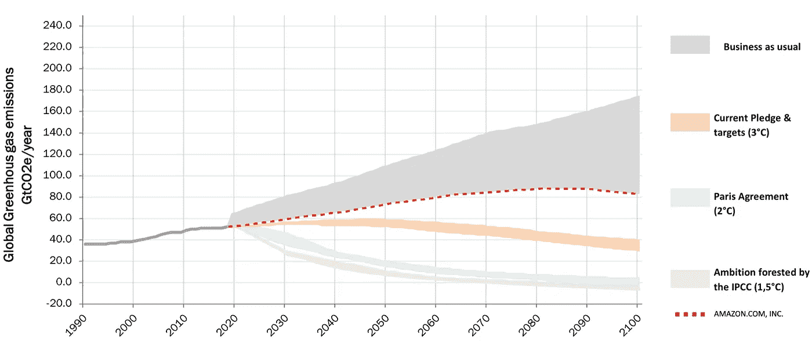
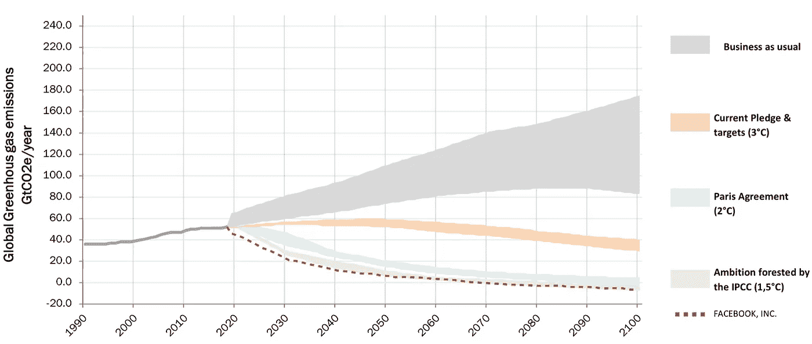

# 设定企业气候数据的标准——罗宾·罗格关于其前瞻性气候情景引擎的访谈

> 原文：<https://medium.datadriveninvestor.com/setting-the-standard-for-corporate-climate-data-an-interview-with-robin-rouger-b03d210aae62?source=collection_archive---------4----------------------->

金融行业对气候数据有异议。尽管我们在过去十年取得了很大进步，但在评估公司在气候方面的表现时，我们仍然依赖次优数据。他们是否如承诺的那样减少了排放？他们的努力是否符合巴黎协定中做出的气候承诺？

这很难讲，原因有很多。首先，数字是自报的。在报告与气候相关的数据时，我们仍然没有一个可信的第三方验证系统。

另一个问题是，我们需要考虑每家公司的背景，并不容易对不同国家和行业的公司进行相同规模的评分。例如，你可以争辩说，一个正在朝着更好的方向改变的石油巨头比一个生来“绿色”但现在躺在功劳簿上的公司更令人钦佩，有更大的净积极影响。

所以我们有一个数据问题。或者更准确地说:我们的 ESG 数据有问题。

根据你的衡量方式，公司的得分有时会非常不同。更令人担忧的是，正如我最近在时事通讯中所写的那样，你可能会认为 ESG 数据没有捕捉到真实世界的影响。

幸运的是，事情正在进展。我感到很幸运能和像罗宾·罗格这样在这个领域崭露头角的人一起工作。

自从一年多前开始与我们合作以来，他一直在尝试开发一种新的模型来对公司进行评分，并估计它们与巴黎协定相关的气候情景路径。

每个月，他的模型——我们称之为“前瞻性气候情景引擎”——都在改进，现在已经到了一个我们可以说是树立行业标准的前沿作品的阶段。

这是一个巨大的成就，也是非常重要的工作。尤其是当你考虑到金融行业和资金的投资方式在解决气候危机中扮演着关键角色。缺乏良好的 ESG 数据是阻碍我们完成工作并为可持续未来铺平道路的首要因素。

罗宾工作的几个具体成果似乎是有序的。首先，这是**亚马逊**的气候轨迹，我也将它包含在[我对零售巨头](https://medium.com/@sasjabeslik/how-sustainable-is-amazon-an-esg-analysis-of-the-retail-giant-e8b07cc8a8eb)的 ESG 分析中。正如你所看到的，亚马逊正在 4 摄氏度的道路上，离它应该在的地方很远。

**Amazon’s climate trajectory.** Amazon is far away from where it should be.

其次，这是脸书的气候轨迹。这个我以前也分享过，在[我对脸书的 ESG 分析](https://medium.com/swlh/how-sustainable-is-facebook-an-esg-analysis-of-the-social-media-giant-8ad8adc3da23)。在气候方面，脸书正在做一项惊人的工作，该公司正在将气温控制在 1.5 摄氏度以下，并有望实现巴黎协议中设定的目标。

**Facebook’s climate trajectory.** Facebook is well on track to meet the targets set in the Paris Agreement.

我想更多地了解罗宾的工作，并与外界分享。所以，我坐下来采访了他。

这是那次采访的文字记录，为了清晰和篇幅，经过了编辑。

你好，罗宾。谢谢你同意接受这个小小的采访。首先，你能简单介绍一下你自己和你的工作吗？

罗宾·罗格:当然。我今年 30 岁，自 2019 年 8 月以来一直是 J. Safra Sarasin 可持续投资团队的一员。我负责为我们所有的可持续基金开发一个气候流程。

SB: 你开发了这个“前瞻性气候情景引擎”，我想我们可以称之为。与投资相关的现有气候数据有什么问题？

**RR:** 首先，让我们明确一点——不管人们怎么想——银行业正在经历转型，并且正在使用越来越多的非金融数据。我们看到投资者愿意为一个更可持续的世界做出贡献，并为他们的储蓄提供额外的空间，为了满足这一需求，金融机构正在使用越来越多的数据来做出投资决策。

气候数据与传统金融数据的区别在于，气候数据是基于未来的考虑，而不是报告的观测值。它们基于关键的假设，而这些假设本身又基于科学假设。

大多数气候数据取决于科学研究的进展，因此可能不稳定。这是一个正在发展的领域，他们还没有令人信服地整合 3 分，目前仅限于公司层面，而不是国家层面。

对于气候轨迹计算，没有一个通用的框架，因此每个人都可以根据自己对该主题的理解建立自己的模型。

[最近的一项研究](https://accfcorpgov.org/wpcontent/uploads/2018/07/ACCF_RatingsESGReport.pdf)显示，主要数据提供商的 ESG 得分之间存在不一致。他们不一样。它提出了关于假设质量的重要问题。

与此同时，由欧盟分类学开发的新框架正在进行深入讨论。

欧盟分类法是一种工具，帮助投资者、公司、发行人和项目发起人引导向低碳、弹性和资源节约型经济的过渡。它可以用来识别有绿色收入的公司，并将提供一个通用的精确框架。

这个框架最有可能帮助投资者识别积极参与气候变化的公司。

不幸的是，没有数据提供商能够完全收集这些绿色收入。

**SB:** 为什么气候数据与投资相关？

每年，世界经济论坛都会发布一份全球风险报告。在那份报告中，在新冠肺炎之前，他们已经确定了“疫情”是极有可能的。但其后果也远不及能源转型的失败。

这充分说明了转变的程度。我们知道，如果我们不做任何改变，总有一天全球变暖会对我们的生态系统产生巨大影响。为了符合《巴黎协定》,我们已经消耗了很大一部分碳预算。

提出创新解决方案来应对温室气体增加的公司将受益于有趣的战略定位，应该会有越来越多的订单。欧盟的补贴已经到位，以帮助朝着这个方向发展的公司。

这就是投资者对气候数据真正感兴趣的地方。气候数据提供了一个重要的机会，来识别那些销售额将会增加的公司，因此肯定会有一个有趣的股市反弹。

同时，气候数据还允许我们限制某些风险，如有争议的活动、潜在的物理风险、碳监管风险等。在这些领域落后的公司将会看到成本增加，并受到投资者的惩罚。

**SB:** 你能描述一下你开发“前瞻性气候情景引擎”时的想法吗？

我们的想法是找到符合巴黎协议的公司。从本质上说，巴黎协定说，我们需要在 2050 年前将二氧化碳排放量限制在一定数量，以将全球变暖限制在 2 度以内。

因此，我们找到了所有的数据提供者，并听取了他们的方法，以便采用最令人信服、最清晰和最透明的方法。我们决定采用一种基于具体事实的方法，这种方法符合各国确定的 NDC(国家确定的贡献)目标。

对事物的前瞻性观点使每个公司都知道需要减少多少二氧化碳才能达到不同的气候情景。公司需要问自己:“我们是否符合气候目标？我们是问题的一部分还是解决方案的一部分？”

当然，一家在能源密集型行业运营的公司必须付出比医疗保健公司更大的努力。为了确定一家公司是否能够满足《巴黎协定》，我们要看管理层设定的承诺目标是否足够宏大。

除此之外，我们还想对抗洗绿现象。为了排除那些“绿色清洗”的公司，我们会查看每家公司过去的碳排放量，并分析它们是否符合设定的目标。

我们的想法是，由于气候变化不是新问题，一家真正希望与巴黎协定保持一致的公司应该已经采取了具体措施来提高其能源效率。行动胜于雄辩。

我们还增加了一个碳分数，反映了能源转型在公司决策中的重要性。

我们也关注那些提供服务和解决方案来帮助他人减少碳排放的公司。为此，我们遵循分类法的建议来定义绿色收入。

然而，我们有一个机制，允许我们分离绿色活动公司的收入。然后，我们可以找到与分类法的相似之处，并得出绿色收入的百分比。对于缺失的数据，我们逐个案例地进行处理，以分类法为指导，并将结果存储在数据库中。

当然，为了得出我们的最终结果，必须做出许多假设。

尽管如此，我们的工具使我们能够识别出两类公司，一类是目标明确的公司(与他们过去的表现一致，也是达到 2 摄氏度情景所必需的),另一类是专注于实施新的解决方案来限制温室气体排放的公司。

**SB:** 这个引擎对投资组合经理有什么作用？

**RR:** 对于传统的投资组合，可以使用它来计算与巴黎协议及其基准相比的定位。它允许投资组合经理进行套利，以提出符合巴黎协议的投资组合。

我们目前正在考虑在避免二氧化碳排放方面的影响，我们可以通过与传统指数进行比较来计算我们的投资。

我们还可以计算与我们的投资相关的物理和气候风险，并据此采取行动，同时根据气候机遇为自己定位。

对于专注于气候主题的投资组合，它允许投资组合经理符合该领域的标准。

**SB:** 你是如何制造这台发动机的？

正如我提到的，我们与许多气候数据提供商进行了对话。我们必须挑战他们，理解他们的假设，以便选择一个好的。

我们决定与 Carbon Delta 合作，因为他们在这一领域不断创新。我们认为他们的方法很有趣，因为它以科学界在二氧化碳预算方面的数据为起点，也以该国为实现巴黎协定目标而试图采取的措施为起点。

对于每家公司，根据其设施的位置和收入情况，它可以扣除一定比例的碳减排要求，以实现不同的温度情景。他们还有一个有趣的方法来评估整个公司在不同维度上的气候风险值。

然后，我们使用基于 Python、VBA 和 SQL 的定量算法来汇总所有气候数据，并构建我们的气候引擎。唯一的问题是，我们不知道如何确切地验证我们的结果。每个人都声称有一个坚实的过程，并评估一个良好的轨迹。

我唯一确定的是，我们已经考虑了所有可能的因素，以避免出错的可能性。当数据缺失或我们不得不做出假设时，我们总是使用谨慎的方法来避免绿洗。

SB: 你花了多长时间开发这款引擎？

**RR:** 嗯，这是个棘手的问题！我不知道花了多少时间，但是很多！我在 2019 年 8 月加入银行时就开始从事这项工作。2019 年 12 月，第一批切实的成果出现了。但是我们一直在努力，现在也是。当然，在所有这些方面，我们都与我们的数据提供商密切合作。

与此同时，我们还查看其他可用数据，如 SBT 数据或其他外部数据，这些数据可能有助于使我们的计算更加精确。由于我们是一家银行，我们当然也会考虑客户的需求，并将其融入我们的流程。

SB: 还缺少什么？

RR: 缺少的主要是一般聚合级别的数据。例如，我们可以在国家层面上准确量化气候轨迹。就像今天一样，我们把在那个国家经营的所有公司的数字加起来。

这个数字本身很有意思，也很能说明问题，但它不包括私营公司，只包括上市公司。数据工程师正在努力解决这个问题。这对固定收益/政府债券投资组合很有用。

按照分类法划分的收入也仍然缺失。当我们得到这个，这将是一个重大的变化，因为它将使我们能够在一个共同的基础上评估这些公司。公平的竞争环境。鉴于对该主题的兴趣，所有大数据提供商和初创公司目前也在致力于此。

另一个缺失是，国家数据中心没有被所有国家完全填满。即使覆盖面越来越大，一些公司仍然没有明确他们的碳目标。

最后，如果有一家值得信赖的碳排放审计公司就太好了。应该是独立的。我们将用它来验证这些公司展示的自我报告数据是否“干净”。

**SB:** 我们什么时候能有解决方案，涵盖公司造成的气候影响的所有方面？

**RR:** 嗯，我没有水晶球。但是，由于有很多人要求获得气候数据，压力越来越大，如果我不得不打赌，这也只是我个人的观点，我认为我们将在未来两年内获得适当的数据集。

但你永远不知道。在我们实现这一目标之前，我们将投入大量精力打造真正强大的产品。

**SB:** 是什么驱使你去做你现在做的事情？

我是想要有所作为的这一代人中的一员。你知道，不像大多数从事投资的人——无意冒犯——我肯定会在 2050 年仍然在这里，看看我们是否已经设法解决了气候方程。

我有幸能够尝试解决重大的社会问题，同时留在我热爱的领域。

我深信，金融在应对这一挑战方面有着重要的作用和责任，它将我们的资本重新导向那些为建设更清洁、更可持续的未来提供切实解决方案的公司。

我还相信，在一个受到重大健康危机影响的世界，气候问题将是一个增长动力。绿色协议是朝着这个方向迈出的一步，表明领导人有改变我们能源消费模式的真正愿望，我们明白全球变暖不仅仅是儿童的故事。

自今年初以来，责任基金和气候主题基金的资本流入出现爆炸式增长，表明客户正在寻找这种类型的工具。为了满足我们客户的需求，并使他们受益于我们在这一领域的专业知识，建立这种投资流程非常重要，这样他们就可以投资于全球变暖问题。