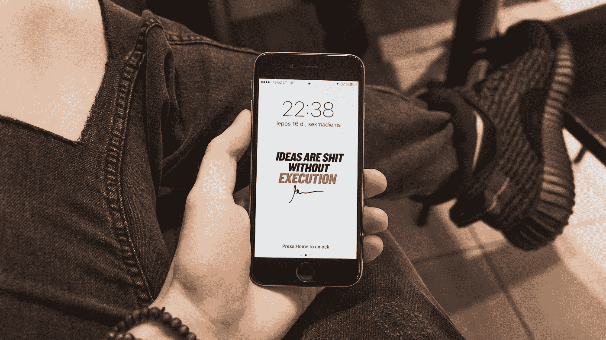

# 启发你的七个见解

> 原文：<https://medium.datadriveninvestor.com/seven-insights-to-inspire-you-787cd1a64e28?source=collection_archive---------14----------------------->

因为有时候你需要的只是一个火花(二手灵感项目)。

Photo by [cottonbro](https://www.pexels.com/@cottonbro?utm_content=attributionCopyText&utm_medium=referral&utm_source=pexels) from [Pexels](https://www.pexels.com/photo/colorful-sticky-notes-3831849/?utm_content=attributionCopyText&utm_medium=referral&utm_source=pexels)

二手灵感项目从一句激励性的引语开始，在创造性道路蜿蜒的任何地方冒险。

很多有冲击力的语录都是一句话粉桶，简洁地传递了一个爆炸性的信息。

人类倾向于简单。我们倾向于内化的指导是很小的，很容易消化的。普通人把所有冗长、费解的提法都留给了知识分子。

好的建议就像迈克·泰森的上钩拳一样——快速、紧凑、精准。这里有一些简短的见解，可能会帮助你在我们混乱的世界中找到清晰。

# “做自己，改变世界。”—艾米·波勒

你很少会后悔选择保持真实。

做自己很清爽。毕竟，其他人的身份都已经被盗用了，而*伪装直到你成功*充其量只是一个不冷不热的策略。模仿和海市蜃楼只能让你到此为止。

忠于你自己，跟随你内心的指南针。你可能不确定你前进的方向，但至少你会沿着你独特的道路跋涉。

# “努力成为某人云中的彩虹。”—玛娅·安杰洛

善良是免费的，然而人们往往对它很吝啬。

你不需要做太多就能成为某人的彩虹——这通常只需要很少的投资。一个真诚的微笑，花点时间积极倾听，或者帮助有小问题的人，都可以给社会注入它所缺乏的乐观主义。

真诚地关心他人，就像你希望他们关心你一样，你会对他们的生活和你的生活产生积极的影响。

# "快乐的灵魂是残酷世界的最佳盾牌."阿提克斯

考虑到过去几个月的疫情、抗议和分裂的政治，这句话很有说服力。

社会可能冷酷无情。但是我们不能让绝望、怀疑和失望淹没我们，侵蚀我们内心的美好。

当你与世界上的消极力量战斗时，用乐观的态度武装自己，你会惊讶地发现自己经常毫发无损。

Photo by [Jonas Svidras](https://www.pexels.com/@jonas-svidras?utm_content=attributionCopyText&utm_medium=referral&utm_source=pexels) from [Pexels](https://www.pexels.com/photo/adidas-apple-electronics-footwear-552961/?utm_content=attributionCopyText&utm_medium=referral&utm_source=pexels)

# "好事发生在努力的人身上。"—阿娜伊斯·宁

有时候你需要一个提醒，提醒自己当初为什么要开始追求自己的理想。

是什么驱使你早起，在上班前花一个小时忙碌？为什么你周末会在健身房锻炼到晚上 10 点？当你可以和朋友出去聚会、闲逛的时候，为什么还要写小说呢？

生活抛出了各种各样的诱惑和复杂因素，它们会把你从游戏中击倒。人们很容易听信消极的自我对话，让拖延让你的雄心停滞不前。

保持速度。拥抱奋斗。激烈地追逐你的梦想。这是值得的。

# "有些东西只触及表面，而有些却直击你的灵魂。"—吉安娜·卡里尼

一些事件几乎不会影响到你，而另一些会引发巨大的冲击。这完全取决于你的心态，以及你准备如何处理生活抛给你的曲线球。

小问题发生时不要惊慌失措。从经验中学习，并让它帮助你做好准备，当一个重大挑战试图打破你的内心时。

# "同时做两件事等于什么都不做。"— Publilius Syrus

许多自助书籍提供了如何有效完成多项任务的策略。但是同时做几件事通常是同时搞砸多件事的最好方法。

多任务处理的好处是有限的，除非你同时在几个方面努力达到中等水平。专注于一项任务并取得成就，然后将注意力转移到下一个挑战上。

# "在内心深处相信你注定要做大事。"—乔·帕特诺

我说的不是一般的或者可以接受的东西。不会吧。你注定要完成一些惊人的事情。

 [## 数据驱动始于数据素养|数据驱动的投资者

### 光是听到“数据”这个词就令人生畏。老实说，只有 21%的全球员工对自己的工作充满信心

www.datadriveninvestor.com](https://www.datadriveninvestor.com/2020/03/22/data-driven-starts-with-data-literacy/) 

培养自信，让自己知道自己注定会成为伟人，这比你从教科书或现实生活中学到的任何东西都更有效。对自己的信念至关重要；如果你没有，就不能指望别人有。

这七句名言证明你不需要一堆话来点燃你的导火索。一句话可能是引爆你生活中焦虑的真相炸弹。

阿德里安·s·波特是一名作家、工程师、顾问和演说家。他写诗歌、短篇小说和各种主题的文章，包括创造力和个人成长。他是诗集[和散文集](https://www.amazon.com/Everything-Wrong-Feels-Adrian-Potter/dp/109519061X/ref=sr_1_4?qid=1560264651&refinements=p_27%3AAdrian+S.+Potter&s=books&sr=1-4&text=Adrian+S.+Potter)[的作者。在](https://e2857002-6118-41be-9746-64261e36cacb.filesusr.com/ugd/21d2c2_03522f10c7c84340a05a8d03a97e1642.pdf)[http://adrianspotter.com/](http://adrianspotter.com/)在线拜访他。

# 附加文字

[你真了不起](https://medium.com/datadriveninvestor/you-are-amazing-274651127432?source=friends_link&sk=34312c5fa72f2109d6031c2a4b7c2e4c)

[没有污垢，就没有花朵](https://medium.com/@adrianpotter/without-dirt-there-can-be-no-flowers-581b1be16a71?source=friends_link&sk=37d7e1543e7be4bd52e239b10e1a3685)

[有三件事我希望我能早点意识到](https://medium.com/datadriveninvestor/three-things-i-wish-id-realized-sooner-e3b3513c8ce?source=friends_link&sk=067d7d116357d93689f044de3222a19d)

**访问专家视图—** [**订阅 DDI 英特尔**](https://datadriveninvestor.com/ddi-intel)