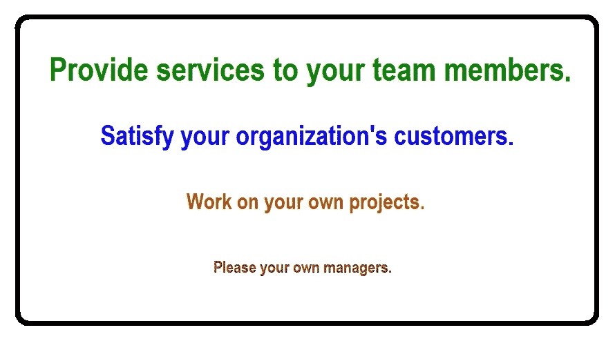

# 新经理的七个起点

> 原文：<https://medium.datadriveninvestor.com/seven-starting-points-for-the-new-manager-b19dd474f247?source=collection_archive---------3----------------------->

## 成为一名优秀的经理并不容易。这里有七个步骤，任何领域的新经理都可以通过这些步骤迅速提高工作效率。

Photo by [Karolina Grabowska](https://www.pexels.com/@karolina-grabowska) from Pexels.com

成为一名经理可能是你选择的职业道路，或者你可能不情愿地同意试一试。在这两种情况下，你可能都没有接受过什么项目和人员管理方面的教育。领导和管理(这不是一回事)不仅仅是简单地做与呆伯特的老板相反的事情。当我第一次成为一个小型软件团队的经理时，我必须考虑如何最好地扮演这个陌生的角色。

 [## 想知道领导是谁？请他决定。数据驱动的投资者

### 一个有效的领导者能为组织提供的最有价值的东西之一是决策能力…

www.datadriveninvestor.com](https://www.datadriveninvestor.com/2019/01/25/want-to-know-who-the-leader-is-ask-him-to-decide/) 

当你考虑你的新任务时，考虑以下早期行动来提高你自己和你的团队的效率。

# 第一步:设定你的优先事项

作为一名经理，首先要确定你的优先事项。继续从事技术工作很诱人，但你现在有了一套新的职责。我提出这个优先顺序:

高效的领导者知道他们的首要任务是为团队成员提供服务。这些服务包括辅导和指导、解决问题和冲突、提供资源、设定目标和优先事项、职业发展，以及在适当的时候提供技术指导。让你的团队成员明白，你随时都可以帮助他们。我认为自己是在为我管理的人工作，而不是相反。

你的第二要务是让你组织的客户满意。作为一名经理，你几乎没有能力直接满足客户，因为你不亲自提供必要的产品和服务。你是推动者，创造一个让你的团队成员最有效地满足客户需求的环境。

你的第三要务应该是做好自己的项目。这些可能是您自己的管理请求的技术项目或活动，例如战略规划活动。当这些任务与两个更高的优先级发生冲突时，要做好推迟它们的准备。

明确地试图取悦你自己的经理应该是你最优先考虑的事情。在一个和谐的组织中，如果你在三项更重要的活动中取得成功，你的经理应该会很高兴。专注于帮助你的团队成员尽可能地高效和快乐，而不是去满足那些在晋升阶梯上比你高的人。

# 第二步:分析你的技能差距

诚实地列出你在关键人物和项目技能方面的优势和不足，并开始缩小差距。你可能希望提高自己处理人际关系、解决冲突和说服他人的能力。你需要处理各种各样的情况，从招聘和解雇员工，到协商时间表，到绩效评估时有人在你的办公室里哭。

我发现通过参加一个倾听技巧班来开始我的管理生涯是很有价值的。个人贡献者经常可以在团队中积极地推动他们自己的技术议程。然而，有效的管理需要更具协作性和接受性的人际风格。我必须学会如何——以及何时——巧妙地引导我天生的自信。另一方面也是为了提高你的表达技巧。增强的沟通技巧对你未来的任何职位都有好处。

如果你是项目经理，你将协调其他人的工作，计划和跟踪项目，并在必要时采取纠正措施。接受一些项目管理方面的培训，并开始阅读相关的书籍和文章。了解如何为传统项目和敏捷项目选择合适的管理方法。

# 步骤 3:定义“质量”

为了帮助你的团队走向成功，与你的团队成员和你的客户一起工作，理解“质量”对他们意味着什么。这两个社区通常没有相同的定义，所以很容易产生矛盾。专注于进度的经理可能会对过早陷入详细设计的开发人员失去耐心。重视可靠性的客户不会喜欢有很多很少使用的功能以及很多缺陷的产品。

为了更好地了解我们的客户对软件质量的看法，我的软件团队曾经邀请我们内部的公司用户和他们的经理来讨论这个话题。这个论坛展示了我们小组对质量的想法与我们客户的认知不一致的地方。了解这些差异有助于我们将精力集中在最大的利益上。

我听说过的一个实用的质量定义是“顾客会回来，但产品不会。”与您的客户和开发人员一起为每个产品定义合适的质量目标。当我们团队努力发展软件质量文化时，我把实现这些目标作为一个明确的优先事项。一定要为自己的工作质量设定高标准。我采纳了这句格言:“追求完美；满足于优秀。”

# 第四步:从过去中学习

也许你的团队过去的一些项目并不完全成功。即使在成功的项目中，我们也能经常发现下次我们会做得不同的事情。当你开始新的领导角色时，花些时间去理解为什么早期的项目举步维艰。你没有时间自己去犯每一个可能的错误。从以前成功和失败的经验中学习，开始你自己的成功。

[进行项目回顾](https://medium.com/swlh/project-retrospectives-looking-back-to-look-ahead-f77ab9d4591c)以了解哪些进展顺利，哪些可以做得更好。你的目标不是推卸责任，而是在未来变得更有效率。在头脑风暴会议中领导团队或使用外部主持人在主要里程碑处以同样的方式分析每个当前项目。

确保每个人都非常熟悉软件行业或您工作的任何领域的既定最佳实践。您的团队成员可能会抵制新的工作方式，但您作为领导者的角色是确保团队始终如一地应用最佳的可用方法、流程和工具。

鼓励团队成员之间共享信息，这样本地最佳实践就可以成为每个团队成员工具箱的一部分。我对那些小心翼翼保护自己知识的人没有耐心。我们都站在同一边。让我们表现得像它一样。

# 第五步:认可进步

认可和奖励团队成员的成就是[保持他们积极性的重要方式](https://medium.com/swlh/motivate-your-team-with-recognition-and-rewards-dfcb139e0083)。认可的范围从象征性的(证书、旅游纪念品)到有形的(礼品卡、现金奖励、公司股票)。表达认可表示“感谢你所做的帮助”或“祝贺你达到那个里程碑。”在认可项目上投入少量的思想和金钱可以换来更多的善意和未来的合作。

与您的团队成员交谈，了解他们认为什么形式的认可有意义。让表彰大大小小成就的活动成为团队文化的标准组成部分。认可是向团队成员以及团队以外的其他人展示你注意到并欣赏他们的贡献的一种方式。

在为我的一个咨询客户讲授创建软件工程文化的课程时，我问 70 名与会者中有多少人在有认可项目的组织中工作。只有几个人举了手。在接下来的休息时间，一位女士走到我面前，小声说:“我在我们的人力资源部。他们*都*有一个认可程序。”我小声回答道:“没用。”

# 第六步。设定改进目标

一旦你对以前的项目进行了回顾，并且理解了“质量”对你的团队意味着什么，就设定一些短期和长期的改进团队目标。量化目标，这样你就可以选择简单的指标来显示你是否朝着目标前进。

这些目标和度量构成了您应该实施的软件过程改进计划的一部分。一些软件人流行鄙视“过程”,认为它是没有创造力的官僚们的最后避难所。然而，现实是每个团队都可以改进他们的工作。的确，如果你继续你一贯的工作方式，就不要指望取得比以前更好的结果。过程改进既能纠正当前的问题，又能预防未来的问题。

当我成为一个小型软件团队的经理时，我们举行了一个两阶段的头脑风暴练习，以确定提高我们软件生产率和质量的障碍。在第一部分，参与者在便利贴上写下他们的想法，每张纸条一个想法。在我们提出想法时，一名主持人收集并分组了这些想法。我们最终列出了十几个主要类别，并将其写在活动挂图上。

在第二次会议中，同样的参与者在便利贴上写下克服这些障碍的想法，并将其附在适当的活动挂图上。进一步的细化导致了一些具体的行动项目，我们可以在努力帮助我们所有人实现我们的软件质量和生产力目标的过程中开始处理这些项目。我们牢记，我们的目标是提高我们的技术和业务成果，而不是满足某些书籍或方法所支持的期望。

# 第七步:自省

当我第一次成为经理时，我兴奋地通知我在另一家公司的一个老朋友。“祝贺你，”他回答道。“你变傻了吗？”有时候，这似乎是晋升到管理职位的常见副作用，但这不是必要条件。作为一名新经理，考虑以下四个行动来帮助你站稳脚跟。

1.  找出项目管理、人员管理或团队领导的两个方面，你觉得你的技能没有达到标准。确定可以弥补这些技能差距并提高自身效率的方法。
2.  确定一位有经验的经理，他可能会成为你的导师。你会从导师那里得到什么样的指导？
3.  回想一下你曾经尊敬的经理。他们表现出的哪些特点或能力让你觉得特别有效？试着将这些相同的特征融入你自己的管理绩效中。
4.  想想你遇到过的那些你认为效率不高的经理。他们表现出的哪些行为或特点让你感到失望？在自己的表演中努力避免这些。

作为一名经理，你要负责的不仅仅是按时按预算完成项目。您还必须:

*   带领员工成为一个有凝聚力的团队，共同致力于质量；
*   培养团队协作的环境；
*   促进和奖励优秀软件实践的使用；和
*   平衡客户、公司、团队成员和你自己的需求。

这是个大工程。祝你好运！

= ============

本文改编自 [*实用项目启动:工具手册*](https://www.processimpact.com/pubs.html#projinit) 作者[卡尔·威格](https://www.karlwiegers.com) s .卡尔是[过程影响](https://www.processimpact.com)的首席顾问。他的最新著作是 [*软件开发珍珠:五十年软件经验的教训*](https://www.processimpact.com/karls_books/SDP/index.html) *。*卡尔是众多其他书籍的作者，包括 [*【软件需求】*](https://www.processimpact.com/pubs.html#SR3E)[*更多关于软件需求*](https://www.processimpact.com/pubs.html#moreabout)[*日常事物的轻率设计*](https://www.thoughtless-design.com)**[*成功的商业分析咨询*](https://www.processimpact.com/karls_books/SBAC/index.html) *。***

**想无限制阅读 Medium.com，可以考虑申请会员资格。**