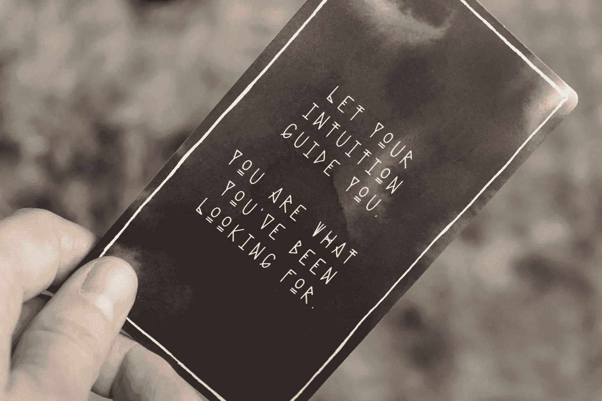

# 避免说的七件事

> 原文：<https://medium.datadriveninvestor.com/seven-things-to-avoid-saying-3a5fe04a9c7?source=collection_archive---------12----------------------->

帮你自己一个忙，跳过这些短语。

Photo by [Markus Lompa](https://unsplash.com/@markuslompa?utm_source=unsplash&utm_medium=referral&utm_content=creditCopyText) on [Unsplash](https://unsplash.com/s/photos/shut-up?utm_source=unsplash&utm_medium=referral&utm_content=creditCopyText)

不管你有多成功，特定的短语可以立刻改变别人对你的看法或你对自己的看法。这些陈述有一种不可思议的能力，让你看起来不那么讨人喜欢。

现在，我不是在谈论制造明显的黄色笑话，政治不正确的声明，或尖刻的评论。你知道不该说这些。但往往是那些微妙的言论让你显得不自信、没能力，会损害你的声誉。

 [## 良好的生活是习惯的形成|数据驱动的投资者

### 过度思考是过度紧张。仅仅几个简单的习惯就会在一天中产生巨大的影响。那是…

www.datadriveninvestor.com](https://www.datadriveninvestor.com/2020/01/17/a-good-life-is-habit-forming/) 

这里有一些人们日常说的带有负面含义的事情。避开他们，否则你可能会损害你的自尊、事业或人际关系。

# “________ 对我的朋友有效，为什么对我无效？”

自助建议的一个谬误是，它假装我们正从同一个大本营爬山。

但事实并非如此。每个人都有不同的属性、能力和基因。因此，一些人在实施新的锻炼计划、学习方法或饮食时拥有优势是很自然的。

个人成长不是一刀切的。一种习惯或哲学可能有助于改善一个人甚至十亿人——但这并不保证它会与你的个性、技能或道德结构相契合。

你有自己的一套目标，所以达到这些目标需要一套独特的工具。重要的是，不要把任何一条自我帮助的建议视为能治愈你缺点的万灵药或完美解药。努力向最好的人学习，但是要调整课程计划，让它为你服务。

不要吞下个人发展专家为你加热和服务的整顿饭。记住他们是在为每个人做饭，而不仅仅是你。挑选出看起来可口的东西并消化它。但是把其他和你的系统不一致的东西留在盘子里。

# “没事的。这就够好了。”

足够好对你来说够好了吗？(提示——不应该。)

对于小的决定，比如挑选一个品牌的磁带来买，足够好是可以接受的。但作为一种生活方式的选择，这是一种蹩脚的哲学。

听着，我不赞同充满压力的决策疲劳和完美主义的一生。但当涉及到天赋和专业知识时，你应该努力达到你潜力的上限。

足够好可以在不重要的事情上足够好，但是要尽量把重要的事情最大化。明智地选择你的战斗，但不要阻止自己取得伟大的成就。

# “我是个坏人。”

我主张把行动和个人分开。我们都在进步，需要修正。

也许你做了一些有问题的选择。你可能会对这些行为感到懊悔，尤其是当你把自己描述为“坏”的时候那么，你准备好从这些黑幕行动中吸取教训并进化了吗？

即使你可能会失败，也要努力改进，而不是仅仅接受你糟糕的方式。不要给自己贴上标签，接受自己的不足。努力变得更好。如果你下定决心，你就能改变。

Photo by [Jen Theodore](https://unsplash.com/@jentheodore?utm_source=unsplash&utm_medium=referral&utm_content=creditCopyText) on [Unsplash](https://unsplash.com/s/photos/hope?utm_source=unsplash&utm_medium=referral&utm_content=creditCopyText)

# "我希望我更聪明/身材更好/更成功/等等."

许愿是给傻瓜的。

不要只希望改变会发生。相反，采取一致的步骤来增加你的知识或朝着你的目标前进。参加在线课程，阅读书籍，尝试新的锻炼方式，建立关系网，提高你的技能，等等。

学习新事物永远不会太晚。自我发展永远是一项不错的投资。

不要许愿——要改进。

# "我的老板/老师/导师说的话激励了我，但我无法完成。"

励志演讲是垃圾食品；它们看起来诱人又美味，但从长远来看，它们并不令人满意。充满激情的话语不能像培养新习惯或技能那样提供持续的营养。

一个教练半场的鼓舞士气的话可能会激励球员在一场比赛中卷土重来，但不会修复那支球队的内在缺陷。因此，他们很可能会犯同样的错误，并在未来的竞争中落后，除非他们采取措施解决问题。

励志演讲是情感驱动的，所以它们诉诸意志力而不是实用性。意志力在短期内会取得很大成就，但是在更长的时间内保持这种专注水平是很有挑战性的。

我几乎总是用励志演讲的瞬间火花来换取培养终生有效习惯的缓慢燃烧。

# "这不是我的错."

指责别人比承担责任更容易。看着镜子里的自己，毫不退缩地承认自己搞砸了，这很有挑战性。

承认自己是问题的制造者需要力量和脆弱的微妙平衡。但是如果你发展了这种暂时的平衡，你会变得更好。

# “我按照他们说的做了，但还是没有得到 ________”

人们关注的是这句话中没有得到他们想要的那部分。但是通常问题是第一部分——总是按照“他们”告诉你的去做。

成功的人有足够的自信去违反别人遵循的规则。

偏离常规并不容易。我们在父母、老师、监督人和教练的指导下度过一生。质疑现状需要你有意识地转变心态。

在你的职业生涯或生活中，有哪些规则你认为是真理？你为什么一直跟着他们？成功人士会问这些问题，并分析答案。如果回答是“这就是一直以来的做法”，他们会逆潮流而动，尝试一些不同的东西。

人们认为魔鬼是细节，但魔鬼隐藏在平凡中，游荡在平凡的外围。如果你清点一下你的话，你会发现你对自己和他人说的话是有毒的、痛苦的、没有附加值的。

当你有意识地选择你说的和想的短语时，它会引发个人和情感的转变。发展积极肯定的词汇，消除危险的陈述，将会在你的日常生活中激发快乐和成就。

我在为你加油。

阿德里安·s·波特是一名作家、工程师、顾问和演说家。他写诗歌、短篇小说和各种主题的文章，包括创造力和个人成长。他是诗集[和散文集](https://www.amazon.com/Everything-Wrong-Feels-Adrian-Potter/dp/109519061X/ref=sr_1_4?qid=1560264651&refinements=p_27%3AAdrian+S.+Potter&s=books&sr=1-4&text=Adrian+S.+Potter)[的作者。在](https://e2857002-6118-41be-9746-64261e36cacb.filesusr.com/ugd/21d2c2_03522f10c7c84340a05a8d03a97e1642.pdf)[http://adrianspotter.com/](http://adrianspotter.com/)在线拜访他。

# 附加文字

[让我摆脱恐惧的四句名言](https://medium.com/datadriveninvestor/four-quotes-that-pulled-me-out-a-funk-c76b77354df5?source=friends_link&sk=29b2f6b71ed819b43424d68eff806d6c)

[三句名言开启你的雄心](https://medium.com/datadriveninvestor/three-quotes-to-jump-start-your-ambition-e59dc4424e60?source=friends_link&sk=1aa2ece82ddde2e40bcafedf3a7e3bc0)

[你在不知不觉中破坏成功的九种方式](https://medium.com/datadriveninvestor/nine-ways-youre-sabotaging-your-success-without-realizing-it-b77463353559?source=friends_link&sk=a6d6bbafec7fe3007fdf044e6653ac22)