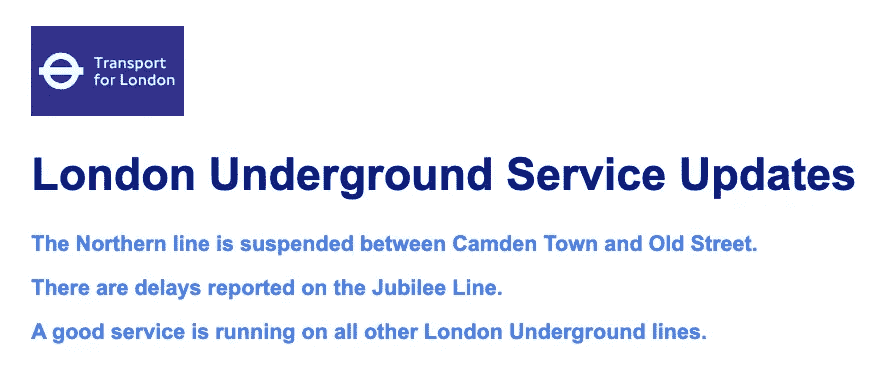

# 让你的网站看起来像建于 2020 年而不是 1997 年的七个 UI 设计基础。

> 原文：<https://medium.datadriveninvestor.com/seven-ui-design-fundamentals-to-make-your-website-look-like-it-was-built-in-2020-and-not-1997-971b26d52e1?source=collection_archive---------26----------------------->

有没有看过一个网站，想知道它的设计师是喝醉了还是只是讨厌人类的眼睛？以下是如何避免你的网站产生这种效果。

 [## 2019 年最值得学习的编码语言|数据驱动的投资者

### 在我读大学的那几年，我跳过了很多次夜游去学习 Java，希望有一天它能帮助我在…

www.datadriveninvestor.com](https://www.datadriveninvestor.com/2019/02/21/best-coding-languages-to-learn-in-2019/) 

# 空格

我们都需要空间，UI 元素也不例外。如果元素聚集在一个页面上，用户界面会变得混乱，令人困惑，阅读起来压力很大。

The STRESS.

另一方面，给你的元素足够的白色空间，它们对眼睛(和血压水平)来说容易得多。

[Click here](https://codepen.io/LKRR/pen/xxGqyeY) to play with the code.

# 对齐

对于一个赏心悦目的 UI 来说，所有的元素都需要沿着同一纵轴排列。

所以像这样:

上帝，请不要这样:

[Click here](https://codepen.io/LKRR/pen/RwPpYQg) to play with code

它的用户界面相当于:

[Click here](https://www.boredpanda.com/irritating-annoying-ocd-imperfection/?utm_source=google&utm_medium=organic&utm_campaign=organic) to become even angrier.

# 对比

对比度是页面上相邻颜色之间的差异。对比度差的页面很难阅读，所有的元素都不知所云，如下图所示。

Contrast of just 1.88 (large text) and 1.73 (small text). ([Click here](https://codepen.io/LKRR/pen/qBdrQwz) to see the code.)

对比度差也会导致可访问性问题，因此请确保您遵守 WCAG (Web 内容可访问性指南)，该指南建议大文本的最小(AA)对比度至少为 4.5:1 或 3:1，或者大文本的增强(AAA)对比度为 7:1 或 4.5:1。你可以用插件或者[网站](https://contrast-ratio.com/#%23073262-on-%23d3c0d2)来检查这个。这会给你一个清晰易读的页面，就像这样:

Contrast of 9.33 (large text) and 5.21 (small text)

# 规模

正如拉姆斯坦所唱的那样，“毕竟，规模很重要。”(我确信 UI 设计正是他们所指的。)举这两个例子。首先，按钮很小，用户会很难知道下一步该做什么。

Where do I click?!

在第二个例子中，用户的下一个预期动作很清楚，按钮也很容易使用:

[Click here](https://codepen.io/LKRR/pen/vYOxzgy) to experiment with scale.

# 排印

这归结为在正确的场合使用正确的字体。所以纪念网站上没有漫画(除非是一个小丑的纪念)。例如，这是可行的:

除了少数万圣节边缘案例外，这种情况并不存在:

[Click here](https://codepen.io/LKRR/pen/ExjWKKW) to play with the code.

然而，你需要考虑的不仅仅是字体系列。还有字体大小，对齐，字母间距，行高，风格，颜色和对比度。

# 颜色

颜色有含义。如果你不相信我，看看下面的例子:

[Click here](https://codepen.io/LKRR/pen/poJegqX?editors=1100) to play with the code/stop your eyes from hurting.

混杂的信息，是吧？所以，这个故事的寓意是:把你的颜色意义和语义意义匹配起来。像这样:

但是要小心:颜色的含义在不同的文化中有所不同。例如，在西方文化中，白色通常意味着和平和纯洁，而在东方，它通常意味着死亡(如果你不小心，这可能会导致严重的失礼)。所以在挑选调色板之前，先做好调查。

# 视觉层次

这是使用上面的一些或全部技术让重要的东西变得更明显的实践。你正在寻找一个清晰、易读、语义化的用户界面，它可以把目光引导到页面的关键部分，以及一个清晰的 CTA(在这个例子中，是“Alohomora”)。

View the code [here](https://codepen.io/LKRR/pen/NWqpexX).

然而，忽略这些 UI 技巧，你可能会得到一个令人困惑的、混乱的设计和一个比 T1 大的 T0，这从来都不是一件好事。

Nobody cares when Hogwarts was founded, Karen!

我希望这些建议对你有所帮助。如果你想学习更多关于用户界面设计的知识，并实践你新发现的技能，[前往 Scrimba](https://scrimba.com/g/gdesign) 获取大量有趣的互动教程和截屏，让你在学习的同时摆弄代码！

快乐设计！:)