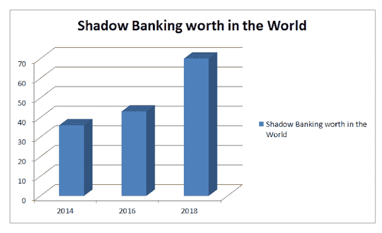
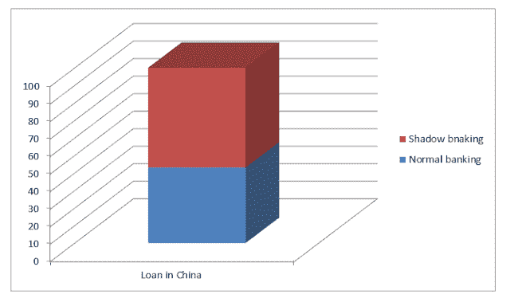
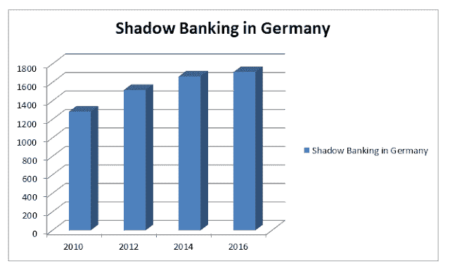

# 影子银行引发了银行体系的问题

> 原文：<https://medium.datadriveninvestor.com/shadow-banking-raising-problem-in-the-banking-system-98dbe78a3254?source=collection_archive---------13----------------------->

很有可能你们中的许多人以前没有听说过这个。影子银行已经开始在银行体系中扎根。这对我们当前的系统是危险的。它正在创造没有他们支持的信用，正因为如此，它可能是不稳定的。许多经济学家表示，这将产生泡沫。那么，什么是影子银行，它是如何运作的，它会对银行体系产生什么影响？我将在这个博客上讨论这一切。

首先，让我们看看什么是影子银行

根据剑桥词典

由非官方银行机构开展的贷款或投资等金融活动，因此不必遵守同样的规则。

简单来说，贷款由非银行组织提供。这是一家银行的影子，它扮演着银行的角色，但不是银行。

“影子银行系统”一词是太平洋投资管理公司的保罗·麦卡里在堪萨斯城美联储银行的经济研讨会上提出的。麦卡里认为，影子银行体系的诞生与 20 世纪 70 年代货币市场基金的发展有关——货币市场账户的功能主要是作为银行存款，但货币市场基金并不像银行一样受到监管。

 [## 在中国做生意:如何优化您的运营|数据驱动的投资者

### 中国是一个受本地和外国公司欢迎的商业中心。在一个国家设立实体存在…

www.datadriveninvestor.com](https://www.datadriveninvestor.com/2019/03/17/doing-business-in-china-how-to-optimize-your-operations/) 

影子银行在不同的书中有不同的含义，它被不同的机构用在不同的场景中。

这种类型的组织在经济中早已存在，那么为什么它会影响到现在呢？这是因为在早期阶段，只有非银行组织使用影子银行为组织融资，但现在许多银行开始使用这一工具。

影子银行很可怕，就像非银行组织提供贷款一样。各种因素，如利率、贷款的可用性等。不受政府控制。所以这个组织没有按照政府的命令工作。因此，它会导致通货膨胀。那么，这种影子银行在标准银行体系中是如何运作的，它有多可怕？让我们谈谈这个

正如我前面所说，影子银行开始被银行用来为政府的各种活动提供资金。和其他组织。正如你们所知，银行是如何贷款的，但由于这家银行贷出的钱比他们账户上的钱多，根据我的观察，这可能会导致未来几年的金融危机。2007 年的危机也是不同的组织大量放贷，这造成了泡沫，当泡沫破裂时，引发了 2007 年的危机。银行利用影子银行为超过其能力的资金融资。他们开始贷出不在他们财力范围内的钱。例如，如果政府。要求一家银行为其项目提供 3000 万美元的资金，而该银行只有 2000 万美元的能力，然后银行从投资者或其他非银行机构借款 1000 万美元，为政府融资。

通过这样做，银行获得了佣金，他们自己的钱没有被投资，所以他们不会发现任何困难。

这是银行影子银行的起步阶段。银行慢慢开始利用这一工具进行融资。银行在其中扮演了中间人的角色，因此他们的风险被降到了最低。
让我们更详细地看看银行是如何获得这笔钱的。

当银行需要资金时，他们会要求投资者提供资金。在真实情况下，银行将这 1000 万美元分成小分母，包装成收益率比平时高的理财产品。因此，当投资者看到这一点时，他们发现这是有利可图的，因为它来自银行，回报率也很高，所以他们投资于此。银行从这里得到他们的钱。

在目前的情况下，其他投资公司正在包装银行理财产品，这种情况还在继续，因此最后一个投资者无法发现其中涉及的风险。

银行只是将风险转嫁给投资者。

过去几年，影子银行在世界范围内兴起。

估计万亿美元

中国是影子银行最重要的市场。它确定中国的影子银行提供了价值 9 万亿美元的贷款。他们经济的 69%。

占中国贷款总额的%

从上面可以看到，中国一半以上的贷款都是影子银行。

现在我们已经看到了什么是影子银行，它是如何运作的，那么现在让我们看看它将如何影响我们的银行体系？

当一个无组织的部门提供贷款时，他们的主要目的是盈利，而当银行向政府提供贷款时。干预银行必须在政府的指挥下工作。

因此，当一家公司无法从银行获得贷款时，它们会转向非银行系统，而银行已被用来解决非银行机构造成的问题，但当银行也开始使用这一系统时，我们就有麻烦了，因为我们希望银行按照指导方针行事。

当贷款变成不良贷款时，这种影子银行会引发问题，银行将无法偿还这些贷款，因为它们已经从其他来源获得了资金。为了理解这一点，让我们举个例子。让我们假设银行拿出 1 亿美元作为影子银行，如果其中的 25%成为坏账，即 2500 万美元，银行必须偿还给投资者，因为投资者因银行而投资于他们。但是银行不能，因为银行已经超过他们的能力 1 亿美元，他们没有任何备份。中国央行行长周小川公开警告称，当局需要抑制可能导致“明斯基时刻”的金融风险。明斯基时刻是指在长时间增长后，由债务或汇率压力引发的资产价格突然崩盘。

影子烘焙不仅是银行使用时的问题，非银行机构也会制造问题。

通常当政府。制定严格的贷款可用性规则人们把注意力转向这些非银行机构。

很多经济学家都说影子银行体系不适合经济。影子银行不仅发生在中国，整个世界也受到了影响。像德国这样的国家在这方面也有所提高。

-以 10 亿美元计(大约。)

在英国，据估计影子银行业价值约 2.2 万亿英镑。

在早期阶段，影子银行没有造成问题，因为它没有像传统银行那样崛起，但现在它发展如此之快，以至于开始超过标准银行体系，这就是问题所在。如果这个部门的贡献大于银行，那么政府。可以对贷款和利率的增减失去控制。这可能会导致金融危机。

该体系在很大程度上导致了 2007 年的全球金融危机。
在 2008 年 6 月的一次演讲中，时任纽约美联储银行总裁兼首席执行官的美国财政部长蒂莫西·盖纳(Timothy Geithner)将信贷市场冻结归咎于影子银行系统中实体的交易对手“挤兑”。

银行和非银行金融机构对利用这些资产负债表外实体为投资战略提供资金的依赖迅速增加，这使它们对支撑整个金融体系的信贷市场至关重要，尽管它们存在于监管商业银行活动的监管控制之外的暗处。此外，这些实体之所以脆弱，是因为它们在流动性市场借入短期资金，购买长期、流动性和高风险资产。

这意味着信贷市场的混乱将使它们受制于快速去杠杆化，以低价出售长期资产。

# 结论

影子银行在过去给我们的银行体系带来了问题，未来也会如此。政府。国际机构必须对这一领域做出一些严格的决定，否则我们将面临比 2007 年更大的危机，而这一次的信贷量将如此之大，以至于标准的救助计划都无法覆盖。

*最初发表于*[*【https://onkarjadhavv.blogspot.com】*](https://onkarjadhavv.blogspot.com/2018/08/shadow-banking-raising-problem-in.html)*。*