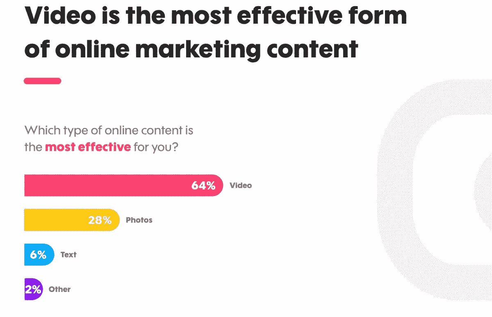
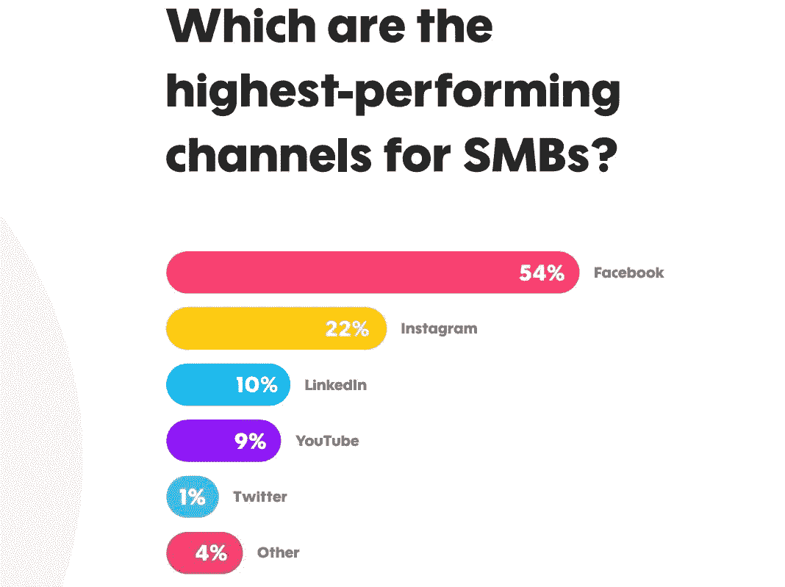

# 分享无限的愿景

> 原文：<https://medium.datadriveninvestor.com/share-a-vision-without-limits-b3fdeb7890df?source=collection_archive---------29----------------------->

## 使用视频将有助于小企业脱颖而出

Photo by Hermes Rivera on Unsplash

视频控制着大多数营销策略的最高层次。越有想象力，小企业就越能在喧嚣中脱颖而出，获得消费者的关注。

视频营销领域迅速崛起的行业领导者之一是 Promo.com 的 T2。该公司让顾客能够用视频推销任何东西。

“我们相信，各种规模的企业都应该能够无限制地推广他们的愿景，”Promo.com 的传播副总裁希拉·什特里·尼西姆说。“我对与视频营销、内容、在线广告、社交媒体和价值创造相关的一切都充满热情。”

 [## 视频创造了令人感动的差异

### 图像会留下不可磨灭的印象

medium.com](https://medium.com/datadriveninvestor/video-creates-a-moving-difference-ec43f8dd16f9) 

Shitrit Nissim 与 Carol Stephen 谈论了视频营销和小企业发展，Carol Stephen 是一位社交媒体经理，帮助那些希望在网上获得关注的雄心勃勃的企业主。斯蒂芬还写道， [*“全面参与社交媒体的 21 种方法:这会让你看起来更专业。”*](https://www.amazon.com/Ways-Total-Social-Media-Engagement/dp/1732209901/ref=sr_1_1?ie=UTF8&qid=1537909679&sr=8-1&keywords=21%20ways%20to%20social%20media%20engagement%20that%20will%20make%20you%20look%20like%20a%20pro)

“视频营销是中小型企业的头号营销工具，这是有原因的，”Shitrit Nissim 说。“这是民主化的。像我们一样的工具。它可以在内部创建。此外，还有简单的分享和互动。

她说:“*视频就是能引起共鸣*”。“比起停滞不前的纯文本内容，人们更有可能与照片和视频互动。我们都有情感归属的需求，视频是实现这一点的最佳方式之一。”

Shitrit Nissim 发现，一旦特定风格的视频效果良好，小企业就更容易重新制作和复制。

“我们总是建议进行测试，看看什么最能引起共鸣，然后将高绩效的风格融入你的视频编辑日历中，”她说。

“我们制作每日视频来帮助你开始，”Shitrit Nissim 说。“采用这些类型的格式，然后创建一个特定于您的小型企业的格式，您可以随时向我们寻求帮助。”

# **见人的人**

消费者喜欢看关于他们自己或他们认识的人的 T2 视频。他们越能与视频联系起来，就越好。

“视频只是更有个性，”Shitrit Nissim 说。“他们很容易被监视着，shared⁣⁣.信息可以更有针对性。视频比文字或 graphics⁣.更具视觉吸引力

“视频是网上营销最有效的形式[*，*，这不是巧合，”她说。“消费者喜欢简短、易于理解的内容，尤其是因为他们觉得在分享时不太需要解释或添加上下文。”](https://www.datadriveninvestor.com/2019/10/06/video-snaps-picture-perfect-content/)

Shitrit Nissim 强调了消费者不希望在视频内容中看到的一点。

“*销售，销售销售*，”她说。“明目张胆的销售永远不会有好结果。如果你需要在最初几秒吸引人，你可以保证他们会在同样长的时间内被拒绝。

“让我们把这变成积极的一面，”Shitrit Nissim 说。"我们知道销售会把人拒之门外，那么是什么让他们回来呢？"

 [## 伟大的视频激励他人

### 获奖作品赋予一个名字一张脸和声音

medium.com](https://medium.com/datadriveninvestor/great-videos-inspire-others-81d31e70c49d) 

她提供了这个清单:

*   包含
*   情感联系
*   笑
*   行动呼吁
*   伟大的音乐
*   惊人的视觉效果

“将最佳实践融入所有视频，”Shitrit Nissim 说。“你可以*还是*卖。怎么会？从马克·谢弗的书《营销反叛》中抽出一页，看看有什么共鸣。

“例如，你的企业文化真的能把你和其他人联系起来，从而促成销售吗？”她说。“这是一个视频机会。”

斯蒂芬说，随着人们除了写博客之外还使用视频，视频变得更加个人化和随意。

“视频营销不再只是商业广告，”Shitrit Nissim 说。“它无处不在。”

Promo.com 用户说这些视频表现最好:

*   广告，37%
*   社交媒体，34%
*   博客内容，20%
*   如何做，百分之五
*   现场活动和采访，4%

“视频对搜索引擎优化也很重要，”Shitrit Nissim 说。"由于你的视频营销策略，你可以在谷歌搜索结果中排名更高."

Ahrefs 在[自己的视频](https://www.youtube.com/watch?v=NY3y0V9UDwM)中解释了这一点。

# **用好库存**

“我们发起了一项关于中小型企业如何使用视频的研究，”Shitrit Nissim 说。“非常彻底。我们发现 75%的中小企业[在他们的视频内容中使用库存镜头或图像](https://promo.com/blog/smb-video-marketing-study)。

“为创作者提供高质量的素材和图像是一个好主意，”她说。"它将资源保存在一个地方，并帮助您创建高质量的专业视频."

 [## 不断的满足需要每天的磨砺

### 在录制第一个场景之前要有一个策略

medium.com](https://medium.com/datadriveninvestor/constant-content-demands-a-daily-grind-498b2a9353b1) 

这些是她最喜欢的创建在线内容的资源或工具:

*   [坎瓦](https://twitter.com/canva)
*   [去飞溅](https://twitter.com/unsplash)
*   [Agorapulse](https://twitter.com/Agorapulse)
*   [品牌 24](https://twitter.com/brand24)

在 Promo.com 接受调查的 500 名营销人员和小企业主中，他们认为以下渠道是视频营销的最佳渠道:

*   脸书，54%
*   Instagram，22%
*   LinkedIn，10%
*   YouTube，9%
*   推特，1%
*   其他，4%

小企业主和营销人员基于以下 criteria:⁣选择这些渠道

*   访问量，销售额，订户，42%
*   喜欢，评论，分享，41%
*   观点，16%
*   其他，1%

一个总体选择是让人们使用他们所在的每一个社交媒体渠道。

“明智之举，”什特里·尼西姆说。"只要确保优化长宽比，特别是手机的方形和故事的垂直."

 [## 易于制作的视频让人们看到你，听到你，了解你

### 指尖控制你的信息

medium.com](https://medium.com/datadriveninvestor/easy-to-make-video-lets-people-see-you-hear-you-and-know-you-3b726a883a66) 

视频中自然包含的人越多越好。比起物品，人们更喜欢观察人。

Shitrit Nissim 有这些在线视频营销技巧:

*   打造签名风格。
*   跟踪参与度。
*   寻找有助于创造的工具。
*   优化视频纵横比。
*   “静音”观众的字幕。

“你永远不必纠结于视频的长宽比，”Shitrit Nissim 说。“我们有几种方法让它变得尽可能简单。一个是以 Promo.com 为平台。我们也有一个[免费的图像和照片大小调整器](https://promo.com/tools/image-resizer/)

Shitrit Nissim 认为，在视频领域，挑战总是存在的。

“大多数时候，这些都与两个具体的事情有关:没有明确的战略和缺乏创造性的想法，”她说。

# **创意街区**

在中小型企业视频研究中，受访者表示，他们最大的挑战是获得创意、时间和资源，以及看到结果。

“这意味着这些挑战可以通过创造工具来解决，”Shitrit Nissim 说。其中包括视频营销编辑日历、供内部使用的最佳做法视频指南和一体化工具

 [## 视频为营销注入活力

### 当企业家知道他们想要什么时，他们就有了优势

blog.markgrowth.com](https://blog.markgrowth.com/video-injects-pizzazz-to-marketing-3974d06be72) 

音频质量是另一个考虑因素。

“就视频而言，质量确实很重要，”Shitrit Nissim 说。“使用高质量的镜头和音乐来满足观众的期望和标准。”

就个人而言，她喜欢各种风格的视频广告。

“对我来说最重要的是视频的独特性和思想，”Shitrit Nissim 说。“作为一名行业专家，当我看到成功视频的新的和不同的使用案例时，我很兴奋。如果让我选一个，我会选励志视频。”

她补充说，Promo.com 是一个一体化的视频创作平台。

“我们提供了一个友好的编辑器，数百万的视频和照片，音乐曲目和现成的模板，”Shitrit Nissim 说。“你也可以上传自己的内容。包括终身许可和 24/7 全天候支持。”

**关于作者**

吉姆·卡扎曼是[拉戈金融服务公司](http://largofinancialservices.com/)的经理，曾在空军和联邦政府的公共事务部门工作。你可以在[推特](https://twitter.com/JKatzaman)、[脸书](https://www.facebook.com/jim.katzaman)和 [LinkedIn](https://www.linkedin.com/in/jim-katzaman-33641b21/) 上和他联系。