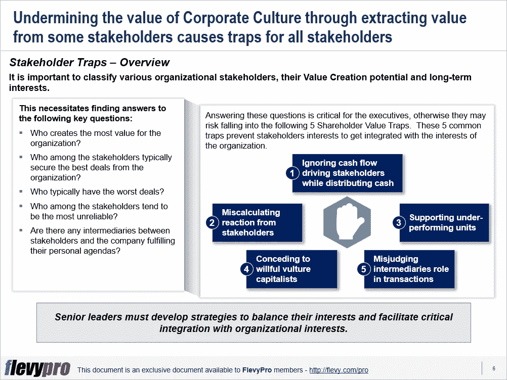

# 股东价值陷阱:如何规避它们并专注于为你的组织创造价值

> 原文：<https://medium.datadriveninvestor.com/shareholder-value-traps-how-to-evade-them-and-focus-on-value-creation-for-your-organization-de22e2c2901c?source=collection_archive---------17----------------------->

当今不断变化的行业生态系统和竞争要求组织进行战略转变。公司的宗旨正在经历[业务转型](https://flevy.com/browse/stream/transformation)从服务股东利益到服务所有影响组织的利益相关者。

股东通常被认为是投资企业的唯一利益相关者。高级管理层需要认识到股东以及为组织创造价值的其他利益相关者的重要性。他们应该致力于建立一种协作的[组织文化](https://flevy.com/browse/stream/culture)，关注所有那些在组织成长中发挥作用的群体的福利。

这保证了对所有利益相关者、他们的长期利益以及[组织的价值创造](https://flevy.com/browse/stream/value-creation)——或价值破坏——潜力的彻底评估。但首先，这需要找到以下关键问题的答案:

*   谁为组织创造了最多的价值？
*   利益相关者中谁通常能从组织中获得最佳交易？
*   谁是组织最差交易的受害者？
*   利益相关者中谁可能不值得信任？
*   是否有任何中介或利益相关者实现他们的个人议程？

回答这些问题对高管来说至关重要，否则他们可能会陷入股东价值陷阱。认识和理解利益相关者的价值陷阱，同时[管理利益相关者](https://flevy.com/business-toolkit/stakeholder-management)的各种利益有助于高管实现共同的和个人的长期目标。这 5 个常见的陷阱会阻碍利益相关者的利益与组织的利益相结合，如果被忽视，会破坏公司的价值:

1.  **分配现金时忽略现金流驱动的利益相关方**
2.  **利益相关方的错误反应**
3.  **支持表现不佳的单位**
4.  **向任性的秃鹫资本家让步**
5.  **误判中介在交易中的角色**

让我们分别讨论其中的三个利益相关者陷阱。

**陷阱 1——在分配现金时忽视现金流驱动的利益相关者**

股东通常被视为长期现金流的关键驱动力。然而，他们通常是短期的现金流生成者，而以能力和经验的形式为组织提供投入的其他利益相关者提供了长期的价值。这些真正的贡献者在分配现金收入时应该得到最优先的考虑。对一个组织来说，低估或未能识别真正的长期现金流产生者可能是一个致命的价值陷阱。

**陷阱 2——利益相关方的错误反应**

另一个陷阱是，大多数高管容易陷入忽视弱势利益相关者对不公平的现金/激励分配的潜在反弹。从这些受害者身上挖掘价值来支持股东支出同样有害，因为愤怒的利益相关者——在社交媒体和非政府组织的帮助下——法律诉讼和经济处罚会摧毁公司的声誉和财务健康。

**陷阱 3——支持表现不佳的单位**

一些组织的高管和董事会以长期价值股东为代价，培养搭便车者——从企业获取的利益比他们创造的业务更多的利益相关者。搭便车者包括与董事会关系密切的表现不佳的部门，或者是盈利部门的一部分，其财务状况没有单独分类的日益萎缩的业务部门。

对这些搭便车者的持续支持往往是以将资源分配给其他潜在更有利可图的企业为代价的，这种做法导致许多公司亏损甚至破产。

有兴趣了解更多关于[利益相关者价值陷阱](https://flevy.com/browse/flevypro/shareholder-value-traps-5239)、组织利益相关者的类型以及避开利益相关者价值陷阱的策略吗？你可以在[Flevy documents market place](https://flevy.com/browse)的处下载**股东价值陷阱**的[可编辑幻灯片。](https://flevy.com/browse/flevypro/shareholder-value-traps-5239)

## 你在这个框架中找到价值了吗？

你可以从 [FlevyPro 库](https://flevy.com/pro/library)下载关于这个和数百个类似业务框架的深入介绍。FlevyPro 得到了数千名管理顾问和企业高管的信任和使用。有些人不得不说:

> “我的 FlevyPro 订阅为我提供了当今市场上最受欢迎的框架和平台。它们不仅增加了我现有的咨询和辅导产品和服务，还让我跟上了最新的趋势，为我的实践激发了新产品和服务，并以其他解决方案的一小部分时间和金钱教育了我。我强烈推荐 FlevyPro 给任何认真对待成功的顾问。”

–比尔·布兰森，战略商业建筑师事务所创始人

> “作为一家利基战略咨询公司，Flevy 和 FlevyPro 框架和文件是一个持续的参考，有助于我们为客户构建我们的调查结果和建议，并提高他们的清晰度、力度和视觉效果。对我们来说，这是增加我们影响力和价值的宝贵资源。”

–Cynertia Consulting 的咨询区域经理 David Coloma

> “作为一个小企业主，FlevyPro 提供的资源材料已被证明是非常宝贵的。根据我们的项目事件和客户要求按需搜索材料的能力对我来说很棒，并证明对我的客户非常有益。重要的是，能够针对特定目的轻松编辑和定制材料有助于我们进行演示、知识共享和工具包开发，这是整个计划宣传材料的一部分。虽然 FlevyPro 包含任何咨询、项目或交付公司都必须拥有的资源材料，但它是小公司或独立顾问工具箱中必不可少的一部分。”

–变革战略(英国)董事总经理迈克尔·达夫

> “作为一名独立的成长顾问，FlevyPro 对我来说是一个很好的资源，可以访问大量的演示知识库来支持我与客户的合作。就投资回报而言，我从下载的第一个演示文稿中获得的价值是我订阅费用的好几倍！这些资料的质量让我能够打出超出自己体重的水平，这就像是用很小一部分开销就能获得四大咨询公司的资源一样。”

–Roderick Cameron，SGFE 有限公司的创始合伙人

> “我每个月都会浏览几次 FlevyPro，寻找与我面临的工作挑战相关的演示文稿(我是一名顾问)。当主题需要时，我会进一步探索，并从 Flevy 市场购买。在所有场合，我都阅读它们，分析它们。我采纳与我的工作最相关和最适用的想法；当然，所有这些都转化为我和我的客户的利益。"

量子 SFE 公司首席执行官奥马尔·埃尔南·蒙特斯·帕拉

在 [**管理和企业咨询**](https://app.ddichat.com/category/management-and-corporate-consulting) **:** 中安排一个 DDIChat 会话

 [## 专家-管理和企业咨询- DDIChat

### DDIChat 允许个人和企业直接与主题专家交流。它使咨询变得快速…

app.ddichat.com](https://app.ddichat.com/category/management-and-corporate-consulting) 

在此申请成为 DDIChat 专家[。
与 DDI 合作:](https://app.ddichat.com/expertsignup)[https://datadriveninvestor.com/collaborate](https://datadriveninvestor.com/collaborate)在此订阅 DDIntel [。](https://ddintel.datadriveninvestor.com/)