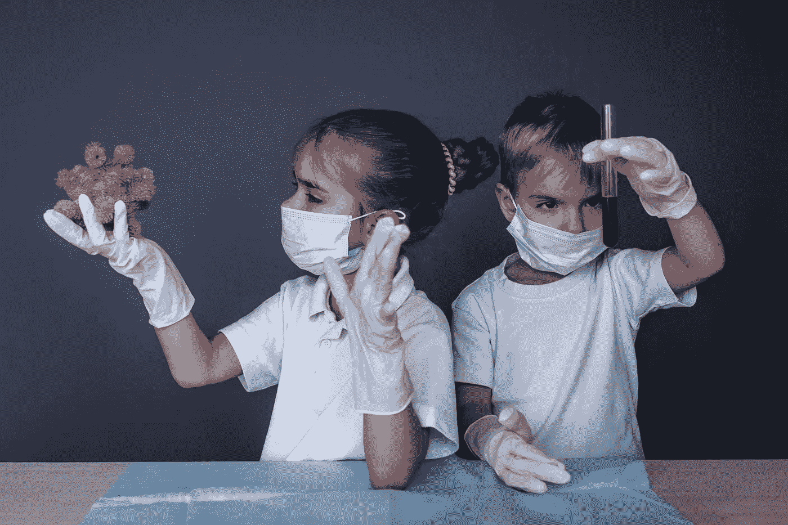
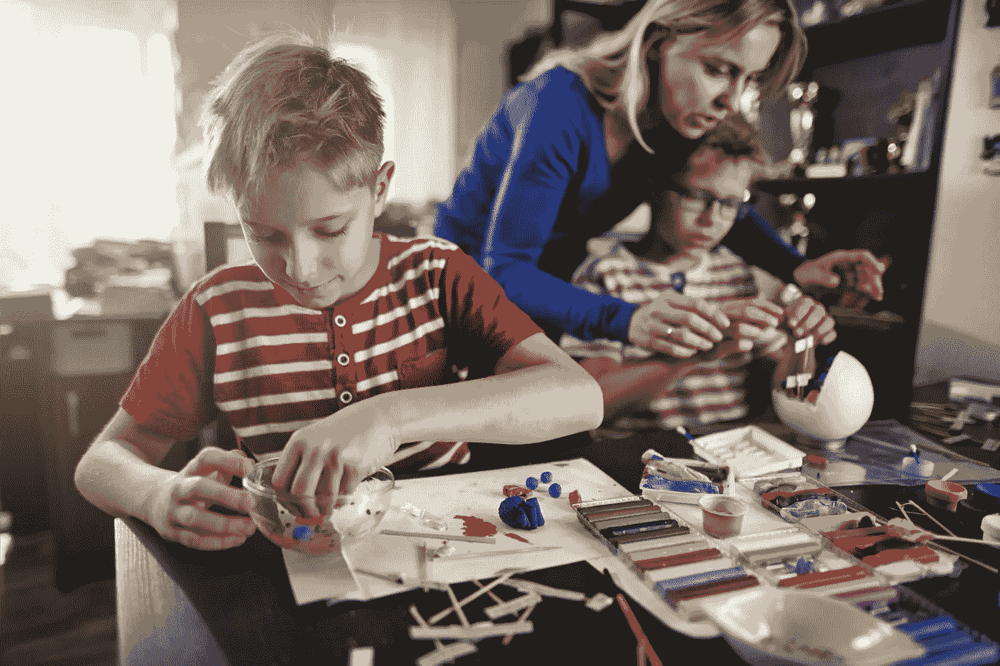
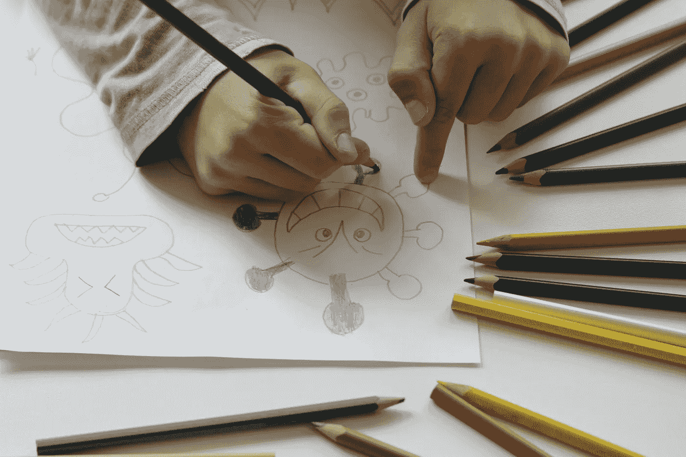
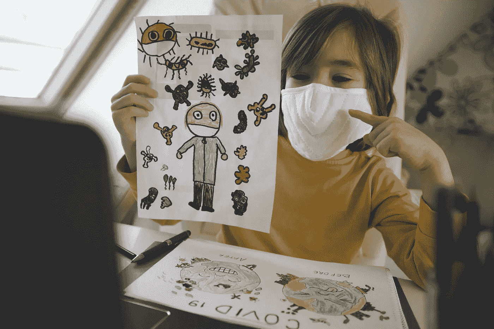
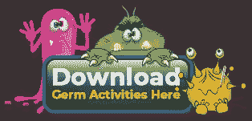
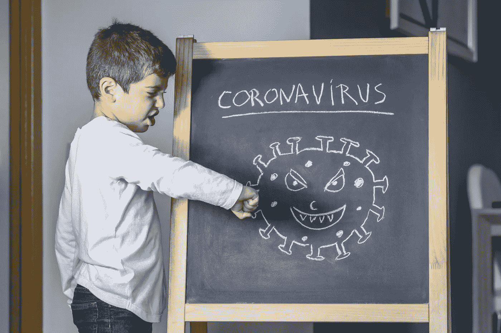

# 就地安置 STEM 教育

> 原文：<https://medium.datadriveninvestor.com/shelter-in-place-stem-education-tips-resources-f94b863a5f3a?source=collection_archive---------7----------------------->

## 利用免费的家长/教师资源，帮助创造最佳的家庭学习环境

Image: Getty ID# 1204258364 / Children Wearing Respirator Masks & Medicine Gloves

*作者:* [*安德鲁·b·劳普*](https://medium.com/u/d8c8d333927a?source=post_page-----bc7b73a1ac7b----------------------)*/*[*@ stem CEO*](https://twitter.com/stemceo)

对于那些不让孩子上学的父母来说，疫情冠状病毒带来了额外的挑战。除了担心经济和家人的健康，你还想让孩子们平静、安全、快乐、有教养。研究人员已经研究了[“夏季滑坡”](https://www.scholastic.com/parents/books-and-reading/raise-a-reader-blog/summer-slide.html)——一种在暑假期间学习退步的趋势——但我们还不知道新冠肺炎病毒传播导致的数月中断可能对学术进步意味着什么。

幸运的是，有许多方法可以在家里继续进行有意义的学习——事实上，你可能会发现自己被过多的资源淹没，并被分享来帮助建设性地度过时间。作为孩子在家教育的监督者，为了帮助你适应你的新常态，当你在适当的地方躲避时，试试这些保持在家上学可控的建议。

# 成为有效的改进推动者

Image: Getty ID# 1193142057 / Mother & Sons Making Cell Models

## 1.尽最大努力保持一个常规

根据儿童心理学家的说法，稳定的日常生活有助于孩子们感到安全——这是我们现在绝对想要培养的。尽你所能围绕一致的睡眠和饮食模式来安排一天。每天安排特定的学习时间也是一个好主意。试着让你的孩子和你一起制定一个时间表，这样他们就可以控制自己的时间了。一旦你们一家人达成一致，让他们制作一张每日时间表的海报，挂在客厅或厨房作为参考。

 [## 教科书行业如何最终被颠覆，并将继续改变|数据驱动…

### 就此而言，教科书产业在美国乃至全世界都有着悠久的历史。事实上，他们已经…

www.datadriveninvestor.com](https://www.datadriveninvestor.com/2018/09/25/how-the-textbook-industry-has-finally-been-disrupted-and-will-continue-to-change/) 

## 2.不要忘记休息

套路好；[超排](https://www.psychologytoday.com/us/blog/suffer-the-children/201408/overscheduled-kids)不是。呆在家里的一线希望是，我们突然有时间和家人在一起。这会变得很危险——会有争吵！—所以给孩子时间和空间来发泄情绪也很重要。当你制定时间表时，一定要给孩子留出一些自由时间，让他们做自己想做的事情(当然，要避免不必要的接触他人)。[精神停工期](https://www.scientificamerican.com/article/mental-downtime/)对大脑功能和发育至关重要。

## 3.在社交中发挥创造力

Image: Getty ID# 1182451008 / Happy Family On Laptop

由于大多数美国人不再能聚在一起，你的孩子面临着遭受孤独的真正风险，一项研究发现这种孤独和吸烟一样有害健康。 [FaceTime](https://apps.apple.com/us/app/facetime/id1110145091) 、 [Zoom](https://zoom.us/) 和 [Google Hangouts](https://cloud.google.com/blog/products/g-suite/helping-businesses-and-schools-stay-connected-in-response-to-coronavirus) 只是你可以用来与孩子的同学建立虚拟游戏日期的几个应用程序。您也可以使用这些应用程序来支持学习，让您的孩子在远处一起完成项目、短剧、游戏等。让他们在如何与朋友互动方面发挥带头作用——他们可能会有一些好主意！

## 4.提高你的心率

燃烧所有被压抑的能量对每个人的心智健全都至关重要。每天散步呼吸新鲜空气和锻炼可以创造奇迹——只要检查一下你所在社区的社交距离规则，并确保你在出门前得到了医生的锻炼许可。你也可以在室内进行大量的身体活动来促进血液循环:尝试跳跃、原地慢跑或其他室内游戏来让孩子们保持活跃。这对整体心血管健康、肌肉骨骼力量、大脑发育和持续的心理健康至关重要。

## 5.给日常活动添加词干

Image: Getty ID# 1212579056 / Boy Drawing Virus

如果在家教授科学和数学的想法让你感到恐慌——放松。STEM(科学、技术、工程和数学)学习的一个最重要的方面是[批判性思维](https://medium.com/@stemceo/a-stem-state-of-mind-no-magic-kit-or-subscription-required-80566683c284)，这是一项可以在日常生活中培养的技能，就像在课堂上一样容易。让孩子们尝试积木、玩具车轨道、粘土模型等。试着让他们假设在他们玩的时候会发生什么，然后通过实验来检验他们的想法。对于年龄较大的学生，鼓励他们用自己的技能解决家庭问题:公平分配屏幕时间，制定清洁协议，紧急行动计划和/或制定新的杂货店预算都是相关的。

# 一个有趣的、免费的 STEM 家庭资源

STEM.org 教育研究和 hand2mind(以及其姐妹公司 Learning Resources 和 Educational Insights)致力于帮助家庭度过这一困难时期。他们共同合作开发了一个名为*解剖和医学*的引人入胜的新学习模块，该模块有完整的教师指南(针对家长和课堂教育者！)和大量供孩子们打印和使用的学习活动。

Image: Getty ID# #1214338166 / Boy Attending Online Class Wearing Mask

这种免费下载的内容鼓励学生更好地了解病原体，并了解为什么卫生是健康和福祉的基本概念。他们将探索疾病的传播、营养和干细胞职业机会。还有对人体和细胞解剖学的强烈关注，通过 [Shelly D. Smith](https://www.linkedin.com/in/shelly-d-smith-69a1366b/) (设计蜜蜂的天才创意总监)的惊人艺术作品更加引人入胜。作为压轴戏，学生们在紧急生存情况下测试他们的新知识——这是历史上这一时刻真正相关的学习。请在接下来的几天里安全地呆在家里，并与他人分享 STEM 资源。

Illustration: Shelly Smith / Design Bee

Image: Getty ID# 1212587015/ Boy Fighting Coronavirus

[安德鲁·b·劳普](https://medium.com/u/d8c8d333927a?source=post_page-----bc7b73a1ac7b----------------------)是创始人/执行董事 [@stemdotorg](https://twitter.com/stemdotorg) 。*“通过健全的政策使科学、技术、工程和数学(STEM)教育民主化&实践……应用 STEM 更好地理解它”*