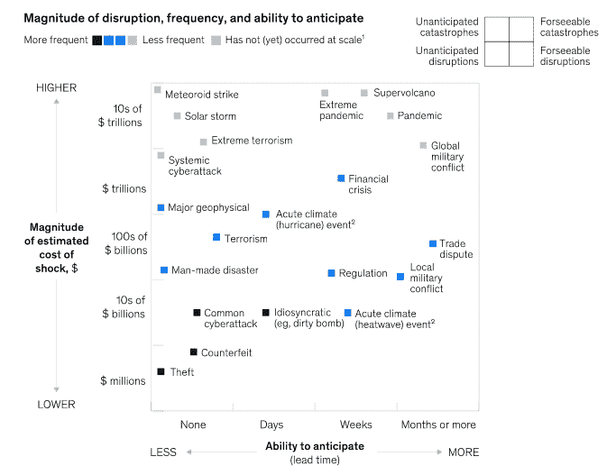
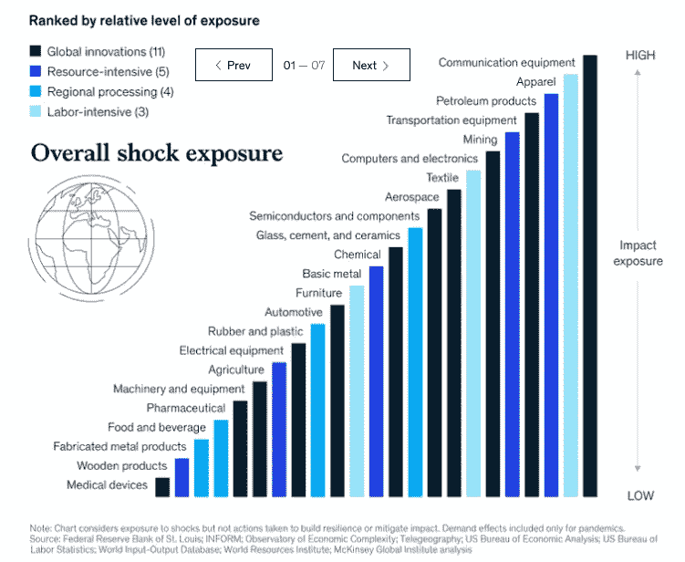
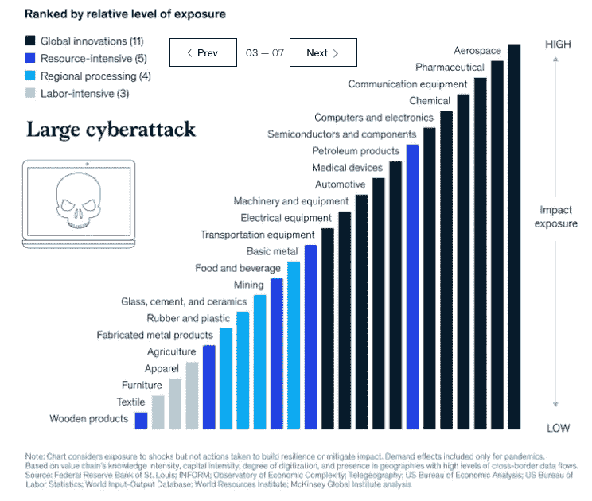
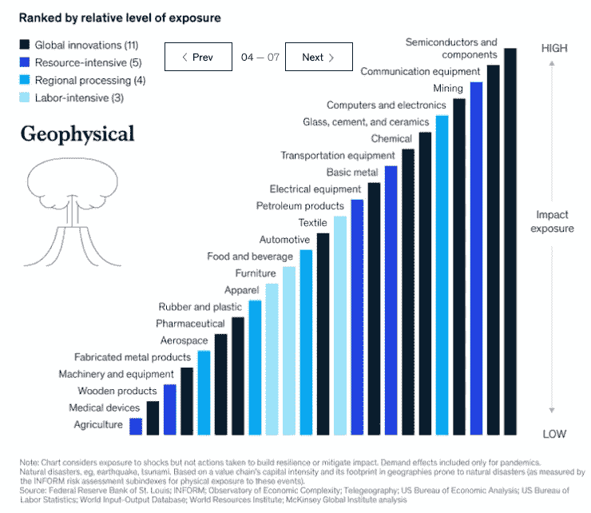
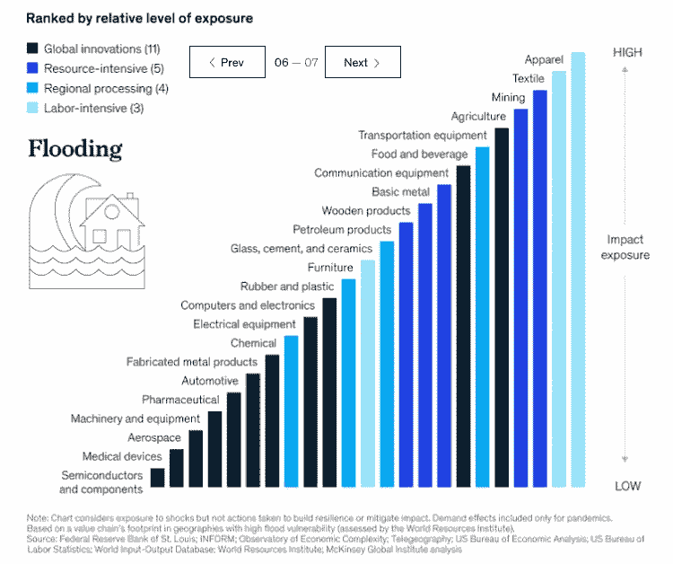
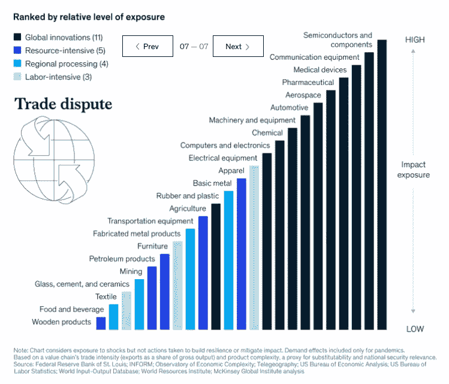

# 冲击管理 101

> 原文：<https://medium.datadriveninvestor.com/shock-management-101-f308901177d6?source=collection_archive---------15----------------------->

## 你的企业准备好迎接下一个疫情或其他“黑天鹅”事件了吗？新的研究表明，有办法更好地为下一次大地震做准备，不幸的是，这是一个时间问题，而不是如果。

Photo by [Felix Mittermeier](https://unsplash.com/@felix_mittermeier?utm_source=medium&utm_medium=referral) on [Unsplash](https://unsplash.com?utm_source=medium&utm_medium=referral)

# 介绍

如果你像我一样，你会看到你的许多“朋友”在社交媒体上发布关于 2020 年还会发生什么的帖子，以填写他们的世界末日宾果卡。有潜在的重大新闻发生…

每一个疯狂的新闻故事…

越来越多的方块似乎被我们的 2020 宾果卡填满了！

是的，看起来我们很有可能在某一天走向“停电宾果”!

我们看到许多人只是说，好吧，那最终的灭绝事件呢？

不过，玩笑归玩笑，如果说 2020 教会了我们什么的话，那就是我们都看到了科幻小说中的事情会发生！虽然没错，许多流行病学家和公共卫生官员多年来一直警告说，可能会出现与一个多世纪前的西班牙疫情流感相媲美的全球疫情，但大多数个人——以及各种规模的公司——都没有认真对待这些警告。正如我们现在所熟知的，流行病的威胁不仅仅是我们历史的一部分或电影惊悚片的内容…

…这是一个关于 2020 年的故事，因为新冠肺炎正在给今天各种规模的个人*和*企业带来*非常真实、非常悲惨的*损失。

因此，展望未来，*所有*高层管理者都有责任考虑“冲击”发生的可能性。这些冲击可能以各种形式出现——经济的、天气的、生物的、政治的等等。然而，我们现在都知道不可能的事情是可能的，是的，一个“不可能”的事件——以某种形式——确实是可能的！

Photo by [Paweł Czerwiński](https://unsplash.com/@pawel_czerwinski?utm_source=medium&utm_medium=referral) on [Unsplash](https://unsplash.com?utm_source=medium&utm_medium=referral)

在商业领域，我们谈论“黑天鹅”事件已经很多年了。如 [Investopedia、](https://www.investopedia.com/)中所定义，这些是:

> *A* [*黑天鹅*](https://www.investopedia.com/terms/b/blackswan.asp) *是一种不可预测的事件，超出了正常情况下的预期，具有潜在的严重后果。黑天鹅事件的特点是极其罕见，影响严重，而且人们普遍认为事后才明白。*

可以肯定地说，当前的疫情肯定会成为自金融教授和思想家纳西姆·尼古拉斯·塔勒布在 10 年前将这个概念从自然世界引入金融/商业领域以来发生的最大的黑天鹅事件。他在 2007 年出版了一本名为《黑天鹅的 T2》的书。这是及时的，因为这本书和这个概念是在 2008 年[金融危机](https://www.thebalance.com/2008-financial-crisis-3305679)——我们认为*会是本世纪最大的*黑天鹅事件——之前曝光的。是的，新冠肺炎疫情就是黑天鹅事件的定义。

[麦肯锡全球研究所](https://www.mckinsey.com/mgi/overview)最近发布了一份题为 [*全球价值链中的风险、弹性和再平衡*](https://www.mckinsey.com/business-functions/operations/our-insights/risk-resilience-and-rebalancing-in-global-value-chains) 的报告。他们研究了各种各样的黑天鹅事件(顺便说一句，没有使用这个术语)如何影响今天的大公司。作为主要的管理咨询公司之一，麦肯锡的研究团队主要着眼于“冲击”对供应链多样化和分散化的全球公司的影响。是的，虽然麦肯锡的分析主要针对财富 500 强和全球 1000 强公司及其高管，但他们的研究结果对绝大多数企业来说确实具有重要意义，这些企业可能尚未登上任何这样的知名榜单，但可能会受到这种令人震惊的事件的深刻影响，如果不是更多的话。疫情冠状病毒已经证明了这一点，在整个美国商业领域都是如此。虽然麦肯锡将他们的分析重点放在大范围的冲击事件如何可能影响最大的 5%的公司(是的，这是他们的目标客户群)，但其他 95%的企业——从小家族企业到大中型企业——可以从对他们的分析的重新解释中受益，这将是本研究的重点。

Photo by [Markus Spiske](https://unsplash.com/@markusspiske?utm_source=medium&utm_medium=referral) on [Unsplash](https://unsplash.com?utm_source=medium&utm_medium=referral)

# 对系统的潜在“冲击”

麦肯锡的分析[显示](https://www.mckinsey.com/business-functions/operations/our-insights/risk-resilience-and-rebalancing-in-global-value-chains)当今的企业“在一个经常发生中断的世界中运营”他们发现，在当今的各个行业中，“公司现在可以预计每 3.7 年就会发生一次持续一个月或更长时间的供应链中断，最严重的事件会造成重大财务损失。”因此，也许*麦肯锡研究得出的*主要信息是:可能对你的业务和运营产生巨大影响的不可预见事件——甚至可能对 it 构成生存威胁——正在越来越频繁地发生，并导致更严重的中断。

那么，什么样的事件构成了麦肯锡视为潜在商业和社会颠覆者的“冲击”类型？值得称赞的是，麦肯锡团队对这种潜在的破坏性事件采取了全新的观点，包括您在图 1 中看到的各种潜在的灾难和灾难(*麦肯锡对企业 21 个潜在冲击事件的分析*)。

**图 1:麦肯锡对企业 21 个潜在冲击事件的分析**

**Source:** [McKinsey Global Institute](https://www.mckinsey.com/mgi/overview), [*Risk, Resilience, and Rebalancing in Global Value Chains*](https://www.mckinsey.com/business-functions/operations/our-insights/risk-resilience-and-rebalancing-in-global-value-chains), August 2020\. Used with permission.

麦肯锡分析师采用了这一广泛的事件，包括天气、地质、经济、金融、政治和战争/恐怖主义引发的事件，并将这 21 个中断和灾难归类到管理顾问的“go oo”工具中，即一个 2 x 2 矩阵。研究人员选取了每一个潜在事件，并着眼于两个因素。首先，企业需要多少时间来预测这种情况的发生，其次，这种冲击的潜在全球经济成本会是多少。是的，他们的分析确实很广泛，不仅仅包括一般的冲击，比如飓风和贸易争端。麦肯锡团队考虑了甚至在现代都没有发生的事件，包括“超级火山”的爆发，这是一种会破坏我们大多数全球电力和通信系统的太阳风暴，是的，他们甚至在分析中包括了“巨大的流星”。如图 1 所示，这些事件分为四种类型:

1.  意料之外的中断
2.  可预见的中断
3.  可预见的灾难
4.  意料之外的灾难。

最后，正如你可以从他们的编码结构中看到的，麦肯锡分析师还记录了此类事件发生的频率，范围从*更频繁*(盗窃、伪造和网络攻击等事件)到*不太频繁*(当前的疫情或全球军事冲突等重大事件)。是的，它们包括了 6 个尚未“大规模发生”的事件，包括那次流星撞击和一次真正的“极端疫情”

然而，也许他们分析中最有趣的部分是麦肯锡的分析师观察了 23 个行业，并研究了这些领域的公司如何受到各种冲击的影响。有趣的是，麦肯锡的分析师们只调查了制造业，而不是服务业——当今经济的主体。麦肯锡在分析中将这 23 个制造业细分为四大领域。这些是:

*   **全球创新(科技)(11 个行业)**

1.  宇宙空间
2.  汽车的
3.  化学的
4.  通信设备
5.  计算机和电子产品
6.  电气设备
7.  机器和设备
8.  医疗设备
9.  制药的
10.  半导体和元件
11.  运输设备

*   **资源密集型产业(5 个行业)**

1.  农业
2.  碱性金属
3.  采矿
4.  石油产品
5.  木制产品

*   **地区加工工业(4 个行业)**

1.  金属制品
2.  食品和饮料
3.  玻璃、水泥和陶瓷
4.  橡胶和塑料

*   **劳动密集型产业(三大产业)**

1.  衣服
2.  设备
3.  纺织品

从下面的图 2 ( *麦肯锡对 23 个选定行业的总体冲击暴露的分析*)中可以看出，研究人员研究了这些选定经济领域的总体冲击暴露。在他们非常详细的分析中，麦肯锡团队探讨了为什么某些行业在总体上比其他行业更容易受到冲击，特别是基于其全球供应和分销网络的复杂性、结构和分布。正如我们在当前的新冠肺炎·疫情身上看到的，距离和旅行非常重要。因此，在一个行业中，一个典型公司的价值链活动越广泛和复杂，这些公司就越容易受到这些冲击的影响。

**图 2:麦肯锡对 23 个选定行业总体冲击敞口的分析**

**Source:** [McKinsey Global Institute](https://www.mckinsey.com/mgi/overview), [*Risk, Resilience, and Rebalancing in Global Value Chains*](https://www.mckinsey.com/business-functions/operations/our-insights/risk-resilience-and-rebalancing-in-global-value-chains), August 2020\. Used with permission.

因此，如图 2 所示，根据麦肯锡的调查，最容易受到各种冲击的 5 个制造业是:

1.  通信设备
2.  衣服
3.  石油产品
4.  运输设备
5.  采矿。

在今年进行研究时，麦肯锡分析师将疫情冲击视为对可能发生的特定类型冲击及其对各行业影响的首次分析。他们对疫情冲击事件影响的分析——例如我们目前正在经历的全球新冠肺炎疫情——见下图 3 ( *麦肯锡对 23 个选定行业的疫情冲击暴露的分析*)。

**图 3:麦肯锡对 23 个选定行业的疫情冲击敞口分析**

**Source:** [McKinsey Global Institute](https://www.mckinsey.com/mgi/overview), [*Risk, Resilience, and Rebalancing in Global Value Chains*](https://www.mckinsey.com/business-functions/operations/our-insights/risk-resilience-and-rebalancing-in-global-value-chains), August 2020\. Used with permission.

根据当前疫情冠状病毒在世界各地的发展情况，人们肯定可以看到一般分析(图 2)和疫情特定分析(图 3)中确定的行业确实受到了新冠肺炎的严重影响，不仅破坏了它们的运营及其价值链合作伙伴的运营，还破坏了消费者(服装和家具)和企业级需求(运输设备和航空航天)对各自产品的需求。事实上，在一般的*和*针对疫情的分析中，5 个行业中有 3 个是相同的，显示了流行病在整个经济中呈现的共同特征。这一点至关重要，因为麦肯锡的预测涵盖了*所有*形式的冲击事件——而不仅仅是流行病。

另一方面，医疗器械被认为可能是整体电击暴露中受突发严重电击事件影响最小的区域(*见图 2* )。同样，制药业被评估为疫情冲击中受影响最小的行业(*见图 3* )，在整体冲击暴露中受影响最小的行业中排名第五。然而，即使当前的危机是医疗性质的，人们仍然可以看到这两个领域的影响，这对这些行业的公司来说既有积极的一面，也有消极的一面。例如，参与寻找疫苗并能为新冠肺炎提供有限疗法的研究工作的制药公司正从其公司增加的活动中获得一些商业利益(是的，利润)。然而，在医疗活动的许多领域出现了下降(即[推迟手术](https://nypost.com/2020/06/28/patients-relieved-to-undergo-elective-surgeries-banned-amid-pandemic/)、[停止牙科](https://www.mibluesperspectives.com/2020/05/26/tips-for-seeking-medical-care-postponed-by-covid-19/)和其他常规服务等)。)对医疗器械公司和制药公司都产生了负面影响，因为对这些产品的需求放缓，甚至暂时停止。因此，即使在受影响程度较轻的经济领域，这些领域仍会受到相当大的影响。总之，真的没有人会在这些冲击经济的事件中毫发无损。

麦肯锡研究团队应用同样的分析过程来探索同样的 23 个行业将如何应对各种形式的冲击。正如你将在下面的图表中看到的，在他们研究的各种“冲击”中，不同行业的影响*非常*不同。他们的分析包括:

*   大型网络攻击冲击暴露(*见图 4*
*   地球物理冲击暴露(*见图 5* )
*   热应力冲击暴露(*见图 6* )
*   浸水冲击暴露(*见图 7*
*   贸易争端(*见图 8* )。

**图 4:麦肯锡对 23 个选定行业的大型网络攻击冲击风险的分析**

**Source:** [McKinsey Global Institute](https://www.mckinsey.com/mgi/overview), [*Risk, Resilience, and Rebalancing in Global Value Chains*](https://www.mckinsey.com/business-functions/operations/our-insights/risk-resilience-and-rebalancing-in-global-value-chains), August 2020\. Used with permission.

**图 5:麦肯锡对 23 个选定行业的地球物理冲击暴露分析**

**Source:** [McKinsey Global Institute](https://www.mckinsey.com/mgi/overview), [*Risk, Resilience, and Rebalancing in Global Value Chains*](https://www.mckinsey.com/business-functions/operations/our-insights/risk-resilience-and-rebalancing-in-global-value-chains), August 2020\. Used with permission.

**图 6:麦肯锡对 23 个选定行业的热应力冲击暴露分析**

**Source:** [McKinsey Global Institute](https://www.mckinsey.com/mgi/overview), [*Risk, Resilience, and Rebalancing in Global Value Chains*](https://www.mckinsey.com/business-functions/operations/our-insights/risk-resilience-and-rebalancing-in-global-value-chains), August 2020\. Used with permission.

**图 7:麦肯锡对 23 个选定行业的洪水冲击风险分析**

**Source:** [McKinsey Global Institute](https://www.mckinsey.com/mgi/overview), [*Risk, Resilience, and Rebalancing in Global Value Chains*](https://www.mckinsey.com/business-functions/operations/our-insights/risk-resilience-and-rebalancing-in-global-value-chains), August 2020\. Used with permission.

**图 8:麦肯锡对 23 个选定行业的贸易争端冲击风险分析**

**Source:** [McKinsey Global Institute](https://www.mckinsey.com/mgi/overview), [*Risk, Resilience, and Rebalancing in Global Value Chains*](https://www.mckinsey.com/business-functions/operations/our-insights/risk-resilience-and-rebalancing-in-global-value-chains), August 2020\. Used with permission.

正如你所看到的，麦肯锡根据发生的冲击类型分析的所有四个主要行业组的风险差异很大。

麦肯锡关于大公司的管理层如何能够并且应该为下一次重大冲击事件做准备的分析，无疑有着令人印象深刻的深度——不管那是什么。正如 2020 年告诉我们的，这可能是他们在 100 多页的完整报告中分析的 21 种可能的冲击中的任何一种。

然而，作为一名管理顾问和教授，我认识到，虽然麦肯锡的分析确实是针对最大的公司，但对于其他企业来说，这一信息是显而易见的——这些企业构成了美国企业及其提供的就业岗位的绝大多数。无论这种冲击是可预测的还是不可预测的，也无论它是破坏性的、灾难性的还是灾难性的，有一点是肯定的:在当今不确定的世界中，规划是必要的。是的，对于各种类型的中小型企业来说，“2020 年的伟大疫情”无疑表明，我们必须考虑以新的方式进行管理。要想成功，我们必须成为“灾难的主宰”，而不是让“灾难主宰我们”。正如麦肯锡的分析所显示的，休克事件在今天确实变得越来越普遍，越来越频繁，是的，越来越可预测，休克管理必须成为每个企业管理剧本的一部分，而不仅仅是那些具有一定规模或在某个行业或位于某个地区或在财富 500 强中排名高于某个点的企业。今天所有的企业——这意味着所有的经理，实际上，我们所有人，都必须意识到潜在的冲击，为它们做好准备，并准备好有效地应对。

Photo by [Photo Boards](https://unsplash.com/@aplaceforcreation?utm_source=medium&utm_medium=referral) on [Unsplash](https://unsplash.com?utm_source=medium&utm_medium=referral)

# 今天的冲击管理

所以，最终的问题是我们该如何应对潜在的冲击。我认为，对于那些参与小型企业甚至中型企业管理的人来说，主要的信息是要以反映大型企业的方式进行思考。这主要包括尽可能为潜在的冲击做好准备。无论影响你的下一次冲击是基于天气、经济、政治、技术还是其他完全不同的因素，关键是在冲击发生之前，想好如何应对并幸存下来。是的，正如麦肯锡的研究证明的那样，冲击是不可避免的，而且变得越来越频繁。因此，从资源的角度，更重要的是从思维的角度，为下一件“大事”做好准备，现在是战略管理的当务之急。

那么，如何为即将到来的冲击做好准备呢？简而言之，我支持“3 R”

1.  ***冗余:*** 在资源上有尽可能多的冗余，并确保不会将所有这些资源集中在一个区域。
2.  ***激进思维:*** 在思考你的业务和每个人如何才能最好地应对不断变化的情况时保持创新和创造性，这是我们今天每天都在处理的事情，而不仅仅是在发生冲击时。
3.  ***决心:*** 确保你有个人的决心带领你的企业和员工度过好时光，是的，还有充满挑战的时光。

在接下来的几个月里，我计划写更多关于疫情的教训对今天所有企业的启示。我期待着听到你的业务故事！与此同时，我们都希望我们的 2020 年宾果卡现在和 12 月 31 日一样满。是的，已经一年了，还没有结束！

# **和我一起在媒体上写作**

想开始自己的写作之旅吗？想通过发布自己创作的文章来更好地建立个人品牌？考虑今天和我一起在媒体上写作，并使用这个链接:[https://davidwyld.medium.com/membership](https://davidwyld.medium.com/membership)。这样做，你将帮助支持我的写作，因为我收到你的媒介会员费的一部分。

 [## 通过我的推荐链接加入媒体-大卫·怀尔德

### 作为一个媒体会员，你的会员费的一部分会给你阅读的作家，你可以完全接触到每一个故事…

davidwyld.medium.com](https://davidwyld.medium.com/membership) 

# 关于大卫·怀尔德

大卫·怀尔德([dwyld@selu.edu](http://dwyld@selu.edu/))是路易斯安那州哈蒙德市[东南路易斯安那大学](https://www.southeastern.edu/)的战略管理教授。他是管理顾问、研究员/作家、出版商、执行教育家和经验丰富的专家证人。

**大卫·怀尔德的社交媒体链接:**

*   上[脸书](https://www.facebook.com/david.wyld)
*   上 [LinkedIn](https://www.linkedin.com/in/david-wyld-4923707/)
*   在[推特上](https://twitter.com/GoodAdvicePub)