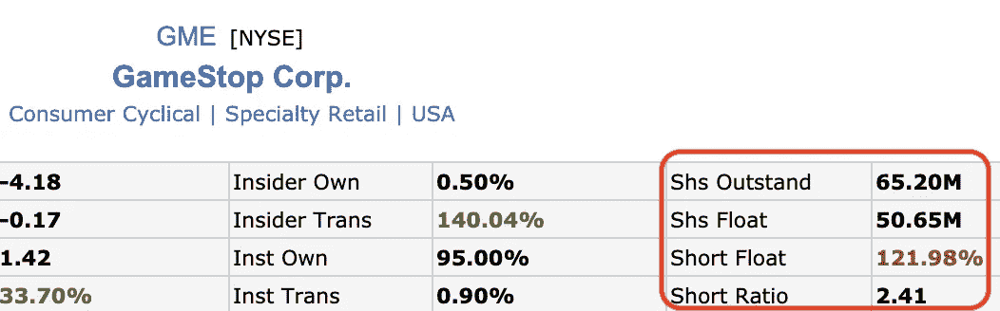
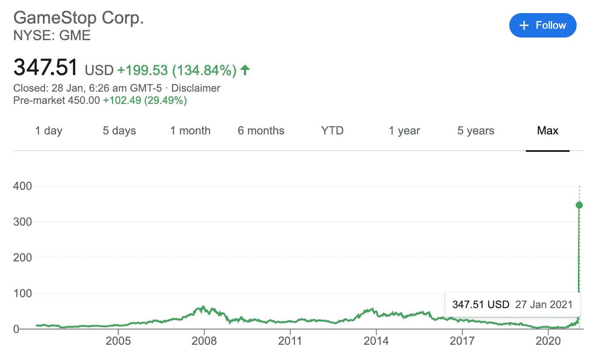

# 卖空和卖空交易解释

> 原文：<https://medium.datadriveninvestor.com/short-selling-and-short-squeeze-explained-5ac5afb1f279?source=collection_archive---------4----------------------->

## 用不到 5 分钟的时间理解外行例子中的 GameStop 做空和做空挤压

Photo by [Clay Banks](https://unsplash.com/@claybanks?utm_source=medium&utm_medium=referral) on [Unsplash](https://unsplash.com?utm_source=medium&utm_medium=referral)

通常，当我们投资股票时，我们会现在买入并持有，直到股票变得更有价值时再卖出。这会持续很长时间。我们的想法是，我们希望股价上涨*，*，换句话说，当股价*上涨*时，我们获利。

另一方面，做空与此相反。通常，当你“做空”一只股票时，你希望股价下跌，因为当股价下跌时你就赚钱了。

# 放弃

> 本网站的内容仅供参考和娱乐，不构成财务、会计或法律建议。这篇博文的作者对本网站内容的任何错误或遗漏不承担任何责任或义务。本网站中的信息容器按“原样”提供，不保证完整性、准确性、有用性或及时性。

> 那么，如何“做空”一只股票呢？

# 卖空

所以有两种流行的方法可以“做空”一只股票。

在典型的股票交易中，你会先买后卖。我重复一遍—

> 买进然后卖出。

基本上，当你“做空”一只股票时，你会先卖出，然后试图回购

> 卖了再买。

等等，什么？*你怎么在买股票之前就卖出了？*

事实证明，每当你“做空”一只股票，基本上意味着你是在从你的经纪人那里借这些股票，通常是要收费的。

## 例子

例如，当约翰的经纪人账户上有 100 美元，他想以 10 美元的价格卖空 XYZ 股票，他将从他的经纪人那里借 10 股，然后立即在市场上以每股 10 美元的价格卖出。

约翰会希望他以 10 美元卖出的 XYZ 股票跌破 10 美元，这样他就可以以更低的价格买回股票，并将其返还给经纪人。

> 换句话说，如果 XYZ 的股票跌到 7 美元，他将每股获利 3 美元。

在这个例子中，约翰有可能获得每股 10 美元的最大利润，因为一只股票最多只能跌到每股 0 美元。

另一方面，约翰冒着失去一大笔钱的风险，嗯，仅仅是因为股票价格没有理论上限。XYZ 股票可能会涨到 15 美元、20 美元、40 美元、80 美元、200 美元等等。

> 如果 XYZ 股票涨到 15 美元，而不是跌到 10 美元，约翰每股亏损 5 美元。呀。

## 你必须归还你借的东西

回到经纪人，当约翰从他的经纪人那里借股票时，他们有一个保证金要求。

当股票 XYZ 变得太高时，经纪人，也就是借款人，会想要回这些股票，以保护他们的下跌。

> 假设 XYZ 的股票从每股 10 美元涨到了 15 美元。

对约翰来说“幸运”的是，经纪人不会找他要钱，相反，如果约翰不采取任何行动，经纪人会强行亏本出售约翰的股票，这将导致 T2、T3、T4 和 T5 的保证金追缴。

约翰现在处境尴尬。如果约翰想退出，他现在必须在他的经纪人账户上增加更多的钱，并弥补他的头寸。

> 约翰现在不得不购买更多的 XYZ 股票来弥补他的头寸。

当他试图回补他的空头头寸时，这给 XYZ 股票制造了额外的买入压力，进而推动 XYZ 的股价进一步上涨。

# 了解流通股和流通股

> 这是导致$GME 遭遇空头挤压的关键因素。

**已发行股份** —公司股份总数

**股票浮动** —在市场上交易的股票

**空头股票** —在所有的流通股中，我们目前持有的空头股票比例是多少。

$GME shares information as of 29 Jan 2021\. (source: [finviz.com](https://finviz.com/))

> *121.98%短浮？！*

等等，你怎么可能卖空比市场上更多的股票呢？

> 这就好像你在整个世界上只有 100 个苹果，但你却可以卖出 121.98 个苹果？

原来，当经纪人借出股票(甚至是他们“库存”中没有的股票)时，他们会对借出的股票收取一笔借款费用。

> 经纪人借出股票是赚钱的。

当你可以借出库存中没有的股票时，这可能会导致空头浮动超过 100%，这正是这里所发生的情况——[裸卖空](https://www.investopedia.com/terms/n/nakedshorting.asp)。

# **TL；GameStop 股票发生了什么事**

Example of short-squeeze that happened to $GME as of 29 Jan 2021 (source: [google.com](https://www.google.com/))

现在想象一下，约翰正在大规模“做空”GME 股票，而其他许多人或机构与他处于相同的位置。

当他们的交易下跌时(GME 股票上涨)，他们将不得不继续回购股票以弥补他们的头寸，换句话说，继续以越来越高的价格从他们的经纪人那里借入股票。

由于交易另一方的投资者或交易员不断买入股票，从而推动股价进一步上涨，约翰和其他卖空者被迫以更高的价格买入 GME，以弥补他们的空头头寸。

如此周而复始，这最终形成了一种自我重复的模式，卖空者受到挤压——因此出现了术语“卖空挤压”。

## [阅读我在 jerrynsh.com 的其他文章](http://jerrynsh.com/)

 [## 轮盘策略

### 臭名昭著的西塔帮策略的简明扼要的解释

medium.com](https://medium.com/fortune-for-future/the-wheel-strategy-99e16b9540b2)  [## 你如何买入下跌的市场

### 在市场低迷时期购买的一些建议

medium.com](https://medium.com/fortune-for-future/how-do-you-buy-a-falling-market-c9487ba092b)