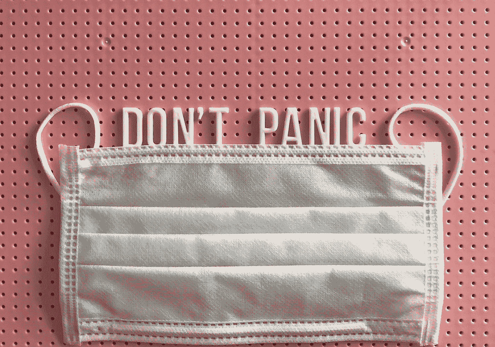
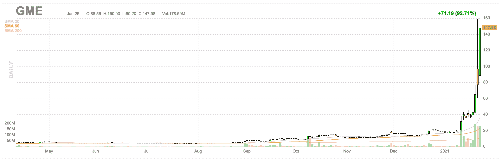

# 短挤压游戏停止(GME)

> 原文：<https://medium.datadriveninvestor.com/short-squeezing-gamestop-gme-3eaaeab54eda?source=collection_archive---------17----------------------->

Photo by [Tonik](https://unsplash.com/@thetonik_co?utm_source=medium&utm_medium=referral) on [Unsplash](https://unsplash.com?utm_source=medium&utm_medium=referral)

## 散户投资者如何摧毁对冲基金

股票市场**被操纵**。它对小人物不利，而且永远如此。市场也不公平，它们是肮脏的战争，简单的事实是，大公司几乎总是赢家。他们有钱推动市场，抬高(或压低)价格，而让一个短期的小人物(比如我们)两手空空。

但有时大人物会被杀。

我们都知道大鱼吃小鱼的寓言，但有时我们忘记了**大鱼**也吃大鱼。你并不安全，即使你认为你的体型可以保护你。

> 短暂的挤压是一个值得一看的景象，就像在佛罗里达州看到北极光一样。

我们在自然界看到这种情况，一只强大的鹰试图攻击一只更小的鸟。但是后来，较小的鸟都聚集在一起赶走了鹰，让他饥饿和骚扰。

这一幕正在 [Gamestop 公司(GME)](https://stocktwits.com/symbol/GME) 上演！

如果你关注市场，你会看到 Gamestop Corp .的迅速崛起。去年 12 月，它的交易价格约为 14 美元，周一收于 147 美元。截至周二上午，隔夜交易的价格约为每股 339 美元。

Game Stop Stock Chart

发生了什么事？梅尔文资本。

大型对冲基金梅尔文资本(Melvin Capital)前段时间对 GME 开了一个空头头寸。这压低了 GME 价格，使他们能够获利。一切(据称)都在按照他们的计划进行，直到来自华尔街的散户投资者开始集体购买 GME。

GME 的价格开始上涨，比 Melvin Capital 能够覆盖或调整的速度更快，造成了短暂的挤压。卖空交易是指卖空者必须平仓以停止损失。这导致了疯狂的波动，价格飙升得更高，套住了更多的空头，把他们挤出了他们的头寸。

短暂的挤压是一个值得一看的景象，就像在佛罗里达州看到北极光一样。非常罕见，当你看到它时，你会惊叹不已。

这种短期紧缩可能会让梅尔文资本破产。卖空是一项非常冒险(但有利可图)的业务。如果 Melvin Capital 真的下跌，这将是小人物的胜利，但也提醒人们，股市是残酷的，受到了操纵。

披露:**在 GME 没有职位**。